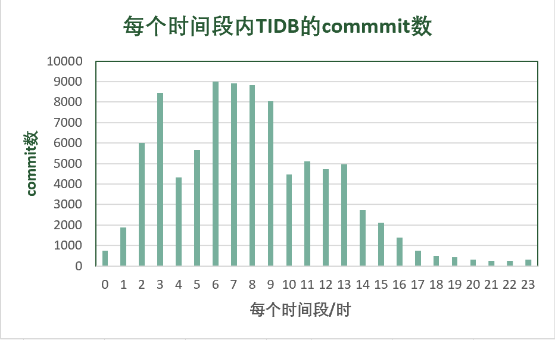

## 2、总体宏观统计结果

本次使用2020 年全年 GitHub 日志进行统计，主要对pingcap/tidb这个开源项目进行分析。

### 2.1 TIDB Top 10 开发者账号

我们统计了pingcap/tidb这个项目中活跃度前10的开发者账户，以及他们的活跃度和其他的活动，表格按活跃度降序排序。

从数据统计来看，zz-jason和sre-bot的活跃度远远高于其他的开发者账户。经过后面的分析和调研，sre-bot应该是一个机器人账号，而zz-jason是一个真实存在的开发者。

### 2.2 TIDB开发者每个时间段内的对pingcap/tidb项目的commit数

我们统计了TIDB中所有的开发者在每个时间段内对pingcap/tidb项目的commit数的分布情况。横坐标为时间，对应的是北京东八区的时间；纵坐标为commit的数量。

统计发现在19点到23点之间的commit数很低，我们分析了一下存在这种现象的原因。可能是对于在中国生活的人而言，这段时间大家有自己的生活，需要社交和带娃。此外，我们还发现6点到9点的commit数尤其高，可能是因为存在机器人账号，在这段时间的commit比较频繁。

### 2.3 TIDB活跃度前三的账户在不同时间段的commit数

我们统计了TIDB中活跃度前三的账户在不同时间段对pingcap/tidb项目的commit数的分布情况。横坐标为时间，对应的是北京东八区的时间；纵坐标为commit的数量。

统计分析sre-bot不眠不休地每个时间段都在为pingcap/tidb做贡献，它大概率是个机器人。此外，zz-jason是最活跃的开发者账户，他一般在凌晨0点到6点这段时间commit很频繁。据我们调研，他生活在中国北京，是一个架构工程师，兴趣围绕分布式计算，sql优化和执行，在PingCAP公司的一员。但他为什么一直在这段时间内进行commit，我们不得而知。

### 2.4 与TIDB协作关联度高的前10个项目

我们调研了与TIDB协作关联度高的前10个项目，通过统计了pingcap/tidb这个项目中前top10个活跃者账户参加其他项目所有活动的次数来分析。

我们发现sre-bot是pingCAP公司的机器人，它还负责了公司的其他项目，这些项目都和tidb密切相关，比如tikv是tidb底下的存储引擎，tidb-operator，pd, docs-cn，docs都是和tidb息息相关的。此外，对于开发者账户crazycs520和tiancaiamao都在自己仓库中维护了一份tidb，在他们仓库本地开发tidb。