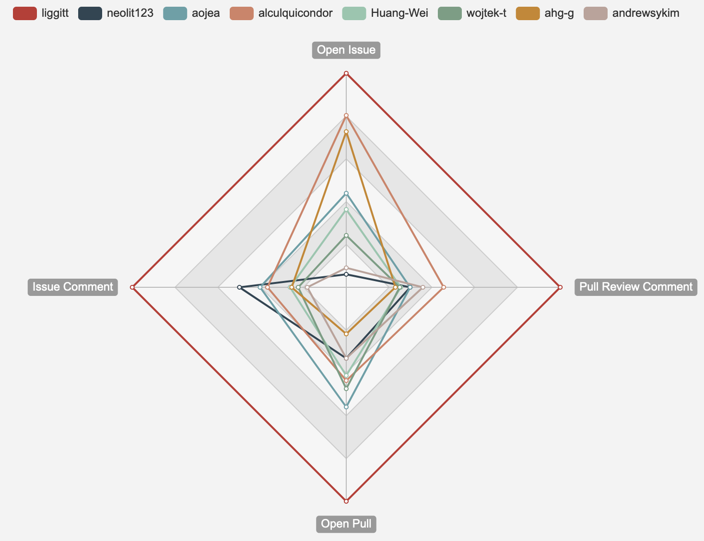
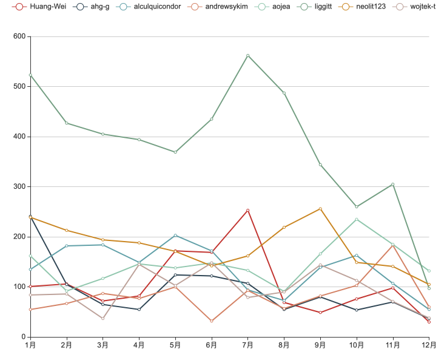
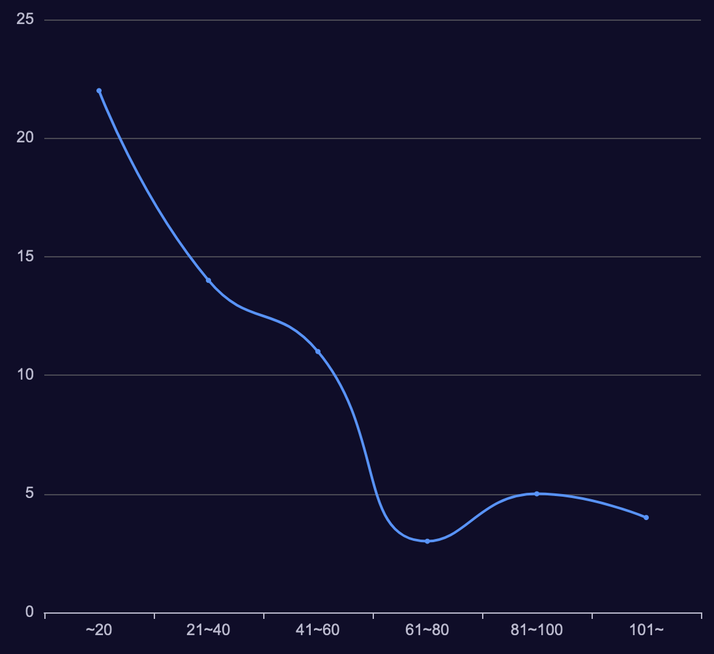
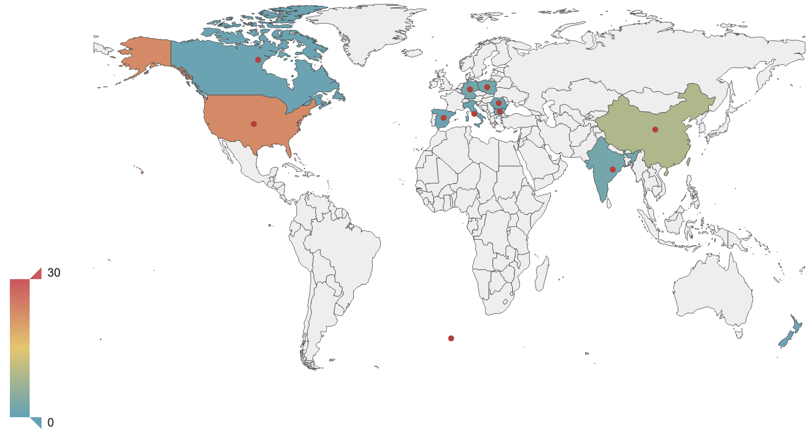
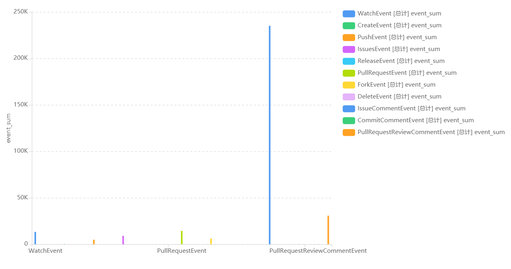
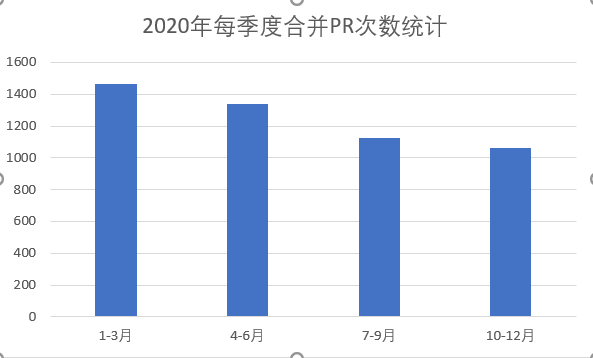
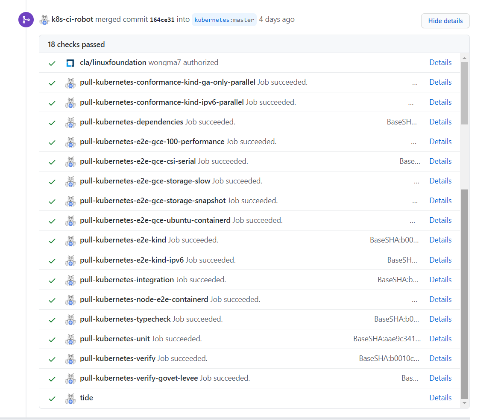

# Kubernetes 2020 数据分析报告

对仓库kubernetes/kubernetes进行了分析

可视化图表采用echarts制作

## 数据类

### 开发者数据统计、可视化

#### 2020 commits Top10 开发者数据统计

对项目中2020年Commits数量前十的开发者进行了统计，具体指标有commits、additions、deletions，统计数据如下：

| 开发者账号                         | Commits | Additions | Deletions |
| ---------------------------------- | ------- | --------- | --------- |
| Jordan Liggitt (liggitt)           | 237     | 205382    | 184420    |
| Davanum Srinivas (dims)            | 154     | 76242     | 152708    |
| Caleb Woodbine (BobyMCbobs)        | 144     | 3343      | 1172      |
| Andrew Sy Kim (andrewsykim)        | 102     | 16145     | 9859      |
| Aldo Culquicondor (alculquicondor) | 96      | 15859     | 7312      |
| Stephen Augustus (justaugustus)    | 94      | 36293     | 37529     |
| Antonio Ojea (aojea)               | 92      | 5859      | 1760      |
| Wojciech Tyczynski (wojtek-t)      | 88      | 7149      | 6011      |
| Wei Huang (Huang-Wei)              | 81      | 8660      | 7117      |
| David Eads (deads2k)               | 73      | 8014      | 60147     |

#### 2020 Activity Scores Top10 开发者数据统计

对项目中各项Activity总分最高的十个开发者进行了各项数据的统计，具体指标包括Open Issue、Issue Comment、Open Pull、Pull Review Comment、Merge Pull，统计数据如下：

| 开发者账号     | Open Issue | Issue Comment | Open Pull | Pull Review Comment | Merge Pull | Score  |
| -------------- | ---------- | ------------- | --------- | ------------------- | ---------- | ------ |
| k8s-ci-robot   | 0          | 126577        | 0         | 0                   | 3983.44    | 355.78 |
| fejta-bot      | 12         | 15097         | 0         | 0                   | 0          | 122.97 |
| liggitt        | 66         | 5062          | 211       | 2664                | 0          | 129.72 |
| neolit123      | 4          | 2526          | 70        | 796                 | 0          | 77.74  |
| aojea          | 29         | 2038          | 118       | 795                 | 0          | 75.93  |
| alculquicondor | 53         | 1863          | 92        | 1213                | 0          | 85.12  |
| Huang-Wei      | 24         | 1327          | 87        | 679                 | 0          | 66.98  |
| wojtek-t       | 16         | 1136          | 100       | 666                 | 0          | 65.48  |
| ahg-g          | 48         | 1291          | 46        | 612                 | 0          | 63.63  |
| andrewsykim    | 6          | 922           | 70        | 954                 | 0          | 71.07  |

#### 2020 Activity Scores Top10 用户行为

对项目中各项Activity总分最高的十个开发者（对两个bot剔除）的用户行为进行了统计，如下图所示。可以看出用户liggitt在各项用户行为上都是项目主要的贡献者，每个用户在不同的贡献行为上有不同的倾向。用户alcuquicondor、ahg-g更倾向于open issue，用户ahg-g、andrewsykim更倾向于pull review comment，用户aojea、wojtek-t更倾向于open pull，用户neolit123更倾向于issue commen。



#### 2020 Activity Scores Top10 开发者月度趋势

对项目中各项Activity总分最高的十个开发者（对两个bot剔除）的月度趋势进行了统计，如下图所示。可以看出开发者liggitt对项目的贡献最大，在全年都对项目进行着较多的贡献。7月为主力开发者贡献较多的月份，12月是贡献者贡献较少的月份。




#### 2020 Commits 开发者分布

对项目中2020年的贡献者进行了commits数量的统计并绘制，共59名贡献者，其中22名贡献者commits数量小于20，4名贡献者commits数量大于100。



#### 2020 开发者区域分布

对项目中2020年中的全部开发者进行区域分布的统计，区域分布如下图所示。在2020年中有过贡献的开发者共59人，其中位置未知的开发者共15人。其中，开发者区域为美国的共23人，为中国的共9人，其他区域还有意大利、印度、德国、罗马尼亚、保加利亚、波兰、新西兰、西班牙、加拿大等。



### 基础的统计数据分析、可视化

kubernetes/kubernetes是一个开源的容器编排引擎，用于自动化部署、伸缩和管理容器化的应用程序。在2020年度项目活跃度排名中位列第八。

.png)

所有事件类型和各种事件类型发生次数统计，统计次数最多的事件是issue中的评论提交次数，达到23万次，位列第1。其中open_pull, open_issue数量相对其他热门项目较少，说明该项目较为稳定成熟。

| type                          | event_sum |
| ----------------------------- | --------- |
| WatchEvent                    | 13331     |
| CreateEvent                   | 160       |
| PushEvent                     | 4889      |
| IssuesEvent                   | 9026      |
| ReleaseEvent                  | 78        |
| PullRequestEvent              | 14335     |
| ForkEvent                     | 6183      |
| DeleteEvent                   | 9         |
| IssueCommentEvent             | 235039    |
| CommitCommentEvent            | 72        |
| PullRequestReviewCommentEvent | 30721     |



### 关联数据的分析

首先统计Kubernetes项目内的所有活跃贡献者（取事件数>200），并排除了这`k8s-ci-robot`和`fejta-bot`两个Bot账户。

对这111名贡献者，分析他们活跃的其他仓库（取事件数>200），以这种方式获取其他项目与Kubernetes的关联度。


可以从关系图看出，与`kubernetes/kubernetes`关联度较大的仓库有

- `kubernetes/test-infra`
- `kubernetes/enhancement`
- `kubernetes-sigs/kind`
- `cri-o/cri-o`
- `kubernetes/release`

## 流程类

### 开发者参与流程调研

#### 开发者贡献分类

- 帮助改进 Kubernetes 文档
- 阐明可以重命名或注释的代码、变量或函数
- 编写测试覆盖率
- 帮助分类问题

#### 开发者获取任务流程

当您发现要解决的问题时，您可以将其分配给自己。

- 回复`/assign`或回复`/assign @yourself`您要处理的问题
- 该K8S-CI-robot将问题自动分配给你。
- 然后，您的姓名将列在 , 下`Assignees`。

#### 开发者测试和合并工作流流程

Kubernetes 合并工作流使用标签，由命令通过注释应用。这些将触发对您的拉取请求的操作。不同的 Kubernetes 存储库在审批路径上可能需要不同的标签。拉取请求机器人也将自动应用和/或建议标签。

*示例：*要应用 SIG 标签，您需要输入注释：

```
/sig apps
```

*注意：对于正在进行但尚未准备好审查的拉取请求，在拉取请求标题前面加上`WIP`或`[WIP]`并在拉取请求描述的清单中跟踪任何剩余的 TODO。*

这是拉取请求从提交到合并的过程：

1. 发出拉取请求
2. `@k8s-ci-robot` 指派审稿人
3. 如果您**不是**Kubernetes 组织的成员，审核员/Kubernetes 成员会检查拉取请求是否可以安全测试。如果是这样，他们评论`/ok-to-test`。Kubernetes 组织成员的拉取请求不需要这一步。现在 pull request 被认为是可信的，并且预提交测试将运行：
   1. 自动测试运行。
   2. 如果测试失败，请通过将编辑推送到您的拉取请求分支来解决问题
   3. 如果失败是片状的，受信任的拉取请求的任何人都可以评论`/retest`以重新运行失败的测试
4. 审稿人建议修改
5. 将编辑推送到您的拉取请求分支
6. 根据需要重复前两个步骤，直到审阅者添加`/lgtm`标签。该`/lgtm`标签由`reviewer`在相应项目`OWNERS`文件中列为 a 的人应用时，表明代码已通过该项目的一个或多个受信任的审查者的审查
7. （可选）一些审阅者更喜欢你在这一步压缩提交
8. 按照机器人建议分配一个 OWNER，该 OWNER 将`/approve`标签添加到拉取请求中。该`/approve`标签，当被列为有人应用`approver`在相应的项目`OWNERS`，是一个信号，即代码已通过最终审核并已准备好自动合并

Prow 的行为可跨项目配置。您应该了解以下可配置行为。

- 如果您`/approver`在`OWNERS`文件中被列为，则`/approve`可以将隐式应用于您的拉取请求。这可能会导致`/lgtm`标签触发合并。这是许多项目中的配置行为，包括`kubernetes/kubernetes`. 您可以删除隐含`/approve`的`/approve cancel`
- `/lgtm`可以进行配置，以便来自同时列为 a`reviewer`和 an 的人`approver`将导致应用两个标签。对于`kubernetes/kuebernetes`和许多其他项目，这*不是*默认行为，并且`/lgtm`与`/approve`

一旦测试通过并且审阅者添加`lgtm`和`approved`标签，拉取请求将进入最终合并池。需要合并池以确保自上次在您的拉取请求上运行测试以来其他拉取请求没有引入不兼容的更改。

Tide会自动管理合并池。它使用 GitHub 查询将 PR 选择到“潮汐池”中，尽可能多地批量运行（“潮汐进入”），并合并它们（“潮汐消失”）。

1. 如果满足合并条件，拉取请求将进入合并池。该PR仪表盘显示你的公关的状态和合并的标准，这样就可以很容易地看到，没有得到满足和解决所有这些标准之间的差异。
2. 如果测试失败，请通过将编辑推送到您的拉取请求分支来解决问题
3. 如果失败是片状的，任何人都可以评论`/retest`拉取请求是否可信
4. 如果测试通过，Tide 会自动合并拉取请求

这是最后一步。您的拉取请求现已合并。

#### 开发者打开拉取请求流程

拉取请求通常称为“PR”。Kubernetes 通常遵循标准的github pull request程，但还有一层特定于 Kubernetes 的（有时是特定于 SIG 的）差异：

您将看到的第一个区别是机器人将开始将结构化标签应用于您的 PR。

机器人还可能会为在您的 PR 中运行的命令提供一些有用的建议，以方便审查。可以在评论中输入
这些`/command`选项以触发自动标记和通知。

常见的新贡献者 PR 问题是：

- 在您的第一个 PR 之前没有正确签署 CLA。
- 为 PR 找到合适的 SIG 或审阅者并遵循任何 SIG 或存储库特定的贡献指南
- 处理在您的 PR 上失败的测试用例，与您引入的更改无关
- 不遵循可扩展性良好实践
- 在提交消息中包含提及（如@person）和可以关闭问题的关键字（如修复#xxxx）。

#### 开发者代码审查流程

代码审查有两个方面：给予和接受。

为了让您的 PR 更容易收到评论，请考虑评论者需要您：

- 遵循项目编码约定
- 写好提交信息
- 将大的更改分解为一系列逻辑上的小补丁，这些小补丁单独进行易于理解的更改，并在总体上解决更广泛的问题
- 使用适当的 SIG 和审阅者标记 PR：为此，请阅读机器人发送给您的消息以指导您完成 PR 流程

强烈鼓励审核员（即进行审核的人员）重新审视行为准则和社区期望，并且必须超越一切以促进协作、相互尊重的社区。在审查其他人的PR 时，补丁审查的温和艺术提出了一系列迭代的重点，旨在引导新的贡献者进行积极的协作，而不会在最初用细微差别淹没他们：

- 贡献背后的想法是否合理？
- 贡献的架构是否正确？
- 贡献是否完善？

#### 开发者测试流程

测试是所有贡献者的责任，部分归所有 SIG 所有，但也由sig-testing协调。

有多种类型的测试。测试代码的位置因类型而异，成功运行测试所需的环境细节也不同：

- 单位：这些确认特定功能按预期运行。Golang 包含通过测试包进行单元测试的本机能力。单元测试源代码可以在给定包内的相应源代码旁边找到。例如：在kubernetes/cmd/kubeadm/app/util/version.go 中定义的函数将在kubernetes/cmd/kubeadm/app/util/version_test.go 中进行单元测试。这些可以由任何开发人员在任何操作系统上轻松地在本地运行。
- 集成：这些测试涵盖包组件的交互或 kubernetes 组件与其他一些非 kubernetes 系统资源（例如：etcd）之间的交互。一个例子是测试一段代码是否可以正确地将数据存储到 etcd 或从 etcd 检索数据。集成测试存储在kubernetes/test/integration/ 中。运行这些可能需要开发人员在他们的开发系统上设置额外的功能。
- 端到端（“e2e”）：这些是对整体系统行为和一致性的广泛测试。这些更复杂，因为它们需要从要测试的源构建的功能性 kubernetes 集群。
- 一致性：这些是一组测试用例，目前是集成/e2e 测试的一个子集，架构 SIG 已批准这些测试用例来定义所有 Kubernetes 部署必须支持的核心互操作功能集。

持续集成将运行这些测试作为对 PR 的预提交、针对主/发布分支的后提交，或两者兼而有之。
结果出现在testgrid 上。

sig-testing 负责官方基础设施和 CI。在test-infra repo 中跟踪相关的自动化。如果您希望在自己的基础设施上运行 e2e 测试，kubetest就是一种机制。

### 开发者数据统计、可视化

2020年每季度issue次数统计，可以看到每季度呈下降趋势，到了第四季度仅有第一季度的三分之一，说明该项目热度持续下降。

.png)

该项目的pull_commits次数为62955次，排在2020年度的第329位，但其中成功合并的pull_merged有4745次，排名第45位，说明其PR合并率相对于其他项目比较高。PR合并次数也是随着时间依次减少。



项目的参与程度来看，2020年度内被fork次数为26447次，排名第32位。PR的review次数为313843次，位列第37位。

### 项目CI/CD的流程调研

Kubernetes仓库本身并不包含CI/CD流程，但会对所有PR进行机器人review check。利用K8S自己的自动化测试网站https://prow.k8s.io/来测试预合并后的代码，只有所有测试都通过的PR才会交给审查者来决定最终是否进行合并。


