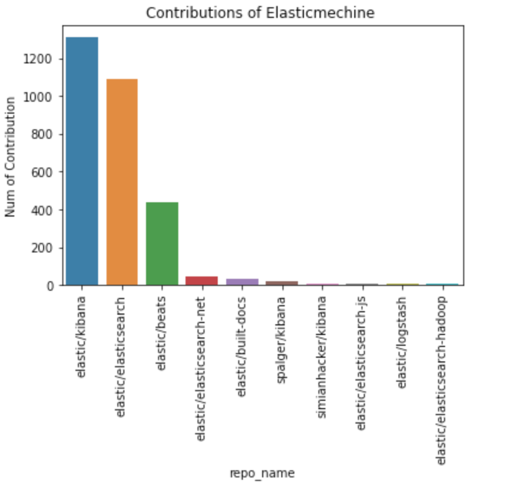
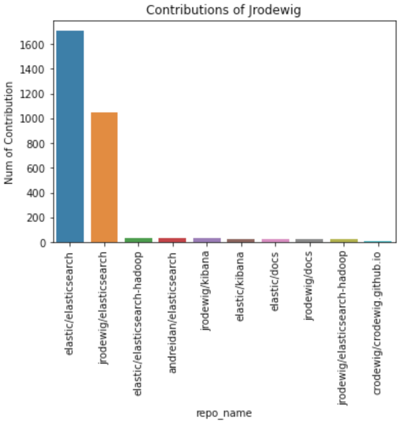

# Elasticsearch 2020 数据年报

摘要：在开源日益重要的今天，我们需要一份简历在全域大数据基础上的相对完整、可以反复进行推演的数据报告（报告、数据、算法均需要开源）。本项目为 OSSDevGov2021 的 06 小组发起，旨在通过分析 Elasticsearch 在 Github 仓库中所有的开发者行为日志，来观察 2020 年内该项目在 Github 中的活跃程度，希望以此得到该项目的开源现状、进展趋势、演化特征、以及未来挑战等问题。同时我们还结合该项目在 2019 年的开源表现，分析其在项目演进的过程中所做出的调整和发展。本报告中使用 2020 年 Elasticsearch 项目全年日志进行统计，总日志数约 12 万条。


关键词：开源、Elasticsearch、开发者行为、数据报告

## 1、背景

Elasticsearch 是一个分布式的免费开源搜索和分析引擎，适用于包括文本、数字、地理空间、结构化和非结构化数据等在内的所有类型的数据。Elasticsearch 在 Apache Lucene 的基础上开发而成，由 Elasticsearch N.V.（即现在的 Elastic）于 2010 年首次发布。Elasticsearch 以其简单的 REST 风格 API、分布式特性、速度和可扩展性而闻名，是 Elastic Stack 的核心组件；Elastic Stack 是一套适用于数据采集、扩充、存储、分析和可视化的免费开源工具。人们通常将 Elastic Stack 称为 ELK Stack（代指 Elasticsearch、Logstash 和 Kibana），目前 Elastic Stack 包括一系列丰富的轻量型数据采集代理，这些代理统称为 Beats，可用来向 Elasticsearch 发送数据。

## 2、数据类分析

### 2.1 基础统计数据分析

本次使用 2020 年全年 Github 日志进行统计，总日志数约 12 万条，相较 2019 年的 11 万条增长约 4.19%。其中项目中的基本数据细分内容：

| 字段名                 | 值                 |
| ---------------------- | ------------------ |
| issue                  | 40330              |
| open issue             | 3610               |
| open pull              | 12515              |
| pull review comment    | 22599              |
| merge pull             | 9791.75            |
| star                   | 7848               |
| fork                   | 4202               |
| repo acitivity (daily) | 319.48295248704335 |

对比 2019 年全年 Github 日志可以得出，变化比较明显的有：`issue` 数量由 105845 降至 40330，降低幅度为 61.89%，这说明该项目代码和内容都趋于完善，用户所提的问题大幅度减少；`merge pull  `数量由 2900 升至 9791，提升幅度为 237.62%，这也表明了该项目中 contributor 数量越来越多，同时对该项目的积极性大大增加。

其中该项目中 issue 数量每月相对平均，均在 680 左右浮动，最高 2 月份 issue 数量为 731，最低 12 月份数量为 473，也就表明该项目的每个 reslease 版本对项目造成的影响相对比较稳定。


​                                                                   **图1 issue 数量月份分布图**

同时该项目中 PR 数量每月浮动明显，最高 2 月份 PR 数量为 2272，最低 12 月份数量为 1058。


​                                                                   **图2 PR 数量月份分布图**

### 2.2 开发者数据分析

1. Elasticsearch 2020 年开发者账号活跃度统计 Top 10

   

   ​                                            **图3  Elasticsearch 2020 年开发者账号活跃度统计 Top 10**

   图 3 是 Elasticsearch 2020 年开发者账号活跃度统计 Top 10 的可视化，图中黄色代表的是 Elasticsearch 项目在 2020 年里最活跃、做出共享最大的十个开发者的活跃度，青色代表的是这个十个开发者的 Issue Comment 的数量。其中，排名第一的是 Elasticsearch 的 bot。剩下的九人中，除了 nik9000 和 danhermann 以外，剩下的七个开发者均来自 Elastic 公司。这说明 Elasticsearch 项目主要还是由 Elastic 公司里相关项目组的人在负责开发和维护。

2. Elasticsearch 2020 年开发者工作时间分布

   

   ​                                             **图4  Elasticsearch 2020 年开发者工作时间分布**

   图 4 是 Elasticsearch 2020 年开发者工作时间分布的可视化，图的横向是一天中的时段，纵向是一周中的时段，中间点的大小和深浅代表了项目的活跃度。从图中可以看出，在周一到周五的正常工作时间，是开发者工作时间最集中的部分。结合图3可以说明，Elastic 公司属于不加班的公司。

3. 与 Elasticsearch 2020 年协作关联度高的 10 个项目

   

   ​                                            **图5  与 Elasticsearch 2020 年协作关联度高的 10 个项目**

   图 5 是与 Elasticsearch 2020 年协作关联度高的 10 个项目 的词云图。可以看到 elastic/kibana 和其它项目的关联度拉开了极大的差距，这可以说明 elastic/kibana 和 elasticsearch 项目有着部分的开发者重合。

### 2.3 关联数据分析

​		开发者关联分析：Elasticsearch 2020 年开发者账号活跃度统计 Top 10 中第一名是 elasticmachine，名字听起来像是一个机器人的名字，事实上其 2020 年在 github上 共有 1840 项 contributions，并没有公开任何库, contribution 图如下：

而 elasticmachine 在 2020 年所贡献的开源项目如下图所示。可以看出其所参与项目都是与 elasticsearch 相关的项目，contribution第一名的Kibna和第三名的beats都是可以在官网中可以查到的项目。

​		其中 Kibana 是一个免费且开放的用户界面，能够让您对 Elasticsearch 数据进行可视化，并让您在 Elastic Stack 中进行导航。您可以进行各种操作，从跟踪查询负载，到理解请求如何流经您的整个应用，都能轻松完成。而轻量型数据采集器 Beats 是一个免费且开放的平台，集合了多种单一用途数据采集器。它们从成百上千或成千上万台机器和系统向 Logstash 或 Elasticsearch 发送数据。



​		贡献榜第二名的 jrodewig 是 elasticsearch 的主要开发者，负责很多 elasticsearch 的开发项目，2020 年其所参与的在 github上 开源的项目前 10 如下:



​		可以看的 Jrodewig 所参与的项目几乎都是与 elasticsearch 的项目，Kibana 是其主要负责项目，我们并未看到其参与 elastic/beats 项目中。

## 3、流程类分析

### 3.1 项目日常协作流程调研

该项目的 CONTRIBUTING 文件中详细说明了协作流程，其中包括了项目分支拉取，环境配置，开发配置，提交PR等等。详细内容主要如下：

1. JDK配置。

构建 Elasticsearch 需要 JDK 16。必须有一个 JDK 16 的安装，环境变量 JAVA_HOME 参考了 JDK 16 安装的 Java home 的路径。默认情况下，测试使用与 JAVA_HOME 相同的运行时间。然而，由于Elasticsearch 支持 JDK 11，构建时支持用 JDK 16 编译，并在 JDK 11 运行时上进行测试；要做到这一点，需要设置 RUNTIME_JAVA_HOME，指向 JDK 11 安装的 Java 首页。注意，这种机制也可以用来对其他 JDK 进行测试，这不仅限于 JDK 11。

2. 将项目导入 IDEA

导入 Elasticsearch 项目所需的最小 IntelliJ IDEA 版本是 2020.1 Elasticsearch 使用 Java 16 构建。当导入 IntelliJ 时，需要定义一个合适的 SDK。按照惯例，这个 SDK 应该被命名为 "16"，这样项目导入时就会自动检测到它。关于在 IntelliJ 中定义 SDK 的更多细节，请参考他们的文档。SDK 的定义是全局性的，所以可以从任何项目中添加 JDK，或者在项目导入后添加。如果导入的 JDK 缺失，仍然可以工作，IntelliJ 只是报告一个问题，并拒绝构建，直到解决。

3. REST 端点约束

Elasticsearch 在 URL 中通常使用单数名词而不是复数。比如说：

```
/_ingest/pipeline
/_ingest/pipeline/{id}
```

而不是：

```
/_ingest/pipelines
/_ingest/pipelines/{id}
```

你可能会找到反例，但新的端点应该使用单数形式。

4. Java 语言格式化指南

Elasticsearch 代码库中的 Java 文件是使用 Spotless Gradle 插件自动格式化的。所有的新项目都会被自动格式化，而现有的项目也在逐渐被选择加入。格式化检查可以通过以下方式明确运行：

```
./gradlew spotlessJavaCheck
```

5. Javadoc

好的 Javadoc 可以帮助浏览和理解代码。Elasticsearch 有一些关于什么时候写 Javadoc 和什么时候不写 Javadoc 的指导原则，但请注意，我们不希望有过度的规定性。这些指南的目的是为了提供帮助，而不是把写代码变成一件苦差事。

6. 许可证标题

要求所有的 Java 文件都有许可证头。除了顶层的 x-pack 目录之外，所有贡献的代码都应该有以下许可头，除非另有指示。

```
    /*
     * Copyright Elasticsearch B.V. and/or licensed to Elasticsearch B.V. under one
     * or more contributor license agreements. Licensed under the Elastic License
     * 2.0 and the Server Side Public License, v 1; you may not use this file except
     * in compliance with, at your election, the Elastic License 2.0 or the Server
     * Side Public License, v 1.
     */
```

7. 创建 Distribution
8. 单元测试
9. 项目布局构建

### 3.2 开发者参与流程调研

Elasticsearch 是一个免费且开源的项目，我们乐意收到来自社区的你的贡献。贡献方式的有很多，从编写教程或博客文章、改进文档、提交错误报告和功能请求以及编写可以合并到 Elasticsearch 本身的代码。

1. 提交 Bug 

   首先，当发现了 bug，开发者要确保自己是针对最新的 Elasticsearch 进行测试。如果 bug 还是未得到修复，再去 issues list 中搜索是否已经有类似的问题，以防 issue 的重复提交。

   当以上都确保了以后，需要提供 bug 的测试用例，以方便 Elasticsearch 团队来运行和确认这个 bug，并修复。测试用例应该用`curl`命令提供，以方便复制粘贴至终端中运行。比如：

   ``` 
   # delete the index
   curl -XDELETE localhost:9200/test
   
   # insert a document
   curl -XPUT localhost:9200/test/test/1 -d '{
    "title": "test document"
   }'
   
   # this should return XXXX but instead returns YYY
   curl ....
   ```

   

2. 提交新功能

   首先，和 bug reports 一样，当想要在 Elasticsearch 中添加不存在的新功能时，应该先考虑下是否可能已经有人提出过类似的想法了。打开 issues list 搜索一下是否有类似的 issue，若没有则可以新开一个 issue 描述希望新添加的功能、为什么需要添加以及新功能运行的机制原理。

   

3. 贡献代码和修改文档

   如果想为 Elasticsearch 贡献新功能或错误修复，需要先在 Github 问题上讨论想法。如想法没有类似的 issue，则需要新开一个。通常有多种方法可以解决问题，在将时间花在无法合并的 PR 上之前，找到正确的方法很重要。

   `help wanted` 标签添加到特别欢迎社区贡献的现有 Github 问题中，`good first issue`标签则标记适合新贡献者的问题。

   1. 分叉并克隆仓库

      首先需要 fork 主 Elasticsearch 代码或文档仓库并将其克隆到自己的本地。

   2. 修改代码的一些提示

      在提出拉取请求之前遵循这些提示将加快审查周期：

      - 添加适当的单元测试。
      - 添加集成测试。
      - 确保您添加的代码遵循[格式指南](https://github.com/elastic/elasticsearch/blob/master/CONTRIBUTING.md#java-language-formatting-guidelines)。
      - 不应编辑不属于更改的行。

   3. 提交更改

      ​	提交以供审核前的需要的准备：

      - 测试修改

        运行测试套件以确保没有损坏。有关运行测试的帮助，请参阅 [TESTING](https://github.com/elastic/elasticsearch/blob/master/TESTING.asciidoc) 文件。

      - 签署贡献者许可协议

        请确保已经签署[贡献者许可协议](https://www.elastic.co/contributor-agreement/)。

      - 更新调整

        使用来自主 Elasticsearch 仓库的最新代码来更新本地仓库，并将分支重新建立在最新的主分支之上。

      - 提交拉取请求

        将本地更改推送到存储库的分叉副本并[提交拉取请求](https://help.github.com/articles/using-pull-requests)。在拉取请求中，选择一个总结您所做更改的标题，并在正文中提供有关您所做更改的更多详细信息。

### 3.3 项目 CI/CD 的流程调研

​		CI/CD 是一种通过在应用开发阶段引入[自动化](https://www.redhat.com/zh/topics/automation/whats-it-automation)来频繁向客户交付应用的方法。CI/CD 的核心概念是持续集成、[持续交付](https://www.redhat.com/zh/topics/devops/what-is-continuous-delivery)和持续部署。作为一个面向开发和运营团队的解决方案，CI/CD 主要针对在集成新代码时所引发的问题（亦称：“[集成地狱](https://www.solutionsiq.com/agile-glossary/integration-hell/)”）。

​		具体而言，CI/CD 可让持续自动化和持续监控贯穿于应用的整个生命周期（从集成和测试阶段，到交付和部署）。这些关联的事务通常被统称为“CI/CD 管道”，由[开发和运维团队](https://www.redhat.com/zh/topics/devops)以敏捷方式协同支持。

​		Elasticsearch 是一个很好的工具。 随着时间的推移，拉动大量数据以及统计分析中的烘焙卓越是卓越的。 我们捕获的所有度量标准都来自推出我们的 CI / CD 管道的消息。 这些消息在 Elasticsearch API 中触发并进入其自己的索引。AWS ElasticSearch 提供服务，他预装在 Elastic Kibana 里.

#### Elasticsearch 的 CI 配置

​		ELasticsearch 定期通过相当多的测试周期，包括在每次新提交之后并连续触发。登记后，Elasticsearch 代码库通过一组自动化测试（在很大程度上灵感来自 Apache Lucene 本身的内容）。 在每个提交时，烟雾测试验证了系统可以内置的，以及是否可以构建基本功能（连接到生成的搜索服务器，安装插件等）。通过此初始理智检查的构建进一步审查。 执行 Java 单元和集成测试套件，验证后兼容兼容性（适用）之后。 最后，检查其余测试。

​		除了这些检查外，还在几个硬件配置和操作系统上连续运行所有Java级别检查。 所有工作都是 Jenkins 管理。 减少我们设置中手动配置开销的关键是一个积极的自动化策略。 对于云尤其，它需要快速支付专用脚本，用于初始化测试所需的所有实例类型。 在我们的情况下，这包括能够旋转任何拓扑的集群来测试各种摄入方案。CI 由 Jenkins 运行 Elasticsearch-CI。 Jobs Live 在作业中的目录中，这些都是使用语法 Simmill 到 JJB 的 yml 中定义的。 不允许宏，并且必须在其自己的文件中定义每个作业。 默认配置的合并是自定义的，因此与标准 JJB 不同，它会返回到YML对象中。 进一步（内部）设置的文档可用。	

#### Elasticsearch 的 CD 配置

​	我们从 elasticsearch 和官网搜索 CD 配置，未找到比较准确的持续部署信息。

## 4、总结

Elasticsearch 作为 Github 2020 年中活跃度排名 18 的项目，其影响力还是非常的大。由本篇数据年报能看出这个项目吸引到了不少的开发者一起协作，同时项目中社区交流也非常的积极密切，许多 issue 都能得到回复，所提 bug 大部分都能及时修复，项目协作流程以及相关文档编辑都非常完善，开发者能够从文档中就能得到该项目的基本开发流程，这也有利于该项目的开发迭代升级。希望 Elasticsearch 这个项目能够继续保持这样的开源精神，为开源届贡献更多力量。

