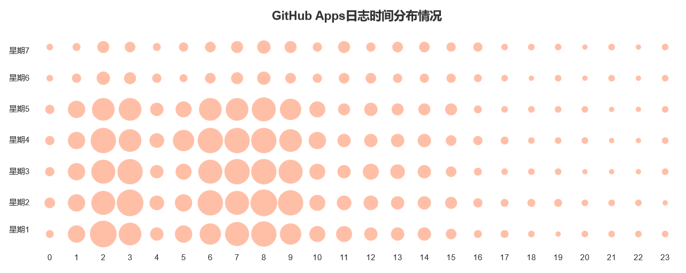
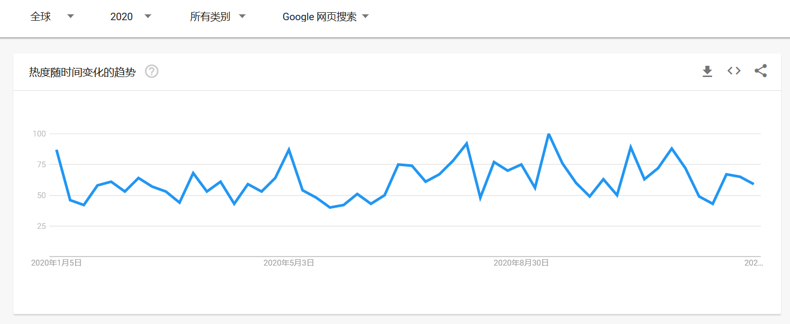

# 数据类报告
## 引言
我们组选定的开源项目为 **Echarts**，2020 年 Echarts 项目的 repo_name 为 **apache/incubator-echarts**。

ECharts 是一款基于 JavaScript 的数据可视化图表库，提供直观，生动，可交互，可个性化定制的数据可视化图表。

ECharts 最初由百度团队开源，后于 2018 年初捐赠给 Apache 基金会，成为 ASF 孵化级项目。2021 年 1 月 26 日，Apache 基金会官方宣布 ECharts 项目正式毕业，现 repo_name 已经更换为 **apache/echarts**（repo_id 9185792）。

【注：以下数据分析，若无特别说明，均为2020年数据。】

## 基础的统计数据分析、可视化
### 1. star 数量按月统计

2020 年月平均 star 数量在 550 左右，其中，又以 3 月份最高，有 714 个新增 star，全年新增 star 数量为 6666。

### 2. commit 数量按照小时统计

Github 全域日志中记录的时间为 UTC 时间，即协调世界时，按照统计结果来看，commit 主要集中在 UTC 下的 1-9 时，比较符合北京时间下的正常工作时间，因此，我们认为 Echarts 项目的开发由国内主导，这也与 Echarts 项目的发展背景相对应。

### 3. PR 数量按月统计

在统计 PR 数量时，我们对 action 的值为 opened 以及 reopened 的日志进行了统计，月平均新增 PR 数量为 27 个，全年总共新增 PR 数量为 326 个，月平均合入 PR 数量为 20 个，全年总共合入 PR 数量为 247 个，其中，无论新增还是合入都是 11 月份数量最多。

### 4. issue 数量按月统计

与统计 PR 数量类似，在统计 issue 的新增时，我们对 action 的值为 opened 以及 reopened 的日志进行了统计，月平均新增 issue 数量为 138 个，全年总共新增 issue 数量为 1662 个，除去 4 月份外，月平均关闭 issue 数量为 132 个，全年总共关闭 issue 数量为 2573 个，其中，4 月份关闭 issue 的数量甚至高达 1115 个，远超其他月份。

### 5. release 数量按月统计

2020 全年共发布版本 17 次，其中 8 月版本发布最频繁，有 4 次新版本发布。与一些开源项目定期发布新版本不同，Echarts 并不是每个月都有新版本发布，且从目前已知的数据来看，版本发布不具有规律性，推测版本发布应该依赖于有重大更新或功能发布时进行。

## 开发者数据统计、可视化
### 1. 开发者 top10（包含机器人）

|开发者|活跃度|SUM(issue_comment)|SUM(open_issue)|SUM(open_pull)|SUM(pull_review_comment)|SUM(merge_pull)|SUM(star)|SUM(fork) |
|-|-|-|-|-|-|-|-|-|
|Ovilia|966.7440681159088|1908|23|90|98|76.788|1|0|
|echarts-bot[bot]|894.5565508127252|2434|0|0|0|0|0|0|
|pissang|849.3817219771732|909|15|96|157|145.028|1|1|
|100pah|661.4429566149104|416|33|147|121|111.36399999999999|0|0|
|echarts-robot[bot]|492.8813396922628|1427|0|0|0|0|0|0|
|plainheart|354.56566210808694|435|9|47|64|28.974000000000004|1|3|
|susiwen8|354.2489957621298|298|4|70|43|13.242|4|2|
|stale[bot]|270.75826428298035|1686|0|0|0|0|0|0|
|deqingli|233.9926079219426|333|7|25|6|20.99|1|2|
|yufeng04|113.85729169175798|103|1|22|9|3.466|1|1|

（此处统计时按照用户名进行统计，但 echarts-bot[bot] 与 echarts-robot[bot] 实际是同一个账号，即他们拥有同一个 actor_id）

### 2. 开发者 top10（不包含机器人）

开发者|活跃度|SUM(issue_comment)|SUM(open_issue)|SUM(open_pull)|SUM(pull_review_comment)|SUM(merge_pull)|SUM(star)|SUM(fork)
|-|-|-|-|-|-|-|-|-|
Ovilia|966.7440681159089|1908|23|90|98|76.788|1|0
pissang|849.3817219771731|909|15|96|157|145.028|1|1
100pah|661.4429566149105|416|33|147|121|111.36399999999998|0|0
plainheart|354.565662108087|435|9|47|64|28.974|1|3
susiwen8|354.24899576212965|298|4|70|43|13.241999999999999|4|2
deqingli|233.99260792194258|333|7|25|6|20.989999999999995|1|2
yufeng04|113.85729169175796|103|1|22|9|3.466|1|1
cuijian-dexter|106.80265618461938|137|2|10|4|2.468|0|1
chfw|86.44828100246708|69|1|2|26|0|0|0
wf123537200|74.59274087048308|60|0|13|15|0.5|1|1

从上表显然可以看出，在 Echarts 项目中，开发者之间的活跃度差距比较大，第一名的活跃度与第十名的活跃度之间相差 892 ，断层比较明显。

### 3. Github Apps 日志数量统计

若我们认为主流开发者正常的工作时间为每日 9 时至 17 时，则在全球视角下，通过日志量来看，可以看到 GitHub 平台上的 Echarts 项目开发由国内主导。而且周末的活跃明显低于工作日，这与 GitHub Octoverse 2020 报告中提到的，目前有越来越多的开发者使用 GitHub 工作而不仅仅是兴趣开发相吻合。

### 4. 机器人参与的主要事件

|机器人| 事件 | 操作次数 |
|-|-|-|
stale[bot]|IssuesEvent|1455
stale[bot]|IssueCommentEvent|1683
stale[bot]|PullRequestEvent|22
echarts-bot[bot]|IssueCommentEvent|2082
echarts-bot[bot]|IssuesEvent|450

在 Echarts 项目中机器人主要参与 issue 相关的事件，且通常是用来关闭一个 issue，或在 issue 中创建一个评论，同时我们注意到机器人 stale[bot] 也有部分操作涉及 PR，主要是用来关闭一个 PR。

## 关联数据的分析
参与本项目的前五活跃度贡献者还参与了其他什么项目？

根据前面的分析，我们得知，在 Echarts 项目中，2020 年活跃前五的贡献者分别是 Ovilia, pissang, 100pah, plainheart, susiwen8 观察他们在 2020 年对于其他项目的参与程度，统计参与次数在十次以上的项目，得到统计结果如下。

开发者|项目名|参与次数|
|-|-|-|
Ovilia|ecomfe/echarts-for-weixin|231 
Ovilia|ecomfe/zrender|84 
Ovilia|apache/incubator-echarts-doc|55 
Ovilia|Ovilia/ECharts-Theme-Builder|37 
Ovilia|Ovilia/echarts-robot-test|32 
Ovilia|apache/incubator-echarts-handbook|31 
Ovilia|ecomfe/echarts-liquidfill|26 
Ovilia|ecomfe/echarts-www|24 
Ovilia|apache/incubator-echarts-www|15 
Ovilia|apache/incubator-echarts-bot|14 
Ovilia|ecomfe/echarts-examples|11 

开发者|项目名|参与次数|
|-|-|-|
pissang|ecomfe/zrender|466 
pissang|apache/incubator-echarts-doc|236 
pissang|apache/incubator-echarts-examples|66 
pissang|ecomfe/echarts-examples|50 
pissang|ecomfe/echarts-gl|32 
pissang|pissang/echarts-examples|26 
pissang|apache/incubator-echarts-www|24 
pissang|ecomfe/echarts-www|22 
pissang|pissang/claygl|13 
pissang|pissang/paper-quilling-art|12 
pissang|pissang/ECharts-Theme-Builder|11 

开发者|项目名|参与次数|
|-|-|-|
100pah|ecomfe/zrender|158 
100pah|apache/incubator-echarts-website|67 
100pah|apache/incubator-echarts-doc|58 
100pah|ecomfe/echarts-www|46 
100pah|ecomfe/echarts-examples|43 
100pah|apache/incubator-echarts-examples|23 
100pah|ecomfe/echarts-stat|19 

开发者|项目名|参与次数|
|-|-|-|
plainheart|plainheart/echarts-extension-amap|162 
plainheart|plainheart/incubator-echarts|137 
plainheart|apache/incubator-echarts-doc|102 
plainheart|plainheart/echarts-extension-gmap|81 
plainheart|plainheart/issue-pr-bot-test|49 
plainheart|plainheart/zrender|37 
plainheart|plainheart/incubator-echarts-doc|37 
plainheart|plainheart/echarts-www|31 
plainheart|ecomfe/zrender|29 
plainheart|plainheart/my-bot-test|28 
plainheart|HNBeidouFE/SeaMap|25 
plainheart|plainheart/issue-pr-bot|21 
plainheart|apache/incubator-echarts-bot|20 
plainheart|plainheart/nginx-http-flv-module|18 
plainheart|plainheart/dpr-observer|17 
plainheart|plainheart/pyecharts|15 
plainheart|ecomfe/echarts-www|12 
plainheart|cdnjs/packages|12 

开发者|项目名|参与次数|
|-|-|-|
susiwen8|susiwen8/incubator-echarts|382 
susiwen8|susiwen8/echarts-vscode-extension|309 
susiwen8|susiwen8/incubator-echarts-doc|132 
susiwen8|susiwen8/zrender|62 
susiwen8|susiwen8/vue-next|56 
susiwen8|apache/incubator-echarts-doc|37 
susiwen8|susiwen8/visx|27 
susiwen8|microsoft/vscode|23 
susiwen8|airbnb/visx|21 
susiwen8|susiwen8/react-hooks|19 
susiwen8|susiwen8/acorn|19 
susiwen8|eslint/eslint|14 
susiwen8|alibaba/hooks|14 
susiwen8|ecomfe/zrender|13 
susiwen8|acornjs/acorn|12 
susiwen8|ecomfe/react-hooks|11 

从上面几张表格我们可以看出，活跃度越高的开发者，在参与其他项目时，会更倾向于参加 Echarts 相关的项目，这一点应该很容易可以观察到，因为很多项目在名称上就携带了 Echarts，而 ecomfe/zrender，它是 Echarts 底层依赖的矢量图形库，活跃度相对不那么高的用户在参与其他项目时就显得更加多元化，比如 susiwen8，他还参加了 vscode、eslint、hooks 等项目。

## 其他任意想做的数据分析
### 1. 近五年日志量的变化

|年份|总日志量|相对上一年的增长率|
|-|-|-|
|2015|13092|--|
|2016|19234|46.9%|
|2017|20663|7.4%|
|2018|19984|- 3.3%|
|2019|24554|22.9%|
|2020|25294|3.0%|

从总体数据来看，2020 年全年，日志数量总计 25294 条，较 2019 年 24554 条增长约 3.0%，近五年唯一一次负增长出现在 2018 年，较上一年减少了 3.3%。

### 2. 搜索趋势

从 Google 上查看了 Echarts 在 2020 年全年的搜索热度，从整体上来看，项目热度还是很不错的，且搜索热度的变化与版本发布趋势基本一致，由此可推测知，每当有新版本发布时，Echarts 的搜索热度会有显著上升。

## 总结
综合上述分析我们可以得出，Echarts 是由国内主导的非常优秀的一个开源项目。结合我自己在日常学习以及开发过程中的使用感受来说，Echarts 的图表种类非常丰富，能够满足绝大部分的分析需求，且 Echarts 提供了丰富且详细的 api 文档，以及大量的在线示例，对于用户来说比较友好，但是，Echarts 虽然强大，目前还是需要用户具有一些编程基础才能够灵活使用，期待后续能够发展的更加自动化，让零编程基础的用户也能够很轻松的上手使用。