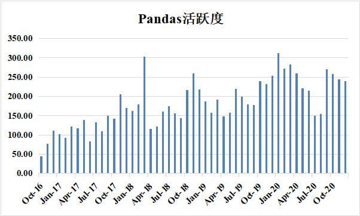
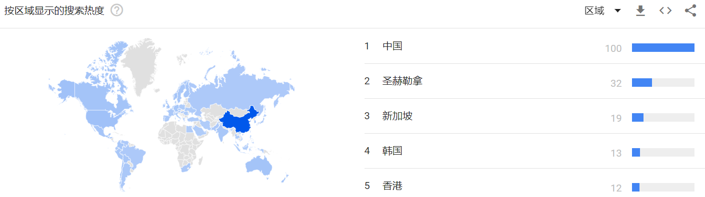

# pandas-dev/pandas社区报告

**摘要**：开源软件开发是人类在互联网发展进程中探索出的一种面向全球的大规模软件协作开发生产模式，当下备受瞩目。本项目为华东师范大学数据学院春季课程《开源软件开发与社区治理》期末大作业，旨在使用ClickHouse中Github全域日志数据对当下流行的开源项目以数据的视角进行分析调研。本报告的调查对象是当前使用广泛的数据分析工具Pandas。

**关键词**：Github、数字报告、开源、行为数据

## 1、背景

Pandas 是一个开放源码、BSD 许可的库，提供高性能、易于使用的数据结构和数据分析工具。Pandas 名字衍生自术语 "panel data"和 "Python data analysis"。Pandas 一个强大的分析结构化数据的工具集，基础是 Numpy。

Pandas 的主要数据结构是 Series （一维数据）与 DataFrame（二维数据），这两种数据结构足以处理金融、统计、社会科学、工程等领域里的大多数典型用例。

Pandas 可以从各种文件格式比如 CSV、JSON、SQL、Microsoft Excel 导入数据。Pandas 可以对各种数据进行运算操作，比如归并、再成形、选择，还有数据清洗和数据加工特征。Pandas 广泛应用在学术、金融、统计学等各个数据分析领域。

## 2、分析结果

### 2.1基础数据分析

截止2020年12月，开源仓库Pandas共有22856个star，我们对该仓库每月的star数进行分析，结果如图1所示。从图中我们可以看到2016-2017年每月的star数呈现上升趋势，说明该项目正处于快速发展期。2018年至今每月的star数一直比较平稳，说明该开源项目进入稳定发展期并持续火热，多年来一直受到开发者的关注。

图2-1：Pandas每月Star数

截止2020年12月，开源仓库Pandas共被fork11498次，我们对该仓库每月的fork数进行分析，结果如图2所示。从图中我们可以看到2018年3月fork数明显多于其他月份，虽然我们没有找到关于这个月发生特定事件的信息，但可以猜测这个月对Pandas社区来说一定是发展过程中非常重要的月份。其他月份fork数处于稳步上升的趋势，说明pandas越来越多的受到开发者的关注。

图2-2：Pandas每月Fork数

图3是Pandas每月star/fork数的对比图，可以发现两者的走势基本一致。

图2-3：Pandas每月Stark/Fork数

我们对2020年活跃的issue进行了统计，2020年共有活跃issue14356条。我们查阅了部分issue的标签，发现其标签内容没有明显的规范，我们对其中一些热门的标签进行统计，如图4所示。从图中可以看出issue中主要的标签有“bug”、“Docs”、“Testing”、“clean”等，其中带有“bug”标签的issue最多，有2505个，约占标签总数的17%，带“docs”标签的issue有1643个，约占总数的11%。

图2-4：issue标签统计

如图5所示是2020年依然活跃的issue的创建年份，约87%的issue创建于当前，6%的issue创建于前一年，其他约7%的issue创建于前几年，有11个2012年创建的issue依然在2020年活跃。

图2-5：issue创建年份

我们统计了开发者和issue关联情况，如图表1是关联issue最多的十个开发者（我们排除了登录名是机器人的可能），其中与开发者jbrockmendel相关的issue有2799个，该开发者在issue的处理上做出了巨大的贡献。

|       登录名       | issue数 |
| :----------------: | :-----: |
|    jbrockmendel    |  2799   |
|  simonjayhawkins   |   676   |
| jorisvandenbossche |   470   |
|   TomAugspurger    |   461   |
|  meeseeksmachine   |   358   |
|      dsaxton       |   349   |
|  MomIsBestFriend   |   341   |
|       phofl        |   301   |
|    MarcoGorelli    |   240   |
|     mroeschke      |   231   |

表2-1：关联issue最多的十个开发者

此外，我们还统计了Pandas仓库每月的活跃度，如图6所示。从图中可以看到Pandas月活跃度呈现波浪上升的态势，说明Pandas仓库越来越受到开发者的喜爱。图中2018年3月活跃度明显偏高，结合前面的分析可以发现fork数也在这个月明显偏高，这一定是Pandas发展里程碑中的重要时刻。从图7中可以发现活跃度与仓库活动参与人数呈正相关性。

图2-6：Pandas活跃度

图2-7：Pandas中活跃度和参与人数的关系

### 2.2开发者数据统计、可视化

我们统计了pandas-dev/pandas社区的贡献者项目活跃度分布，并且使用对数坐标，如图2-7所示，在pandas社区中活跃的用户占比还是较少的，大部分的开发者在该仓库下的活动较少。

图2-7 用户活跃度分布

图2-8显示了pandas社区中的活跃度最高的20位开发者的活跃度情况，可以看到jbrockmendel是pandas社区中的核心贡献者，他的活跃度超过了另外19位开发者的总和，第二名是mroeschek。

图2-8 pandas Top20用户活跃度统计

如表2-1所示，我们列出了开发这种活跃度前10名的用户名称及他们的活动统计，包括他们创建issue，merge，pull等常规操作的统计。

表2-1 pandas Top10用户操作统计

我们统计了pandas社区中从2015年到2020年的参与开发的用户数量，并且我们可视化了逐年的用户增加数量，可以看到在pandas社区在开源一年后的2016年，用户的新增数量是最多的，而在2018年新增数量来到了最低点，后面两年又有所增加，整体维持在一个较为活跃的程度。

图2-9 pandas 逐年新增的开发用户数量统计

我们也调查了项目用户每周所发起的Event数量，并且进行了统计，结果如图2-10所示，可以观察到周日的上传次数是一周内最少的，而周三却是该社区用户上传次数最多的日期。

图2-10 pandas 用户每周提交代码次数统计

而对于一天之内的24个小时，我们也统计了用户在不同的时间段提交代码的次数分布，如图2-11所示，大部分的提交都集中在下午或者晚上，而早上5点至6点的区间是用户提交次数最少的区间。

图2-11 pandas 用户每天不同时段提交代码次数统计

综合每周每天不同时间段的代码提交统计，我们绘制了图2-12的综合上传分布图，可以看到，每天凌晨的代码提交次数基本都是最少的。

图2-12 pandas 用户每周每天提交代码次数统计

我们统计了pandas社区中的top20活跃的开发者，并且查看这些开发者在其他项目上的活跃程度，并且提取出了较为活跃的项目绘制了图2-13的pandas相关项目关系图。

图2-13 pandas 关联项目关系图

### 2.3关联数据的分析

### 2.4其他数据分析

我们对2020年的日志记录进行分析，有4567人的活动与Pandas仓库相关。我们对这些开发者使用的邮箱进行了统计，其中大部分人使用了“@gmail.com”、 “@users.noreply.github.com”这两类邮箱，分别占总数的57.8%、33.1%，其他用户有使用“@tensortable.com”、“@outlook.com”、“@kth.se”等一些类型的邮箱，但占比都比较低。

图：Pandas参与者邮箱使用情况

如图所示，使用google搜索指数工具对关键词“pandas”进行分析可以发现，近十年来，pandas的搜索热度总体呈现上升趋势，2020年4月以来也有一个短暂的下滑，分析可能和疫情有一定相关性。

图：Pandas搜索热度

近10年的热门搜索区域如图所示，可以看到Pandas在全球的使用比较广泛，足以说明其作为一个数据处理库的卓越性。对比近5年与近10年的热门热门区域可以发现，中国从第五位上升到第一位，足以见得国人对Pandas库的喜爱，当然也一定程度上反映了近几年国内人工智能的快速发展热潮。

图：Pandas近10年热门搜索区域

图：Pandas近5年热门搜索区域

Github Apps的日志时间分布情况统计如图所示，x轴是以小时计数的时间，y轴是以日期计数的星期数。通过观察可以发现开发者的主要工作时间为上午8点到晚上9点，周末尤其是周六开发者的工作明显减少。

图：Github Apps的日志时间分布情况

2020年与仓库名称与pandas有关联的活跃仓库为16108个，有1931个名称是“%/pandas”，为fork仓库。查阅其中部分仓库发现其余仓库主要是一些使用了pandas的项目仓库，其中也有很大一部分仓库是与pandas使用教学相关联的。

## 3 流程类

### 3.1 项目的日常协作流程调研

#### 3.1.1贡献工作

​	**1 Bug reports and enhancement requests**

​	错误报告是使 Pandas 更加稳定的重要组成部分。完整的错误报告将有助于其他人重现错误并提供修复的见解。编写错误报告需要按照格式规范完成。在提交错误报告前需在 master 分支上测试产生错误的代码，以确认错误仍然存在。还要搜索现有的错误报告和拉取请求，以查看问题是否已被报告或修复。

​	**2 Contributing to the documentation**

​	对文档的贡献使使用 Pandas 的每个人都受益。

​	**3 Contributing to the code base**

​	贡献代码有规范的流程，这一部分在开发者参与流程调研中详细说明。

#### 3.1.2维护工作

​	**1 Issue triage**

​	issue分类主要有以下几步：

- 感谢报告着开启issue

- 确认issue中提供了必要的信息

- 确认是否是重复issue

- 问题是否最小化且可重现

- 问题是否有用

- 应该添加哪些标签和里程碑

  **2 Closing issues**

​	许多人认为结束issue是对话结束了。通常最好给issue报告者一些时间来回应或自行关闭他们的问题。有时issue报告者会忘记，那么应该在对话结束后关闭issue。

​	**3 Reviewing pull requests**

​	任何人都可以审查pull requests：常规贡献者、分类人员或核心团队成员。但是只有核心团队成员准备好后才能合并 pull request。

​	**4 Cleaning up old issues**

​	有时，bug已经被修复，但问题并未与pull request相关联。在这些情况下，给issue评论“这已经修复，但需要测试。并将问题标记为“Good first issue”和“Needs Test”。

​	如果较旧的问题缺少可重现的示例，请将其标记为“Needs Info”并要求提供一个（或如果可能的话自己写一个）。如果没有尽快提供，根据关闭issue中的政策关闭它。

​	**5 Cleaning up old pull requests**

​	有时，贡献者无法完成pull request。如果距离上次审查请求更改已经过了一段时间（比如说两周），那么可以礼貌地问他们是否仍有兴趣进行此项工作。如果再过两个星期左右没有任何回应，感谢他们的工作并关闭pull request。在最初的问题上评论“在#1234有一个可能有用的停滞PR”，如果PR比较完整了的话，也许可以给issue贴上“Good first issue”的标签。

​	**6 Merging pull requests**

​	只有核心团队成员可以合并拉取请求。

### 3.2 开发者参与流程调研

 	**1 start**

​	找到未被分配并且感兴趣的issue，并将issue分配给自己。如果由于某种原因无法继续处理该问题，请尝试取消分配，以便其他人知道当前issue再次可用。

​	**2 Version control, Git, and GitHub**

​	代码托管在 GitHub 上。要做出贡献，需要注册一个免费的 GitHub 帐户。项目使用 Git 进行版本控制，以允许许多人一起在项目上工作。

​	**3 Forking**

​	在github的pandas页面上fork仓库，并将仓库克隆到本地

​	**4 Creating a development environment**

​	要测试代码就需要从源代码构建 Pandas，这需要 C/C++ 编译器和 Python 环境。可以使用 Docker 来自动创建环境，而不是手动设置开发环境。

​	**5 Creating a branch**

​	master 分支存放预生产代码，因此需要创建一个feature分支来更改代码。

​	**6 Code standards**

​	良好的风格是向 Pandas 提交代码的必要条件。

​	代码在提交前必须经过测试。

​	更改代码时要注意兼容性，不要是当前版本的正确代码在之后的版本中失效。

​	**7 commit**

​	提交代码前应该充分检查代码规范性正确性。提交时解释性消息要按照指定规范书写，包括消息前缀和规范的约定。

​	**8 make the pull request**

​	如果一切正常，您就可以发出pull request了。pull request将本地存储库中的代码提供给 GitHub 社区，可以查看并最终合并到主版本中。此pull request及其相关更改最终将提交到主分支并在下一个版本中可用。

​	**9 Delete your merged branch (optional)**

​	分支在代码被合并后可以删除。

​	**10 Tips for a successful pull request**

​	为了提高您的拉取请求被审查的机会，您应该：

​		引用未被更改的issue以阐明 PR 的目的；

​		确保有适当的测试；

​		使pull request尽可能简单，较大的 PR 需要更长的时间来审查；

​		确保 CI 处于绿色状态

### 3.3 项目CI/CD的流程调研

## 4 总结