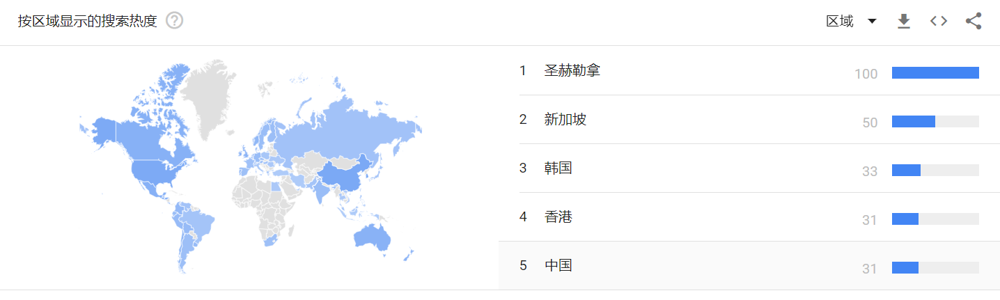

# pandas-dev/pandas社区分析报告

**摘要**：开源软件开发是人类在互联网发展进程中探索出的一种面向全球的大规模软件协作开发生产模式，当下备受瞩目。本项目为华东师范大学数据学院春季课程《开源软件开发与社区治理》期末大作业，旨在使用ClickHouse中Github全域日志数据对当下流行的开源项目以数据的视角进行分析调研。本报告的调查对象是当前使用广泛的数据分析工具Pandas。

**关键词**：Github、数字报告、开源、行为数据

## 1、背景

Pandas 是一个开放源码、BSD 许可的库，提供高性能、易于使用的数据结构和数据分析工具。Pandas 名字衍生自术语 "panel data"和 "Python data analysis"。Pandas 一个强大的分析结构化数据的工具集，基础是 Numpy。

Pandas 的主要数据结构是 Series （一维数据）与 DataFrame（二维数据），这两种数据结构足以处理金融、统计、社会科学、工程等领域里的大多数典型用例。

Pandas 可以从各种文件格式比如 CSV、JSON、SQL、Microsoft Excel 导入数据。Pandas 可以对各种数据进行运算操作，比如归并、再成形、选择，还有数据清洗和数据加工特征。Pandas 广泛应用在学术、金融、统计学等各个数据分析领域。

## 2、分析结果

### 2.1基础数据分析

截止2020年12月，开源仓库Pandas共有22856个star，我们对该仓库每月的star数进行分析，结果如图1所示。从图中我们可以看到2016-2017年每月的star数呈现上升趋势，说明该项目正处于快速发展期。2018年至今每月的star数一直比较平稳，说明该开源项目进入稳定发展期并持续火热，多年来一直受到开发者的关注。

图2-1：Pandas每月Star数

截止2020年12月，开源仓库Pandas共被fork11498次，我们对该仓库每月的fork数进行分析，结果如图2所示。从图中我们可以看到2018年3月fork数明显多于其他月份，虽然我们没有找到关于这个月发生特定事件的信息，但可以猜测这个月对Pandas社区来说一定是发展过程中非常重要的月份。其他月份fork数处于稳步上升的趋势，说明pandas越来越多的受到开发者的关注。

图2-2：Pandas每月Fork数

图3是Pandas每月star/fork数的对比图，可以发现两者的走势基本一致。

图2-3：Pandas每月Stark/Fork数

我们对2020年活跃的issue进行了统计，2020年共有活跃issue14356条。我们查阅了部分issue的标签，发现其标签内容没有明显的规范，我们对其中一些热门的标签进行统计，如图4所示。从图中可以看出issue中主要的标签有“bug”、“Docs”、“Testing”、“clean”等，其中带有“bug”标签的issue最多，有2505个，约占标签总数的17%，带“docs”标签的issue有1643个，约占总数的11%。

图2-4：issue标签统计

如图5所示是2020年依然活跃的issue的创建年份，约87%的issue创建于当前，6%的issue创建于前一年，其他约7%的issue创建于前几年，有11个2012年创建的issue依然在2020年活跃。

图2-5：issue创建年份

我们统计了开发者和issue关联情况，如图表1是关联issue最多的十个开发者（我们排除了登录名是机器人的可能），其中与开发者jbrockmendel相关的issue有2799个，该开发者在issue的处理上做出了巨大的贡献。

|       登录名       | issue数 |
| :----------------: | :-----: |
|    jbrockmendel    |  2799   |
|  simonjayhawkins   |   676   |
| jorisvandenbossche |   470   |
|   TomAugspurger    |   461   |
|  meeseeksmachine   |   358   |
|      dsaxton       |   349   |
|  MomIsBestFriend   |   341   |
|       phofl        |   301   |
|    MarcoGorelli    |   240   |
|     mroeschke      |   231   |

表2-1：关联issue最多的十个开发者

此外，我们还统计了Pandas仓库每月的活跃度，如图2-6所示。从图中可以看到Pandas月活跃度呈现波浪上升的态势，说明Pandas仓库越来越受到开发者的喜爱。图中2018年3月活跃度明显偏高，结合前面的分析可以发现fork数也在这个月明显偏高，这一定是Pandas发展里程碑中的重要时刻。从图7中可以发现活跃度与仓库活动参与人数呈正相关性。

图2-6a：Pandas活跃度

图2-6b：Pandas中活跃度和参与人数的关系

### 2.2开发者数据统计、可视化

我们统计了pandas-dev/pandas社区的贡献者项目活跃度分布，并且使用对数坐标，如图2-7所示，在pandas社区中活跃的用户占比还是较少的，大部分的开发者在该仓库下的活动较少。

图2-7 用户活跃度分布

图2-8显示了pandas社区中的活跃度最高的20位开发者的活跃度情况，可以看到jbrockmendel是pandas社区中的核心贡献者，他的活跃度超过了另外19位开发者的总和，第二名是mroeschek。

图2-8 pandas Top20用户活跃度统计

如表2-1所示，我们列出了开发这种活跃度前10名的用户名称及他们的活动统计，包括他们创建issue，merge，pull等常规操作的统计。

表2-1 pandas Top10用户操作统计

我们统计了pandas社区中从2015年到2020年的参与开发的用户数量，并且我们可视化了逐年的用户增加数量，可以看到在pandas社区在开源一年后的2016年，用户的新增数量是最多的，而在2018年新增数量来到了最低点，后面两年又有所增加，整体维持在一个较为活跃的程度。

图2-9 pandas 逐年新增的开发用户数量统计

我们也调查了项目用户每周所发起的Event数量，并且进行了统计，结果如图2-10所示，可以观察到周日的上传次数是一周内最少的，而周三却是该社区用户上传次数最多的日期。

图2-10 pandas 用户每周提交代码次数统计

而对于一天之内的24个小时，我们也统计了用户在不同的时间段提交代码的次数分布，如图2-11所示，大部分的提交都集中在下午或者晚上，而早上5点至6点的区间是用户提交次数最少的区间。

图2-11 pandas 用户每天不同时段提交代码次数统计

综合每周每天不同时间段的代码提交统计，我们绘制了图2-12的综合上传分布图，可以看到，每天凌晨的代码提交次数基本都是最少的。

图2-12 pandas 用户每周每天提交代码次数统计

### 2.3关联数据的分析

我们统计了pandas社区中的top20活跃的开发者，并且查看这些开发者在其他项目上的活跃程度，并且提取出了较为活跃的项目绘制了图2-13的pandas相关项目关系图。

图2-13 pandas 关联项目关系图

### 2.4其他数据分析

我们对2020年的日志记录进行分析，有4567人的活动与Pandas仓库相关。我们对这些开发者使用的邮箱进行了统计，其中大部分人使用了“@gmail.com”、 “@users.noreply.github.com”这两类邮箱，分别占总数的57.8%、33.1%，其他用户有使用“@tensortable.com”、“@outlook.com”、“@kth.se”等一些类型的邮箱，但占比都比较低。

图2-14：Pandas参与者邮箱使用情况

如图所示，使用google搜索指数工具对关键词“pandas”进行分析可以发现，近十年来，pandas的搜索热度总体呈现上升趋势，2020年4月以来也有一个短暂的下滑，分析可能和疫情有一定相关性。

图2-15：Pandas搜索热度

近10年的热门搜索区域如图所示，可以看到Pandas在全球的使用比较广泛，足以说明其作为一个数据处理库的卓越性。对比近5年与近10年的热门热门区域可以发现，中国从第五位上升到第一位，足以见得国人对Pandas库的喜爱，当然也一定程度上反映了近几年国内人工智能的快速发展热潮。

图2-16：Pandas近10年热门搜索区域

图2-17：Pandas近5年热门搜索区域

Github Apps的日志时间分布情况统计如图所示，x轴是以小时计数的时间，y轴是以日期计数的星期数。通过观察可以发现开发者的主要工作时间为上午8点到晚上9点，周末尤其是周六开发者的工作明显减少。

图2-18：Github Apps的日志时间分布情况

2020年与仓库名称与pandas有关联的活跃仓库为16108个，有1931个名称是“%/pandas”，为fork仓库。查阅其中部分仓库发现其余仓库主要是一些使用了pandas的项目仓库，其中也有很大一部分仓库是与pandas使用教学相关联的。

## 3 总结

​	通过上述的关于Pandas社区的基本数据分析以及社区开发者行为等各方面的分析，我们可以知道Pandas目前已经进入了一个稳定的发展期并且持续火热，多年来一直受到开发者的关注。目前仍有相当多的issue产生，主要是关于bug的修复以及文档的更新，且大部分的issue都是最近两年由开发者提出的。近10年的热门搜索区域可以看到Pandas在全球的使用比较广泛，足以说明它作为一个数据处理库的卓越性，也一定程度上反映了近几年内人工智能的快速发展热潮。

