# 第九组分析模块
### 摘要
开源软件开发是人类在互联网发展进程中探索出的一种面向全球的大规模软件协作开发生产模式，当下备受瞩目。本项目为华东师范大学数据学院春季课程《开源软件开发与社区治理》期末大作业，旨在使用ClickHouse中Github全域日志数据对当下流行的开源项目以数据的视角进行分析调研。本报告的调查对象是当前流行的前端框架Vue。
### 关键词：开源、行为数据、开发者行为、Github、数字报告
## 1.背景
“简单却不失优雅，小巧而不乏大匠”。很多使用过vue的程序员这样评价它，“vue.js兼具angular.js和react.js的优点，并剔除了它们的缺点”。授予了这么高的评价的vue.js，也是开源世界华人的骄傲，因为它的作者是位中国人–尤雨溪（Evan You）。

Vue.js 是一个JavaScript MVVM库，是一套构建用户界面的渐进式框架。它是以数据驱动和组件化的思想构建的，采用自底向上增量开发的设计。相比于Angular.js，Vue.js提供了更加简洁、更易于理解的API，使得我们能够快速地上手并使用Vue.js；同时比起 React + Redux 相对复杂的架构，Vue.js 更加轻量级也更加容易上手，是初创项目的首选前端框架。Vue 的核心库只关注视图层，它不仅易于上手，还便于与第三方库或既有项目整合。并且作者是华人的关系，Vue拥有着对华人开发者最友好的api文档和官方教程。

时至今日，Vue已成为全世界三大前端框架之一，Github 上拥有近 17 万 Star 领先于 React 和 Angular，在国内更是首选。它的设计思想、编码技巧也被众多的框架借鉴、模仿。本次项目旨在以数据的视角去分析探究Vue的发展和用户使用以及参与社区的情况。
## 2.分析结果
### 2.1基础的统计数据分析、可视化
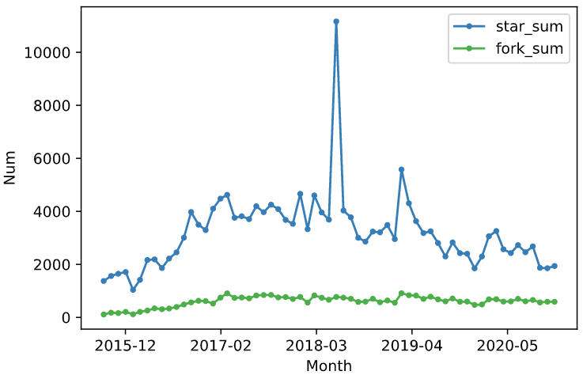

图2-1 star数量和fork数量

我们统计了这个项目从开始到2020年末每个月的star和fork的数目，star可以代表这个项目被人们关注的数量，fork可以代表这个项目被其他开发者利用的数量。从图2-1的原始数据可以看出18年6月的star数量比平时都高，也许是这个框架突然火起来了。

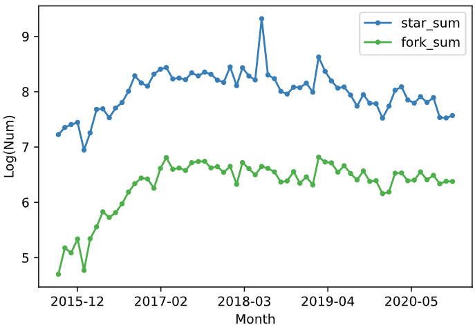

图2-2 star数量和fork数量log后

图2-2为原始数据做log处理后的曲线。从图2-2中可以看出它们两的形状曲线相似，说明两者间存在一定的关系，发现人数越多，利用人数也越多。

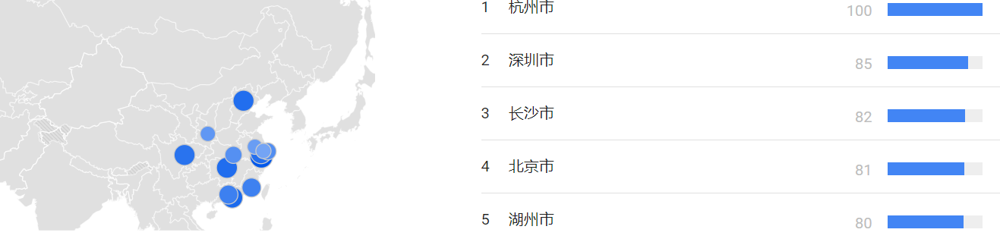

图2-3 城市搜索趋势

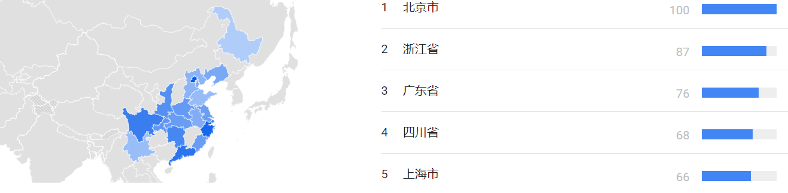

图2-4 子区域搜索趋势

我们也在谷歌趋势上查看了vue这个关键词的搜索趋势。上面两个图片显示了不同区域的搜索情况，可以发现大部分城市或者区域都是互联网比较发达的地区，符合实际情况。

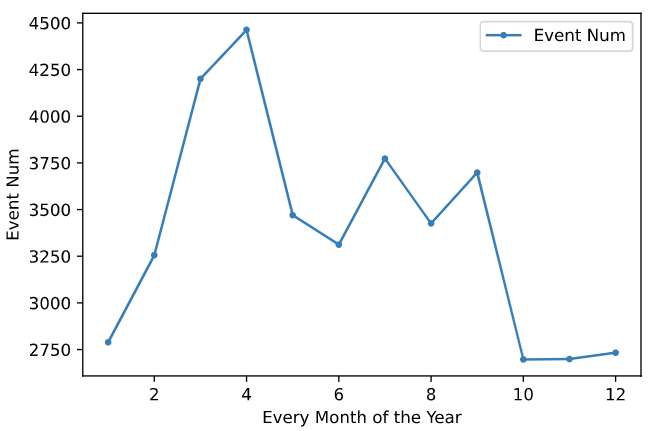

图2-5 每个月的event数量

上图展示了每个月的event数量，数据显示在2020年初它的关注度以及活跃度要比年末强。

### 2.2开发者数据统计、可视化
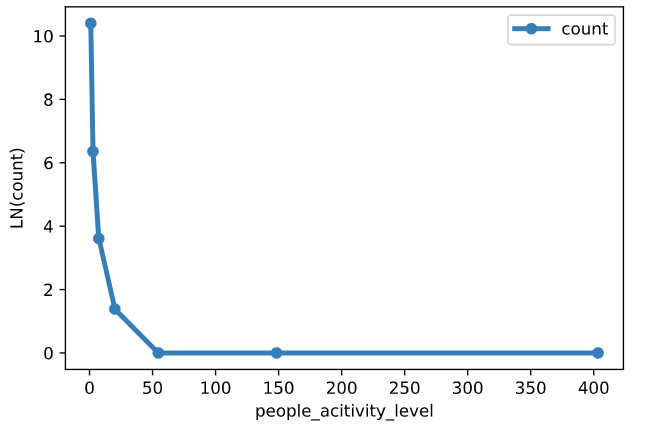

图2-6 项目开发者活跃区间分布

我们统计了项目开发者活跃区间分布，从上图中可以看出活跃度高的人比较少，而活跃度低的人比较多

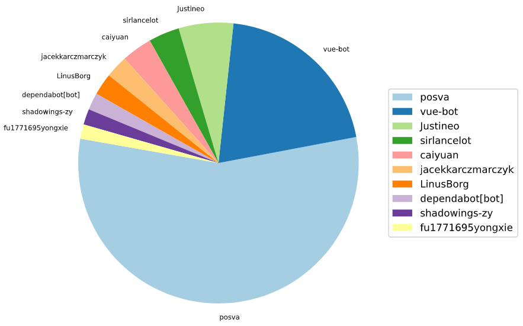

图2-7 活跃度前10

我们列出了活跃度前10名，活跃度包含了他们打开issue，评论issue，merge等常规操作。从图中可以看出用户posva活跃度最高，他的活动记录如下：

| issue_comment | open_issue | open_pull | pull_review_comment | merge_pull|
| :----: | :----: | :----: | :----: | :----: |
| 568 | 1 | 5 | 15 | 4.282 |

从表中可以看出他在issue下评论次数比较多。大概是因为他是项目的核心开发者之一，能够比较好的解决大家的问题。

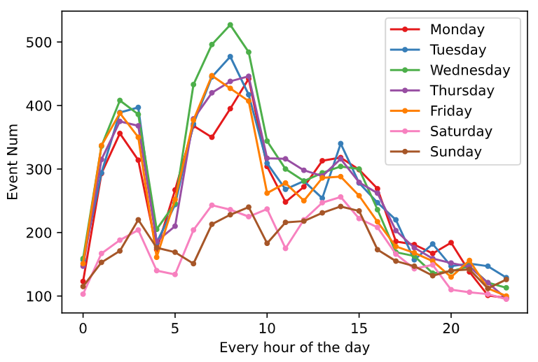

图2-8 每周的event事件数

我们也调查了项目一周内每天24小时的event出现情况。可以看出每天的曲线都比较相似和规律，大概是作息的原因。周六日休息的时候event数目比工作日要少。

### 2.3关联数据的分析，如协作关联度高的其他项目

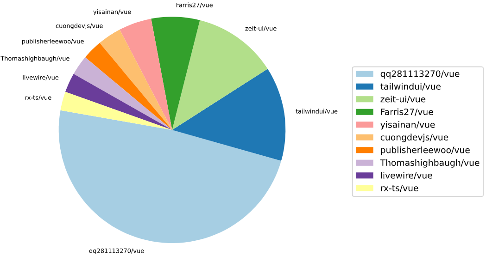

图2-9 fork下来的其他项目

我们调查了由vue派生出来的其他项目，选取了活跃度较高的前十名在饼图中列出了名字。通过调研发现里面的项目有些是ui类，即为vue编写了用户界面；有些是教程类，教大家怎么学习vue；还有一些是工具类，包含一些比较实用的组件或者写好的框架，方便其他开发者二次开发。通过这些教程或者框架，可以帮助开发者更快地入门vue。

### 2.4其他任意想做的数据分析
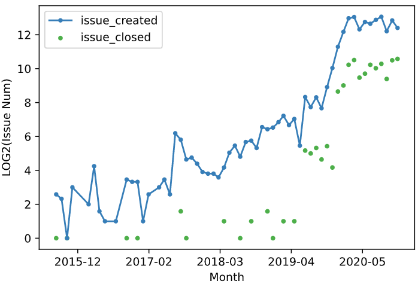

图2-10 issue的创建关闭情况

我们调研了每个月issue打开和关闭的情况，图中可以看出每月打开的issue数量总是大于关闭issue的数量，说明有些issue还不能得到很好的解决。

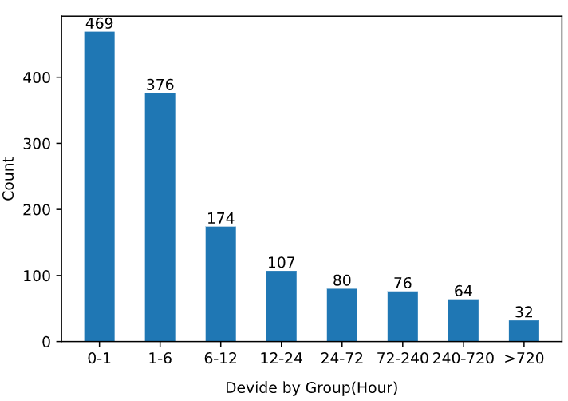

图2-11 issue的关闭时间情况

我们也统计了issue从打开到关闭的时间。由图中可以看出大部分issue在一个小时或者六个小时都被关闭了，其中用户提出的问题或者bug能够较快的被解决，说明这个社区的活跃度还是比较高。也还有一部分issue关闭需要的时间比较长，说明也还需要改进。

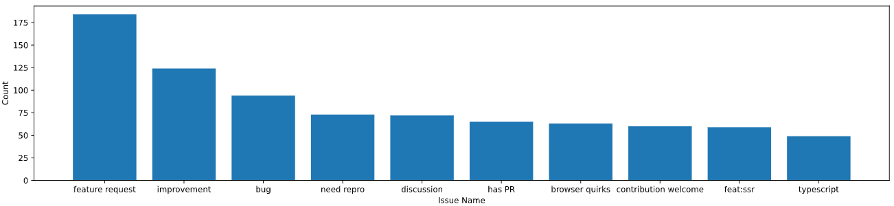

图2-12 issue的标签情况

我们统计了2020全年中前10的issue标签，可以看出feature request、improvement和bug标签位居前三。

## 3.总结
通过以上分析可以得知Vue这个框架大概从18年六月开始火起来，star数量和fork数量在项目创立到2020年末都是最高的。通过区域搜索地图可视化分析发现，国内使用Vue的用户主要集中在北上广深等互联网相对发达的城市。在社区成员参与项目的活跃度调查中发现用户posva活跃度最高，因为他是Vue核心团队的成员，能更好的帮助大家解决问题，所以对他的行为数据分析发现他在issue下评论次数比较多。对Vue项目issue分析发现issue在较短时间内都被解决了，说明这个社区的活跃度还是比较高，也还有一部分issue关闭需要的时间比较长，说明也还需要改进。关于其他用户fork下来的vue前十个活跃的项目里，通过调研发现里面的项目有些是ui类，即为vue编写了用户界面；有些是教程类，教大家怎么学习vue；还有一些是工具类，包含一些比较实用的组件或者写好的框架，方便其他开发者二次开发。通过这些教程或者框架，可以帮助开发者更快地入门vue。这些项目进一步反映了Vue框架的热门。