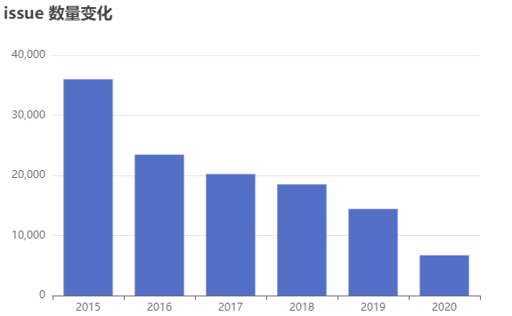
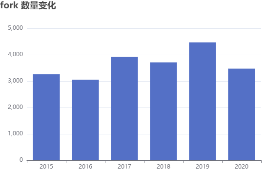
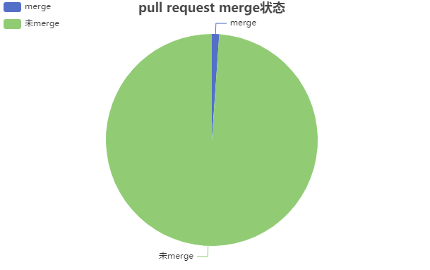
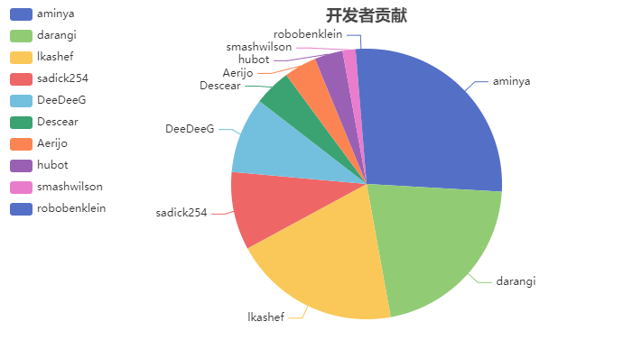
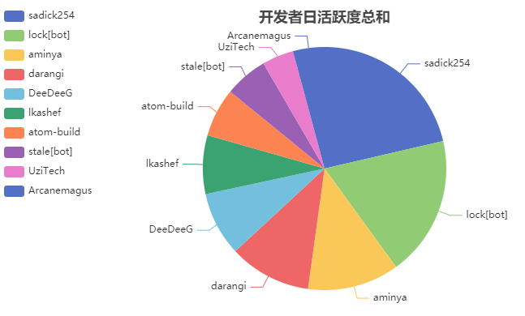
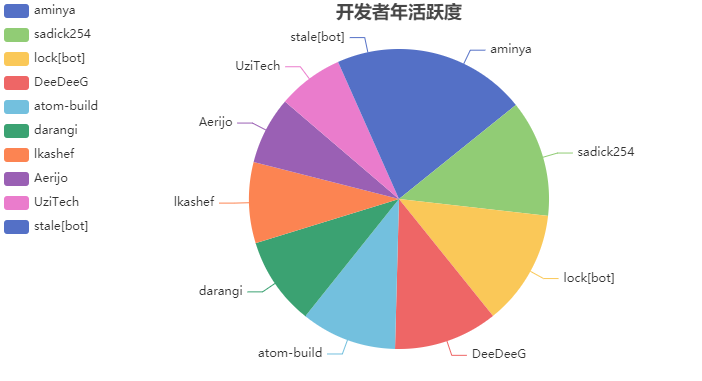
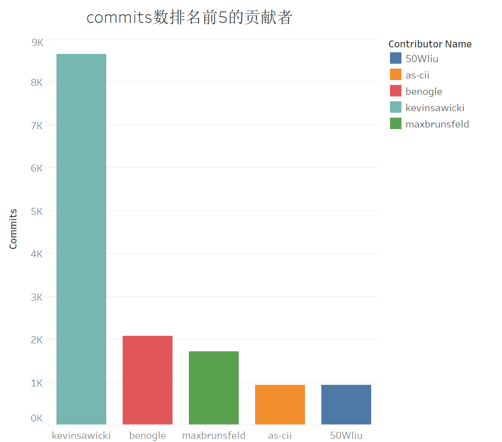
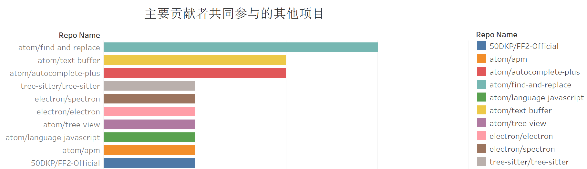
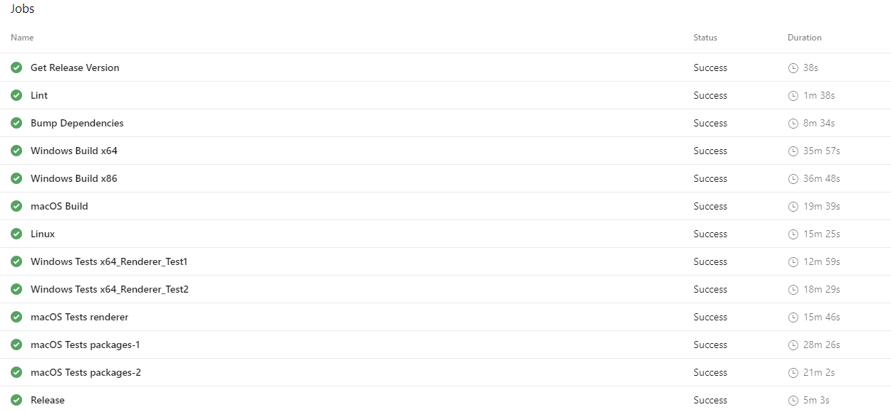

# Atom 数据分析

## 项目介绍

Atom 是 Github 官方推出的一款跨平台文本编辑器，具有简洁和直观的图形用户界面，并有很多有趣的特点：支持CSS，HTML，JavaScript等网页编程语言。它支持宏，自动完成分屏功能，集成了文件管理器。该编辑器于2015年开源。本报告将对 Atom 这一流行开源项目做数据分析。

## 分析内容

### 数据类

#### 1. 基础数据统计分析、可视化

首先看看该项目提交的 issue 数量。从每年提交的 issue 数量可以看到，从2015年到2020年，issue 数量在不断的减少，到了2020年，该项目的 issue 数量甚至首次低于10000。对于 issue 数量不断下降，可能的原因有：一个是项目的质量越来越高，有用的 issue 本身也不多，第二是项目的活跃度也在不断的下降，开发者的参与变少了。



虽然 issue 数量在不断减少，但是项目的 fork 数量没有太大的变化，过去5年间都比较稳定，说明 Atom 受到的关注并没有太大的变化，开发者依然愿意去为这个项目做出贡献。



  在 pull_request 的 merge 状态方面，Atom 的绝大部分的 pull request 都没有被 merge，2020年一共只有187个pull request 被 merge，剩下的16455个都未被 merge。




#### 2. 开发者数据统计、可视化

在开发者的贡献上，从 commit 数量上来看，2020年，commit 数量排名第一的开发者一共提交了100次，排名第十的开发者只提交了5次。



我们分别统计了 Atom 项目中的开发者日活跃度和年活跃度，两份统计图中，排名前十的开发者近乎一致。






#### 3.关联数据的分析



​	在进行关联数据分析时，我们首先找出了atom中commits数量排名前5的开发者。其中排名第一的开发者kevinsawicki共进行了8655次commit。排名第二的benogle共进行了2071次commit。排名前5位的开发者的commits数量基本都超过或接近1000次。




​	在找出了atom的5名主要贡献者后，我们统计了他们主要参与的项目。

​	这些项目很多都与atom相关联。例如上图中排名第一的 "atom/find-and-replace"。这个项目的贡献者里包含了前面提到的5位中的3位atom开发者。这个项目主要用于实现atom编辑器中查找和替换文本的功能。还有例如"atom/autocomplete-plus“这个项目，主要用于实现atom编辑器中自动补全的功能。

​	此外，值得一提的是"electron/electron"这个项目。electron是一个跨平台的、基于web前端技术的桌面GUI应用程序开发框架。它最初是用来服务Github的开发工具atom的，当时的名称为atom shell，后来才改名为electron。在atom中commits数量排名第一的开发者"kevinsawicki"在electron中的commits数量位列第二(2138 commits)。

### 流程类

#### 1. 项目日常流程

项目日常流程分为提交 issue 的规范和提交建议的规范。

##### 提交 issue 规范

首先是提交 issue 的规范，从以下三个方面入手描述 issue。

##### 一. 解释问题及其细节描述规范：

（1） 对问题使用清晰的描述性标题。

（2） 尽可能详细地描述问题的确切步骤。例如，当你启动 Atom 开始，在终端中使用了哪个命令，或者在其他情况下如何启动 Atom 。在描述问题的同时，不仅要说你做了什么，还要解释你是如何做到的。例如，如果你将光标移到一行的末尾，请说明你是使用了鼠标、键盘快捷键还是 Atom 命令，如果是，请说明是哪一个？

（3） 提供具体的文件和代码来描述问题。包括指向文件或 GitHub 项目的链接，或在这些示例中使用的可复制/粘贴的代码段。

（4） 描述您在遵循这些步骤后观察到的行为，并指出该行为的问题所在。

（5） 解释你希望看到的行为以及原因。

（6） 如果可以，请尽可能使用屏幕截图和动画 gif ，显示你遵循所描述的步骤并清楚地演示问题。如果在执行步骤时使用键盘，请使用所示的键绑定解析器录制 GIF 。

（7） 如果报告 Atom 崩溃，请包含一个崩溃报告以及来自操作系统的堆栈跟踪。如果在 macOS 上崩溃报告，请在 Console.app 的“诊断和使用信息”>“用户诊断报告”下提供。将崩溃报告包含在问题的代码块、文件附件中，或者将其放在 gist 中，并提供指向该 gist 的链接。

（8） 如果问题与性能或内存有关，请在报告中包含 CPU 配置文件捕获。

（9） 如果 Chrome 的 developer tools 窗格在没有触发的情况下显示，通常意味着您的某个主题或 styles.less 中存在语法错误。试着在安全模式下运行，使用不同的主题或注释掉样式的内容，看看是否可以解决问题。

（10）如果问题不是由特定操作触发的，请描述问题发生前您正在做的事情。

##### 二. 交代问题产生时的背景：

（1）是否能在安全模式下重现这个问题。

（2）问题是最近开始出现的，还是一直都存在。

（3）问题的产生时新版本的时候开始的还是旧版本时就存在的。

（4）是否可以复现这个问题。如果不可以，请详细说明问题发生的频率以及通常发生的条件。

（5）如果问题与使用文件有关，那么问题是发生在所有文件和项目中，还是仅发生在部分文件和项目中。

（6） 你使用的文件是否有特别之处。

##### 三. 介绍有关配置和环境的详细信息：

（1）介绍你使用的是哪个版本的 Atom 。

（2）介绍你使用的操作系统的名称和版本是什么。

（3）介绍你使用的虚拟机软件或主机或客户机使用的操作系统和版本。

（4）介绍你安装的软件包。

（5）您是否修改过本地配置文件 config.cson 、keymap.cson 、snippets.cson 、styles.less 和 init.coffee 自定义 Atom ？如果是，请介绍这些文件的内容，最好是在代码块中，或者提供指向要点的链接。

（6）是否将 Atom 与多个监视器一起使用？如果是这样的话，当你使用一台显示器时，你能再现这个问题吗？

（7）介绍你使用的键盘布局，是美国版式还是其他版式？

##### 提交加强建议规范

本节描述提交建议的规范。

##### 在提交加强建议之前

(1)查看调试指南中的提示-你可能会发现功能已经可用。最重要的是，检查你是否正在使用最新版本的 Atom ，以及是否可以通过更改 Atom 或包的配置设置来获得所需的行为。

(2)检查是否已经有一个包提供了该功能。

(3)确定应该在哪个存储库中建议加强。

(4)执行粗略搜索以查看是否已建议加强。如果有，请在现有问题上添加注释。

##### 如何提交加强建议？

请提供以下信息提交加强建议：

（1）使用清晰的描述性标题来描述建议。

（2）尽可能详细地描述加强建议。

（3）尽可能使用具体的例子来演示这些步骤。

（4）描述当前的行为，并解释你希望看到的行为以及原因。

（5）可以使用屏幕截图和动画 gif，帮助你演示步骤或指出需要加强的部分。

（6）可以解释加强后对用户的好处。

（7）列出存在此加强建议功能的其他文本编辑器或应用程序。

（8）描述你正在使用的 Atom 版本。

（9）描述你正在使用的操作系统的名称和版本。

#### 2. 开发者流程调研

开发者流程分为如何提交贡献、创建核心 package 的 fork 、维护核心 package 的分支和发布四个部分。

##### 如何提交贡献

本节将描述提交贡献的流程。

##### 克隆

第一步是创建自己的克隆。完善构建 Atom 所需的所有需求，以便运行 apm install 。

例如，如果要更改树视图包，请在 github 帐户上分叉 repo ，然后克隆它：

```
C:\> git clone git@github.com:your-username/tree-view.git
```

接下来安装所有依赖项：

```
C:\> cd tree-view
C:\> apm install
```

之后将可链接到开发模式，以便在使用 Atom--dev 运行 Atom 窗口时，使用fork而不是内置包：

```
C:\> apm link -d
```

##### 以开发模式运行

如若要打开一个开发模式窗口，使用"Application: open Dev"命令。也可以使用 atom——dev 从命令行运行 dev模式。

如若要在开发模式下加载包，请在〜/ .atom / dev / packages中创建一个符号链接。使用 apm develop 克隆包时会自动发生。也可以从包目录运行 APM Link --dev 和 APM unlink --dev 以创建和删除 Dev-Mode Symlinks。

##### 安装依赖项

可以通过拉取任何上游更改之后运行 apm update 来保持依赖关系的最新状态。

##### 创建核心package的fork

Atom 的几个核心 package 保存在 Atom/Atom 存储库的 packages 目录中。如果想使用这些 package 中的一个作为自己 package 的起点，可以按照以下步骤操作。

##### 创建新包

为了简化描述，假设开发者希望从 one-light-ui 包中的当前代码开始，对其进行一些定制，然后以“one-light-ui-plus”的名称发布新包。

（1） 将 Atom/Atom 存储库的当前内容作为 ZIP 文件下载。

（2） 解压文件到一个临时位置(例如 C:\TEMP\atom )。

（3） 将所需包的内容复制到 fork 的工作目录中。

```
C:\> cp -R /tmp/atom/packages/one-light-ui ~/src/one-light-ui-plusxcopy
C:\TEMP\atom\packages\one-light-ui C:\src\one-light-ui-plus /E /H /K
```

（4） 创建本地存储库并提交初始内容。

```
C:\> cd ~/src/one-light-ui-plus
C:\> git init
C:\> git commit -am "Import core Atom package"
```

（5） 在 package.json 中给 package 定一个唯一的 name 。

（6） 制作想到的其他自定义。

（7） 提交更改。

```
C:\> git commit -am "Apply initial customizations"
```

（8） 在 github.com 上为你的新包创建一个公共存储库。

（9） 按照 github.com UI 中的说明将代码推到新的在线存储库中。

（10） 按照发布中的步骤发布你的新包。

##### 维护核心 package 分支

原始包中的代码将随着时间的推移继续发展，以修复 bug 或添加新的增强功能。您可能想将其中的一些或所有更新合并到您的包中。为此，您可以按照以下步骤将上游更改合并到您的包中。

##### 添加 atom/atom 作为远程

 （1） 导航到 fork 的本地克隆：

```
C:\> cd path/to/your/fork
```

（2） 将 atom/atom 存储库添加为git远程存储库：

```
C:\> git remote add upstream https://github.com/atom/atom.git
```

##### 获取核心包的最新更改

从 atom/atom 存储库获取最新更改：

```
C:\> git fetch upstream
```

确定核心包的最新更改。例如，如果要维护 one light ui 包的分支，则需要标识 packages/one light ui 目录中最近的更改：

##### 将上游更改合并到您的 Fork 中

对于要放入 fork 的每个提交，请将 git 格式的修补程序与 git am 结合使用。例如，要将 commit 8ac9919a0 合并到fork中：

```
C:\> git format-patch -1 --stdout 8ac9919a0 | git am -p3
```

对要合并到 fork 中的每个提交重复此步骤。

##### 发布

本节将描述发布的流程。

##### 准备好你的 Package

在 publishing 之前，需仔细检查以下几点：

（1） 你的 package.json 文件包含 name、description 和 repository 字段。

（2） 你的 package.json 文件有一个值为“0.0.0”的版本字段。

（3） 你的 package.json 文件有一个 engines 字段，其中包含 Atom 的条目，例如：“engines” {“Atom”：“>=1.0.0<2.0.0”}。

（4） 你的 package 在根目录下有一个 README.md 文件。

（5） 你的 package.json 文件中的存储库URL与存储库的URL相同。

（6） 你的 package 位于已推送到 GitHub 的 Git 存储库中。如果你的 package 还没有在 GitHub 上，请遵循github 中使用命令行导入 Git 存储库指南。

##### 发布你的 Package

在发布 package 之前，最好提前检查是否已将同名 package 发布到 atom.io 包注册表。可以通过访问 https://atom.io/packages/your-package-name 查看 package 是否已存在。如果有，将 package 的名称更新为可用的名称。

之后用 apm publish 发布，该命令会执行以下操作：

（1） 在 atom.io 上注册第一次发布的 package 名。

（2） 更新 package.json 文件中的 version 字段并提交它。

（3） 为要发布的版本创建新的 Git 标记。

（4） 将标记和当前分支推送到 GitHub。

（5） 使用正在发布的新版本更新 atom.io。

现在运行以下命令发布 package：

```
C:\> cd path-to-your-package
C:\> apm publish minor
```

如果这是你要发布的第一个 package，那么 apm publish 命令可能会提示输入 GitHub 用户名和密码。如果启用了双因素身份验证，请使用个人访问令牌代替密码。这是发布所必需的，只需在第一次发布时输入此信息。登录后，凭据将安全地存储在您的密钥链中。

如果你的软件包现在已在 atom.io 上发布并可用。前往 https://atom.io/packages/your-package-name 查看package 页面。

使用 apm publish 命令。你也可以修改 version-type。目前支持 major, minor 和 patch 这三种 version-type。

```
C:\> apm publish version-type
```

publish 命令的 major 选项告诉 apm 在发布之前增加版本的第一个数字，这样发布的版本将是1.0.0，创建的 Git标记将是 v1.0.0。

publish 命令的 minor 选项告诉 apm 在发布之前增加第二个版本号，这样发布的版本将是0.1.0，创建的 Git 标记将是v0.1.0。

publish 命令的 patch 选项告诉 apm 在发布之前增加第三个版本号，这样发布的版本将是0.0.1，创建的 Git 标记将是v0.0.1。

如果你进行的更改破坏了向后兼容性时，如更改默认值或删除功能，请使用 major。如果你不破坏向后兼容性，请使用 minor，如果你更改了现有功能的实现，但没有更改包的行为或选项时，请使用 patch。请根据实际需求进行选择。

也可以运行 apm help publish 查看所有可用选项，并运行 apm help 查看所有其他可用命令。

#### 3. 项目的 CI/CD 的流程调研

Atom 这个项目使用了多个 CI 平台来做自动化测试和自动化构建，这些平台包括 Appveyor、Travis-CI 和 Azure DevOps。经过我们调研发现，使用最频繁的是  Azure DevOps。

Atom 的 CI 流程是开发者提交 pull request ，平台对开发者提交的代码在 CI 平台进行自动化的测试，通过了全部测试用例的代码，才能被 merge，否则提示失败，无法 merge。

经过调研发现，自动化测试需要在多个系统平台上进行，包括 macOS，Windows 和 Linux，所有的测试项目如下图所示。


