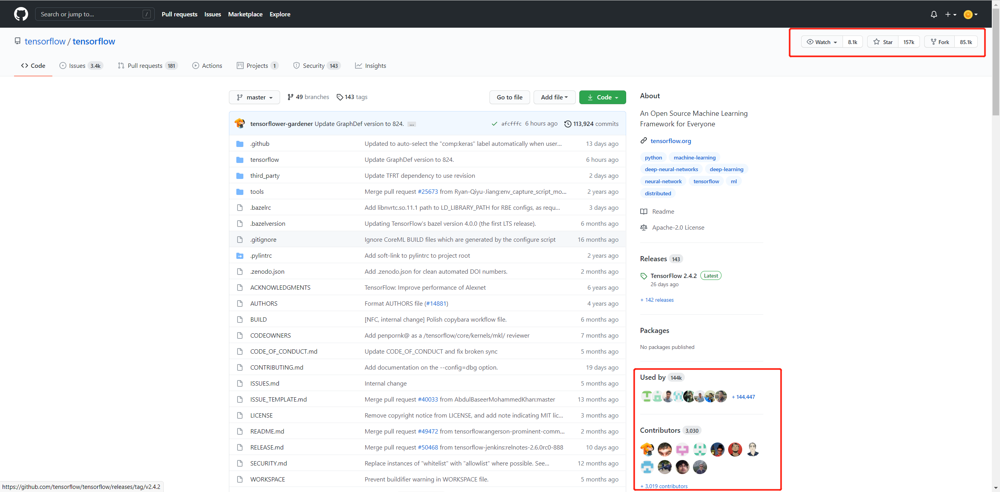
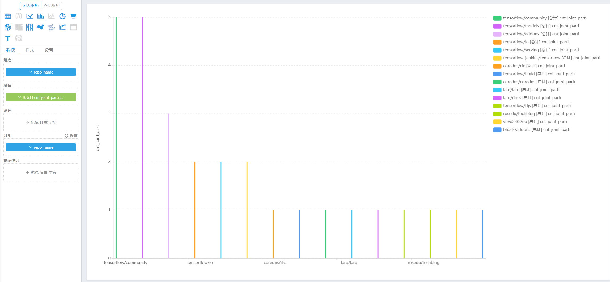
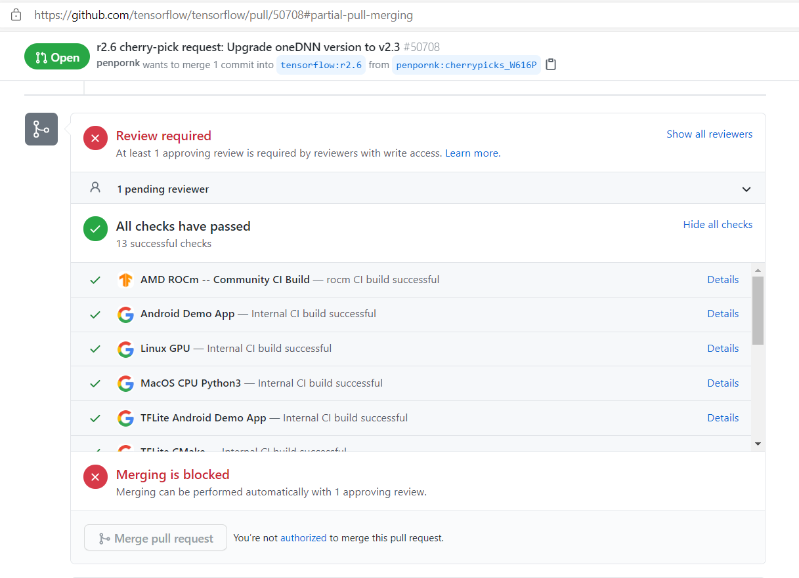
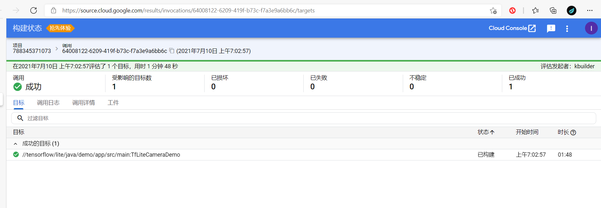

# Tensorflow 2020 数据分析报告

分析数据来源：[tensorflow/tensorflow](https://github.com/tensorflow/tensorflow) 2020年用户行为日志数据

by: Group_11(娄泽华，唐海波，阙琦峰)

## 1 数据类

### 1.1 基础的统计数据分析、可视化

tensorflow/tensorflow是TensorFlow的GitHub开源项目。TensorFlow 是一个端到端的机器学习开源平台。 它拥有一个由工具、库和社区资源组成的全面、灵活的生态系统，使研究人员能够推动 ML 的最新技术，而开发人员可以轻松构建和部署 ML 驱动的应用程序。

TensorFlow 最初由 Google 机器智能研究组织内的 Google Brain 团队的研究人员和工程师开发，用于进行机器学习和深度神经网络研究。 该系统的通用性足以适用于各种其他领域。

当前（2021年7月）tensorflow/tensorflow项目累计总量：Star 157k，Fork 85.1k，Used by 144k，Contributors 3030，相比于theano、keras、pytorch、PaddlePaddle等机器学习平台开源项目有着绝对的社区规模优势（见表1）。

<center>表1 GitHub平台机器学习平台开源项目累计使用情况粗略对比</center>

| repo_name | star( k ) | fork( k ) | Used_by( k ) | Contributors |
| --------- | ------------- | ---------- | --------- | ------------------- |
|[tensorflow](https://github.com/tensorflow)/**[tensorflow](https://github.com/tensorflow/tensorflow)**	|157	|85.1	|144	|3030	|
|[Theano](https://github.com/Theano)/**[Theano](https://github.com/Theano/Theano)**	| 9.4       |2.5	| 11.1         |352	|
|[keras-team](https://github.com/keras-team)/**[keras](https://github.com/keras-team/keras)**	| 51.9      |18.7	| unknown      |898	|
|[pytorch](https://github.com/pytorch)/**[pytorch](https://github.com/pytorch/pytorch)**	| 49.4      |13.4	| 82.3         |1910	|
|[PaddlePaddle](https://github.com/PaddlePaddle)/**[Paddle](https://github.com/PaddlePaddle/Paddle)**	| 16        |3.9	| 1.1          |436	|

故选择tensorflow作为调查对象。tensorflow/tensorflow的项目概况如图1所示：


<center>图1 tensorflow</center>

仅分析tensorflow/tensorflow在**2020年度**的项目活跃度，可以看出该项目在排名中位列第21，活跃度308.79，如表2所示。

<center>表2 GitHub 2020年全域项目活跃度 Top 30（项目的各项指标均大于0）</center>

| repo_name | issue_<br>comment | open_issue | open_pull | pull_<br>review_<br>comment | merge_pull | star | fork | repo_activity |
| --------- | ------------- | ---------- | --------- | ------------------- | ---------- | ---- | ---- | ----------- |
|pddemo/demo	|0	|251354	|0	|0	|0	|1	|0	|971.2251566383451|
|google-test/signcla-probe-repo	|138621	|0	|104135	|0	|0	|1	|0	|871.5482823062531|
|test-organization-kkjeer/app-test	|109172	|40226	|47731	|7529	|18169.31	|1	|0	|703.0669841935637|
|elastic/kibana	|145309	|9838	|22891	|45224	|17094.26	|2202	|1293	|697.950251541232|
|test-organization-kkjeer/bot-validation	|104083	|40242	|47729	|7425	|17724.20	|2	|0	|691.3141223233523|
|ouyanxia2/hgmgmg	|4	|162355	|0	|0	|0	|0	|0	|627.3422912393443|
|imamandrews/<br>imamandrews.github.io	|79182	|104764	|13	|0	|0	|3	|2	|621.2233518767804|
|kubernetes/kubernetes	|235006	|3897	|6868	|30721	|3984.25	|13327	|6181	|601.590606500223|
|flutter/flutter	|126337	|17538	|7222	|18438	|4124.31	|33130	|6714	|583.788590766972|
|NixOS/nixpkgs	|84113	|4489	|26407	|30328	|18371.82	|1798	|1956	|538.0787928700676|
|microsoft/vscode	|99180	|23349	|1977	|1780	|1220.79	|23347	|6470	|432.1952378966484|
|rust-lang/rust	|103937	|4799	|7809	|25194	|5039.93	|10912	|1820	|422.8175092061143|
|Ramos-dev/jniwebshell	|0	|108092	|0	|0	|0	|2	|0	|417.6698699017579|
|dotnet/runtime	|81740	|7886	|7942	|40000	|5662.51	|4007	|1616	|415.2017502069554|
|**pytorch/pytorch**	|**67923**	|**5805**	|**12165**	|**38319**	|**283.22**	|**11781**	|**4313**	|**413.4156619682172**|
|home-assistant/core	|76135	|6101	|7987	|30681	|5621.01	|9832	|5526	|388.6150539324425|
|MicrosoftDocs/azure-docs	|85504	|17367	|5165	|1015	|2790.97	|1709	|3828	|338.9740273888836|
|apache/spark	|138874	|0	|3877	|32252	|1.80	|4581	|3263	|324.6961016095656|
|elastic/elasticsearch	|40330	|3610	|12515	|22599	|9791.75	|7848	|4202	|319.48295248703926|
|odoo/odoo	|54666	|1706	|19392	|19509	|26.79	|4521	|2879	|312.7698512660069|
|**tensorflow/tensorflow**	|**62952**	|**7277**	|**3126**	|**7960**	|**1909.55**	|**17321**	|**8392**	|**308.79429682928463**|
|labuladong/fucking-algorithm	|679	|261	|360	|37	|123.12	|81970	|15273	|285.6667918040059|
|BoltunovOleg/ChatRoulette	|12	|69970	|14	|0	|5.08	|0	|0	|270.47474096638035|
|istio/istio	|82976	|4338	|5519	|14572	|3826.89	|5361	|1465	|257.1969447852387|
|SmartThings<br>Community/<br>SmartThingsPublic	|878	|14	|37512	|1790	|484.70	|463	|16247	|251.74276745775572|
|kubernetes/website	|54180	|2222	|5139	|21281	|3345.07	|706	|3304	|242.5517143350943|
|cockroachdb/cockroach	|55887	|7682	|6819	|4096	|4957.73	|2424	|564	|235.95325081198027|
|pandas-dev/pandas	|32697	|2906	|5282	|21512	|3870.24	|5835	|3563	|235.32524237548714|
|jwasham/coding-<br>interview-university	|246	|92	|138	|22	|37.818	|63162	|16011	|234.24001864163006|
|codelingo/gh_int_test	|7	|0	|17588	|27574	|0	|0	|1	|233.49347951306316|

取GitHub 2020年全域项目活跃度 Top 30中的各项最大值如表3所示，

<center>表3 GitHub 2020年全域项目活跃度 Top 30中的各项最大值</center>

| locmax_<br>issue\_<br>comment | locmax\_<br>open_issue | locmax\_<br/>open_pull | locmax\_<br>pull\_<br>review\_<br>comment | locmax\_<br>merge_pull | locmax\_<br>star | locmax\_<br>fork | locmax\_<br>repo_activity |
| ----------------------------- | ---------------------- | ---------------------- | ----------------------------------------- | ---------------------- | ---------------- | ---------------- | ------------------------- |
| 235006                        | 251354                 | 104135                 | 45224                                     | 18371.827000000045     | 81970            | 16247            | 971.2251566383451         |

以活跃度Top30中的pytorch社区为对比对象，对比tensorflow与pytorch的各项指标的雷达图见图2，其中雷达图的边界由表3确定。可以看出tensorflow在issue_comment, open_issue方面与pytorch相当，在open_pull, pull_review_comment等方面显著地弱于pytorch，在merge_pull, star, fork等方面强于pytorch，综合repo_activity弱于pytorch。注意到2020年的issue_comment, open_issue方面tensorflow与pytorch相当，而其他方面显著不同，推测：

a. tensorflow的中心性相对pytorch较强，更偏重于由核心开发团队维护，用较少的open_pull和pull_review_comment完成了较多的合并，贡献者的交流相对较少，可能是核心开发团队在github以外的交流较多造成的。（若是tensorflow本身对于贡献者而言涉及知识广度低或问题明确，不需要较多的pr交流，则无法解释open_pull只有open_issue一半的反常现象，显然提出的问题无法被有效地尝试解决，再结合tensorflow本身的数学复杂度、工程复现复杂度和有更庞大的社区规模等特性，可以推测贡献者对问题本身的理解已经有较高的门槛。）

b. tensorflow更像是生产者消费者模式，在open_pull, pull_review_comment等方面显著地弱于pytorch，在merge_pull, star, fork等方面强于pytorch，说明该项目相比于pytorch，更偏向于用户反馈issue，团队解决issue，交由用户使用的模式，存在着贡献者与用户相对分化的现象。


<center>图2 tensorflow vs pytorch雷达图</center>

### 1.2 开发者数据统计、可视化

#### 1.2.1 2020 tensorflow actor_activity Top20 开发者数据统计

统计了2020年度tensorflow项目中actor_activity最高20个开发者（筛除了登录名中含有bot的用户）的各项指标，sql见文件`2020-tensorflow-actor_activity-Top20.sql`，数据如表4所示：

<center>表4 2020年度tensorflow项目中actor_activity Top20 开发者数据统计</center>

| actor_login | issue_<br>comment | open_issue | open_pull | pull\_<br>review\_<br>comment | merge_pull | star | fork | actor_activity |
| ----------- | ----------------- | ---------- | --------- | ----------------------------- | ---------- | ---- | ---- | --------------- |
|mihaimaruseac	|1995	|0	|194	|853	|149.58399999999997	|0	|0	|3313.1180521609017|
|**Saduf2019**	|**2466**	|**0**	|**0**	|**0**	|**0**	|**0**	|**0**	|**2336.0751017255534**|
|**amahendrakar**	|**2208**	|**0**	|**0**	|**0**	|**0**	|**0**	|**0**	|**2145.5676206072517**|
|ravikyram	|1948	|0	|1	|0	|0	|0	|1	|1864.3685523531092|
|gbaned	|1642	|0	|2	|26	|0	|0	|0	|1692.1920236764956|
|jvishnuvardhan	|1065	|4	|14	|1	|8.114	|0	|0	|1074.3719717298793|
|bhack	|1195	|4	|27	|26	|5.676	|0	|0	|953.842443251124|
|ymodak	|784	|1	|8	|0	|3.212	|0	|0	|793.1134206584409|
|**gadagashwini**	|**624**	|**0**	|**0**	|**0**	|**0**	|**0**	|**0**	|**619.3137084989849**|
|vnvo2409	|225	|3	|79	|126	|59.08000000000001	|1	|1	|551.9890661375729|
|rthadur	|329	|17	|8	|134	|3.3120000000000003	|0	|0	|543.1804161028024|
|penpornk	|144	|0	|4	|338	|4.202	|0	|0	|524.2472426591567|
|yongtang	|233	|4	|94	|28	|63.236	|0	|0	|523.6842473310027|
|advaitjain	|196	|18	|69	|137	|15.542	|0	|0	|520.0226969389495|
|gowthamkpr	|514	|0	|0	|0	|0	|0	|1	|508.2883999936729|
|deven-amd	|204	|0	|77	|66	|44.45300000000001	|0	|1	|489.8594027886801|
|sanjoy	|298	|0	|3	|173	|0	|0	|0	|479.88348819577135|
|lgeiger	|213	|11	|64	|53	|41.51400000000001	|0	|0	|451.4964976557855|
|mdanatg	|253	|1	|0	|149	|0	|0	|0	|393.672218056874|
|jdduke	|268	|0	|1	|80	|0.8620000000000001	|0	|0	|384.1847882101362|

可以看出**Saduf2019**、**amahendrakar**、**gadagashwini**的行为模式相似，他们都只热衷于issue_comment行为，类似于stack overflow中的答疑者。


#### 1.2.2 2020 tensorflow actor_activity Top20 开发者用户行为对比

分析以上20位用户的行为，得到2020年度tensorflow项目中actor_activity Top20 开发者雷达图，如图3所示。可以看出相当多的人的issue_comment与repo_activity相关性很高，这表明issue_comment这种问答形式在tensorflow社区比较常见。


<center>图3 2020年度tensorflow项目中actor_activity Top20 开发者雷达图</center>

mihaimaruseac是一个专注且精通于项目维护和解决问题的用户，广泛覆盖了项目维护的open_pull、pull_review_comment、merge_pull、issue_comment等流程，无open_issue行为，而用户advaitjain和rthadur虽然活跃度并不太高，但open_issue行为非常频繁，能和他形成很好的互补，形成典型的生产者-消费者模式。而用户mihaimaruseac在2020年的代码贡献情况也很好的印证了其在tensorflow项目中的生产者地位，详见图4。


<center>图4 用户mihaimaruseac在2020年对tensorflow等项目的贡献情况</center>

### 1.3 关联数据的分析

计算2020年度tensorflow/tensorflow项目基于共同开发者数的相似仓库排名：

a. 统计tensorflow/tensorflow项目内的贡献者行为日志记录数，取行为日志数Top 30的不含bot字符的actor_login。

b. 根据actor_login在year2020行为日志表中做inner join，找出这些开发者贡献的除tensorflow/tensorflow以外的其他仓库（由于仓库较多，保留其中日志数大于30的仓库即可）。

c. 统计按这些仓库group后的记录总数，即为这些仓库与tensorflow/tensorflow项目的共同开发者总数，降序排序取 Top15。sql语句见文件`2020年度tensorflow项目基于共同开发者数的相似仓库排名.sql`，结果见表5。

<center>表5 2020年度tensorflow项目基于共同开发者数的相似仓库排名</center>

| rank  | repo_name                         | cnt_joint_parti |
| ----- | --------------------------------- | --------------- |
| **1** | **tensorflow/models**             | **5**           |
| **2** | **tensorflow/community**          | **5**           |
| **3** | **tensorflow/addons**             | **3**           |
| **4** | **tensorflow/io**                 | **2**           |
| **5** | **tensorflow-jenkins/tensorflow** | **2**           |
| **6** | **tensorflow/serving**            | **2**           |
| 7     | vnvo2409/io                       | 1               |
| 8     | coredns/coredns                   | 1               |
| 9     | tensorflow/tfjs                   | 1               |
| 10    | coredns/rfc                       | 1               |
| 11    | rosedu/techblog                   | 1               |
| 12    | larq/larq                         | 1               |
| 13    | bhack/addons                      | 1               |
| 14    | tensorflow/build                  | 1               |
| 15    | larq/docs                         | 1               |

柱状图见图5。

对这名贡献者，分析他们活跃的其他仓库（取事件数>x），以这种方式获取其他项目与tensorflow的关联度。



<center>图5 2020年度tensorflow项目基于共同开发者数的相似仓库排名柱状图</center>

显然Top 6 往后开始趋于平缓，从粗粒度上给出了与`tensorflow/tensorflow`协作关联度较高的仓库依次是：tensorflow/models, tensorflow/community, tensorflow/addons, tensorflow/io, tensorflow-jenkins/tensorflow, tensorflow/serving。


### 1.4 其他数据分析

tensorflow项目是一个典型的主要由公司员工参与贡献的项目，2020年度tensorflow项目中开发者行为的周记录条数统计如图6所示，其中横轴的7个柱形依次表示从周一到周日，纵轴表示2020年度以一周为周期划分为7份时，每一份所对应的累计记录数。


<center>图6 2020年度tensorflow项目中开发者行为的周记录条数统计</center>

## 2 流程类

### 2.1 项目的日常协作流程调研
- 阅读贡献指南
- 阅读行为准则
- 确保您已签署 贡献者许可协议 (CLA)
- 检查更改是否与指南一致 
- 代码风格一致
- 运行单元测试
### 2.2 开发者参与流程调研
##### 贡献者许可协议

填写个人或公司贡献者许可协议 (CLA)。如果您是编写原始源代码的个人并且您确定您拥有知识产权，那么您需要签署个人 CLA。如果您为一家允许您贡献工作的公司工作，那么您需要签署公司 CLA。按照上述两个链接之一访问相应的 CLA 以及有关如何签名和返回它的说明。一旦我们收到它，我们将能够接受您的拉取请求。

（注意：只有来自您和其他已签署 CLA 的人的原始源代码才能被接受到主存储库中。）

##### 贡献代码

如果您对 TensorFlow 有改进，请将您的拉取请求发送给我们！对于那些刚入门的人，Github 有一个 how to。

TensorFlow 团队成员将被指派审查您的拉取请求。拉取请求获得批准并通过持续集成检查后，TensorFlow 团队成员会将ready to pull标签应用于您的更改。这意味着我们正在努力将您的拉取请求提交到我们的内部存储库。在内部提交更改后，您的拉取请求将在 GitHub 上自动合并。

如果您想做出贡献，请开始使用 TensorFlow 代码库，导航到 Github“问题”选项卡并开始查看有趣的问题。如果您不确定从哪里开始，那么首先尝试这里较小/更容易的问题之一，即 带有“good first issue”标签的问题 ，然后查看 带有“contributions Welcome”标签的问题。这些是我们认为特别适合外部贡献的问题，通常是因为我们现在可能无法解决这些问题。如果您决定开始处理某个问题，请发表评论，以便其他人知道您正在处理该问题。如果您想提供帮助，但不是一个人，请使用问题评论线程进行协调。

##### 贡献指南和标准

在发送您的拉取请求以供 审核之前，请确保您的更改符合指南并遵循 TensorFlow 编码风格。

##### 贡献的一般准则和理念

- 在您贡献新功能时包括单元测试，因为它们有助于 a) 证明您的代码工作正常，以及 b) 防止未来的重大更改以降低维护成本。
- 错误修复通常也需要单元测试，因为错误的存在通常表明测试覆盖率不足。
- 当您更改核心 TensorFlow 中的代码时，请记住 API 兼容性，例如， tensorflow/core 和 tensorflow/python 中的代码。TensorFlow 已经通过了 1.0 版，因此在没有主要版本的情况下无法进行非向后兼容的 API 更改。您的拉取请求的审核者将按照 API 审核实践对任何 API 兼容性问题发表评论 。
- 当您向 TensorFlow 贡献新功能时，维护负担（默认情况下）会转移到 TensorFlow 团队。这意味着必须将贡献的收益与维护该功能的成本进行比较。
- 全新功能（例如，实现尖端算法的新操作）通常会存在于 tensorflow/addons 中，以便在决定是否将它们迁移到核心之前获得一些播放时间。
- 由于每个 PR 需要几个 CPU/GPU 小时的 CI 测试，我们不鼓励提交 PR 来修复一个错字、一个警告等。我们建议至少在文件级别修复相同的问题（例如：修复文件中的所有错别字，修复文件中的所有编译器警告等）
- 测试应遵循 测试最佳实践 指南。

##### 执照

在新文件的顶部包含许可证。

- C/C++ 许可证示例
- Python 许可证示例
- Java 许可证示例
- Go 许可证示例
- Bash 许可证示例
- HTML 许可证示例
- JavaScript/TypeScript 许可示例

Bazel BUILD 文件还需要包含一个许可部分，例如 BUILD example。

##### C++编码风格

对 TensorFlow C++ 代码的更改应符合 Google C++ 样式指南。

使用clang-tidy检查你的C / C ++的变化。要clang-tidy在 ubuntu:16.04 上安装，请执行以下操作：

`apt-get install -y clang-tidy`

您可以通过执行以下操作来检查 C/C++ 文件：

```
clang-format < my_cc_file > --style=google > /tmp/my_cc_file.cc
diff < my_cc_file > /tmp/my_cc_file.cc
```
##### Python编码风格

对 TensorFlow Python 代码的更改应符合 Google Python 风格指南

使用pylint来检查你的Python的变化。要根据 TensorFlow 的自定义样式定义安装pylint和检查文件pylint：

```
pip install pylint
pylint --rcfile=tensorflow/tools/ci_build/pylintrc myfile.py
```

注意 `pylint --rcfile=tensorflow/tools/ci_build/pylintrc`应该从顶级 tensorflow 目录运行。


- 其他语言的编码风格
- 谷歌 Java 风格指南
- 谷歌 JavaScript 风格指南
- Google Shell 风格指南
- Google Objective-C 风格指南

##### 运行健全性检查

如果您的系统上安装了 Docker，您可以通过运行以下命令对您的更改执行健全性检查：

`tensorflow/tools/ci_build/ci_build.sh CPU tensorflow/tools/ci_build/ci_sanity.sh`

这将捕获更改中可能存在的大多数许可证、Python 编码风格和 BUILD 文件问题。

##### 运行单元测试

有两种方法可以运行 TensorFlow 单元测试。

1. 使用直接安装在系统上的工具和库。

有关所需的包，请参阅 CPU-only 开发人员 Dockerfile 和 GPU 开发人员 Dockerfile。另外，使用上述 多克尔图像，例如， `tensorflow/tensorflow:devel`与`tensorflow/tensorflow:devel-gpu`发展，以避免直接在您的系统上安装的软件包（在这种情况下要记得更改目录从`/root`到`/tensorflow`一旦你进入运行的容器中，以便`bazel`能找到`tensorflow` 工作区）。

安装软件包后，您可以通过执行以下操作在 bazel 中运行特定的单元测试：

如果要在 GPU 上运行测试，请将 CUDA 路径添加到 LD_LIBRARY_PATH 并添加`cuda`选项标志

```
export LD_LIBRARY_PATH= “ ${LD_LIBRARY_PATH}：/usr/local/cuda/lib64：/usr/local/cuda/extras/CUPTI/lib64：$LD_LIBRARY_PATH ”
导出标志 = " --config=opt --config=cuda -k "
```

例如，要在 tensorflow/python 下运行所有​​测试，请执行以下操作：

`bazel测试 ${flags} //tensorflow/python/...`

对于单个组件，例如 softmax op：

```
bazel测试 ${flags} tensorflow/python/kernel_tests:softmax_op_test
使用Docker和 TensorFlow 的 CI 脚本。
```
2. 使用Docker和 TensorFlow 的 CI 脚本。


```
#首先安装 Docker，然后这将构建并运行 cpu 测试
tensorflow/tools/ci_build/ci_build.sh CPU bazel test //tensorflow/...
```
有关 详细信息，请参阅 TensorFlow 构建。


##### 为可测试的文档字符串运行 doctest

有两种方法可以在本地测试 docstring 中的代码：

1. 如果您只是更改类/函数/方法的文档字符串，则可以通过将该文件的路径传递给tf_doctest.py来测试它 。例如：

`python tf_doctest.py --file= <文件路径>`

这将使用您安装的 TensorFlow 版本运行它。确保您运行的代码与您正在测试的代码相同：

- 使用最新的tf-nightly pip install -U tf-nightly
- 将您的拉取请求重新设置为最近从TensorFlow 的主分支拉取 。

2. 如果您要更改类/函数/方法的代码和文档字符串，则需要 从 source 构建 TensorFlow。一旦您设置为从源代码构建，您就可以运行测试：

`bazel 运行 //tensorflow/tools/docs:tf_doctest`

或者

`bazel 运行 //tensorflow/tools/docs:tf_doctest --module=ops.array_ops`

的`--module`是相对于`tensorflow.python。`

##### 调试版本

在构建 Tensorflow 时，传递 `--config=dbg` 给 Bazel 将构建带有调试信息且没有优化的构建，允许您使用 GDB 或其他调试器来调试 C++ 代码。例如，您可以通过运行以下命令构建带有调试信息的 pip 包：

`bazel build --config=dbg //tensorflow/tools/pip_package:build_pip_package`

TensorFlow 内核和 TensorFlow 的依赖项仍然没有使用调试信息构建--config=dbg，因为如果调试信息过多，Linux 上就会出现问题（有关上下文，请参阅此 GitHub 问题）。如果要调试内核，可以-g使用 --per_file_coptbazel 选项编译特定文件。例如，如果要调试以 开头的文件中的身份操作，则identity_op可以运行

`bazel build --config=dbg --per_file_copt=+tensorflow/core/kernels/identity_op. * @-g //tensorflow/tools/pip_package:build_pip_package`

请注意，该`--config=dbg`选项不受官方支持。


### 2.3 项目CI/CD的流程调研

从GitHub仓库里的Pull Requests一栏可以看到tensorflow开源项目的所有拉取请求，而每个拉取请求所要合并的代码都会经过自动化测试流程的考验，比如在这个PR中，通过了所有共13轮的各个方面的代码检查，那么它就可以受到开发者的review并进行进一步merge。



那么在tensorflow项目中，这13轮checks可以归类为以下几种

- Jenkins
- 测试用例
- Android/Linux/MacOS/TFLite环境适配
- 编译测试

#### Jenkins

- `AMD ROCm -- Community CI Build`

采用了Jenkins这款自动集成工具搭建流水线任务，主要用于构建工作区和对PR状态的反馈


#### 测试用例

- `Linux GPU`
- `MacOS CPU Python3`
- `Ubuntu CPU`

包含大量（2000+）的测试用例，针对库中所有涉及到的接口函数。


#### Android/Linux/MacOS/TFLite环境适配

- `Android Demo App`
- `TFLite Android Demo App`
- `TFLite iOS Tests`
- `Ubuntu Sanity`
- `Windows Bazel`
- `Windows Bazel GPU`



测试的目标很少（个位数），主要是对不同平台下应用的兼容性进行测试。

#### 编译测试

- `TFLite CMake`
- `TFLite Makefile`

具体细节无从得知，但从测试名上看，应该属于代码编译层面