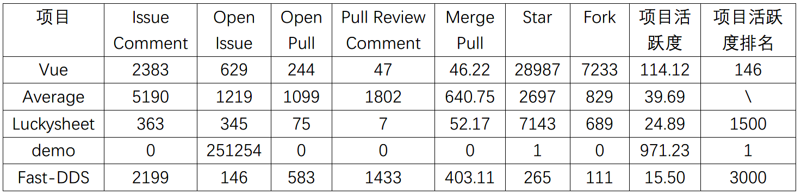
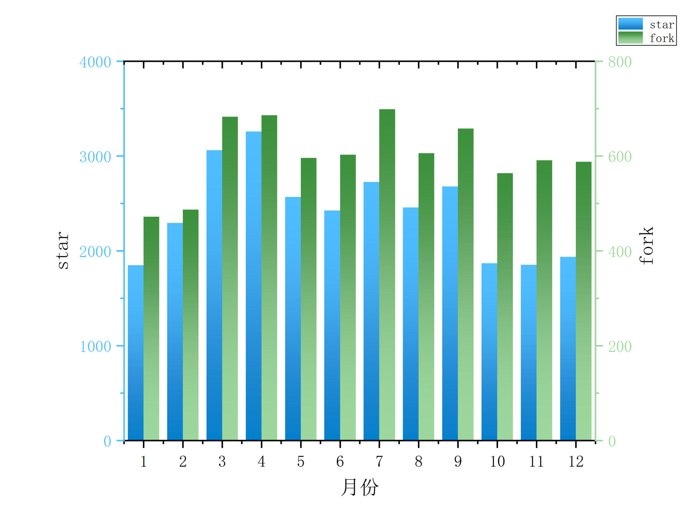
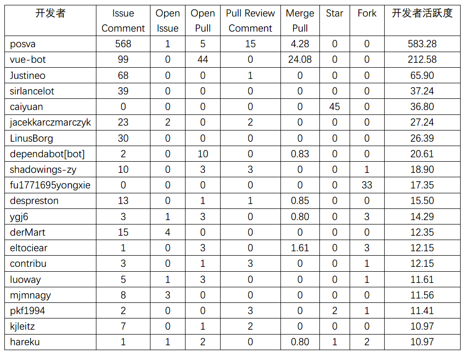
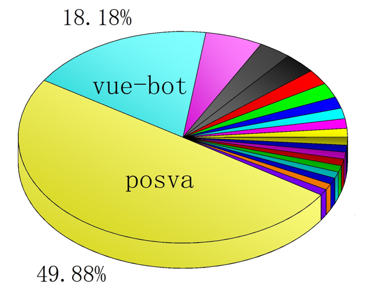
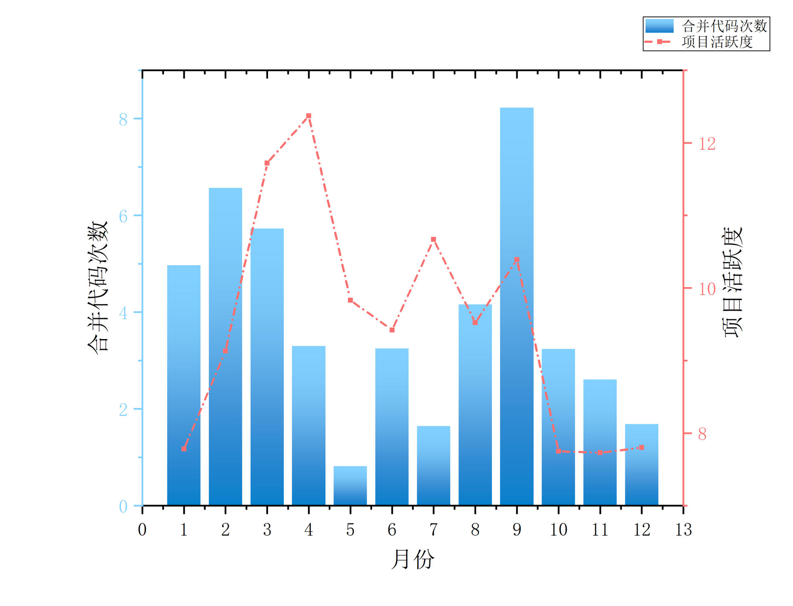
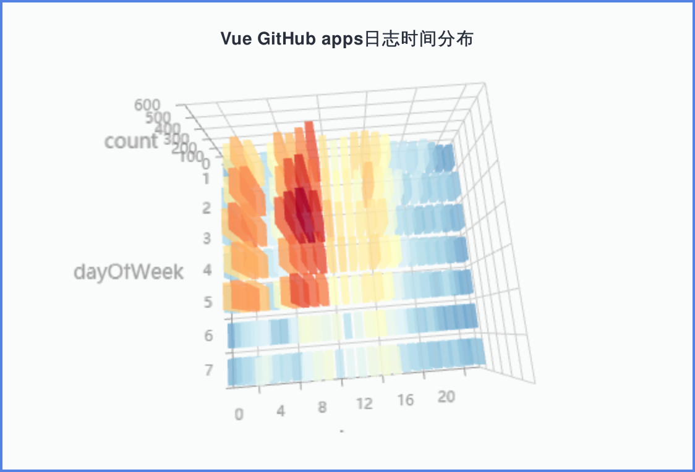
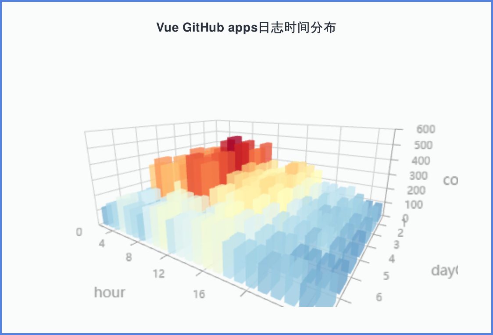
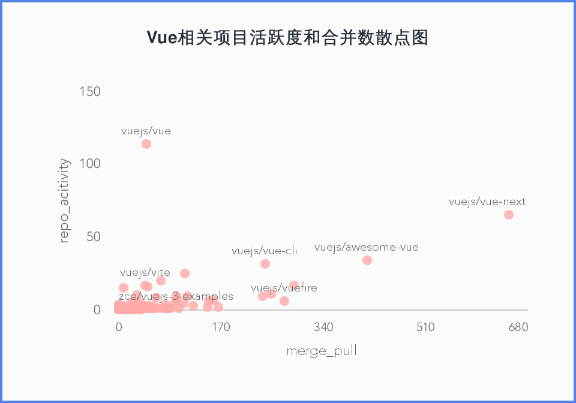
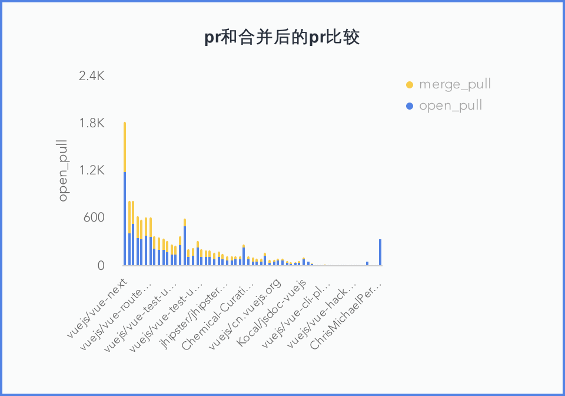
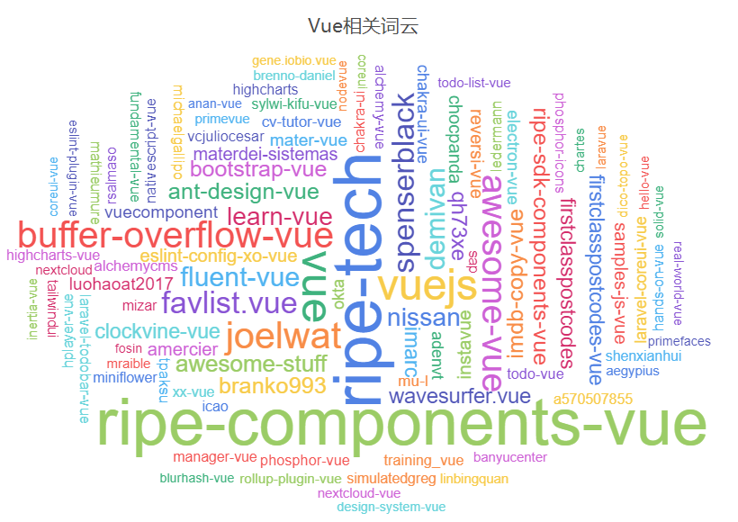

# Vuejs项目2020年深入数据分析

# 摘要：

&ensp;&ensp;&ensp;&ensp;开源社区又称开放源代码社区，根据相应的开源软件许可证协议公布软件源代码的网络平台。由于开放源码软件主要被散布在全世界的编程者所开发，开源社区就成了他们沟通交流的必要途径，因此开源社区在推动开源软件发展的过程中起着巨大的作用。我们小组因此针对开源项目Vue.js进行深入的数据分析，通过数据的角度来观察vuejs的发展趋势、演化特征以及未来挑战等问题。

# 项目介绍：

&ensp;&ensp;&ensp;&ensp;AngularJS是Vue早期开发的灵感来源。然而，AngularJS 中存在的许多问题，在 Vue 中已经得到解决。Vue.js是一套构建用户界面的渐进式框架。与其他重量级框架不同的是，Vue采用自底向上增量开发的设计。Vue 的核心库只关注视图层，并且非常容易学习，非常容易与其它库或已有项目整合。另一方面，Vue.js完全有能力驱动采用单文件组件和Vue生态系统支持的库开发的复杂单页应用。Vue.js 的目标是通过尽可能简单的 API 实现响应的数据绑定和组合的视图组件。	Vue.js 自身不是一个全能框架——它只聚焦于视图层。因此它非常容易学习，非常容易与其它库或已有项目整合。另一方面，在与相关工具和支持库一起使用时，Vue.js 也能驱动复杂的单页应用。

# 1. 基础数据统计

&ensp;&ensp;&ensp;&ensp; 上表对vue项目（活跃度排名146）以及demo（活跃度排名1）、Fast-DDS（活跃度排名3000）、Luckysheet（活跃度排名1500，即中位数）以及活跃度前3000的项目的均值（Average）的一些基础数据进行了统计。由表可知，Vue项目star、fork及项目活跃度远大于均值，但其它指标均低于均值。这可能是因为马太效应，部分巨头项目的极大值拉高了均值。相比之下，Luckysheet项目（中位数）更能反映实际情况，Vue项目的各项指标均高于该项目，属正常情况。

&ensp;&ensp;&ensp;&ensp;该图可视化了项目的star和fork数量（按月份）。由图可知：在2020年中，star和fork的变化趋势大体上比较平稳，每月分布较为均匀；且star和fork的变化趋势较为接近，两者呈正相关关系。

# 2. 开发者数据统计

## 2.1 活跃度前20开发者

&ensp;&ensp;&ensp;&ensp;由表可知，该项目在2020年由开发者posva主导。开发者posva主要负责解决一些问题（issue comment和pull review comment中的问题）；而项目自动化机器人（bot）主要负责合并提交的代码（merge pull）。余下的开发者活跃度都未超过100，活跃度在20以上的开发者仅8人，其中还包括2个自动化机器人。下图是根据上表开发者活跃度来绘制的，能更直观地体现活跃度前20的开发者对vue项目的贡献。

## 2.2 每月开发者活跃趋势

&ensp;&ensp;&ensp;&ensp;该图可视化了项目活跃度以及合并代码次数（按月份）。综合来看，项目最活跃的时候是第一季度，其次是第三季度，第四季度的时候项目最不活跃。项目活跃度和项目合并代码次数变化的趋势大体一致，两者有较强的相关关系。

# 3. 关联数据分析

## 3.1 Vue社区Github apps日志时间分布立体图

&ensp;&ensp;&ensp;&ensp;从图中可以清晰的看到，主要的自动协作化工作时间都集中在红色区域，其中数量最密集的是一周执行三天，每周自动化协作八小时左右。从俯视的角度观察立体图可以得知，社区工作中普遍工作时间是一周3天，每周工作6-9小时。从量上来看，自动化协作的实用程度还是可以的。未来，基于Github Apps的自动化协作机器人会被更加广泛的用于项目的自动化协作，更好的帮助开源项目进行大规模协作的管理。

## 3.2 Vue相关项目活跃度和merge_pull散点图

&ensp;&ensp;&ensp;&ensp;从上图中其实我们可以清晰的看到，仓库活跃度最高的是vuejs项目本身，位于左上方，但是非常有趣的是，它的merge_pull数量不算很多，经常不如那些分支下来的项目。其实我们可以明白，vuejs的下一个版本就是vue-next。开发人员将 Vue.js 描述为“用于构建用户界面的渐进式框架”。它是一个用于构建交互式 Web 界面的库。它提供具有简单灵活的 API 的数据反应组件。另一方面，vue-next 被详细描述为vue的下一个主要版本（WIP）。它是 vue 的下一个主要版本。它是一个用于构建交互式 Web 界面的库。它提供具有简单灵活的 API 的数据反应组件。所以可以很显然的得出结论，当前的vue-next还处于构建时期，merge_pull的量非常的大但是活跃度还远远不够。毕竟人们还是抱有守旧的态度。不过可以看到的趋势是未来应该是向vue-next发展的。

## 3.3 开启的PR和合并的PR

&ensp;&ensp;&ensp;&ensp;上图是将开启的pr以及合并的pr进行比较，因为数据是增量存储的，已经merge的pull依然会算作open_pull的一部分，因此可以比较直观的看出当前pr的解决情况。从图中可以了解到，先前说的vue-next是比较活跃的，因为它的open的pull有30%左右合并了，这个在开源项目的比例是比较高的，也说明开发者在项目中非常活跃，贡献质量也比较高。但是令人惊讶的是第二个项目是vue-awesome，他的合并率几乎达到了百分之百。但这也跟项目本身有关是个svg图标组件。因此尽可能会同意合并。

## 3.4 Vue 项目词云

&ensp;&ensp;&ensp;&ensp;从图中可以明显的看到，与vue相关的词汇中，惊人的可以发现，竟然不是vuejs而是ripe-tech/ripe-components-vue。这个是vuejs中的一个重要共享组件库。按照我们的理解就是，当一款软件开发日趋成熟的时候，软件本身可能并不是最频繁出现的，而可能是相关配套的一些组件库，第三方插件显得更加活跃。我想这个应该才是一款软件能够保持经久不息的秘诀之一吧。
