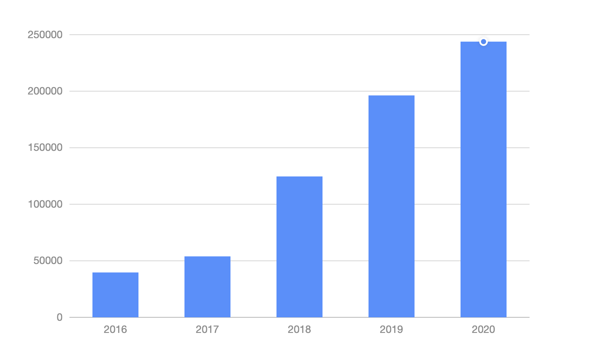
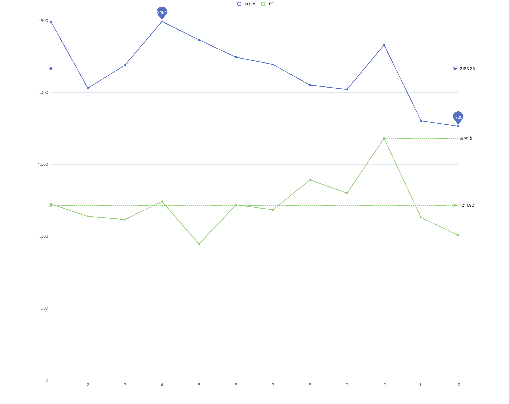
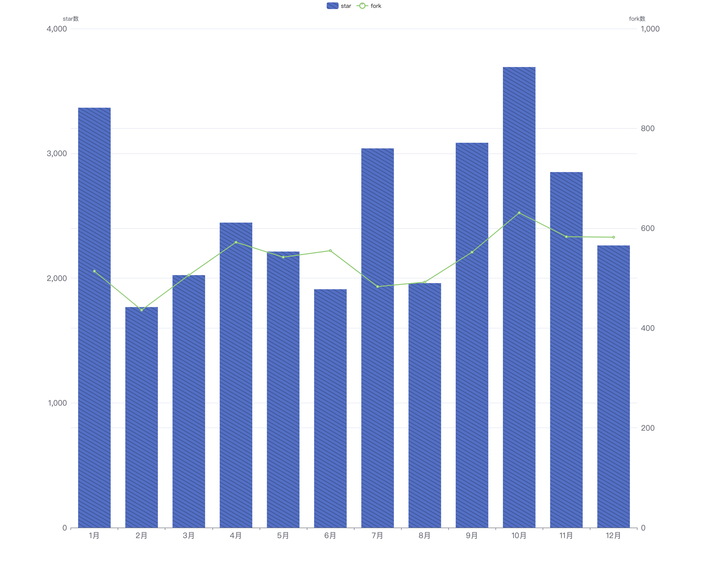
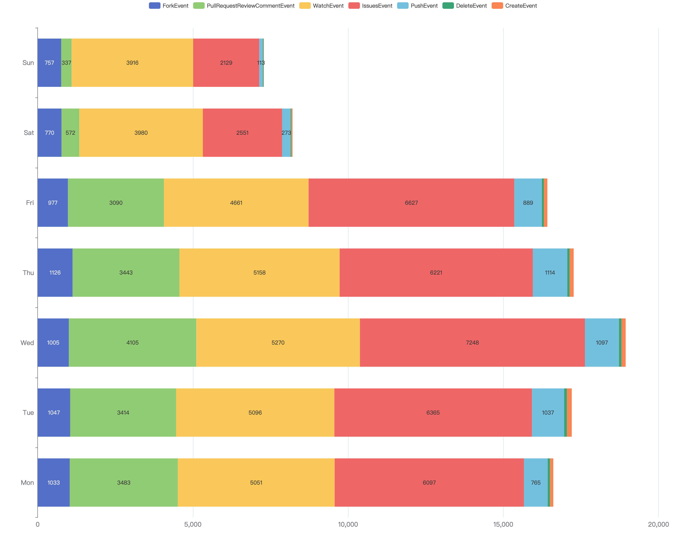
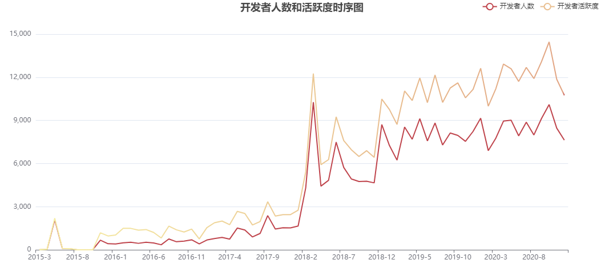
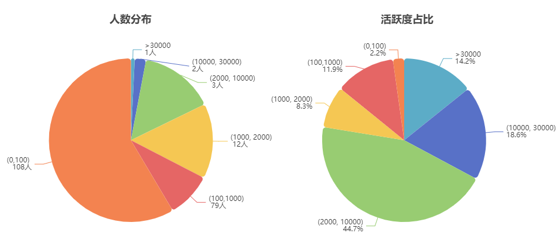
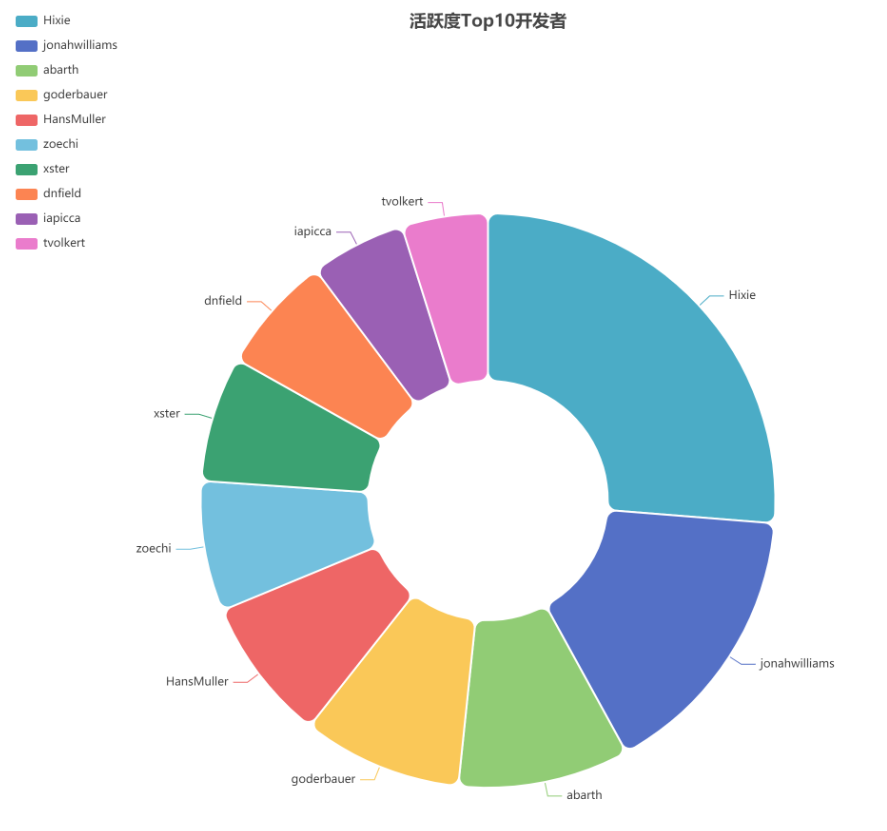
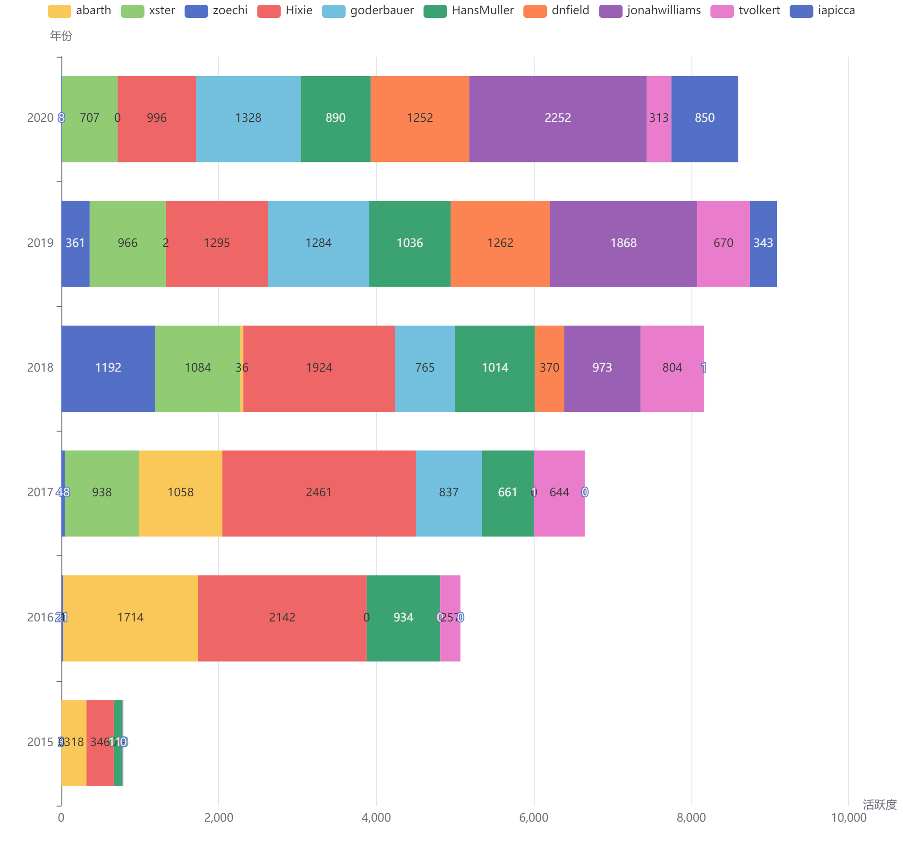
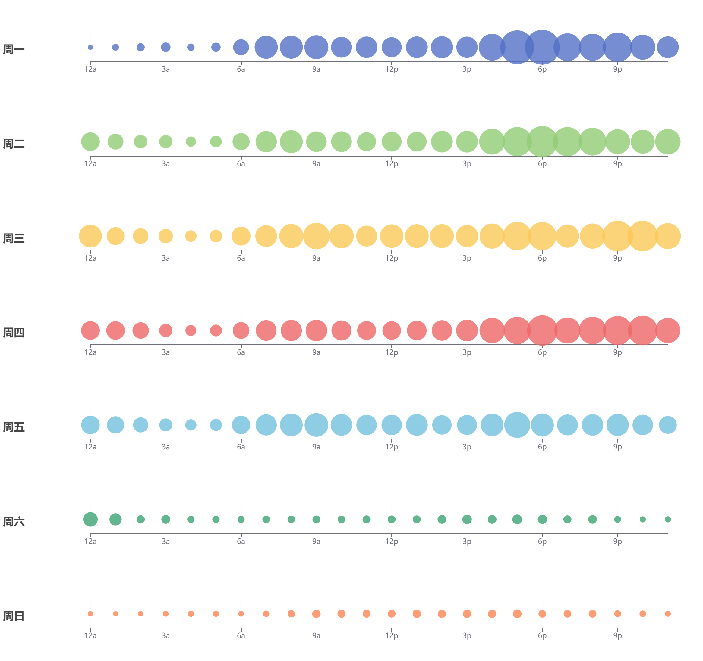
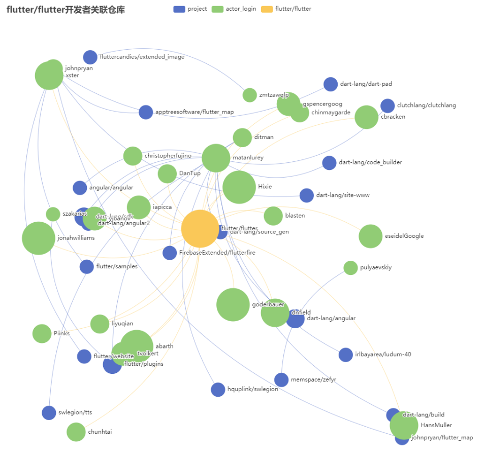

# 2020年Flutter项目数据分析及社区分析

# 1. 引言
Flutter是谷歌的移动UI框架，可以快速在iOS和Android上构建高质量的原生用户界面。
Flutter可以与现有的代码一起工作，其拥有丰富的工具和库，可以帮助开发者轻松地同时在iOS和Android系统中实现自己的想法和创意。
在全世界，Flutter正在被越来越多的开发者和组织使用，
本报告将分析2020年Flutter项目数据和社区动态。

# 2. 数据分析

## 2.1基础数据统计

- 2020最活跃的前十个项目

|  序号  | 项目 | 
| :---: | :--: |
|   1   | pddemo/demo |  
|   2   | google-test/signcla-probe-repo |  
|   3   | test-organization-kkjeer/app-test |  
|   4   | elastic/kibana |  
|   5   | test-organization-kkjeer/bot-validation |  
|   6   | ouyanxia2/hgmgmg |   
|   7   | imamandrews/imamandrews.github.io |  
|   8   | kubernetes/kubernetes |  
|   9   | flutter/flutter |  
|   10  | NixOS/nixpkgs |  

flutter/flutter是2020年最活跃的十个项目之一，全年共打开了issus数**17538**，新增star数**33130**，fork数**6714**。2020年flutter日志总数为**243853**，下图展示flutter项目近五年日志数的趋势图，可以看出，该项目自2018年以来活跃度显著增加。


<!-- 243853 196270 124601 53908 39683 -->
<!-- 活跃开发者账号数 -->

- issue数和PR数

我们统计了Flutter项目在2020年每月提出的issue数和PR数，
如下图所示，月均提出issue数为**2165**，月均提出PR数为**1214**，总体趋势较稳定，整体表现为非常活跃。


- start数和fork数

下图展示了Flutter项目每月新增的start数和fork数，
每月新增start数在1800以上，每月fork数在400~600之间。


- 各事件的贡献度

我们统计了2020年所有参与Flutter项目的开发者在周维度内对各事件的贡献度。我们可以明显看出，开发者在工作日的活跃度较高。其中，红色（IssuesEvent）和黄色部分(WatchEvent)占比最高，在工作日时，绿色部分（PullRequestReviewCommentEvent）占比也比较高。



## 2.2开发者分析

- flutter开发者人数和活跃度发展情况

统计2015年3月至2020年12月，flutter项目的开发者人数和活跃度的发展情况，如下图所示。我们可以很明显的看到，在2015年10月份以前，flutter处于开发初期，开发者数量和活跃度较为低迷，开发者人数较少，但活跃度在2015年5月份左右有活跃度小高峰。随后，开发者活跃度处于一个逐步上升阶段。在2018年12月，迎来了flutter活跃的高峰，开发者人数和活跃度都骤增3倍。随后，进入开发活跃度降低，但至今仍处于震动增长状态。



- 开发者活跃度分布

我们统计了在flutter开发过程中，开发者不同活跃度区间的人数分布以及其活跃度占比情况，如下图所示。“人数分布”图展示了不同活跃度区间的人数情况：活跃度位于（0,100）之间的人最多，共有108人；而活跃度大于30000的人最少，只有1人；贡献度在（10000,3000）和（2000,10000）之间的分别有2人和3人。“活跃度占比”图展示了这些活跃度区间的人所贡献的活跃度占比：其中活跃度在（2000,10000）间的2个人的活跃度占比最多，为44.7%，而活跃度位于（0,100）的人的贡献占比最少为2.2%。可以得出结论，flutter项目的主要贡献力为小部分人，而大部分人的活跃贡献度不高。此现象符合帕累托法则，少数的人会造成主要的影响，而多数人只能造成少许影响。



- 最活跃的10个开发者

我们抽取了flutter项目活跃度最高的10个开发者，得到了他们参与项目的主要信息，如下表所示。得到活跃度最高的开发者为Hixie，总体贡献力为30281.597  ，而jonahwilliams、abarth、goderbauer的贡献力紧追其后。

|  actor_login  | issue_comment | open_issue | open_pull | pull_review_comment | merge_pull | star | fork | actor_acitivity |
| :-----------: | :-----------: | :--------: | :-------: | :-----------------: | :--------: | :--: | :--: | :-------------: |
|     Hixie     |     15688     |    1565    |   1321    |        12415        |  1030.825  |  2   |  1   |    30281.597    |
| jonahwilliams |     7685      |    591     |   1982    |        4528         |  1410.841  |  1   |  1   |    18142.627    |
|    abarth     |     5731      |    199     |   1096    |        2336         |  918.290   |  1   |  1   |    11110.257    |
|  goderbauer   |     3858      |    365     |    636    |        4595         |  482.718   |  1   |  1   |    10362.511    |
|  HansMuller   |     3173      |    276     |    702    |        3984         |  579.274   |  1   |  1   |    9347.648     |
|    zoechi     |     9643      |     38     |     3     |          4          |   1.604    |  1   |  1   |    8460.438     |
|     xster     |     3879      |    585     |    423    |        2973         |  315.026   |  1   |  1   |    8133.423     |
|    dnfield    |     5131      |    365     |    433    |        1910         |  318.468   |  1   |  1   |    7654.662     |
|    iapicca    |     6484      |     31     |     2     |          2          |   0.810    |  3   |  8   |    6187.414     |
|   tvolkert    |     2689      |    318     |    511    |        1360         |  386.475   |  1   |  4   |    5586.491     |

下图为Top10开发者的贡献比例饼图，可以明显观察到，Hixie、jonahwilliams、abarth三者的活跃度贡献力，在前十中占了接近一半。



下图统计了flutter项目Top10开发者从2015年值2020年的活跃度变化，不同开发者的活跃年份不同。有些开发者在项目初期较为活跃，但近年活跃度减少，例如abarth、Hixie；而有些开发者是近年来加入项目的新势力，例如goderbauer、jonahwilliams。



- 2020年开发者工作时间分布

此部分统计了2020年开发者的工作时间分布。如下图所示，横轴为星期天数，而纵轴为一天24小时的时间。可以观察到，工作日开发者的活跃度明显比周末高，且周一的活跃度最高，周二到周五活跃度相仿。一天中，24小时都有开发者在工作，且早上9am、下午6pm和晚上9pm是开发者活跃的高峰。



## 2.3相关项目分析

此部分统计了flutter贡献度Top20的开发者参与较为活跃度项目，形成了flutter开发者关联仓库关系图。下图中黄色节点代表flutter项目，绿色节点代表开发者，蓝色节点代表其他项目。可以看到flutter开发者贡献力较高的项目angular/angular等也是前端框架，而也有flutter_map、flutter/plugins等flutter相关项目。



# 3. 流程分析

## 3.1 项目的日常协作流程调研

### 3.1.1 Issue

如果用户有分配权限那么就可以分配自己正在处理的bug，如果bug不会被很快完成那么久取消分配，对issue的优先级描述可以帮助团队更好区别issue重要性并检查进度。

- 优先级标签：p0标签表示非常严重的罕见错误，严重性类似于”世界着火了“；p1标签表示该问题值得立即关注，通常一次只能有一到两个p1级别的错误，严重程度类似于”一位顾客着火了“；p2标签表明该问题即将对顶级用户造成影响，通常有少于25个p2错误，这样的任务不会被立即处理但是每周都会去关注这些问题，严重性类似于”一位顾客要着火了“；p3标签表明该问题是位于工作列表中的顶部高优先级问题；p4标签表明这是很重要的工作，但是并不位于工作列表顶级，这是默认的错误级别；p5标签表明该问题不是重要的问题，这是新功能请求问题的默认级别，这些问题不太可能被处理除非他们成为长期战略计划的一部分；p6表示不可解决的有效问题；
- 顾客标签：当顾客与团队成员密切合作时，他们被视为“顶级客户”以进行优先排序
- Thumb-up：用于对某个问题进行投票作为其问题优先级的参考

### 3.1.2 Milestone

- 发布里程碑：每个月的第一个星期一分支一次；每季度一次将该beta里程碑映射到稳定版本
- Unassigned customer work：在该里程碑里面指出的问题表示我们正打算尽快修复，但是我们对于这个问题还没有找到所有者
- Declined customer request：在该里程碑里面指出的问题表示我们不打算在timescale里列出这个问题的计划，一般表示没有6个月不会完成这个任务；如果客户发现自己的问题被错误放置在该里程碑中，则需要与团队联系人联系进行升级

### 3.1.3 分配issue

有分配权限的用户可自行分配issue；没有分配权限的用户需要提交PR来获取issue，权限分配有以下注意事项：

- 仅当用户在积极处理某问题时方可将该问题分配给自己，如果不知道合适开始处理问题则不要对该问题进行分配；不知道他人何时处理该问题的时候不可将问题分配给他人；若发现自己分配了为确定何时处理的问题，则需取消该任务的分配以便其他人可以处理该问题
- 对于自己正在处理的问题或者已经安排着手处理的问题，则需要把该问题及时分配给自己，以助于他人知道该问题的状态，防止多个人同时解决同一个问题

### 3.1.4 提出issue

若有一个想法想要落地，那么需要的流程如下：

- 提交描述问题
- 编写一份参考此问题的设计文档并描述解决方案
- 将方案设计发布到问题及聊天区中
- 收集大家的反馈，如果大部分是正面反馈，那么就可以实施该想法并进行提交

提出的issue需要是可执行的，其中要求包括：

- issue需要有明确的描述，否则将其进行关闭
- issue需要有明确的重现步骤、预期结果、实际结果，若没有该信息则将其进行关闭

## 3.2 开发者参与流程调研

将代码提交到Flutter存储库的一般过程如下：

- 阅读Flutter开发相关文档，包括：行为准则、核心价值观、引擎开发环境配置、框架开发环境配置、开发测试流程、标签及里程碑流程、设计文档模板
- Fork Github上的存储库
- 如果现在在做的工作还没有对应issue，并且认为该工作具有重大贡献，那么可以自行提交issue来描述正在解决的问题
- 如上条所述提交issue后，创建Goole doc通过邮件或聊天频道征求反馈
- 在存储库的GitHub分支上创建一个master分支并实施更改，确保他们经过测试
- 将此分支作为PR提交到相关的Flutter存储库
- 审查代码，可要求相关领域专家及推荐的审稿人来进行审查。代码审查的好处包括：在团队中传播知识，每一行代码都会被多个人阅读，随着代码的更新其他人理解代码的可能性就会更大；让开发者保持诚实而不偷工减料，更有动力编写好的代码；让开发者接触到不同的思维模式，代码审查者可能会提供不同于本人的全新解决问题思路
- 确保PR通过了所有预提交测试进行提交
- 提交以后若仪表盘上发现任何问题，则需修复补丁并研究该问题，这将与团队中的人进行竞争来修复

## 3.3 项目CI/CD的流程调研

持续集成（CI）是一个让开发人员将工作集成到共享分支中的过程，从而增强了协作开发。频繁的集成有助于解决隔离，减少每次提交的大小，以降低合并冲突的可能性。

持续交付和持续部署（CD）是在构建持续集成的基础之上的两种策略。持续交付是持续集成的扩展，它将构建从集成测试套件部署到预生产环境。这使得它可以直接在类生产环境中评估每个构建，因此开发人员可以在无需增加任何工作量的情况下，验证bug修复或者测试新特性。一旦部署到环境中，就可能需要进行额外的手动和自动测试。

### 3.3.1 Recipes

用户LUCI基础设施配置的存储库，该项目是Chromium基础设施的继承，是Flutter基础设施的基础，对于Windows、Linuex和Mac机器均可运行，克隆：git clone https://flutter.googlesource.com/recipes

### 3.3.2 准备

要在此基础架构上工作，需要：

- depot_tools
- Python包安装程序：sudo apt-get install python-pip
- Python覆盖包（仅需要training_simulation）：sudo pip install coverage

在prepare_package.dart本地运行：

- 确保depot_tools是在PATH中。 如果使用的是 Windows则还需要一个DEPOT_TOOLS以路径depot_tools为值调用的环境变量
- 运行gsutil.py config（或python %DEPOT_TOOLS%\gsutil.py在 Windows 上）以使用身份验证令牌进行身份验证
- 创建本地临时目录并cd进入
- 运行dart [path to your normal Flutter repo]/dev/bots/prepare_package.dart --temp_dir=. --revision=[revision to package] --branch=[branch to deploy to] --publish。
- 如果遇到gsutil权限问题，请与 @Hixie 联系以确保拥有正确的推送权限。

### 3.3.3 获取代码

使用下列命令去获取代码

```jsx
mkdir chrome_infra
 cd chrome_infra 
fetch infra
```

### 3.3.4 编辑recipes

编辑recipes的典型流程如下：

- 使用git clone https://flutter.googlesource.com/recipes
- 进行编辑（可能是 中的文件 //recipes/recipes）
- 更新测试：运行recipes.py test train以更新现有的预期输出以匹配新输出，通过改变GenTests recipes的方法来验证全新的测试用例，其需要具有 100% 的测试覆盖率。
- Run led get-builder 'luci.flutter.prod:BUILDER_NAME' | led edit -p 'revision="GIT_HASH"' | led edit-recipe-bundle | led launch，其中BUILDER_NAME是构建器名称（例如Linux Engine）， GIT_HASH是要构建的散列（这对引擎很重要，但对框架不重要）
- 要提交 CL，首先需要一个本地分支 ( git checkout -b [some branch name]）。
- 上传补丁 ( git commit, git cl upload），并将输出的 URL 打开到 CL。
- 使用“查找所有者”获取 CL 的审阅者