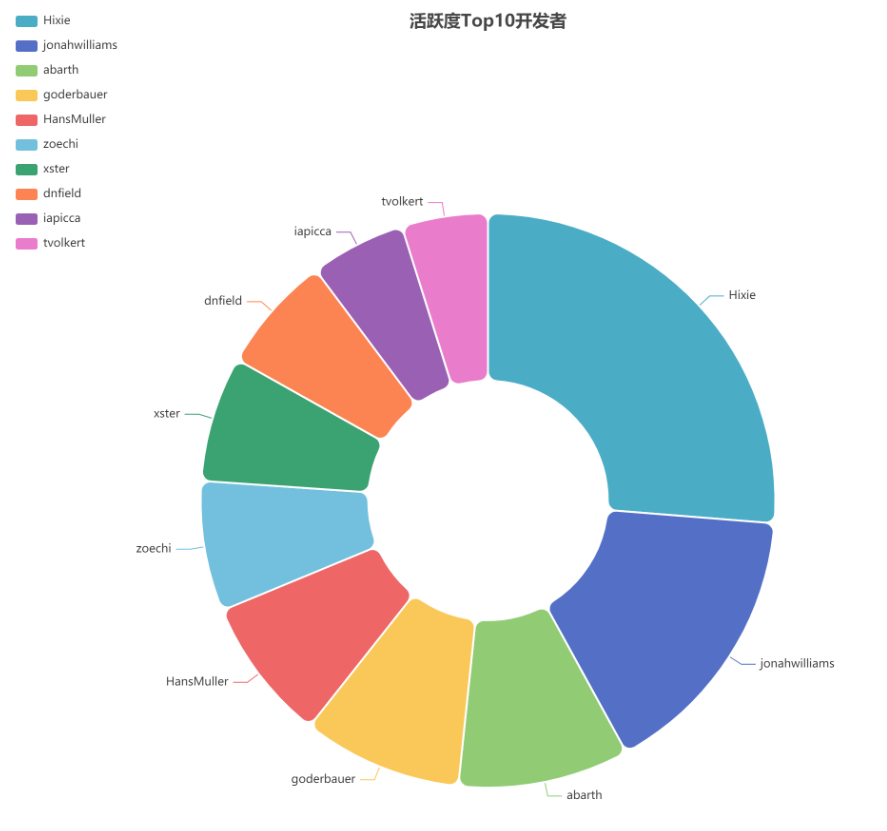
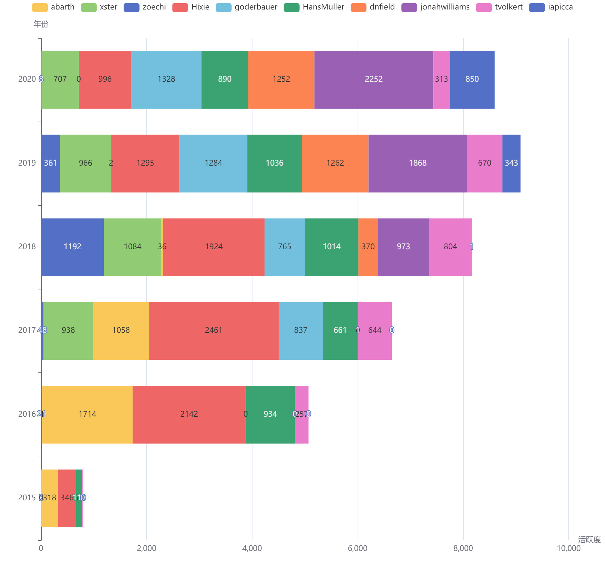

## 开发者分析

- flutter开发者人数和活跃度发展情况

统计2015年3月至2020年12月，flutter项目的开发者人数和活跃度的发展情况，如下图所示。我们可以很明显的看到，在2015年10月份以前，flutter处于开发初期，开发者数量和活跃度较为低迷，开发者人数较少，但活跃度在2015年5月份左右有活跃度小高峰。随后，开发者活跃度处于一个逐步上升阶段。在2018年12月，迎来了flutter活跃的高峰，开发者人数和活跃度都骤增3倍。随后，进入开发活跃度降低，但至今仍处于震动增长状态。

- 开发者活跃度分布

我们统计了在flutter开发过程中，开发者不同活跃度区间的人数分布以及其活跃度占比情况，如下图所示。“人数分布”图展示了不同活跃度区间的人数情况：活跃度位于（0,100）之间的人最多，共有108人；而活跃度大于30000的人最少，只有1人；贡献度在（10000,3000）和（2000,10000）之间的分别有2人和3人。“活跃度占比”图展示了这些活跃度区间的人所贡献的活跃度占比：其中活跃度在（2000,10000）间的2个人的活跃度占比最多，为44.7%，而活跃度位于（0,100）的人的贡献占比最少为2.2%。可以得出结论，flutter项目的主要贡献力为小部分人，而大部分人的活跃贡献度不高。此现象符合帕累托法则，少数的人会造成主要的影响，而多数人只能造成少许影响。

- 最活跃的10个开发者

我们抽取了flutter项目活跃度最高的10个开发者，得到了他们参与项目的主要信息，如下表所示。得到活跃度最高的开发者为Hixie，总体贡献力为30281.597  ，而jonahwilliams、abarth、goderbauer的贡献力紧追其后。

|  actor_login  | issue_comment | open_issue | open_pull | pull_review_comment | merge_pull | star | fork | actor_acitivity |
| :-----------: | :-----------: | :--------: | :-------: | :-----------------: | :--------: | :--: | :--: | :-------------: |
|     Hixie     |     15688     |    1565    |   1321    |        12415        |  1030.825  |  2   |  1   |    30281.597    |
| jonahwilliams |     7685      |    591     |   1982    |        4528         |  1410.841  |  1   |  1   |    18142.627    |
|    abarth     |     5731      |    199     |   1096    |        2336         |  918.290   |  1   |  1   |    11110.257    |
|  goderbauer   |     3858      |    365     |    636    |        4595         |  482.718   |  1   |  1   |    10362.511    |
|  HansMuller   |     3173      |    276     |    702    |        3984         |  579.274   |  1   |  1   |    9347.648     |
|    zoechi     |     9643      |     38     |     3     |          4          |   1.604    |  1   |  1   |    8460.438     |
|     xster     |     3879      |    585     |    423    |        2973         |  315.026   |  1   |  1   |    8133.423     |
|    dnfield    |     5131      |    365     |    433    |        1910         |  318.468   |  1   |  1   |    7654.662     |
|    iapicca    |     6484      |     31     |     2     |          2          |   0.810    |  3   |  8   |    6187.414     |
|   tvolkert    |     2689      |    318     |    511    |        1360         |  386.475   |  1   |  4   |    5586.491     |

下图为Top10开发者的贡献比例饼图，可以明显观察到，Hixie、jonahwilliams、abarth三者的活跃度贡献力，在前十中占了接近一半。

下图统计了flutter项目Top10开发者从2015年值2020年的活跃度变化，不同开发者的活跃年份不同。有些开发者在项目初期较为活跃，但近年活跃度减少，例如abarth、Hixie；而有些开发者是近年来加入项目的新势力，例如goderbauer、jonahwilliams。

- 2020年开发者工作时间分布

此部分统计了2020年开发者的工作时间分布。如下图所示，横轴为星期天数，而纵轴为一天24小时的时间。可以观察到，工作日开发者的活跃度明显比周末高，且周一的活跃度最高，周二到周五活跃度相仿。一天中，24小时都有开发者在工作，且早上9am、下午6pm和晚上9pm是开发者活跃的高峰。

# 相关项目分析

此部分统计了flutter贡献度Top20的开发者参与较为活跃度项目，形成了flutter开发者关联仓库关系图。下图中黄色节点代表flutter项目，绿色节点代表开发者，蓝色节点代表其他项目。可以看到flutter开发者贡献力较高的项目angular/angular等也是前端框架，而也有flutter_map、flutter/plugins等flutter相关项目。

