# Kubernetes项目深入数据分析

Kubernetes（常简称为k8s）是Google开源的一个容器编排引擎，它支持自动化部署、大规模可伸缩、应用容器化管理。Kubernetes现隶属于CNCF（Cloud Native Computing Foundation，云原生计算基金会），是容器编排领域的事实标准，吸引了大量开发者的注意力。因此，本项目将对Kubernetes进行深入数据分析，评估其开源社区的发展状况。

本报告包含两部分。首先本项目将分析Github上Kubernetes项目的相关数据，从数据的角度评估其活跃程度。随后，本项目将调研和学习Kubernetes项目的协作流程。

## 1. Github 数据分析
Kubernetes项目托管于Github上，因此可以借助爬虫从Github获取相关的项目信息并进行数据分析和可视化。本节主要包含四类数据的分析和可视化，分别为基础的统计数据、开发者数据、关联数据（如协作关联度高的其它项目数据）、其它数据。

### 1.1 基础的统计数据分析、可视化
Github事件数是一个项目活跃程度的重要参照指标，因此在基础的统计数据分析、可视化部分，首先展示Github事件数的分析结果。

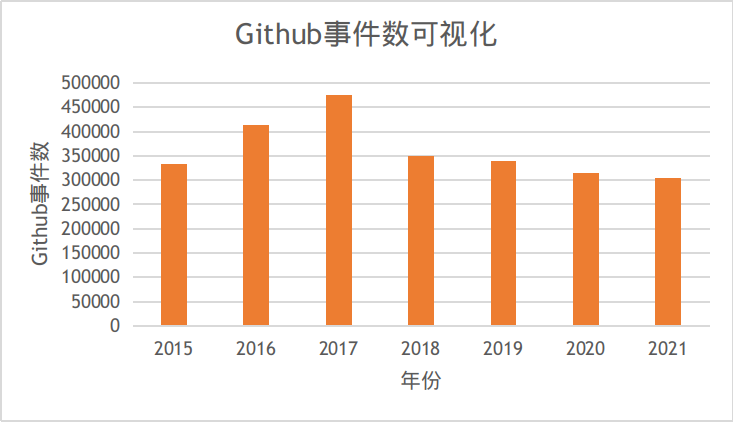

上图展示了2015-2021年Kubernetes项目的Github事件数。其中2015年和2021年由于没有收集到全年的数据，这里展示的是按事件数按收集收集时间等比例扩增后的结果。从图中我们可以看到，Kubernetes项目每年的Github事件数在30万到50万的区间波动。2015-2017年间，Github事件数逐步增加，但2018年后呈现下降并逐步稳定到30万的趋势。这说明Kubernetes在2015-2017年间处于快速发展阶段，2018年后已经趋于成熟和稳定。

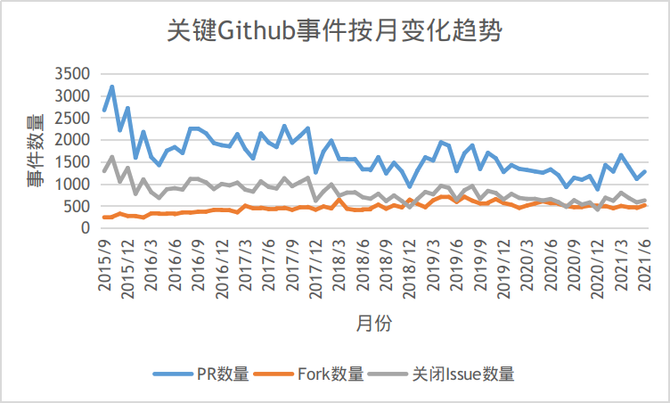

为了进一步分析Github事件数的变化趋势，上图绘制了三种重要的事件（PR数量、Fork数量、关闭Issue数量）在2015/9\~2021/6间按月的变化趋势。可以看到PR数量和Issue数量稳步下降，这同样反映了Kubernetes已经日趋成熟的趋势。但Fork数量在2015/9\~2021/6不存在很大变化，这反映了参与Kubernetes的热度丝毫未减。

另一个考察开发热度的方法是统计解决Issue的平均时间，该事件越短，说明社区开发热度越高，解决问题越积极。

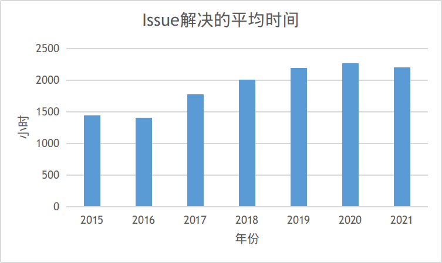

上图反映了2015~2021每年度Issue的平均解决事件，可以看到今年来Issue的平均解决事件有了一定的增长，结合之前Issue数量逐年下降的趋势，也能够得到Kubernetes现已趋于成熟，开发热度略有下降的结论。

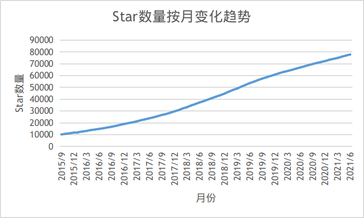

上图是Kubernetes仓库Star数量按月的变化趋势。可以看到从2015/9~2021/6，Star数量稳步从1万增长到8万，反映了Kubernetes在开发者中极高的热度。

### 1.2 开发者数据统计、可视化

GitHub开发者活跃度显示一个开源项目的热度。本节将展示开发者相关的数据分析，旨在用数据了说明K8s在开源社区的热度。

#### K8s开发者在2020年GitHub apps日志时间分布

上图为K8s开发者在2020年GitHub apps日志时间分布图，工作日和周末不同时段总的commit提交数目。可以看到，开发者在工作日提交的commit比休息日提交的commit多50%-300%，这说明开发者在工作日更愿意参与到开源项目中，在周末开发者的提交热情有所下降。此外，开发者提交开源项目commit的时间段主要集中在一天的14-22时，这可能是因为在其他时间段开发者正忙于自己工作中的事情。

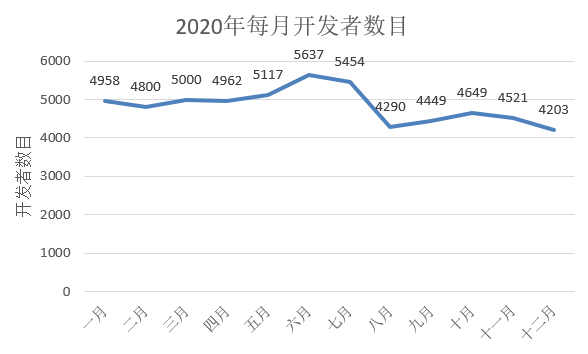

上图展示了K8s项目，2020年每月开发者的数目。在1-7月开发者数目是要多于8-12月的。在7月开发者数目达到了顶峰，8月有比较明显的开发者数目的减少。

#### 2020年最活跃的开发者

| actor_login | actor_acitivity | ic | oi | op | prc | mp | st | fo |
| --- | --- | --- | --- | --- | --- | --- | --- | --- |
| k8s-ci-robot | 52436.47009 | 126577 | 0 | 0 | 0 | 0 | 0 | 0 |
| fejta-bot | 12874.42606 | 15097 | 12 | 0 | 0 | 0 | 0 | 0 |
| liggitt | 7697.22643 | 5062 | 66 | 211 | 2664 | 172.306 | 0 | 0 |
| neolit123 | 3200.500606 | 2526 | 4 | 70 | 796 | 57.988 | 0 | 0 |
| alculquicondor | 3026.861263 | 1863 | 53 | 92 | 1213 | 74.038 | 0 | 0 |
| aojea | 2845.832739 | 2038 | 29 | 118 | 795 | 67.489 | 0 | 0 |
| dims | 2247.372477 | 2278 | 21 | 110 | 208 | 59.989 | 0 | 0 |
| Huang-Wei | 2074.79355 | 1327 | 24 | 87 | 679 | 67.279 | 0 | 0 |
| wojtek-t | 1987.627394 | 1136 | 16 | 100 | 666 | 78.043 | 0 | 0 |
| andrewsykim | 1969.980537 | 922 | 6 | 70 | 954 | 45.683 | 0 | 0 |
| ahg-g | 1894.971758 | 1291 | 48 | 46 | 612 | 37.996 | 0 | 0 |
| BenTheElder | 1723.110232 | 1534 | 10 | 34 | 309 | 22.134 | 0 | 0 |
| lavalamp | 1703.183879 | 1014 | 12 | 11 | 714 | 5.934 | 0 | 0 |
| tedyu | 1630.017516 | 1585 | 35 | 73 | 295 | 32.796 | 0 | 0 |
| msau42 | 1618.06897 | 991 | 21 | 37 | 554 | 29.294 | 0 | 0 |
| justaugustus | 1333.184741 | 1327 | 6 | 94 | 82 | 69.334 | 0 | 0 |
| andyzhangx | 1312.091128 | 897 | 17 | 151 | 180 | 116.229 | 0 | 0 |
| oomichi | 1200.626495 | 665 | 5 | 57 | 321 | 39.94 | 0 | 0 |
| thockin | 1191.546589 | 724 | 13 | 22 | 486 | 13.304 | 0 | 0 |
| fedebongio | 1177.102983 | 1214 | 0 | 0 | 0 | 0 | 0 | 0 |
| apelisse | 1156.443016 | 756 | 12 | 47 | 342 | 32.059 | 0 | 0 |
| MikeSpreitzer | 1145.179749 | 771 | 35 | 46 | 571 | 20.523 | 0 | 0 |

上表展示了2020年活跃程度最高的前22名开发者，其中第一名k8s-ci-robot和第二名fejta-bot是机器人。

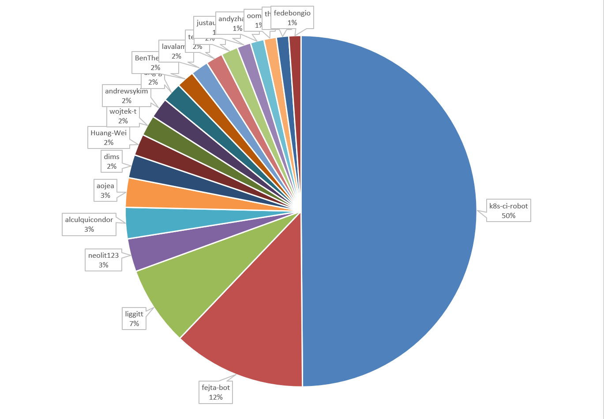 

上图展示了不包括机器人在内的前20名开发者的活跃度占比情况，由图可知，机器人k8s-ci-robot贡献了一半的活跃度，机器人fejta-bot贡献了12%的活跃度。

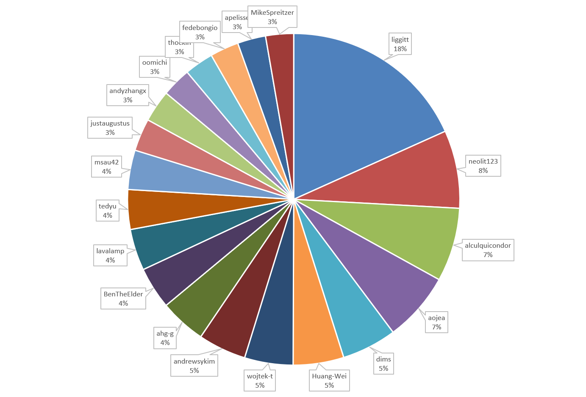 

上图展示了包括机器人在内的前20名开发者的活跃度占比情况，由图可知，k8s的开发由liggitt主导，neolit123、alculquicondor、aojea、dims等人积极参与k8s的开发。

#### 2020年开发者参与项目的方式

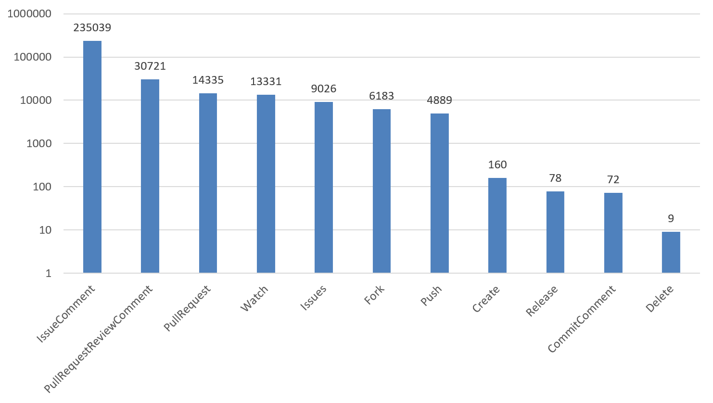 

2020年开发者参与项目的最普遍的方式是issue，占所有参与方式的四分之三；此外开发者还以pull request review，pull request， watch ，issue， fork，push等方式参与开发。

#### 2020年所有开发者的活跃度

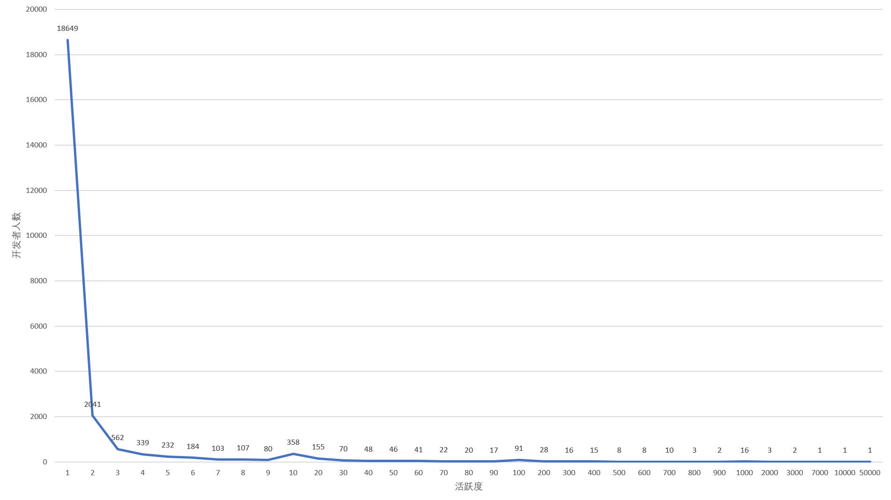 

上图对每个开发者的活跃度只保留一位有效数字然后进行归并，统计了每个活跃度阶段的开发者人数。可以看到，活跃度越高，则开发者越少。绝大多数开发者的活跃度在10以下，只有少数开发者的活跃度超过了100。

### 1.3 关联数据的分析，如协作关联度高的其他项目

#### 2020年与k8s拥有最多共同开发者的项目

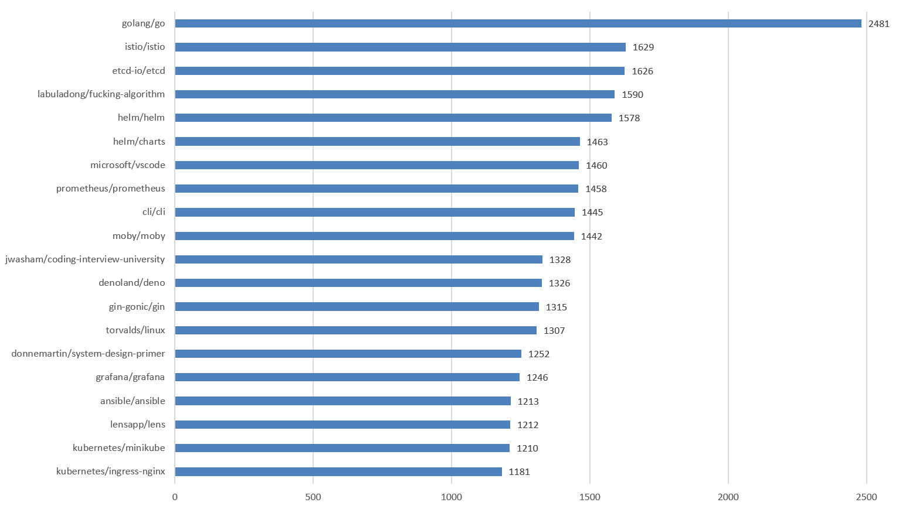 

上图展示了与k8s拥由相同的开发者数量最多的前20个项目。如图所示，第一名golang一骑绝尘，第2名istio和和第3名etcd是用golang开发的，考虑到k8s也是用golang开发的，这说明大量的开发者因golang编程语言而汇聚起来，开发了一系列的项目。

#### 2020年与k8s拥有最多共同开发者的组织

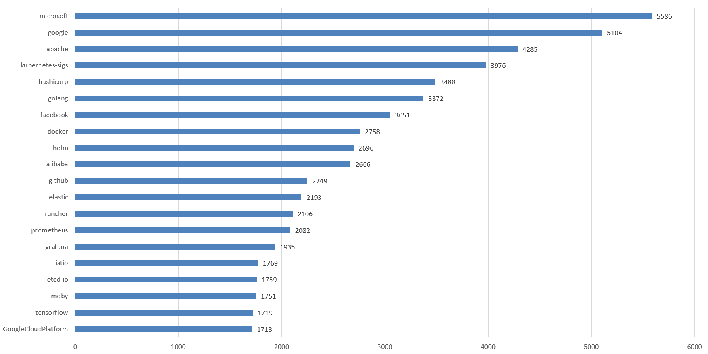 

上图展示了与k8s拥由相同的开发者数量最多的前20个组织。如图所示，2020年与k8s具有最多共同开发者的组织是MicroSoft和Google，后面还可以看到Facebook和阿里巴巴的身影，这说明企业高度参与甚至主导了k8s的开发。

### 1.4 其他任意想做的数据分析
Kubernetes的社区活动被组织成若干个SIG（Special Interest Group）。SIG的具体组织架构和工作流程将在协作流程调研小节中介绍。简单地说，每个SIG重点关注Kubernetes某方面的功能和特性，并对该方面进行优化和扩展的工作。SIG进行的扩展项目被统一组织在Github的Kubernetes SIGs组织下。

为了评估Kubernetes SIGs组织下项目的热度，下图绘制了各项目的Star数量。可以看到，约一半的SIG项目的Star数量都不超过100，但也存在如kubespary等项目Star数量到达10000。

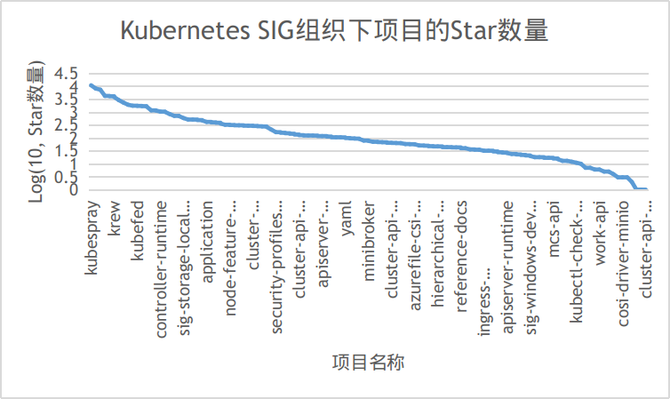

下图从另一个角度--Github事件数比较了Kubernetes SIG组织下项目的热度。可以看到Github事件数呈现与Star数量相同的幂律分布。不过，Github事件数量反映的最活跃项目与Star数量反映的最热项目并不完全一致。具有最多Star的项目kubespray在Github事件数量排行榜中名列第3，具有最多Github事件数量的项目cluster-api在Star排行榜中名列第12。

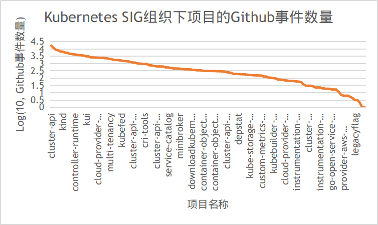

## 2. 协作流程调研

### 2.1 项目的日常协作流程调研
Kubernetes包含了许多项目，这些项目被组织成若干社区小组，所有的协作通过这些社区小组进行。小组中负责管理文档和代码库的一类被称为SIG（Special Interest Group）。社区小区的协作渠道包括邮件列表、Slack频道、
Zoom会议、会议议程/笔记，这些内容可以在对应社区小组/SIGs页面上的README中找到。

除此之外，每月Kubernetes社区还会通过Zoom组织社区会议，可以在[Google Doc](https://docs.google.com/document/d/1VQDIAB0OqiSjIHI8AWMvSdceWhnz56jNpZrLs6o7NJY/edit)上找到对应会议的议程。每年Kubernetes社区会举办若干次的KubeCon/CloudNativeCon，开发者也可以现场参会进行交流或观看[Youtube上的录播](https://www.youtube.com/channel/UCvqbFHwN-nwalWPjPUKpvTA)。

下面简要介绍社区小组的交流和协作的方式：

#### 邮件列表
邮件列表是大部分SIG和子项目的最主要的异步协作方式，邮件列表中的人分为四种角色：管理员、邮件列表拥有者、协调员、订阅者。管理员是Kubernetes项目统一组织的一类人员，专门负责对各个邮件列表的日常管理。邮件列表拥有者通常是邮件列表的创建者，即SIG的管理者。协调员负责对新用户发送的邮件进行审核，并组织年度邮件列表的Review。订阅者即为普通的开发者，可以接收邮件列表中的邮件并向邮件列表发送新的邮件。

具体邮件列表相关事项可以参见[mailing-list-guidelines](https://github.com/kubernetes/community/blob/master/communication/mailing-list-guidelines.md)

#### Slack Channel
Kubernetes通过Slack进行实时交流。开发人员和Kubernetes爱好者分布在近250个Channel，这些Channel由sig-contributor-experience拥有和统一运营。

Kubernetes Slack Channel开放申请，任何有关Kubernetes话题的讨论都可以申请新的Channel。

具体Slack相关事项可以参考[slack-guidelines](https://github.com/kubernetes/community/blob/master/communication/slack-guidelines.md)

#### 论坛
Kubernetes的论坛称为[Discuss Kubernetes](https://discuss.kubernetes.io/)，用户可以在这里讨论各种Kubernetes生态相关的内容。此外，每个SIG还对应专门的Google Group，用户可以从[SIG列表](https://github.com/kubernetes/community/blob/master/sig-list.md)中的链接选择加入。

#### 日历和Zoom会议
Kubernetes的所有小组会议通过Zoom进行，Zoom会议的日程被放在个共享的日历上。需要发布新的会议需要联系Slack上的sig-contribex Channel。

日历相关事项可以参考[calendar-guidelines](https://github.com/kubernetes/community/blob/master/communication/calendar-guidelines.md)，Zoom会议相关事项可以参考[zoom-guidelines](https://github.com/kubernetes/community/blob/master/communication/zoom-guidelines.md)。

#### 网站
Kubernetes的官方文件发布在 https://kubernets.io。

网站相关事项可以参考[website-guidelines](https://github.com/kubernetes/community/blob/master/communication/website-guidelines.md)。

#### Twitter
Kubernetes的Twitter账号由CNCF拥有和运营，相关事项可以联系 social@cncf.io。

#### Youtube
Kubernetes的Youtube账号由sig-contribex社区管理子项目拥有和运营，其中存放了社区小组的会议录像。

Youtube相关事项可以参考[youtube-guidelines](https://github.com/kubernetes/community/blob/master/communication/website-guidelines.md)。

#### Kubernetes周报
Kubernetes周报（LWKD）由Josh Berkus拥有和运营。

详情可以参见 https://lwkd.info。

#### Kubernetes博客
[Kubernetes博客](https://kubernetes.io/blog/)由sig-docs所有，由博客团队运营。

### 2.2 开发者参与流程调研

Kubernetes是开源的，但许多从事该工作的人将其作为日常工作。为了避免强迫人们24小时有效地 "工作"，我们想围绕开发建立一些半正式的协议。希望这些规则能使事情进行得更顺利。如果你发现情况并非如此，请大声抱怨。

作为一个潜在的贡献者，我们欢迎你的改变和想法，无论在白天还是晚上，工作日、周末和假期的任何时候。请不要犹豫，提出一个问题或发送一个Pull Request。

请查看我们的社区指导原则，了解如何作为一个大团体创造伟大的代码。

初学者的信息可以在打开 Pull Request]和代码评审中找到。

对于贡献者资源的快速参考，我们有一个方便的贡献者小册子。

##### 沟通

与SIG主题相关的问题，最好是联系你的SIG。你的SIG能够比一般问题更快地帮助你。

对于一般的问题和故障排除，请使用标准的沟通渠道，并通过故障排除指南进行工作。

#### GitHub的工作流程

要检查代码的工作，请参考GitHub工作流程指南。

Pull Request的完整工作流程记录在此。

* Kubernetes专用的github工作流程。

该文件是全面而详细的，对于一个典型的Pull Request，我们将在这里涵盖初始和简单的用例。

#### 打开一个Pull Request

Pull Request通常被称为 "PR"。Kubernetes通常遵循标准的github Pull Request流程，但有一层额外的kubernetes特定（有时是SIG特定）的差异。

你会看到的第一个区别是，一个机器人会开始给你的PR贴上结构化的标签。

机器人也可能提出一些有用的建议，在你的PR中运行命令，以方便评审。

这些/命令选项可以在评论中输入以触发自动标签和通知。请参考其命令参考文档。

常见的新贡献者PR问题是:

* 在你的第一个PR之前没有正确签署CLA。请参阅 CLA 页面获取故障排除帮助，在某些情况下，你可能需要向 CNCF 提交一份票据来解决 CLA 问题。

* 为 PR 找到合适的 SIG 或评审员（参见代码评审部分），并遵循任何 SIG 或版本库的特定贡献指南（参见了解 SIG 部分）。

* 处理在你的PR上失败的测试案例，与你引入的修改无关（见Test Flakes）。

* 不遵循可扩展性的良好实践

* 在提交信息中包括提及（如@某人）和可以关闭问题的关键词（如fixes #xxxx）。

#### 代码评审

关于代码评审的重要性的简要描述，请阅读论代码评审。

代码评审有两个方面：给予和接受。

为了使你的PR更容易接受评审，考虑到评审者需要你:

* 遵循项目的编码规范

* 写好提交信息

* 将大的修改分解成一系列逻辑上较小的补丁，每个补丁都是容易理解的修改，并且总体上解决了一个更广泛的问题

* 给PR贴上适当的SIG和评审员的标签：要做到这一点，请阅读机器人发给你的信息，以指导你完成PR过程。

评审员，也就是提供评审的人，我们强烈鼓励他们重新审视行为准则以及社区的期望，他们必须超越自我，以促进一个合作、尊重的社区。在评审他人的PR时，《补丁评审的温柔艺术》建议采用一系列迭代的重点，旨在引导新的贡献者进行积极的合作，而不是一开始就把他们淹没在细微的差别中:

* 贡献背后的想法是否合理？

* 贡献的架构是否正确？

* 贡献是否经过精加工？

注意：如果你的拉动请求没有得到足够的关注，你可以使用Slack上的#pr-reviews频道来帮助寻找评审者。

#### 最佳实践

* 编写清晰而有意义的git提交信息。

* 如果PR将完全修复一个特定的问题，在PR正文中包括修复#123（其中123是PR将修复的特定问题编号。当PR被合并时，这将自动关闭该问题。

* 确保你在git提交信息中不包括@mentions或fixes关键字。这些应该包含在PR正文中。

* 当你为小的改动（比如修正错别字、风格变化或语法修正）做PR时，请压制你的提交，以便我们能保持一个更干净的git历史。

* 请确保你包含一个清晰详细的PR描述，解释修改的原因，并确保有足够的信息让审核者理解你的PR。

* 补充阅读:

    * https://chris.beams.io/posts/git-commit/.

    * https://github.com/blog/1506-closing-issues-via-pull-requests

    * https://davidwalsh.name/squash-commits-git

    * https://mtlynch.io/code-review-love/

#### 测试

测试是所有贡献者的责任，部分由所有SIG拥有，但也由sig-testing协调。更多信息请参考《测试指南》。

有多种类型的测试。测试代码的位置随类型的不同而不同，成功运行测试所需的环境的具体情况也是如此:

* 单元测试。这些测试确认一个特定功能的行为是否符合预期。Golang包括通过测试包进行单元测试的本地能力。单元测试的源代码可以在一个给定的包内的相应源代码旁边找到。例如：在kubernetes/cmd/kubeadm/app/util/version.go中定义的函数将在kubernetes/cmd/kubeadm/app/util/version_test.go中有单元测试。这些都可以由任何开发人员在任何操作系统上轻松地在本地运行。

* 集成。这些测试涵盖了软件包组件的交互，或者kubernetes组件和其他一些非kubernetes系统资源（例如：etcd）之间的交互。一个例子是测试一段代码是否可以正确地存储数据到etcd或从etcd中检索数据。集成测试存储在kubernetes/test/integration/。运行这些测试可能需要开发人员在其开发系统上设置额外的功能。

* 端到端（"e2e"）。这些是对整体系统行为和一致性的广泛测试。这些测试更复杂，因为它们需要从被测试的源头建立一个功能性的kubernetes集群。在kubernetes/test/e2e/中可以找到一份单独的文件，详细说明e2e测试和测试案例本身。

* 一致性。这是一组测试案例，目前是集成/e2e测试的一个子集，由架构组批准，以定义所有Kubernetes部署必须支持的核心互操作特性。关于一致性测试的更多信息，请参见一致性测试文件。

持续集成将运行这些测试，可以作为PR的预提交，也可以作为针对主/发布分支的后提交，或者两者都是。
结果会出现在testgrid上。

sig-testing负责该官方基础设施和CI。相关的自动化在test-infra repo中被跟踪。如果你想在自己的基础设施上运行e2e测试，kubetest是一个机制。

#### 安全问题

* 安全发布页 - 概述了处理安全问题的程序。

* 安全和披露信息 - 如果你想报告一个安全漏洞，请查看此页面。

#### 文档

* 贡献于文档

#### 问题管理或分流

你有没有注意过未解决的问题的总数？帮助管理或分流这些开放的问题可以是一个很大的贡献，也是一个了解项目各个领域的好机会。分流是我们用来描述为GitHub问题添加多种类型的描述性标签的过程，以加快将问题转交给正确的人。更多信息请参考《问题分流指南》。

### 2.3 项目CI/CD的流程调研

Kubernetes通过一个k8s-ci-robot来负责项目的CI/CD。它能帮助管理上游点的PR&Issue，无处不在。k8s-ci-robot其背后通过[Prow](https://github.com/kubernetes/test-infra/tree/master/prow#bots-home)系统来管理Kubernetes的CI/CD。

#### Prow
Prow 的出现称得上是顺势而为。在它诞生前夕，Kubernetes 正值快速发展，开发者们每天需要在数个 GitHub 组织的 100 多个代码库中执行超过 10,000 个 CI/CD job。为了简化工作，Kubernetes 测试特别兴趣小组（sig-testing）创建了一系列工具和服务，其中就包括 Prow。

Prow是基于Kubernetes的CI/CD系统。作业可以由各种类型的事件触发，并向许多不同的服务报告它们的状态。除了作业执行之外，Prow还提供了GitHub的自动化功能，包括策略执行、通过/foo风格命令的聊天操作以及自动PR合并。

##### Prow的功能和特性
* 用于测试、批处理、工件发布的作业执行。
  - GitHub事件用于触发pr后合并(postsubmit)作业和pr上更新(presubmit)作业。
  - 支持多个执行平台和源代码审查站点。
* 可插入的GitHub机器人自动化实现/foo风格的命令和执行配置的策略/进程。
* GitHub将自动化与批量测试逻辑合并。
* 用于查看作业、合并队列状态、动态生成帮助信息等的前端。
* 基于配置的源代码控制的自动部署。
* 在源代码控制中配置的自动GitHub /repo管理。
* 设计为多组织规模与数十个存储库。(Kubernetes Prow实例只使用了一个GitHub bot token!)
* 高可用性是在Kubernetes上运行的好处。(复制、负载平衡、滚动更新…)
* JSON结构日志。

#### 使用Prow的项目
Prow由以下机构和项目使用:
* Kubernetes
  - 包括kubernetes, kubernetes-client, kubernetes-csi, and kubernetes-sigs.
* OpenShift
  - 包括 openshift, openshift-s2i, operator-framework
* Istio
* Knative
* Jetstack
* Kyma
* Metal
* Prometheus
* Caicloud
* Kubeflow
* Azure AKS Engine
* tensorflow/minigo
* Daisy (Google Compute Image Tools)
* KubeEdge (Kubernetes Native Edge Computing Framework)
* Volcano (Kubernetes Native Batch System)
* Loodse
* Feast
* Falco
* TiDB
* Amazon EKS Distro
Jenkins X使用Prow作为无服务器Jenkins的一部分。
