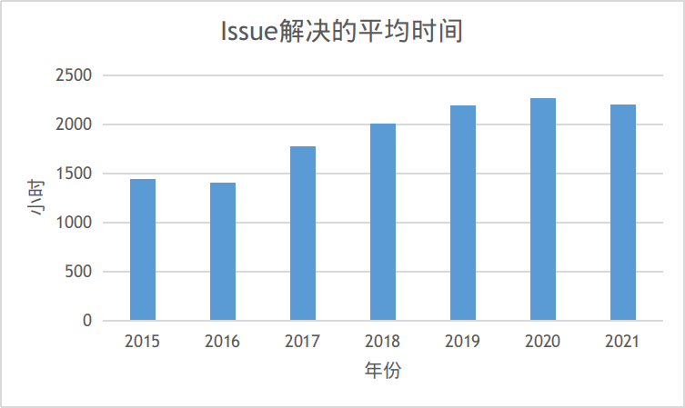
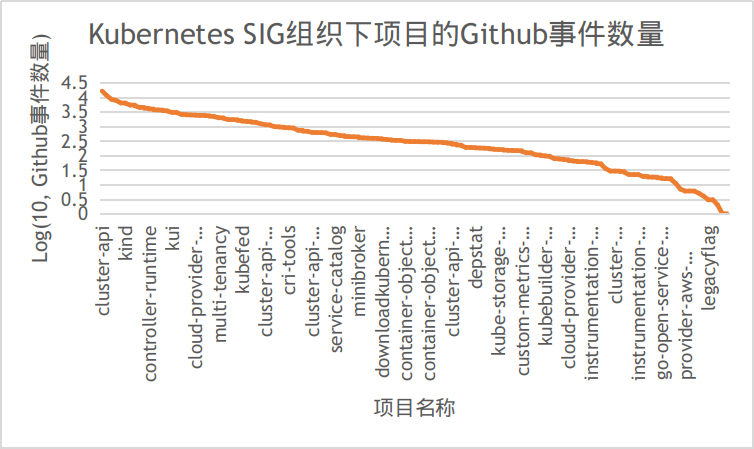

# Kubernetes项目深入数据分析

Kubernetes（常简称为k8s）是Google开源的一个容器编排引擎，它支持自动化部署、大规模可伸缩、应用容器化管理。Kubernetes现隶属于CNCF（Cloud Native Computing Foundation，云原生计算基金会），是容器编排领域的事实标准，吸引了大量开发者的注意力。因此，本项目将对Kubernetes进行深入数据分析，评估其开源社区的发展状况。

本报告包含两部分。首先本项目将分析Github上Kubernetes项目的相关数据，从数据的角度评估其活跃程度。随后，本项目将调研和学习Kubernetes项目的协作流程。

## 1. Github 数据分析
Kubernetes项目托管于Github上，因此可以借助爬虫从Github获取相关的项目信息并进行数据分析和可视化。本节主要包含四类数据的分析和可视化，分别为基础的统计数据、开发者数据、关联数据（如协作关联度高的其它项目数据）、其它数据。

### 1.1 基础的统计数据分析、可视化
Github事件数是一个项目活跃程度的重要参照指标，因此在基础的统计数据分析、可视化部分，首先展示Github事件数的分析结果。

上图展示了2015-2021年Kubernetes项目的Github事件数。其中2015年和2021年由于没有收集到全年的数据，这里展示的是按事件数按收集收集时间等比例扩增后的结果。从图中我们可以看到，Kubernetes项目每年的Github事件数在30万到50万的区间波动。2015-2017年间，Github事件数逐步增加，但2018年后呈现下降并逐步稳定到30万的趋势。这说明Kubernetes在2015-2017年间处于快速发展阶段，2018年后已经趋于成熟和稳定。

为了进一步分析Github事件数的变化趋势，上图绘制了三种重要的事件（PR数量、Fork数量、关闭Issue数量）在2015/9\~2021/6间按月的变化趋势。可以看到PR数量和Issue数量稳步下降，这同样反映了Kubernetes已经日趋成熟的趋势。但Fork数量在2015/9\~2021/6不存在很大变化，这反映了参与Kubernetes的热度丝毫未减。

另一个考察开发热度的方法是统计解决Issue的平均时间，该事件越短，说明社区开发热度越高，解决问题越积极。

上图反映了2015~2021每年度Issue的平均解决事件，可以看到今年来Issue的平均解决事件有了一定的增长，结合之前Issue数量逐年下降的趋势，也能够得到Kubernetes现已趋于成熟，开发热度略有下降的结论。

上图是Kubernetes仓库Star数量按月的变化趋势。可以看到从2015/9~2021/6，Star数量稳步从1万增长到8万，反映了Kubernetes在开发者中极高的热度。

### 1.2 开发者数据统计、可视化

### 1.3 关联数据的分析，如协作关联度高的其他项目

### 1.4 其他任意想做的数据分析
Kubernetes的社区活动被组织成若干个SIG（Special Interest Group）。SIG的具体组织架构和工作流程将在协作流程调研小节中介绍。简单地说，每个SIG重点关注Kubernetes某方面的功能和特性，并对该方面进行优化和扩展的工作。SIG进行的扩展项目被统一组织在Github的Kubernetes SIGs组织下。

为了评估Kubernetes SIGs组织下项目的热度，下图绘制了各项目的Star数量。可以看到，约一半的SIG项目的Star数量都不超过100，但也存在如kubespary等项目Star数量到达10000。

下图从另一个角度--Github事件数比较了Kubernetes SIG组织下项目的热度。可以看到Github事件数呈现与Star数量相同的幂律分布。不过，Github事件数量反映的最活跃项目与Star数量反映的最热项目并不完全一致。具有最多Star的项目kubespray在Github事件数量排行榜中名列第3，具有最多Github事件数量的项目cluster-api在Star排行榜中名列第12。

## 2. 协作流程调研

### 2.1 项目的日常协作流程调研
Kubernetes包含了许多项目，这些项目被组织成若干社区小组，所有的协作通过这些社区小组进行。小组中负责管理文档和代码库的一类被称为SIG（Special Interest Group）。社区小区的协作渠道包括邮件列表、Slack频道、
Zoom会议、会议议程/笔记，这些内容可以在对应社区小组/SIGs页面上的README中找到。

除此之外，每月Kubernetes社区还会通过Zoom组织社区会议，可以在[Google Doc](https://docs.google.com/document/d/1VQDIAB0OqiSjIHI8AWMvSdceWhnz56jNpZrLs6o7NJY/edit)上找到对应会议的议程。每年Kubernetes社区会举办若干次的KubeCon/CloudNativeCon，开发者也可以现场参会进行交流或观看[Youtube上的录播](https://www.youtube.com/channel/UCvqbFHwN-nwalWPjPUKpvTA)。

下面简要介绍社区小组的交流和协作的方式：

#### 邮件列表
邮件列表是大部分SIG和子项目的最主要的异步协作方式，邮件列表中的人分为四种角色：管理员、邮件列表拥有者、协调员、订阅者。管理员是Kubernetes项目统一组织的一类人员，专门负责对各个邮件列表的日常管理。邮件列表拥有者通常是邮件列表的创建者，即SIG的管理者。协调员负责对新用户发送的邮件进行审核，并组织年度邮件列表的Review。订阅者即为普通的开发者，可以接收邮件列表中的邮件并向邮件列表发送新的邮件。

具体邮件列表相关事项可以参见[mailing-list-guidelines](https://github.com/kubernetes/community/blob/master/communication/mailing-list-guidelines.md)

#### Slack Channel
Kubernetes通过Slack进行实时交流。开发人员和Kubernetes爱好者分布在近250个Channel，这些Channel由sig-contributor-experience拥有和统一运营。

Kubernetes Slack Channel开放申请，任何有关Kubernetes话题的讨论都可以申请新的Channel。

具体Slack相关事项可以参考[slack-guidelines](https://github.com/kubernetes/community/blob/master/communication/slack-guidelines.md)

#### 论坛
Kubernetes的论坛称为[Discuss Kubernetes](https://discuss.kubernetes.io/)，用户可以在这里讨论各种Kubernetes生态相关的内容。此外，每个SIG还对应专门的Google Group，用户可以从[SIG列表](https://github.com/kubernetes/community/blob/master/sig-list.md)中的链接选择加入。

#### 日历和Zoom会议
Kubernetes的所有小组会议通过Zoom进行，Zoom会议的日程被放在个共享的日历上。需要发布新的会议需要联系Slack上的sig-contribex Channel。

日历相关事项可以参考[calendar-guidelines](https://github.com/kubernetes/community/blob/master/communication/calendar-guidelines.md)，Zoom会议相关事项可以参考[zoom-guidelines](https://github.com/kubernetes/community/blob/master/communication/zoom-guidelines.md)。

#### 网站
Kubernetes的官方文件发布在 https://kubernets.io。

网站相关事项可以参考[website-guidelines](https://github.com/kubernetes/community/blob/master/communication/website-guidelines.md)。

#### Twitter
Kubernetes的Twitter账号由CNCF拥有和运营，相关事项可以联系 social@cncf.io。

#### Youtube
Kubernetes的Youtube账号由sig-contribex社区管理子项目拥有和运营，其中存放了社区小组的会议录像。

Youtube相关事项可以参考[youtube-guidelines](https://github.com/kubernetes/community/blob/master/communication/website-guidelines.md)。

#### Kubernetes周报
Kubernetes周报（LWKD）由Josh Berkus拥有和运营。

详情可以参见 https://lwkd.info。

#### Kubernetes博客
[Kubernetes博客](https://kubernetes.io/blog/)由sig-docs所有，由博客团队运营。

### 2.2 开发者参与流程调研

### 2.3 项目CI/CD的流程调研