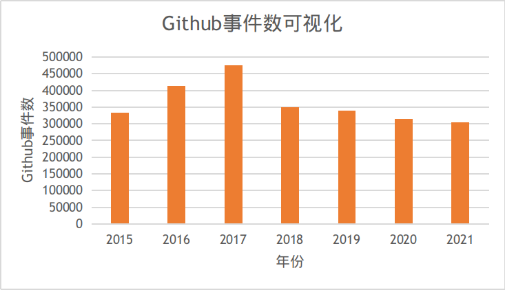

# Kubernetes项目深入数据分析

Kubernetes（常简称为k8s）是Google开源的一个容器编排引擎，它支持自动化部署、大规模可伸缩、应用容器化管理。Kubernetes现隶属于CNCF（Cloud Native Computing Foundation，云原生计算基金会），是容器编排领域的事实标准，吸引了大量开发者的注意力。因此，本项目将对Kubernetes进行深入数据分析，评估其开源社区的发展状况。

本报告包含两部分。首先本项目将分析Github上Kubernetes项目的相关数据，从数据的角度评估其活跃程度。随后，本项目将调研和学习Kubernetes项目的协作流程。

## 1. Github 数据分析
Kubernetes项目托管于Github上，因此可以借助爬虫从Github获取相关的项目信息并进行数据分析和可视化。本节主要包含四类数据的分析和可视化，分别为基础的统计数据、开发者数据、关联数据（如协作关联度高的其它项目数据）、其它数据。

### 1.1 基础的统计数据分析、可视化
Github事件数是一个项目活跃程度的重要参照指标，因此在基础的统计数据分析、可视化部分，首先展示Github事件数的分析结果。

上图展示了2015-2021年Kubernetes项目的Github事件数。其中2015年和2021年由于没有收集到全年的数据，这里展示的是按事件数按收集收集时间等比例扩增后的结果。从图中我们可以看到，Kubernetes项目每年的Github事件数在30万到50万的区间波动。2015-2017年间，Github事件数逐步增加，但2018年后呈现下降并逐步稳定到30万的趋势。这说明Kubernetes在2015-2017年间处于快速发展阶段，2018年后已经趋于成熟和稳定。

为了进一步分析Github事件数的变化趋势，上图绘制了三种重要的事件（PR数量、Fork数量、关闭Issue数量）在2015/9~2021/6间按月的变化趋势。可以看到PR数量和Issue数量稳步下降，这同样反映了Kubernetes已经日趋成熟的趋势。但Fork数量在2015/9~2021/6不存在很大变化，这反映了参与Kubernetes的热度丝毫未减。

上图是Kubernetes仓库Star数量按月的变化趋势。可以看到从2015/9~2021/6，Star数量稳步从1万增长到8万，反映了Kubernetes在开发者中极高的热度。

### 1.2 开发者数据统计、可视化

### 1.3 关联数据的分析，如协作关联度高的其他项目

### 1.4 其他任意想做的数据分析
Kubernetes的社区活动被组织成若干个SIG（Special Interest Group）。SIG的具体组织架构和工作流程将在协作流程调研小节中介绍。简单地说，每个SIG重点关注Kubernetes某方面的功能和特性，并对该方面进行优化和扩展的工作。SIG进行的扩展项目被统一组织在Github的Kubernetes SIGs组织下。

为了评估Kubernetes SIGs组织下项目的热度，下图绘制了各项目的Star数量。可以看到，约一半的SIG项目的Star数量都不超过100，但也存在如kubespary等项目Star数量到达10000。

## 2. 协作流程调研
