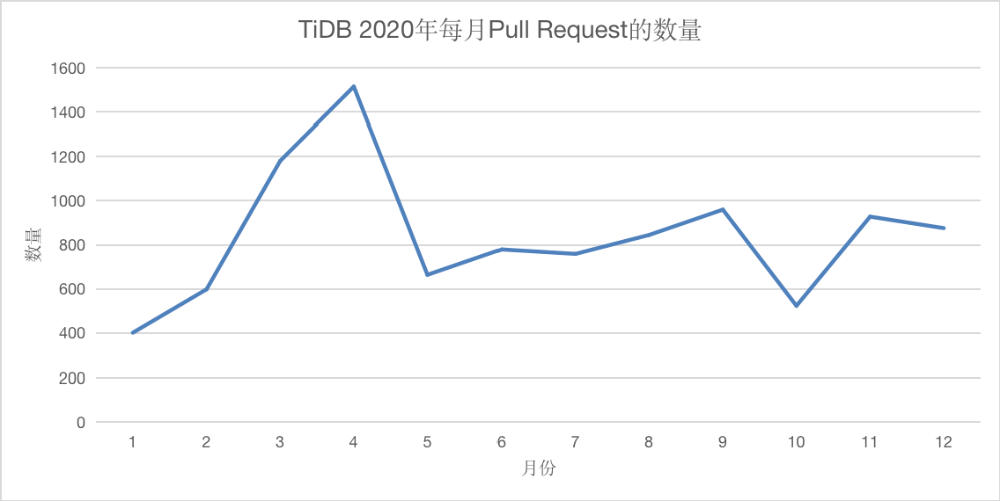
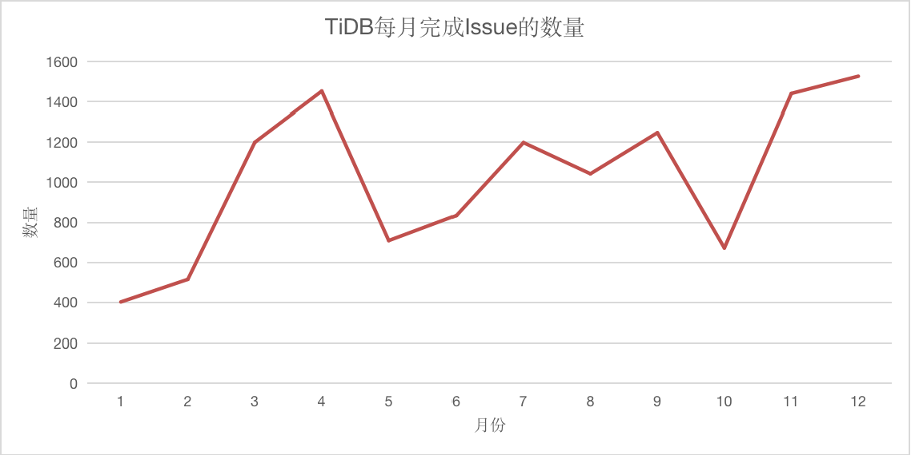
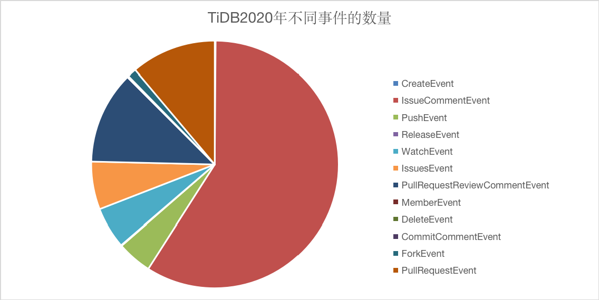
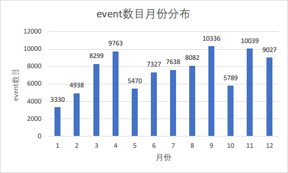
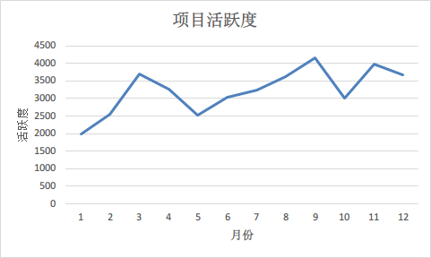
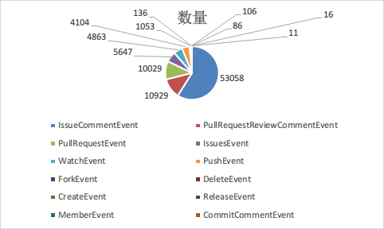
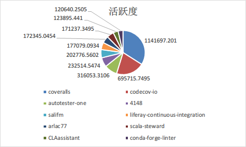

# TiDB2020年深入数据分析

## TiDB简介
[TiDB](https://github.com/pingcap/tidb) 是 [PingCAP](https://pingcap.com/about-cn/) 公司自主设计、研发的开源分布式关系型数据库，是一款同时支持在线事务处理与在线分析处理 (Hybrid Transactional and Analytical Processing, HTAP) 的融合型分布式数据库产品，具备水平扩容或者缩容、金融级高可用、实时 HTAP、云原生的分布式数据库、兼容 MySQL 5.7 协议和 MySQL 生态等重要特性。目标是为用户提供一站式 OLTP (Online Transactional Processing)、OLAP (Online Analytical Processing)、HTAP 解决方案。TiDB 适合高可用、强一致要求较高、数据规模较大等各种应用场景。

### 五大核心特性

- 一键水平扩容或者缩容

  得益于 TiDB 存储计算分离的架构的设计，可按需对计算、存储分别进行在线扩容或者缩容，扩容或者缩容过程中对应用运维人员透明。

- 金融级高可用

  数据采用多副本存储，数据副本通过 Multi-Raft 协议同步事务日志，多数派写入成功事务才能提交，确保数据强一致性且少数副本发生故障时不影响数据的可用性。可按需配置副本地理位置、副本数量等策略满足不同容灾级别的要求。

- 实时 HTAP

  提供行存储引擎TiKV、列存储引擎TiFlash两款存储引擎，TiFlash 通过 Multi-Raft Learner 协议实时从 TiKV 复制数据，确保行存储引擎 TiKV 和列存储引擎 TiFlash 之间的数据强一致。TiKV、TiFlash 可按需部署在不同的机器，解决 HTAP 资源隔离的问题。

- 云原生的分布式数据库

  专为云而设计的分布式数据库，通过TiDB Operator可在公有云、私有云、混合云中实现部署工具化、自动化。

- 兼容 MySQL 5.7 协议和 MySQL 生态

  兼容 MySQL 5.7 协议、MySQL 常用的功能、MySQL 生态，应用无需或者修改少量代码即可从 MySQL 迁移到 TiDB。提供丰富的数据迁移工具帮助应用便捷完成数据迁移。

## 数据分析类

### 基础的统计数据分析、可视化

TiDB在2020年不同月份提交Pull Requests的数量相对稳定，总体为略微上升趋势，其中4月份PR数量显著高于其他月份。

TiDB在2020年每月完成Issue数量的趋势和提交Pull Requests数量的趋势保持一致，其中4月份和12月份完成Issue的数量达到高峰，稳步上升的趋势让我们可以期待TiDB在2021年的表现。

2020年TiDB项目中的不同事件呈现多样化，其中IssueCommentEvent占比超过50%，PullRequestReviewCommentEvent和PullRequestEvent分列二三位，由此可以看出TiDB在开源社区表现十分活跃，受到了广大开发者的关注，开发者也乐于为TiDB做出自己的贡献。TiDB也是2020年GitHub的明星项目，引发了不少的讨论。

### 项目角度分析
#### 项目活跃度
为了了解tidb项目在2020年项目活跃度，我们统计1~12个月每个月份的活跃度，和各个月份的event数目：  

  
我们可以看到，项目的活跃度与even数目基本上成正比，活跃度增加，event数目也会相应的增加。通过折线图我们可以发现，tidb项目的活跃度呈现出波浪型的特征。并且tidb在4月份、9月份和11月份的event数目最多，我们猜测，可能tidb项目在这些时间段中发布了重大更新。
#### issue解决效率
为了了解tidb社区解决issue的效率，我们统计了在2020年提出并解决的issue，issue数目共10733个，提出当天就解决的issue数目为1926个，占比约为1/5，说明tidb社区的工作人员十分积极的去解答开发者们所提出的问题，同时我们也可以从下图的漏斗图中可以看到，随着时间间隔越来越大，issue的数目的越来越少。  
  
#### 总event数目的统计
我们统计了tidb项目2020年所有的event项目，开发者们总共为tidb项目提出了90038个event，我们也统计了不同event的占比，如以下饼图所示：  
  
我们可以看到，IssueCommentEvent的占比最高，占比为59%，这说明tidb的社区还是十分活跃的，有大量的开发者或者tidb的使用者来向tidb提出各种各样的问题，tidb的官方人员也能够及时地回答提问者提出的问题。
同时我们也可以看到，排名第二和第三的event分别是PullRequestReviewCommentEvent和PullRequestEvent，并且两者的数目非常接近，所以我们得出的结论是：开发者十分乐于向tidb项目贡献自己的力量，为tidb项目的发展添砖加瓦，同时，tidb官方项目组也十分重视其它开发者提出的pr，对于开发者们提出的pr能够及时地进行review，并能够及时的将结果反馈给开发者们。

### 开发者分析
#### 活跃度排名前10的开发者
我们统计了2020年参与了tidb项目的所有开发者的活跃度，并筛选掉了一些机器人账户和官方账户，得到活跃度为前10的开发者和他们的活跃度分布：  
  
我们可以看到，id名称为coveralls的开发者的活跃度最高，贡献了排名前10的开发者的活跃度的34%，排名第二，id名称为codecov-io的开发者同样十分活跃，活跃度占比为21%，两者合计占比了50%以上。
#### 一天中各个时间段的event数目统计
之后，我们为了了解开发者们在一天中，具体是在哪些时间段比较活跃，我们将一天分为了4个时间段，统计了2020年这4个时间段的所有event数目：  
  
我们可以清楚的看到，在一天中上午这一时间段的event数目最多，其次是凌晨、下午和晚上。也间接地说明了从上午到晚上，开发者的活跃度会慢慢降低，但到凌晨时，活跃度又会上升，不过这也可能与开发者们处于不同的时区有关，因为本次统计是以北京时间为准。

## 流程类分析
TiDB是一个社区驱动的开源项目，欢迎任何贡献者。

### 项目的日常协作流程调研

#### 在提前PR之前
在继续之前，请确保您的问题和/或拉入请求是什么，是简单的错误修复还是架构更改。
为了节省审稿人的时间，每一期都应该用模板归档，并且应该在5分钟内可以正常检查 。
- 这是一个简单的错误修复吗？
  错误修复通常伴随着测试。在持续集成测试的帮助下，补丁可以很容易地进行审查。请更新单元测试，以便它们捕获错误！
- 这是架构改进吗？
  如果您正在改进代码质量，那么在Pull请求中准确地调整/说明您要“清理”的内容，以节省审查者的时间。此拉入请求就是一个例子。 如果您要使代码更具弹性，请在本地对其进行测试，以演示您的补丁到底是如何改变事情的。
  
#### TiDB工作流
要为TiDB代码库做出贡献，请遵循本节中定义的工作流。
1. 创建要作为工作基础的主题分支。这通常是master。
2. 如果更改修复了错误或添加了新功能，则提交逻辑单元并添加测试用例
3. 运行测试并确保所有测试都通过
4. 确保提交消息的格式正确
5. 将更改推送到存储库分叉中的主题分支
6. 提交PR

#### 获取代码审查
如果您的Pull Request(PR)已打开，则会将其分配给相关特殊兴趣组(SIG)内的审阅者。正常情况下，每个公关需要至少2个LGTM(看起来不错)，从合格的评审员。这些审查者将进行彻底的代码审查，检查正确性、错误、改进机会、文档和注释，以及样式。 要处理审查意见，您应该将更改提交到您的分叉上的同一PR分支。

### 开发者参与流程调研

#### 开发者誓言
为了营造一个开放和欢迎的环境，作为贡献者和维护者，我们承诺让参与我们的项目和我们的社区的每个人都能获得不受骚扰的体验，无论年龄、体型、残疾、种族、性别特征、性别认同和表达、经验水平、教育程度、社会经济地位、国籍、个人外表、种族、宗教或性身份和取向。

#### 开发者标准
有助于创建积极环境的行为示例包括：
- 使用欢迎和包容的语言
- 尊重不同的观点和经历
- 优雅地接受建设性的批评
- 专注于对社区最有利的事情
- 对其他社区成员表现出同情心

参与者不可接受的行为示例包括：
- 使用性别化的语言或意象，以及不受欢迎的性关注或进展
- 种族或政治典故
- 恶言相向、侮辱性/贬损性评论，以及人身攻击或政治攻击
- 公共或私人骚扰
- 未经明确许可，发布他人的私人信息，如物理或电子地址
- 其他可能被合理地认为在专业环境中不合适的行为

#### 开发者职责
项目维护人员负责澄清可接受行为的标准，并应对任何不可接受的行为采取适当和公平的纠正措施。
项目维护人员有权利和责任删除、编辑或拒绝与本行为准则不符的评论、提交、代码、维基编辑、问题和其他贡献，或暂时或永久禁止任何贡献者从事他们认为不适当、威胁、冒犯或有害的其他行为。

#### 作用域
当个人代表项目或其社区时，本行为准则既适用于项目空间，也适用于公共空间。代表项目或社区的示例包括使用官方项目电子邮件地址、通过官方社交媒体帐户发帖或在在线或线下活动中担任指定代表。项目的表示可以由项目维护人员进一步定义和澄清。

#### 强制执行
可以通过联系项目团队coc@pingcap.com报告辱骂、骚扰或其他不可接受行为的情况。所有投诉将被审查和调查，并将导致一个被认为是必要的和适合情况的回应。项目组有义务对事件的记者保密。具体执法政策的更多细节可能会单独张贴。
项目维护人员如果不真诚地遵循或执行“行为准则”，可能会面临项目领导层其他成员认定的暂时或永久性影响。

### 项目CI/CD的流程调研

#### TiDB采用Jenkins作为CI/CD工具

#### Jenkins概念
Jenkins是一个开源的、提供友好操作界面的持续集成(CI)工具，起源于Hudson（Hudson是商用的），主要用于持续、自动的构建/测试软件项目、监控外部任务的运行（这个比较抽象，暂且写上，不做解释）。Jenkins用Java语言编写，可在Tomcat等流行的servlet容器中运行，也可独立运行。通常与版本管理工具(SCM)、构建工具结合使用。常用的版本控制工具有SVN、GIT，构建工具有Maven、Ant、Gradle。

#### Jenkins特性
- 开源的java语言开发持续集成工具，支持CI，CD
- 易于安装部署配置：可通过yum安装,或下载war包以及通过docker容器等快速实现安装部署，可方便web界面配置管理；
- 消息通知及测试报告：集成RSS/E-mail通过RSS发布构建结果或当构建完成时通过e-mail通知，生成JUnit/TestNG测试报告；
- 分布式构建：支持Jenkins能够让多台计算机一起构建/测试；
- 文件识别:Jenkins能够跟踪哪次构建生成哪些jar，哪次构建使用哪个版本的jar等；
- 丰富插件支持:支持扩展插件，你可以开发适合自己团队使用的工具，如git，svn，maven，docker等。

#### Jenkins目的
- 持续、自动地构建/测试软件项目。
- 监控软件开放流程，快速问题定位及处理，提示开放效率。
