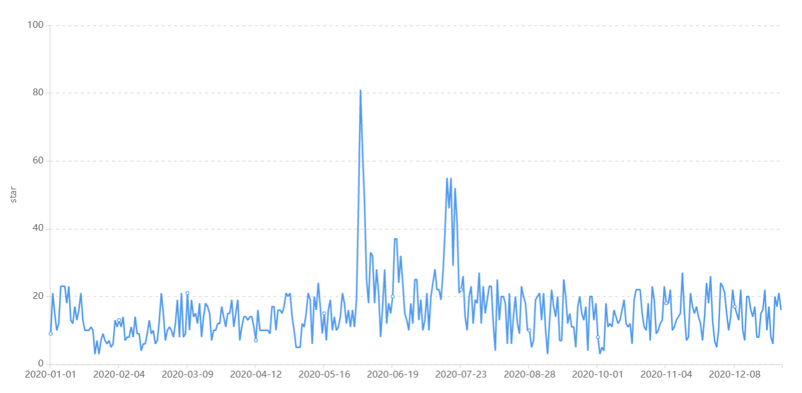
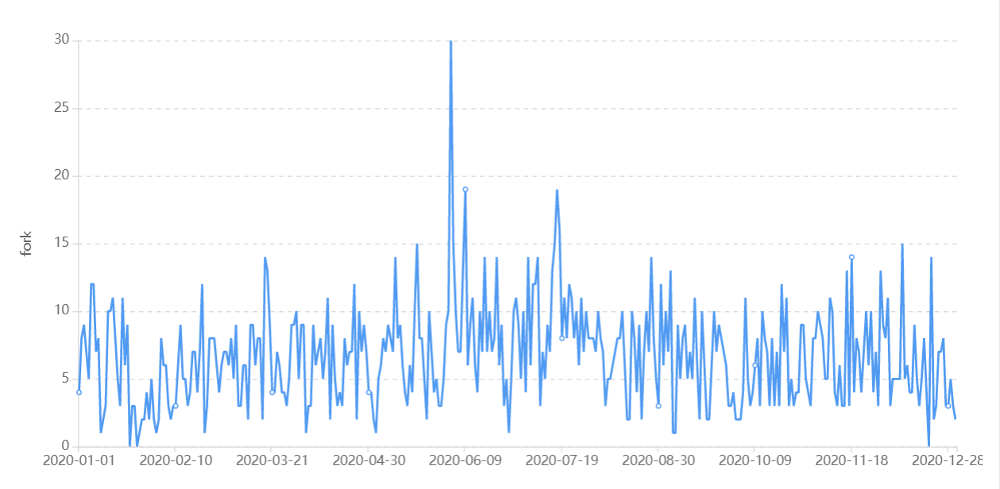
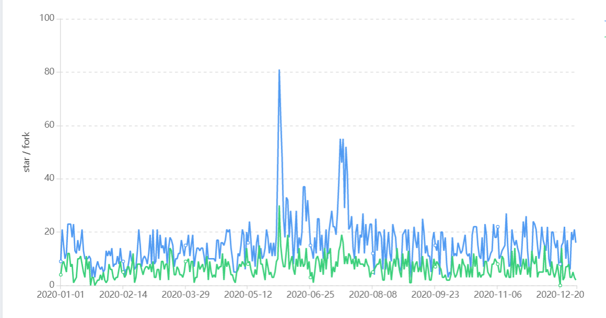
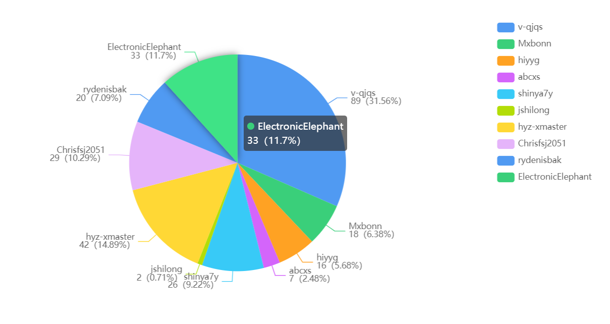
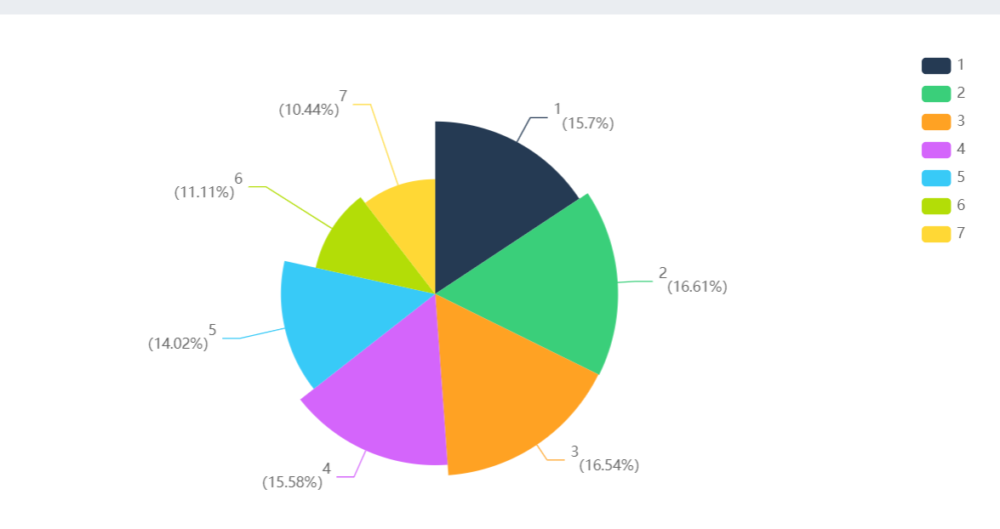
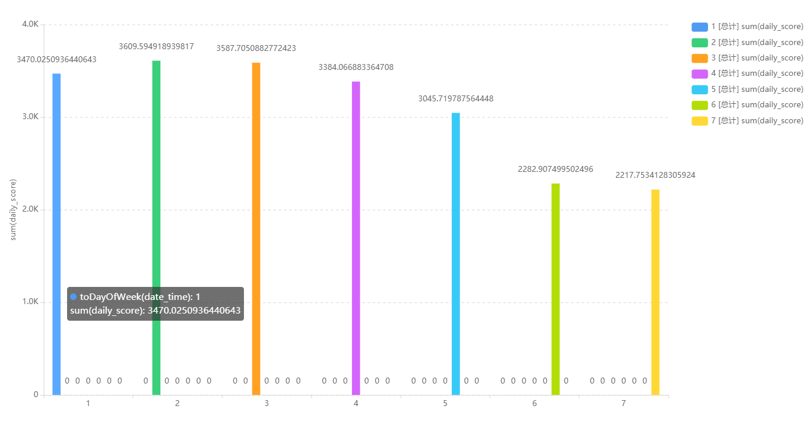
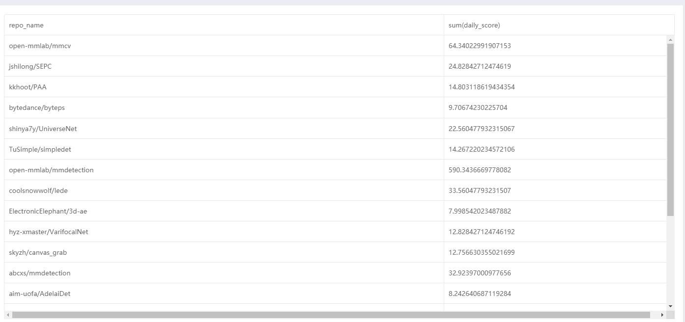

# open-mmlab/mmdetection 社区报告

**摘要**：开源软件开发是人类在互联网发展进程中探索出的一种面向全球的大规模软件协作开发生产模式，当下备受瞩目。本项目为华东师范大学数据学院春季课程《开源软件开发与社区治理》期末大作业，旨在使用ClickHouse中Github全域日志数据对当下流行的开源项目以数据的视角进行分析调研。本报告的调查对象是当前使用广泛的基于 PyTorch 的目标检测开源工具箱MMDetection ,他是open-mmlab的一部分。

**关键词**：Github、数字报告、开源、行为数据


## 1、背景

从2018年年中开始，香港中文大学多媒体实验室（MMLab）就启动了OpenMMLab（[https://github.com/open-mmlab](https://www.oschina.net/action/GoToLink?url=https%3A%2F%2Fgithub.com%2Fopen-mmlab)）计划。这项计划的初衷是为计算机视觉的一些重要方向建立统一而开放的代码库，并不断把新的算法沉淀其中。这一项工作可以推动可复现算法生态的建立，也是对计算机视觉社区的重要贡献。它的主要特性有：

- **模块化设计**

  MMDetection 将检测框架解耦成不同的模块组件，通过组合不同的模块组件，用户可以便捷地构建自定义的检测模型

- **丰富的即插即用的算法和模型**

  MMDetection 支持了众多主流的和最新的检测算法，例如 Faster R-CNN，Mask R-CNN，RetinaNet 等。

- **速度快**

  基本的框和 mask 操作都实现了 GPU 版本，训练速度比其他代码库更快或者相当，包括 [Detectron2](https://github.com/facebookresearch/detectron2), [maskrcnn-benchmark](https://github.com/facebookresearch/maskrcnn-benchmark) 和 [SimpleDet](https://github.com/TuSimple/simpledet)。

- **性能高**

  MMDetection 这个算法库源自于 COCO 2018 目标检测竞赛的冠军团队 *MMDet* 团队开发的代码，我们在之后持续进行了改进和提升。

除了 MMDetection 之外，我们还开源了计算机视觉基础库 [MMCV](https://github.com/open-mmlab/mmcv)，MMCV 是 MMDetection 的主要依赖。


## 2、数据类分析

### 2.1基础数据分析



图2.1.1 star数量变化趋势

截止2020年12月，开源仓库open-mmlab/mmdetection共有5731个star，我们对该仓库的star数进行分析，结果如图2.1.1所示。其中可以看到大部分时间都很平稳，但六月和七月明显多了大量star，猜测由于期末的到来，学生中使用该库的人数激增。例如我们也贡献了一个star。




图2.1.2 fork数量变化趋势




图2.1.3 fork趋势和star趋势对比

由图2.1.2和2.1.3可以看出，fork的趋势变化和star基本一致，且数量小于star。六七月份也有明显的激增。


### 2.2开发者数据统计、可视化



图2.2.1 开发者活跃度top20

图2.2.1显示了open-mmlab/mmdetection社区开发者活跃度Top20，可以看到v-qjqs的贡献度最高，达到了百分之三十多，但和其他开发者并没有拉出过大差距，其余开发者活跃度或高或低，但总的来说大家差不了太多。




图2.2.2 每周提交代码统计

由图2.2.2可以看出，周一到周四工作量最大，其中又以周中也就是周二周三最多。周一应当是刚过完周末，大家还没有缓过来。而随着周末的即将到来，周五的工作热情已经明显下降。周末自然以休息为主，但可以看到仍有一定的工作量。




图2.2.3 每周热度

从热度上来看，与图2.2.2基本保持一致。


### 2.3关联数据的分析



图2.3.1 项目top20开发者所参与的其他开源项目热度表

我们统计了open-mmlab/mmdetection社区活跃度Top20的开发者的所有开源项目的热度排名，可以看到open-mmlab/mmdetection仅仅排名第七，不算低但也谈不上最高。说明这些开发者主要精力并没有放在该社区。排名第一的是open-mmlab/mmcv，可以看到仍然是open-mmlab的项目。可以看出不少开发者专为该实验室工作。其他的项目猜的也是CV相关。

## 3、流程类分析

### 3.1日常协作调研

OpenMMLab 欢迎各种投稿，包括但不限于以下内容。

- 修复（错别字，错误）
- 新功能和组件

日常协作流程为：

- fork 并拉取最新的 OpenMMLab 存储库
- 签出一个新分支（不要为 PR 使用 master 分支）
- 提交您的更改
- 创建公关

如果参与者计划添加一些涉及较大更改的新功能，通常先打开一个问题进行讨论。

### 3.2开发者参与流程调研

对于Python语言，采用PEP8作为首选代码风格，并使用以下工具进行 linting 和格式化：

- flake8：一些linter工具的包装器。
- yapf：Python 文件的格式化程序。
- isort：用于对导入进行排序的 Python 实用程序。
- markdownlint : 检查 markdown 文件和标记样式问题的 linter。
- docformatter：格式化文档字符串的格式化程序。

yapf 和 isort 的样式配置可以在setup.cfg 中找到。

该项目使用pre-commit hook检查和格式化flake8, yapf, isort, trailing whitespaces, markdown files, fix end-of-files, double-quoted-strings, python-encoding-pragma, mixed-line-ending，requirments.txt在每次提交时自动排序。pre-commit hook的配置存储在.pre-commit-config 中。在克隆存储库后，您需要安装初始化pre-commit hook。

```
pip install -U pre-commit hook
```

或者从存储库文件夹直接安装

```
pre-commit install
```

安装markdownlint时遇到问题，尝试以下步骤安装ruby

```
# install rvm
curl -L https://get.rvm.io | bash -s -- --autolibs=read-fail
[[ -s "$HOME/.rvm/scripts/rvm" ]] && source "$HOME/.rvm/scripts/rvm"
rvm autolibs disable

# install ruby
rvm install 2.7.1
```

在此之后，每次提交检查代码 linters 和格式化程序将被强制执行。

在创建 PR 之前，要确保代码 lint 并由 yapf 格式化。

对于C++ 和 CUDA，要遵循Google C++ 风格指南。

### 3.3项目CI/CD的流程调研

主要使用 Jenkins 构建 CI/CD 流水线

打开一个终端窗口，并使用 `cd <your path>` 进入下载 Jenkins 的目录。（在继续之前，请确保已安装 JDK 并将其添加到环境路径。）执行以下命令，该命令将 WAR 文件作为可执行二进制文件运行：

```text
java -jar ./jenkins.war
```

如果一切顺利，Jenkins 应该在默认端口 8080 上启动并运行。

打开一个 Web 浏览器并导航到 `localhost:8080`。除非你有以前安装的 Jenkins，否则应直接转到 Jenkins 仪表板。点击 “Create New Jobs”。你也可以点击左侧的 “New Item”。

在此步骤中，你可以选择并定义要创建的 Jenkins 作业类型。选择 “Pipeline” 并为其命名（例如，“TestPipeline”）。单击 “OK” 创建流水线作业。

你将看到一个 Jenkins 作业配置页面。向下滚动以找到 “Pipeline” 部分。有两种执行 Jenkins 流水线的方法。一种方法是在 Jenkins 上直接编写流水线脚本，另一种方法是从 SCM（源代码管理）中检索 Jenkins 文件。在接下来的两个步骤中，我们将体验这两种方式。

要使用直接脚本执行流水线，请首先从 GitHub 复制该 [Jenkinsfile 示例](https://link.zhihu.com/?target=https%3A//github.com/bryantson/CICDPractice)的内容。选择 “Pipeline script” 作为 “Destination”，然后将该 Jenkinsfile 的内容粘贴到 “Script” 中。花一些时间研究一下 Jenkins 文件的结构。注意，共有三个阶段：Build、Test 和 Deploy，它们是任意的，可以是任何一个。每个阶段中都有一些步骤；在此示例中，它们只是打印一些随机消息。

单击 “Save” 以保留更改，这将自动将你带回到 “Job Overview” 页面。

要开始构建流水线的过程，请单击 “Build Now”。如果一切正常，你将看到第一个流水线（如下面的这个）。

要查看流水线脚本构建的输出，请单击任何阶段，然后单击 “Log”。你会看到这样的消息。

现在，换个方式：在此步骤中，你将通过从源代码控制的 GitHub 中复制 Jenkinsfile 来部署相同的 Jenkins 作业。在同一个 [GitHub 存储库](https://link.zhihu.com/?target=https%3A//github.com/bryantson/CICDPractice)中，通过单击 “Clone or download” 并复制其 URL 来找到其存储库 URL。

单击 “Configure” 以修改现有作业。滚动到 “Advanced Project Options” 设置，但这一次，从 “Destination” 下拉列表中选择 “Pipeline script from SCM” 选项。将 GitHub 存储库的 URL 粘贴到 “Repository URL” 中，然后在 “Script Path” 中键入 “Jenkinsfile”。 单击 “Save” 按钮保存。

要构建流水线，回到 “Task Overview” 页面后，单击 “Build Now” 以再次执行作业。结果与之前相同，除了多了一个称为 “Declaration: Checkout SCM” 的阶段。

要查看来自 SCM 构建的流水线的输出，请单击该阶段并查看 “Log” 以检查源代码控制克隆过程的进行情况。
