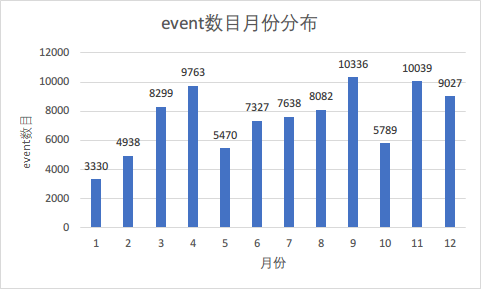
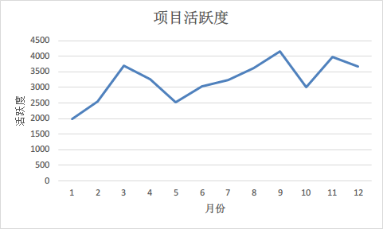
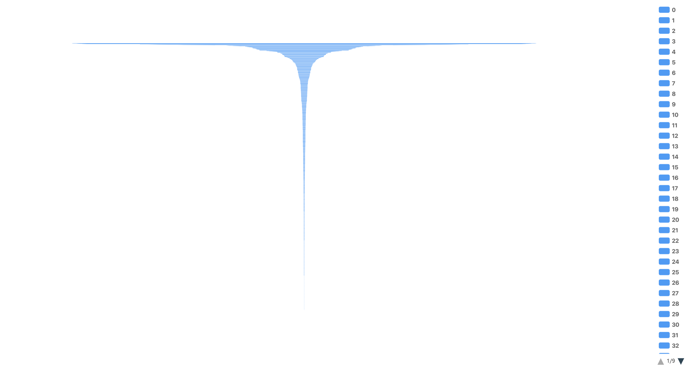
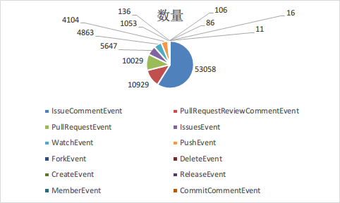
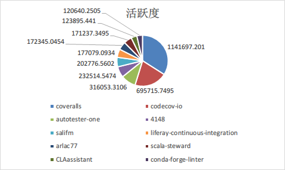
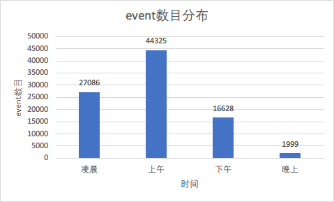

# TiDB2020年深入数据分析

## TiDB简介
[TiDB](https://github.com/pingcap/tidb) 是 [PingCAP](https://pingcap.com/about-cn/) 公司自主设计、研发的开源分布式关系型数据库，是一款同时支持在线事务处理与在线分析处理 (Hybrid Transactional and Analytical Processing, HTAP) 的融合型分布式数据库产品，具备水平扩容或者缩容、金融级高可用、实时 HTAP、云原生的分布式数据库、兼容 MySQL 5.7 协议和 MySQL 生态等重要特性。目标是为用户提供一站式 OLTP (Online Transactional Processing)、OLAP (Online Analytical Processing)、HTAP 解决方案。TiDB 适合高可用、强一致要求较高、数据规模较大等各种应用场景。

### 五大核心特性

- 一键水平扩容或者缩容

  得益于 TiDB 存储计算分离的架构的设计，可按需对计算、存储分别进行在线扩容或者缩容，扩容或者缩容过程中对应用运维人员透明。

- 金融级高可用

  数据采用多副本存储，数据副本通过 Multi-Raft 协议同步事务日志，多数派写入成功事务才能提交，确保数据强一致性且少数副本发生故障时不影响数据的可用性。可按需配置副本地理位置、副本数量等策略满足不同容灾级别的要求。

- 实时 HTAP

  提供行存储引擎TiKV、列存储引擎TiFlash两款存储引擎，TiFlash 通过 Multi-Raft Learner 协议实时从 TiKV 复制数据，确保行存储引擎 TiKV 和列存储引擎 TiFlash 之间的数据强一致。TiKV、TiFlash 可按需部署在不同的机器，解决 HTAP 资源隔离的问题。

- 云原生的分布式数据库

  专为云而设计的分布式数据库，通过TiDB Operator可在公有云、私有云、混合云中实现部署工具化、自动化。

- 兼容 MySQL 5.7 协议和 MySQL 生态

  兼容 MySQL 5.7 协议、MySQL 常用的功能、MySQL 生态，应用无需或者修改少量代码即可从 MySQL 迁移到 TiDB。提供丰富的数据迁移工具帮助应用便捷完成数据迁移。

## 数据分析类

### 基础的统计数据分析、可视化

TiDB在2020年不同月份提交Pull Requests的数量相对稳定，总体为略微上升趋势，其中4月份PR数量显著高于其他月份。

TiDB在2020年每月完成Issue数量的趋势和提交Pull Requests数量的趋势保持一致，其中4月份和12月份完成Issue的数量达到高峰，稳步上升的趋势让我们可以期待TiDB在2021年的表现。

2020年TiDB项目中的不同事件呈现多样化，其中IssueCommentEvent占比超过50%，PullRequestReviewCommentEvent和PullRequestEvent分列二三位，由此可以看出TiDB在开源社区表现十分活跃，受到了广大开发者的关注，开发者也乐于为TiDB做出自己的贡献。TiDB也是2020年GitHub的明星项目，引发了不少的讨论。

### 项目角度分析
#### 项目活跃度
为了了解tidb项目在2020年项目活跃度，我们统计1~12个月每个月份的活跃度，和各个月份的event数目：  

  
我们可以看到，项目的活跃度与even数目基本上成正比，活跃度增加，event数目也会相应的增加。通过折线图我们可以发现，tidb项目的活跃度呈现出波浪型的特征。并且tidb在4月份、9月份和11月份的event数目最多，我们猜测，可能tidb项目在这些时间段中发布了重大更新。
#### issue解决效率
为了了解tidb社区解决issue的效率，我们统计了在2020年提出并解决的issue，issue数目共10733个，提出当天就解决的issue数目为1926个，占比约为1/5，说明tidb社区的工作人员十分积极的去解答开发者们所提出的问题，同时我们也可以从下图的漏斗图中可以看到，随着时间间隔越来越大，issue的数目的越来越少。  
  
#### 总event数目的统计
我们统计了tidb项目2020年所有的event项目，开发者们总共为tidb项目提出了90038个event，我们也统计了不同event的占比，如以下饼图所示：  
  
我们可以看到，IssueCommentEvent的占比最高，占比为59%，这说明tidb的社区还是十分活跃的，有大量的开发者或者tidb的使用者来向tidb提出各种各样的问题，tidb的官方人员也能够及时地回答提问者提出的问题。
同时我们也可以看到，排名第二和第三的event分别是PullRequestReviewCommentEvent和PullRequestEvent，并且两者的数目非常接近，所以我们得出的结论是：开发者十分乐于向tidb项目贡献自己的力量，为tidb项目的发展添砖加瓦，同时，tidb官方项目组也十分重视其它开发者提出的pr，对于开发者们提出的pr能够及时地进行review，并能够及时的将结果反馈给开发者们。

### 开发者分析
#### 活跃度排名前10的开发者
我们统计了2020年参与了tidb项目的所有开发者的活跃度，并筛选掉了一些机器人账户和官方账户，得到活跃度为前10的开发者和他们的活跃度分布：  
  
我们可以看到，id名称为coveralls的开发者的活跃度最高，贡献了排名前10的开发者的活跃度的34%，排名第二，id名称为codecov-io的开发者同样十分活跃，活跃度占比为21%，两者合计占比了50%以上。
#### 一天中各个时间段的event数目统计
之后，我们为了了解开发者们在一天中，具体是在哪些时间段比较活跃，我们将一天分为了4个时间段，统计了2020年这4个时间段的所有event数目：  
  
我们可以清楚的看到，在一天中上午这一时间段的event数目最多，其次是凌晨、下午和晚上。也间接地说明了从上午到晚上，开发者的活跃度会慢慢降低，但到凌晨时，活跃度又会上升，不过这也可能与开发者们处于不同的时区有关，因为本次统计是以北京时间为准。
