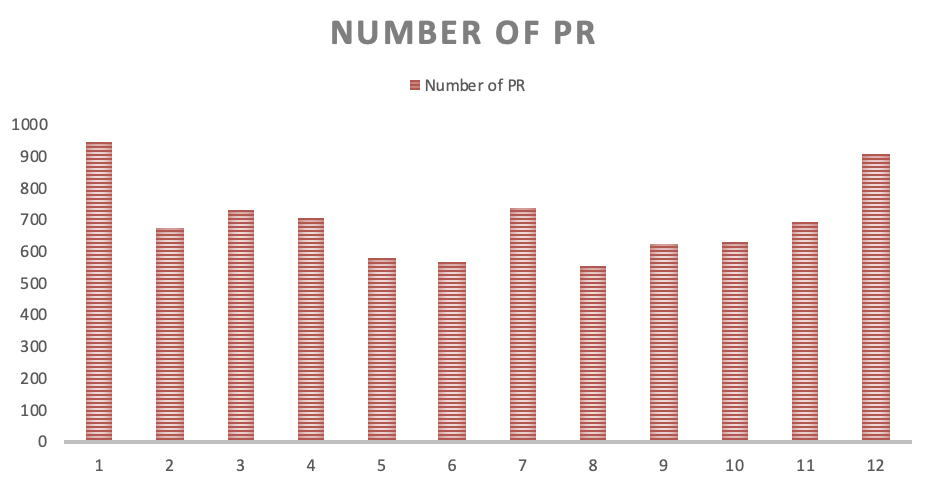
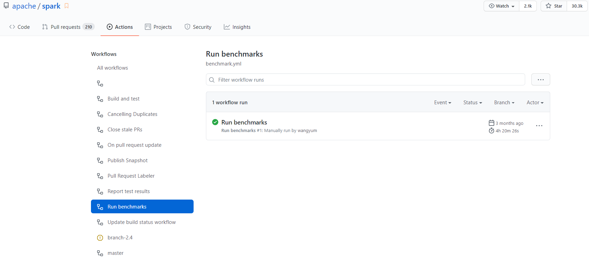

# 基础统计数据分析、可视化

Apache Spark是一个为实时大数据分析所设计的开源数据处理引擎，它是一个开源的分布式通用集群计算框架，它为整个集群的编程提供了一个接口，具有隐含的数据并行性和容错性。目前Spark的大用户有雅虎、腾讯和百度，使用Spark处理的数据在PB级别，集群节点数目也超过8000。Apache Spark是GitHub上最大的数据处理项目之一，有超过750名开发人员都曾对项目做出过贡献。

从总体数据来看，2020年全年，Apache Spark事件日志数量总计约**191952**条，较 2019 年 **171628**条增长约 **11%**。下图为2015年到2020年Apache Spark的总体情况。

																2015-2020年Apache Spark项目的日志数量情况

根据所给Apache Spark项目2015-2020年的数据集进行分析，主要是2020年的数据集。

**分析方法**

## （1）每年的score总和

从score上来看，Apache Spark项目虽然每年的score呈下滑趋势，但是在2018-2020年间趋于稳定，并且保持在一个相对活跃的状态。

## （2）按月统计star数量

通过全年每月的star数量我们可以看出在7月份的时候，star的数量最多，全年总体趋于稳定，每月的平均值大概在380左右，项目的star数水平较高。

## （3）按月统计fork的数量

根据每月的fork数量我们可以看出平均值大约在260左右。针对整个Apache Spark项目来说，项目处于相对活跃的水平，用户的参与度也很高。

## （4）按小时统计commit的数量

根据每小时的commit数量的统计，我们发现用户在7点的时候commit的数量最多。剩下的事件提交数量都比较平均，大约在8000左右。

## （5）用户的贡献度

从图中我们可以看出大部分用户的贡献度都是在1左右，只有小部分的用户贡献度比较大。因此可以看出，在开源项目的贡献中，用户贡献的广度大，深度较小。

## （6）每周用户数量	

2020年Apache Spark项目的日志数量，按一周的分布来看，大家在周一至周五在项目上的贡献比较多，周六、周日贡献数量明显减少。

## （7）Apache Spark 的相关的repo_name

# 开发者数据统计、可视化

## （1）2020年开发者账号活跃度统计

​	图2.1 Spark 2020年开发者账号活跃度统计 Top 10

​	在2020年中，开发活跃度排前两名的开发者分别来自UCB AMPLab实验室，Spark。其中AmplabJenkins开发者（来自UCB AMPLab实验室）对全年活跃度快到24900，SparkQA的活跃度超过18899，说明Spark项目主要还是由Spark项目组的人在开发、维护。前五名中其余的开发者来自Apache Software Foundation，说明Apache项目组对Spark的开发也很重视，活跃度都在5676以上。除了项目组，个人开发者对Spark开发的参与也比较多，活跃度都超过了1850，并且参与了超过600次issue commit和review commit。

## （2）开发者工作时间分布

​    图2.2 Spark 2020年日志时间分布（按周统计）

​	从图中可以看出，周一到周五，开发者都在密集进行开发工作，而周六、周天的日志明显少于工作日，event数量不到工作日的一半。说明Spark项目的开发者主要在工作日工作，周末只有部分加班情况。

​	图2.3 Spark 2020年日志时间分布（按时段统计）

​	从图中可以看出，一天内24小时都有开发者在勤奋的工作着。这说明Spark的开发者来自世界各地，所以每个时段的新添开发日志次数才没有太大差异。其中06:00-08:00是新添的开发日志激增的时段，可能是对全球大多数开发者都属于工作时间的时段。20:00-22:00时段内新添的开发日志相比于其他时段较少，说明这时段有一大部分开发者处于休息状态。

## （3）开发者使用语言分布

​	图2.4 Spark开发者使用语言分布

​	从图中可以看出，大多数开发者使用Scala语言对Spark进行开发，占比超过了65%。Python, Jupyter NoteBook, Java一共占了约28%，还有占比3.3%的HiveQL和2.2%的R语言，以及1.8%的其他编程语言。说明Spark编程用到的编程语言种类较丰富，擅长不同编程语言的开发者在为Spark项目添砖加瓦。

# 关联数据分析

## （1）名称及功能相关项目

在首页搜索 spark，搜索条件为 Best match， 我们可以发现，仓库名称或者 README 中包含 spark 的仓库多达 99242个。当然，因为 spark 本身便是一个有现实含义的单词，所以其中会有许多与 apache/spark 并不相关的项目。

我们知道，spark 本身是用 scala 编写而成的，同时又可以通过 Java、Python、Scala 等语言编写 spark 的应用程序。因此通过编程语言条目下的搜索结果，我们也可以发现有大于 50000 个项目是关于 spark 的。

通过搜索的 Topics 条目，我们可以发现 Apache Spark 条目下有 5.8k 个仓库，这进一步验证了我们根据编程语言检索所得到的结论。

## （2）相关项目的分析

### 相关项目

我们在 Apache Spark 的 Topics 下，仍按照 Best match 来检索，得到出现如下项目。

| 序号 | 项目名称                                     |
| ---- | -------------------------------------------- |
| 1    | apache                                       |
| 2    | apache / spark                               |
| 3    | donnemartin / data-science-ipython-notebooks |
| 4    | getredash / redash                           |
| 5    | yeasy / docker_practice                      |
| 6    | eclipse / deeplearning4j                     |
| 7    | aalansehaiyang / technology-talk             |
| 8    | horovod / horovod                            |
| 9    | cube-js / cube.js                            |
| 10   | zhisheng17 / flink-learning                  |
| 11   | heibaiying / BigData-Notes                   |
| 12   | FavioVazquez / ds-cheatsheets                |
| 13   | thingsboard / thingsboard                    |
| 14   | itdevbooks / pdf                             |
| 15   | Angel-ML / angel                             |
| 16   | donnemartin / dev-setup                      |
| 17   | h2oai / h2o-3                                |
| 18   | apache / zeppelin                            |
| 19   | Alluxio / alluxio                            |
| 20   | wangzhiwubigdata / God-Of-BigData            |
| 21   | PipelineAI / pipeline                        |
| 22   | intel-analytics / BigDL                      |
| 23   | yahoo / TensorFlowOnSpark                    |
| 24   | delta-io / delta                             |
| 25   | lw-lin / CoolplaySpark                       |
| 26   | spark-notebook / spark-notebook              |
| 27   | Cyb3rWard0g / HELK                           |
| 28   | databricks / koalas                          |
| 29   | spark-jobserver / spark-jobserver            |
| 30   | douban / dpark                               |
| 31   | Azure / mmlspark                             |

### 相关项目介绍

首先根据项目本身的描述，我们可以发现 [7, 11, 14, 20, 25] 均为国人分享的学习笔记以及技术类总结，[12] 是外国人的学习清单。同时，github 检索的得到的这些仓库在根据 match 的限制下，也是按照 star 数来排序的。我们不去分析此类项目。

接着，我们简单介绍下我们认为与spark较为相关的项目。

项目[2]，数据科学 ipython-notebooks：深度学习（TensorFlow、Theano、Caffe、Keras）、scikit学习、Kaggle、大数据（Spark、Hadoop MapReduce、HDFS）、matplotlib、pandas、NumPy、SciPy、Python essentials、AWS和各种命令行。[3]，使您的公司数据驱动。连接到任何数据源，易于可视化，仪表板和共享您的数据。可以连接到spark数据源。[4]，学习和理解Docker技术，与真正的DevOps实践！其中应该有 Spark 的镜像。pipelineAI/pipeline, 其中机器学习的 pipeline 就是包含起到数据清洗作用的 spark。英特尔的 BigDL 与spark的关系则更为密切，这是一个基于Apache Spark 的分布式深度学习框架 。TensorFlowOnSpark则与上个项目类似，将TensorFlow程序引入Apache Spark集群。databricks公司的 koalas，则是 pandas 在 Apache Spark 上的 API。豆瓣的 dpark 是 Spark 的 Python 克隆版本，一个 Python 中类似 MapReduce 的框架。

# 项目的日常协作流程调研

项目的日常协作如果能够遵循规范要求，将会大大方便项目的参与和推广。因此，需要对此项目的协作流程进行分析。

## （1）测试的流程

在日常的开发流程中，涉及开发新功能、分支合并、发布新版本以及发布紧急的修复版本等操作。需要测试的功能有很多，因此要有一套完整的测试流程。

Apache Spark 利用 GitHub Actions 实现持续集成和广泛的自动化。Apache Spark 存储库提供了多个 GitHub 操作工作流，供开发人员在创建拉取请求之前运行。

在 Apache Spark 中创建拉取请求之前，请务必检查测试是否可以通过自己的分支，因为我们的 GitHub Acrions 工作流程会自动为拉取请求/后续提交运行测试，并且每次运行都会增加 Apache Spark 中 GitHub Actions 的有限资源存储库。

Apache Spark 存储库具有一个工作流，能够对自己的分叉存储库中的分支运行相同的测试，该分支不会对 Apache Spark 存储库的资源造成负担。

Apache Spark 存储库提供了一种在 GitHub Actions 中运行基准测试的简单方法。当在拉取请求中更新基准测试结果时，建议使用 GitHub Actions 运行并生成基准测试结果，以便尽可能在相同的环境中运行它们。

## （2）错误报告的使用

理想情况下，错误报告伴随着提交的代码更改以修复错误。这并不总是可行的，因为发现错误的人可能没有修复它的经验。通过创建 JIRA 但不创建拉取请求可能会报告错误。

但是，错误报告只有在包含足够的信息来理解、隔离和理想地重现错误时才有用。仅仅遇到错误并不意味着应该报告错误；如下，先搜索JIRA，在Spark user/dev邮件列表中搜索查询。无法重现的错误或简单的错误报告可能会被关闭。

如果 bug 报告中有关于 bug 是如何引入的、通过哪个提交的描述，这将非常有帮助，这样contributor可以很容易地了解 bug。它还可以帮助提交者决定在合并拉取请求时应该向后移植 bug 修复多远。修复错误的拉取请求应该将问题缩小到根本原因。

## （3）提交信息的规范

- 在提交的时候，尽可能使用清晰的文字来描述提交信息。
- 如果有更改，您可以指出解决了问题
  - 设置修复版本，当且仅当分辨率是固定的
  - 将受让人设置为对解决方案做出最大贡献的人，通常是打开解决问题的 PR 的人。
  - 如果有几个人贡献，更愿意分配给更“初级”的非提交者贡献者
- 对于所报告的无法针对 master 重现的问题，请解决为无法重现
  - 修复也是合理的，如果很清楚其他先前的拉取请求解决了它。链接到它。
- 如果问题与另一个问题相同或属于另一个问题，则解决为重复
  - 确保链接到它复制的 JIRA
  - 优先解决活动或讨论较少的问题作为副本
- 如果问题显然已经过时并且适用于自打开以来发生了根本性变化的问题或组件，则将其解决为“**不是问题”**
- 如果问题没有意义 - 不可操作，例如，非 Spark 问题，则解决为**无效**
- 如果这是一个连贯的问题，但有明确的迹象表明没有人支持或没有兴趣对其采取行动，则解决为**Won't Fix**
- 如果只是容器问题而不对应于它们自己的可操作更改，它们通常会被标记为**“完成”**

# 开发者参与流程数据与调研

（1）2020年内Spark项目中，按月总结开发强度

​														图2.1 2020年内Spark项目每月的pr数

​	从图中看出，1月和12月内产生的pr事件最多。也许是因为到了年底，项目开发需求比其他月份更多。5-6月内提交的pr数只有500多条，约是1月的2/3。在7月，pr事件数量又增长到接近800条。从图中看，开发的一个周期大约是半年左右。

（2）2020年内Spark项目中，各种类型的开发者着重处理哪些开发问题

​														图2.2 对2020年间开发中日志事件以及发起者的统计

​	从图中可以看出，日志事件最多的是对于issue的讨论，主要发起者是来自UCB AMPLab实验室的AmplabJenkins。日志事件中对于代码的review的占比也很大，而Push，CommitComment的占比并没有那么大，说明项目管理者们对于的代码开发管理比较谨慎，需要review、修改很多遍后才会merge代码。开发者cserlb发起了很多ForkEvent，他应该是开发的很重要的贡献者。

（3）Spark项目中最被关注的issue

​														图2.3  2020年Spark开发过程中开发者最关注的前20个issue

​	从图中可以看出，开发者其中开发者最关注的问题多数是和SQL有关的问题，也有和python编程，Shuffle有关的问题。由cchighman账号提出的和SQL相关的开发问题，讨论量超过580个。排10到20名的issue的讨论量也多达200多个，说明开发者在开发的过程中经过了很多交流。

## 贡献代码流程

1. 如果你还没有，请将Github仓库https://github.com/apache/spark fork一下。
2. 克隆你的分支，创建一个新的分支，将提交推送到该分支。
3. 考虑是否需要添加或更新文档或测试作为修改的一部分，并根据需要添加它们。
4. 用./dev/run-tests运行所有测试，以验证代码是否仍能编译、通过测试和通过样式检查。如果样式检查失败，请查看下面的《代码样式指南》。
5. 针对apache/spark的主分支开启一个拉取请求。(只有在特殊情况下，才会针对其他分支打开PR。)
   1. PR的标题应该是[SPARK-xxxx][COMPONENT]的形式，其中SPARK-xxxx是相关的JIRA编号，COMPONENT是spark-prs.appspot.com上显示的PR类别之一，Title可以是JIRA的标题或描述PR本身的更具体的标题。
   2. 如果拉动请求仍然是一个正在进行的工作，因此还没有准备好被合并，但需要被推送到Github以方便审查，那么在组件后面添加[WIP]。
   3. 考虑确定提交者或其他贡献者，他们曾在被修改的代码上工作过。在Github中找到该文件，点击 "责备"，可以看到逐行注释谁最后修改了该代码。你可以在PR描述中加入@用户名，以便立即与他们联系。
   4. 请说明该贡献是你的原创作品，并且你根据项目的开源许可将该作品授权给项目。
6. 相关的JIRA（如果有的话）将被标记为 "进行中"，你的拉动请求将被自动链接到它。不需要成为JIRA的受让人就可以进行工作，尽管欢迎你评论说你已经开始工作。
7. Jenkins的自动拉动请求生成器将测试你的改动
   1. 如果这是你的第一次贡献，Jenkins会在构建你的代码之前等待确认，并发布 "管理员之一可以验证这个补丁吗？"
   2. 提交者可以用 "ok to test "这样的注释来授权测试。
   3. 提交人可以用 "Jenkins，添加到白名单 "这样的注释来自动允许贡献者未来的拉取请求被测试。
8. 大约2个小时后，Jenkins会将测试结果发布到拉动请求上，并附上Jenkins上全部结果的链接。
9. 观察结果，并及时调查和修复故障
   1. 修复可以简单地推送到你打开拉动请求的同一分支上
   2. 当新的提交被推送时，Jenkins会自动重新测试
   3. 如果测试失败的原因与变更无关（比如Jenkins停工），那么提交者可以用 "Jenkins，请重新测试 "来请求重新测试。询问是否需要重启测试。如果你之前被提交者以 "Jenkins，添加到白名单 "的方式添加，你也可以要求重新测试。
10. 如果你的拉动请求中有与SparkR相关的变化，AppVeyor将自动触发，在Windows上测试SparkR，这大约需要一个小时。与上面的步骤类似，修复故障并推送新的提交，这将在AppVeyor中请求重新测试。

# 项目的CI/CD流程调研

## 介绍

持续集成和持续交付（CI/CD）是指通过使用自动化管道在短时间内频繁开发和交付软件的过程。虽然这绝不是一个新的过程，几十年来在传统的软件工程中无处不在，但它正成为数据工程和数据科学团队越来越必要的一个过程。为了使数据产品具有价值，它们必须及时交付。此外，消费者必须对这些产品中的结果的有效性有信心。通过自动构建、测试和部署代码，开发团队能够比许多数据工程和数据科学团队中仍然普遍存在的手动流程更频繁、更可靠地交付版本。

持续集成开始于让你以一定的频率提交你的代码到源代码库的一个分支的做法。每次提交都会与其他开发者的提交进行合并，以确保没有冲突出现。通过创建一个构建，并针对该构建运行自动测试，进一步验证更改。这个过程最终会产生一个工件或部署包，最终会被部署到目标环境中。

Spark 的商业母公司是 databricks，无线上服务版本，因此不需要持续部署。

## 使用 GitHub Action workflow 进行测试

Apache Spark 利用 GitHub Actions 实现持续集成和广泛的自动化。Apache Spark 仓库提供了一些 GitHub Actions 工作流，开发人员可以在创建 pull 请求之前运行它们。在下图中可以看到仓库提供了丰富的工作流。

### 在你的 forked repository 中运行测试

在 Apache Spark 中创建一个 pull 请求之前，重要的是检查测试是否可以传递给您的分支，因为我们的 GitHub Acrions 工作流会自动运行对您的 pull 请求/后续提交的测试，而且每次运行都会加重 Apache Spark 存储库中 GitHub Actions 的有限资源负担。

Apache Spark 存储库具有一个工作流，使您能够对自己的分支存储库中的一个分支运行相同的测试，而不会对 Apache Spark 存储库中的资源造成负担。

例如，假设您有一个名为“ your _ branch”的分支来表示一个 pull 请求。在“ your _ branch”上运行测试并检查测试结果:

- 单击分支存储库中的“操作”选项卡。
- 在“ All workflows”列表中选择“ Build and test”工作流。
- 点击“运行工作流程”按钮，并在“目标分支运行”字段中输入“ your _ branch”。
- 一旦“构建和测试”工作流完成，单击“报告测试结果”工作流来检查测试结果。

### 在你的 forked repository中运行基准测试

Apache Spark 存储库提供了一种在 GitHub Actions 中运行基准测试的简单方法。当您在拉请求中更新基准测试结果时，建议使用 GitHub Actions 来运行并生成基准测试结果，以便在环境中尽可能地运行它们。

- 单击分支存储库中的“操作”选项卡。
- 在“所有工作流”列表中选择“运行基准”工作流。
- 单击“运行工作流程”按钮，按以下方式适当输入字段:
  - 基准类: 您希望运行的基准类。它允许一个 glob 模式。
  - JDK 版本: 您希望使用的 Java 版本运行基准测试。
  - Failfast: 指示您是否希望在基准测试和工作流失败时停止它。如果是真的，它立刻就失败了。当出错时，不管失败与否，它都会运行。
  - 作业拆分的数量: 它将基准作业拆分为指定的数量，并且并行地运行它们。在 GitHub Actions 中绕过工作流和作业的时间限制尤其有用。
- 一旦“运行基准测试”工作流完成，点击工作流并在“工件”下载基准测试结果。
- 转到 Apache Spark 存储库的根目录，解压/解压下载的文件，这些文件将通过适当地定位要更新的文件来更新基准测试结果。

