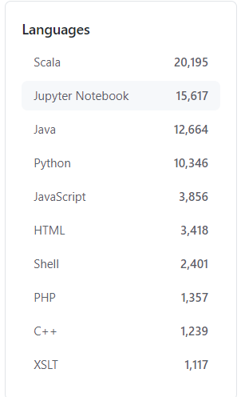
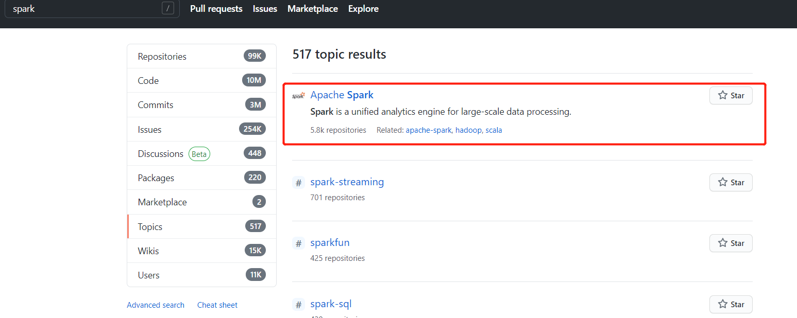

# 关联数据分析

## 名称及功能相关项目

在首页搜索 spark，搜索条件为 Best match， 我们可以发现，仓库名称或者 README 中包含 spark 的仓库多达 99242个。当然，因为 spark 本身便是一个有现实含义的单词，所以其中会有许多与 apache/spark 并不相关的项目。

我们知道，spark 本身是用 scala 编写而成的，同时又可以通过 Java、Python、Scala 等语言编写 spark 的应用程序。因此通过编程语言条目下的搜索结果，我们也可以发现有大于 50000 个项目是关于 spark 的。

通过搜索的 Topics 条目，我们可以发现 Apache Spark 条目下有 5.8k 个仓库，这进一步验证了我们根据编程语言检索所得到的结论。

## 相关项目的分析

### 相关项目

我们在 Apache Spark 的 Topics 下，仍按照 Best match 来检索，得到出现如下项目。

1. apache 
2. apache / spark
3. donnemartin / data-science-ipython-notebooks
4. getredash / redash
5. yeasy / docker_practice
6. eclipse / deeplearning4j
7. aalansehaiyang / technology-talk
8. horovod / horovod
9. cube-js / cube.js
10. zhisheng17 / flink-learning
11. heibaiying / BigData-Notes
12. FavioVazquez / ds-cheatsheets
13. thingsboard / thingsboard
14. itdevbooks / pdf
15. Angel-ML / angel
16. donnemartin / dev-setup
17. h2oai / h2o-3
18. apache / zeppelin
19. Alluxio / alluxio
20. wangzhiwubigdata / God-Of-BigData
21. PipelineAI / pipeline
22. intel-analytics / BigDL
23. yahoo / TensorFlowOnSpark
24. delta-io / delta
25. lw-lin / CoolplaySpark
26. spark-notebook / spark-notebook
27. Cyb3rWard0g / HELK
28. databricks / koalas
29. spark-jobserver / spark-jobserver
30. douban / dpark
31. Azure / mmlspark

### 相关项目介绍

首先根据项目本身的描述，我们可以发现 [7, 11, 14, 20, 25] 均为国人分享的学习笔记以及技术类总结，[12] 是外国人的学习清单。同时，github 检索的得到的这些仓库在根据 match 的限制下，也是按照 star 数来排序的。我们不去分析此类项目。

接着，我们简单介绍下我们认为与spark较为相关的项目。

项目[2]，数据科学 ipython-notebooks：深度学习（TensorFlow、Theano、Caffe、Keras）、scikit学习、Kaggle、大数据（Spark、Hadoop MapReduce、HDFS）、matplotlib、pandas、NumPy、SciPy、Python essentials、AWS和各种命令行。[3]，使您的公司数据驱动。连接到任何数据源，易于可视化，仪表板和共享您的数据。可以连接到spark数据源。[4]，学习和理解Docker技术，与真正的DevOps实践！其中应该有 Spark 的镜像。pipelineAI/pipeline, 其中机器学习的 pipeline 就是包含起到数据清洗作用的 spark。英特尔的 BigDL 与spark的关系则更为密切，这是一个基于Apache Spark 的分布式深度学习框架 。TensorFlowOnSpark则与上个项目类似，将TensorFlow程序引入Apache Spark集群。databricks公司的 koalas，则是 pandas 在 Apache Spark 上的 API。豆瓣的 dpark 是 Spark 的 Python 克隆版本，一个 Python 中类似 MapReduce 的框架。

