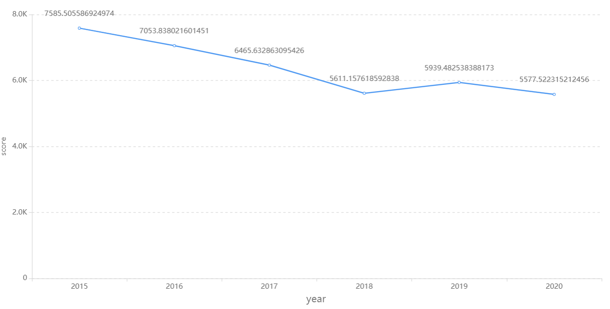
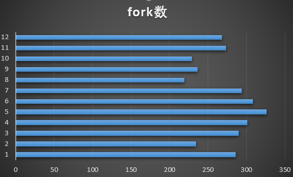
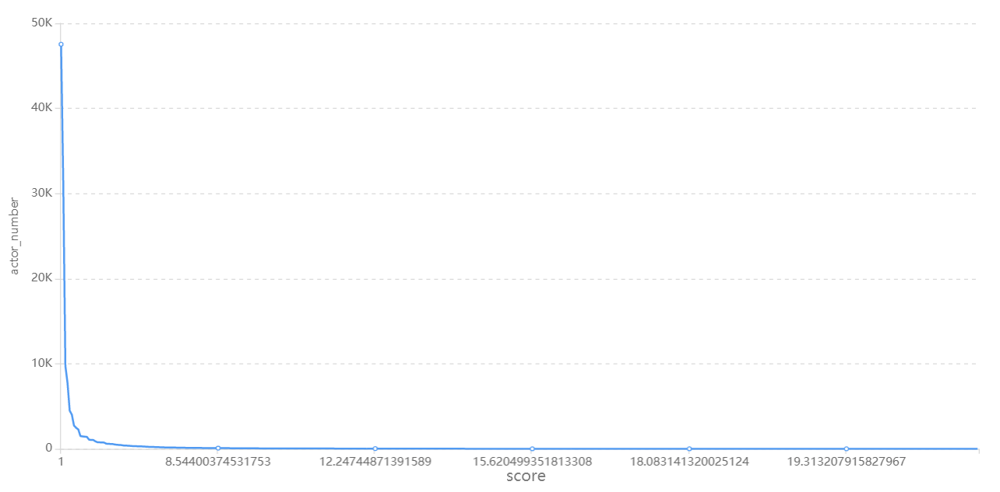
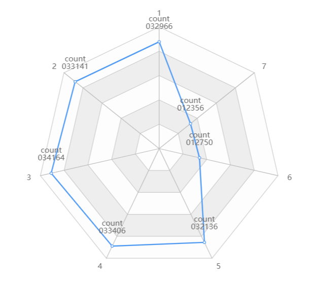
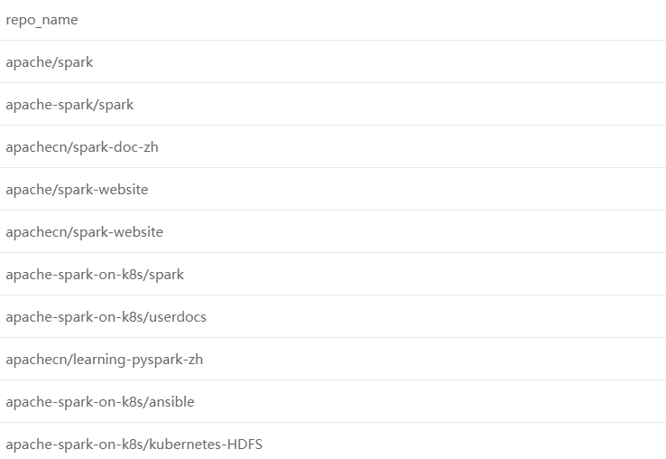

## **1、基础统计数据分析、可视化**

Apache Spark是一个为实时大数据分析所设计的开源数据处理引擎，它是一个开源的分布式通用集群计算框架，它为整个集群的编程提供了一个接口，具有隐含的数据并行性和容错性。目前Spark的大用户有雅虎、腾讯和百度，使用Spark处理的数据在PB级别，集群节点数目也超过8000。Apache Spark是GitHub上最大的数据处理项目之一，有超过750名开发人员都曾对项目做出过贡献。

从总体数据来看，2020年全年，Apache Spark事件日志数量总计约**191952**条，较 2019 年 **171628**条增长约 **11%**。下图为2015年到2020年Apache Spark的总体情况。

																2015-2020年Apache Spark项目的日志数量情况

根据所给Apache Spark项目2015-2020年的数据集进行分析，主要是2020年的数据集。

**分析方法**

（1）每年的score总和

从score上来看，Apache Spark项目虽然每年的score呈下滑趋势，但是在2018-2020年间趋于稳定，并且保持在一个相对活跃的状态。

（2）按月统计star数量

通过全年每月的star数量我们可以看出在7月份的时候，star的数量最多，全年总体趋于稳定，每月的平均值大概在380左右，项目的star数水平较高。

（3）按月统计fork的数量

根据每月的fork数量我们可以看出平均值大约在260左右。针对整个Apache Spark项目来说，项目处于相对活跃的水平，用户的参与度也很高。

（4）按小时统计commit的数量

根据每小时的commit数量的统计，我们发现用户在7点的时候commit的数量最多。剩下的事件提交数量都比较平均，大约在8000左右。

（7）用户的贡献度

从图中我们可以看出大部分用户的贡献度都是在1左右，只有小部分的用户贡献度比较大。因此可以看出，在开源项目的贡献中，用户贡献的广度大，深度较小。

（8）每周用户数量	

2020年Apache Spark项目的日志数量，按一周的分布来看，大家在周一至周五在项目上的贡献比较多，周六、周日贡献数量明显减少。

（9）Apache Spark 的相关的repo_name

