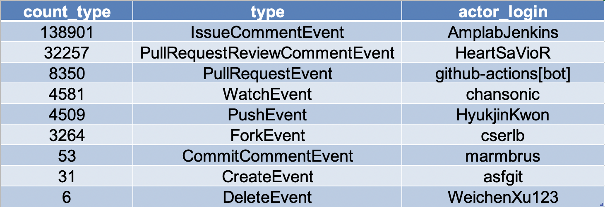

## 开发者参与流程调研
（1）2020年内Spark项目中，按月总结开发强度

​														图2.1 2020年内Spark项目每月的pr数

​	从图中看出，1月和12月内产生的pr事件最多。也许是因为到了年底，项目开发需求比其他月份更多。5-6月内提交的pr数只有500多条，约是1月的2/3。在7月，pr事件数量又增长到接近800条。从图中看，开发的一个周期大约是半年左右。

（2）2020年内Spark项目中，各种类型的开发者着重处理哪些开发问题

​														图2.2 对2020年间开发中日志事件以及发起者的统计

​	从图中可以看出，日志事件最多的是对于issue的讨论，主要发起者是来自UCB AMPLab实验室的AmplabJenkins。日志事件中对于代码的review的占比也很大，而Push，CommitComment的占比并没有那么大，说明项目管理者们对于的代码开发管理比较谨慎，需要review、修改很多遍后才会merge代码。开发者cserlb发起了很多ForkEvent，他应该是开发的很重要的贡献者。

（3）Spark项目中最被关注的issue

​														图2.3  2020年Spark开发过程中开发者最关注的前20个issue

​	从图中可以看出，开发者其中开发者最关注的问题多数是和SQL有关的问题，也有和python编程，Shuffle有关的问题。由cchighman账号提出的和SQL相关的开发问题，讨论量超过580个。排10到20名的issue的讨论量也多达200多个，说明开发者在开发的过程中经过了很多交流。

