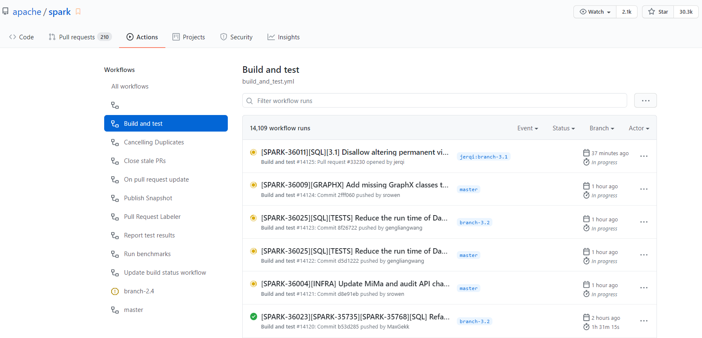

# 项目的CI/CD流程调研

## 介绍

持续集成和持续交付（CI/CD）是指通过使用自动化管道在短时间内频繁开发和交付软件的过程。虽然这绝不是一个新的过程，几十年来在传统的软件工程中无处不在，但它正成为数据工程和数据科学团队越来越必要的一个过程。为了使数据产品具有价值，它们必须及时交付。此外，消费者必须对这些产品中的结果的有效性有信心。通过自动构建、测试和部署代码，开发团队能够比许多数据工程和数据科学团队中仍然普遍存在的手动流程更频繁、更可靠地交付版本。

持续集成开始于让你以一定的频率提交你的代码到源代码库的一个分支的做法。每次提交都会与其他开发者的提交进行合并，以确保没有冲突出现。通过创建一个构建，并针对该构建运行自动测试，进一步验证更改。这个过程最终会产生一个工件或部署包，最终会被部署到目标环境中。

Spark 的商业母公司是 databricks，无线上服务版本，因此不需要持续部署。

## 使用 GitHub Action workflow 进行测试

Apache Spark 利用 GitHub Actions 实现持续集成和广泛的自动化。Apache Spark 仓库提供了一些 GitHub Actions 工作流，开发人员可以在创建 pull 请求之前运行它们。在下图中可以看到仓库提供了丰富的工作流。

### 在你的 forked repository 中运行测试

在 Apache Spark 中创建一个 pull 请求之前，重要的是检查测试是否可以传递给您的分支，因为我们的 GitHub Acrions 工作流会自动运行对您的 pull 请求/后续提交的测试，而且每次运行都会加重 Apache Spark 存储库中 GitHub Actions 的有限资源负担。

Apache Spark 存储库具有一个工作流，使您能够对自己的分支存储库中的一个分支运行相同的测试，而不会对 Apache Spark 存储库中的资源造成负担。

例如，假设您有一个名为“ your _ branch”的分支来表示一个 pull 请求。在“ your _ branch”上运行测试并检查测试结果:

- 单击分支存储库中的“操作”选项卡。
- 在“ All workflows”列表中选择“ Build and test”工作流。
- 点击“运行工作流程”按钮，并在“目标分支运行”字段中输入“ your _ branch”。
- 一旦“构建和测试”工作流完成，单击“报告测试结果”工作流来检查测试结果。

### 在你的 forked repository中运行基准测试

Apache Spark 存储库提供了一种在 GitHub Actions 中运行基准测试的简单方法。当您在拉请求中更新基准测试结果时，建议使用 GitHub Actions 来运行并生成基准测试结果，以便在环境中尽可能地运行它们。

- 单击分支存储库中的“操作”选项卡。
- 在“所有工作流”列表中选择“运行基准”工作流。
- 单击“运行工作流程”按钮，按以下方式适当输入字段:
  - 基准类: 您希望运行的基准类。它允许一个 glob 模式。
  - JDK 版本: 您希望使用的 Java 版本运行基准测试。
  - Failfast: 指示您是否希望在基准测试和工作流失败时停止它。如果是真的，它立刻就失败了。当出错时，不管失败与否，它都会运行。
  - 作业拆分的数量: 它将基准作业拆分为指定的数量，并且并行地运行它们。在 GitHub Actions 中绕过工作流和作业的时间限制尤其有用。
- 一旦“运行基准测试”工作流完成，点击工作流并在“工件”下载基准测试结果。
- 转到 Apache Spark 存储库的根目录，解压/解压下载的文件，这些文件将通过适当地定位要更新的文件来更新基准测试结果。

## 贡献代码

1. 如果你还没有，请将Github仓库分叉到https://github.com/apache/spark。
2. 克隆你的分支，创建一个新的分支，将提交推送到该分支。
3. 考虑是否需要添加或更新文档或测试作为修改的一部分，并根据需要添加它们。
4. 用./dev/run-tests运行所有测试，以验证代码是否仍能编译、通过测试和通过样式检查。如果样式检查失败，请查看下面的《代码样式指南》。
5. 针对apache/spark的主分支开启一个拉取请求。(只有在特殊情况下，才会针对其他分支打开PR。)
   1. PR的标题应该是[SPARK-xxxx][COMPONENT]的形式，其中SPARK-xxxx是相关的JIRA编号，COMPONENT是spark-prs.appspot.com上显示的PR类别之一，Title可以是JIRA的标题或描述PR本身的更具体的标题。
   2. 如果拉动请求仍然是一个正在进行的工作，因此还没有准备好被合并，但需要被推送到Github以方便审查，那么在组件后面添加[WIP]。
   3. 考虑确定提交者或其他贡献者，他们曾在被修改的代码上工作过。在Github中找到该文件，点击 "责备"，可以看到逐行注释谁最后修改了该代码。你可以在PR描述中加入@用户名，以便立即与他们联系。
   4. 请说明该贡献是你的原创作品，并且你根据项目的开源许可将该作品授权给项目。
6. 相关的JIRA（如果有的话）将被标记为 "进行中"，你的拉动请求将被自动链接到它。不需要成为JIRA的受让人就可以进行工作，尽管欢迎你评论说你已经开始工作。
7. Jenkins的自动拉动请求生成器将测试你的改动
   1. 如果这是你的第一次贡献，Jenkins会在构建你的代码之前等待确认，并发布 "管理员之一可以验证这个补丁吗？"
   2. 提交者可以用 "ok to test "这样的注释来授权测试。
   3. 提交人可以用 "Jenkins，添加到白名单 "这样的注释来自动允许贡献者未来的拉取请求被测试。
8. 大约2个小时后，Jenkins会将测试结果发布到拉动请求上，并附上Jenkins上全部结果的链接。
9. 观察结果，并及时调查和修复故障
   1. 修复可以简单地推送到你打开拉动请求的同一分支上
   2. 当新的提交被推送时，Jenkins会自动重新测试
   3. 如果测试失败的原因与变更无关（比如Jenkins停工），那么提交者可以用 "Jenkins，请重新测试 "来请求重新测试。询问是否需要重启测试。如果你之前被提交者以 "Jenkins，添加到白名单 "的方式添加，你也可以要求重新测试。
10. 如果你的拉动请求中有与SparkR相关的变化，AppVeyor将自动触发，在Windows上测试SparkR，这大约需要一个小时。与上面的步骤类似，修复故障并推送新的提交，这将在AppVeyor中请求重新测试。