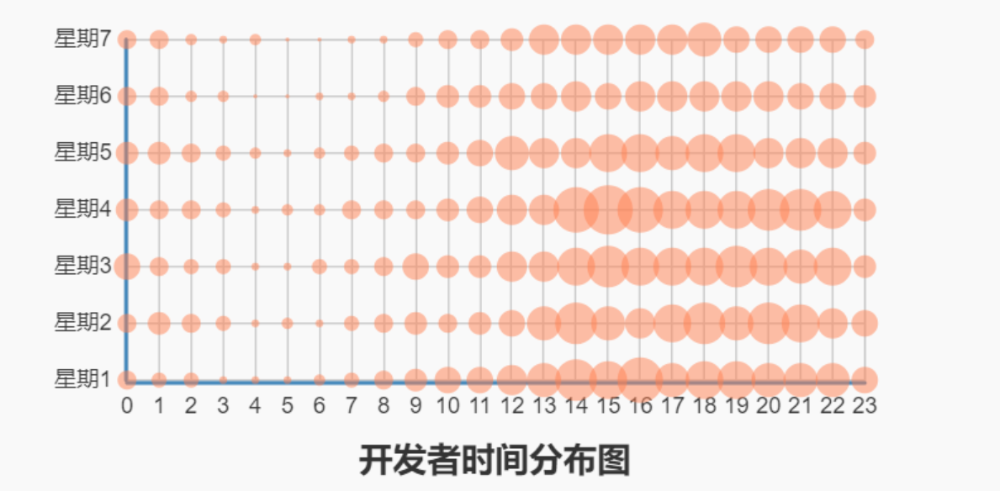
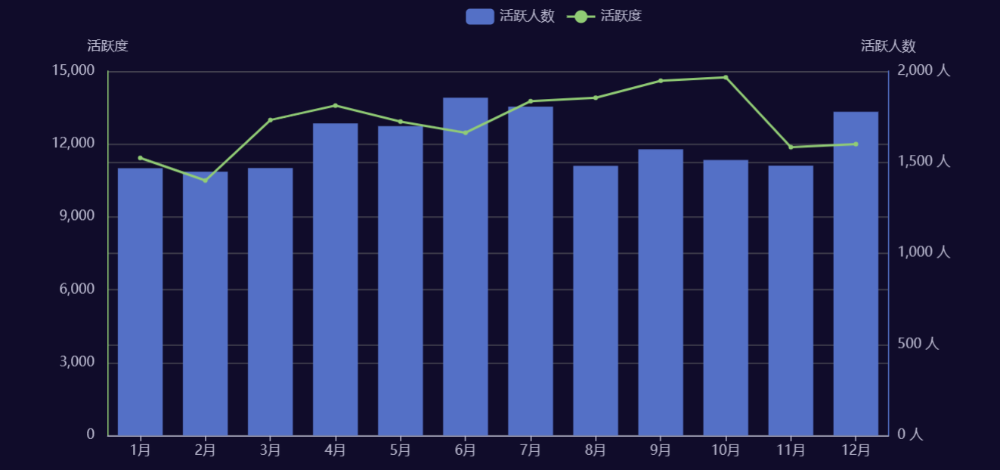
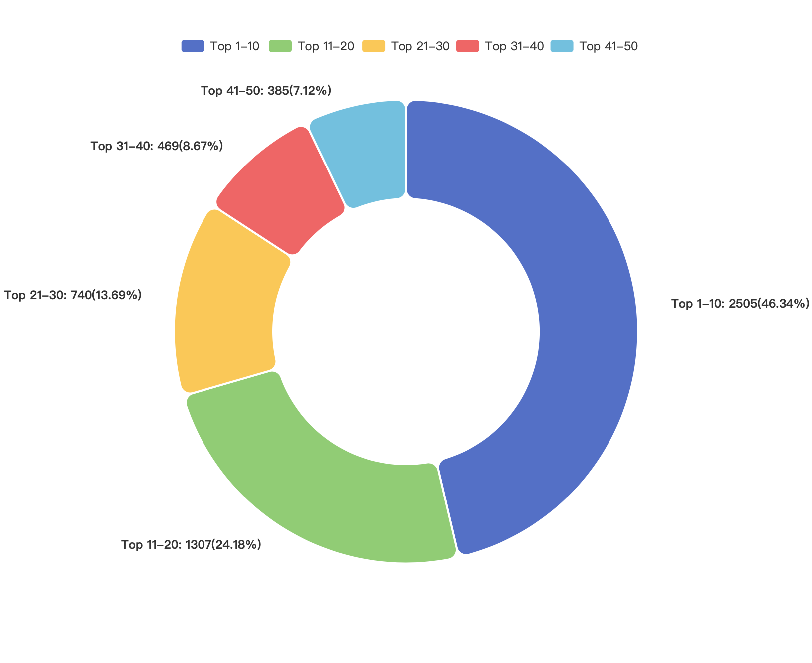
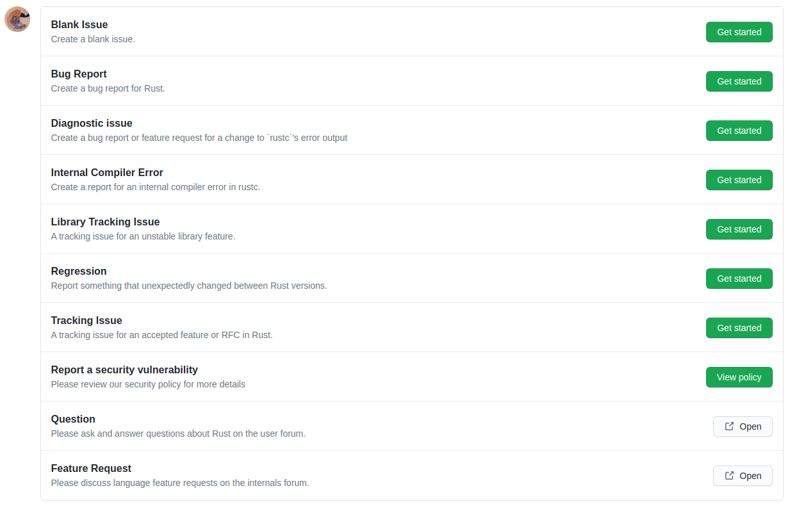
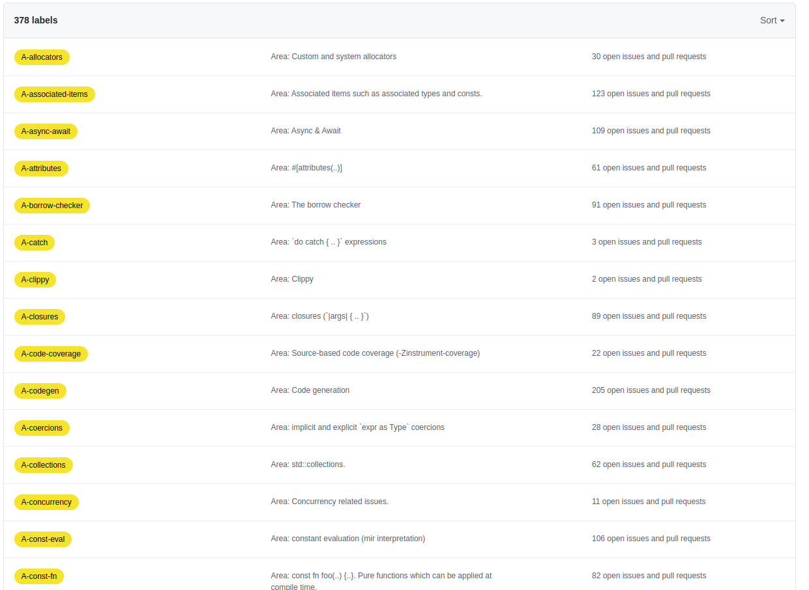
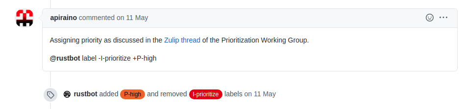
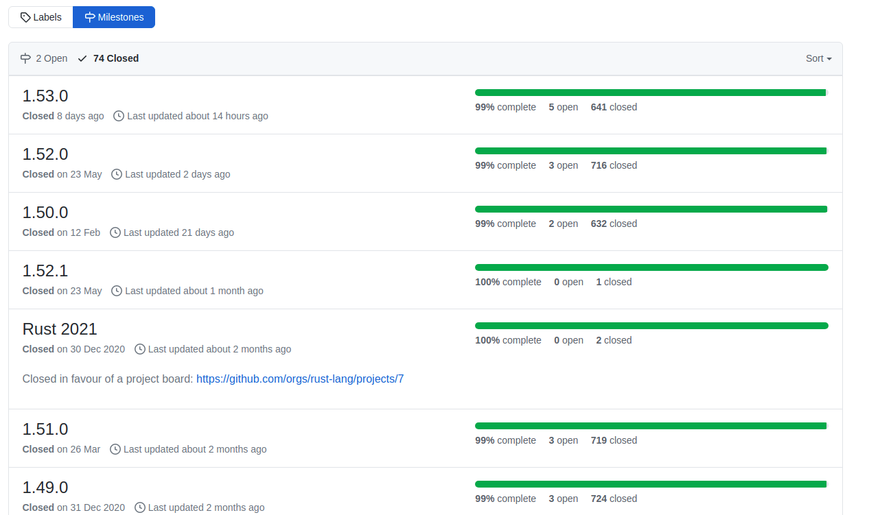
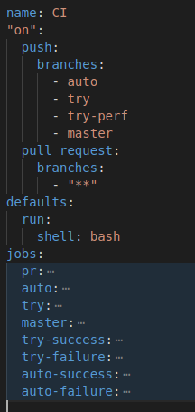
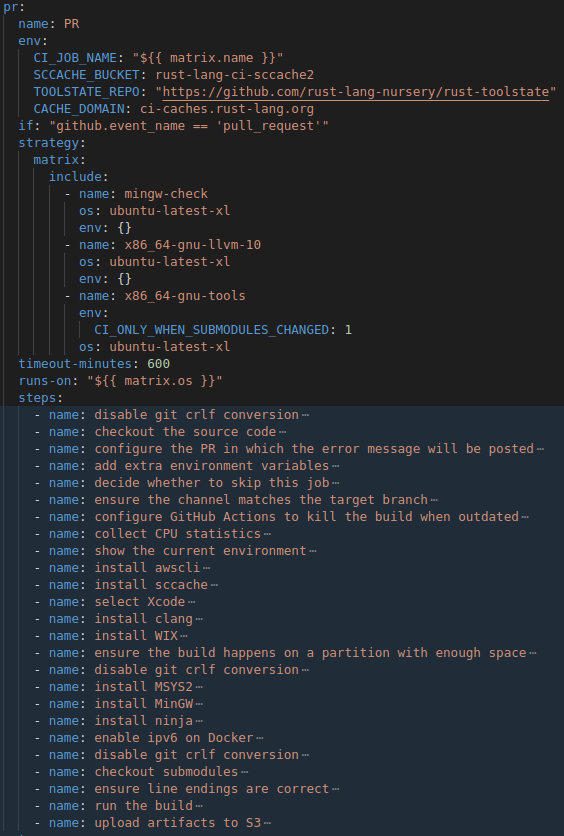

## 数据分析
### 开发者时间分布图

上述图统计分析了GitHub上Rust项目日志的时间分布情况，采用打孔图，横轴代表一天中24小时，纵轴代表星期一到星期日，圆点大小代表某时产生的日志数量。
我们可以发现，一天 24 小时中，12:00-22:00 相对活跃，其中，14:00-21:00 最为突出；同时，与我们全域日志时间分布情况相比，18:00-22:00相对更为活跃；周六、周日为休息日，日志数量有所减少。
另一方面，在我们统计了GitHub 上 Apps 的日志时间分布情况时，发现Rust项目几乎没有或者说很少使用机器人。

### 2020年月活跃度与活跃人数变化图

活跃人数最多达到1854人，活跃度最高达到14741。总体来说，每个月的活跃人数都在1400以上，vscode项目的月活跃人数在4000人左右，相比较Rust项目的活跃人数较少。Rust项目的平均活跃度为12895，从图中可以看出，活跃度相对稳定，在十月份的时候活跃度有个小高峰。

## 2020年Rust项目PR贡献者Top50饼图

该饼图展示了Rust项目在2020年中，提交PR最高的50位贡献者每十人一组分成五组后，每组提交PR在所有Top50开发者PR中的占比。一个活跃且健康的开源社区项目，应该是大家一起参与，并且有几位作为领导者，引领项目的发展。显而易见，Rust就是这样优秀的开源项目，Top10的开发者占据了将近一半，但其余几组的开发者也有较高的贡献数。值得一提的是，图上没有展示剩下所有开发者的PR数量，其余所有开发者的PR数量是2300+，也是非常亮眼的数据。

## 2020年Rust开发者相关仓库统计表
| 相关动作数 | 相关仓库 |
| ---- | ---- |
| 123387        | rust-lang/crates.io-index             |
| 69531         | hackerkid/zulip-archive-action-test-2 |
| 58410         | nainardev/tamil-dubbed                |
| 51927         | opentimestamps/nist-inject            |
| 23665         | godotengine/godot                     |
| 22859         | NixOS/nixpkgs                         |
| 22445         | 19h/heartbeat                         |
| 21117         | paritytech/substrate                  |
| 19324         | rust-analyzer/rust-analyzer           |
## 流程分析
### issue协作
rust 项目针对issue有着10种形式，如下图所示。包括了空issue，bug报告，追踪某个不稳定的库，甚至是提供别的平台社区进行问答等。可以看到它的issue形式非常丰富，涵盖了各个开发者的几乎所有可能的issue形式，方便开发者进行issue，这些issue形式为社区形成良好的issue氛围奠定了基础。

另一方面，rust项目为issue提供了多样化的标签。如下图所示，rust项目提供了多达378种label为issue打标签，同时rust社区用了十多种标签颜色对标签进行分类，从而也对issue分类提供了帮助,例如以A为前缀的黄色标签说明问题与项目的哪个区域相关，带 E 前缀的绿色标签解释了解决问题所需的经验水平。这些标签方便了开发者快速检索以及快速识别问题所在，在一定程度上能够减少issue响应时间以及issue解决时间。

同时，上述这种打标签的方式社区通过配置rustbot来一起协助完成。如下图所示，开发者可以通过@rustbot进行自动的标签添加与删除，另外，rustbot对于新开的issue也会自动识别相应的标签并进行标记。

针对版本发布，rust项目使用issue 下面的Milestones进行追踪，每一个待发布的版本下面都有一些issue对应，这样大大方便了社区内的开发者相互协作解决这些issue，快速定位待发布版本的问题，有助于版本的快速迭代。

### PR协作
rust项目使用“fork-pull”的形式进行协作，针对pull request协作rust社区也有相应机器人@rust-highfive 来协助一些自动化操作，方便社区开发者们更加有效率地协作。例如，开发者可以在提出PR后，评论r? @steveklabnik，机器人就会将该PR分配给@steveklabnik进行review。与此同时，rust也集成了github CI用于对PR的自动测试，CI的具体情况下一节将具体阐述。在PR通过CI自动化测试以及reviewer审核后，reviewer可以评论@bors r+告诉机器人PR已经通过了。PR 然后进入合并队列，机器人将在支持的每个平台上运行所有测试。 如果一切顺利，机器人会将代码合并到 master 并关闭PR。
### CI流程
rust项目使用github action来完成CI测试，在ci.yml文件中定义了工作流。如下图所示，工作流主要对push与pull_request事件进行监听。对于push事件，主要对项目auto、try、try-perf、master分支进行push事件监听，同时对于这些分支也有相应的job用于执行工作流，例如jobs.auto是对auto分支的push事件进行监听。对于pull_request事件，对项目的所有分支均进行了监听，对应的job也仅有一个即pr job。
<!--  -->

 

对于pr job,有着众多的steps，从下图可以看到，各个step的name描述了step的情况，从配置到环境构建再到项目构建测试等，整个job的工作流是非常完善的，对于提交PR的开发者来说，无需关注这一套复杂的CI流程，只需专注编写核心的代码即可，大大提高了PR协作的效率。

 

auto job与try job的工作流与pr job的工作流类似，不过它们针对的是特定分支的push事件，因此在环境变量的配置上有所差异。另外，auto-success job、auto-failure job依赖try job，try-success job、try-failure job依赖try job，这四个job在原有的依赖job基础上，执行了一些收尾工作。而mater job则是对master分支的push事件进行监听。

总体而言，rust项目的社区氛围非常的棒！开发者可以根据贡献指南的指引参与协作。社区提供一系列自动化工具，大大方便了开发者参与社区、贡献社区。