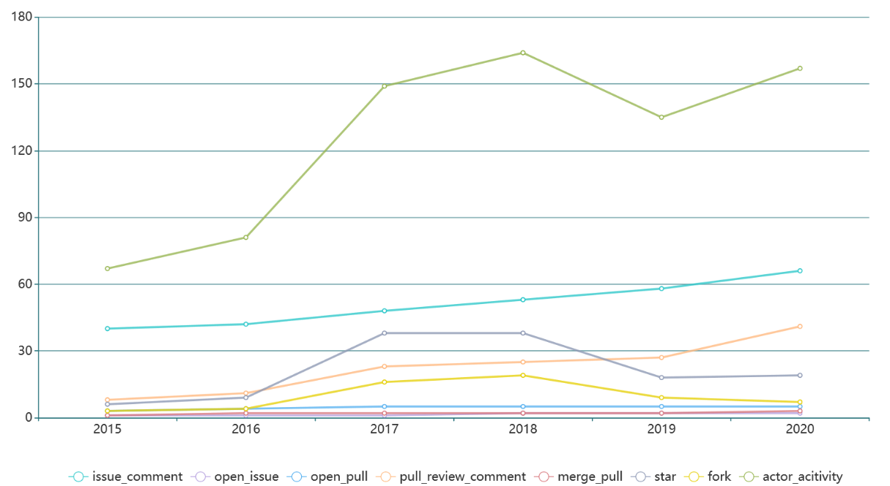
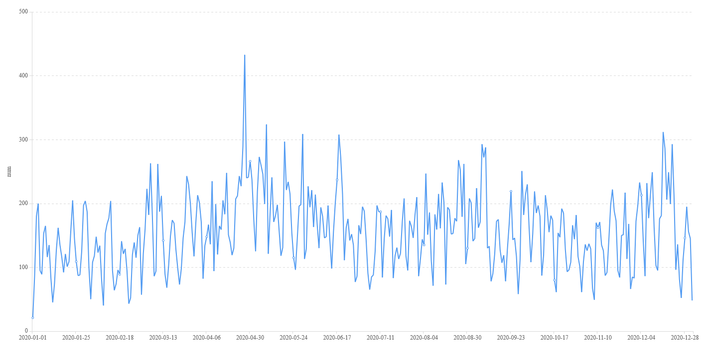
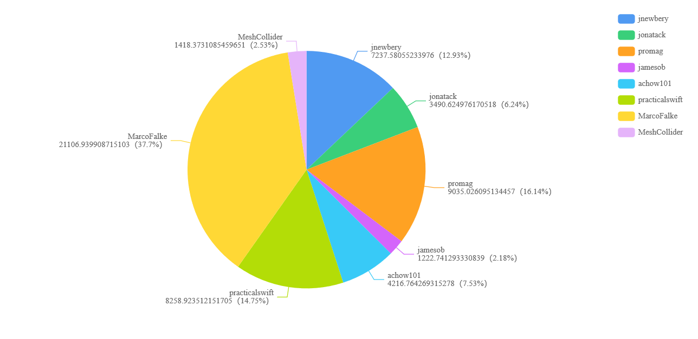
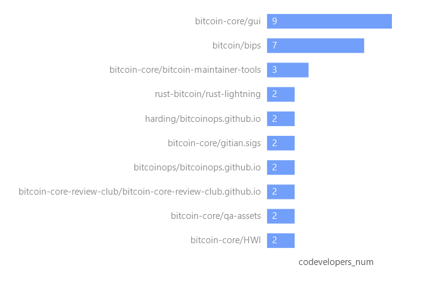
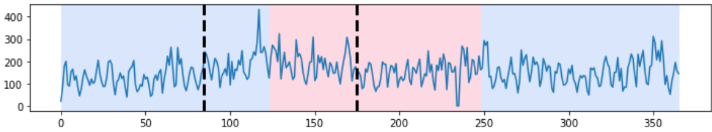
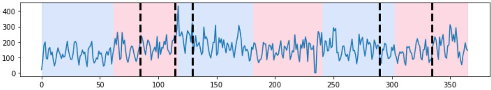
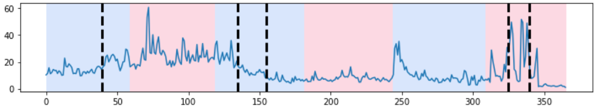

## bitcoin/bitcoin 项目分析

比特币是一种实验性的数字货币，它可以让世界上任何地方的任何人都能完成即时支付。比特币使用去中心化的p2p网络，交易管理和货币发行都是由网络集体完成的。本报告围绕github上的开源项目bitcoin/bitcoin展开开源协作分析。

## 数据分析

截至2021年6月，bitcoin/bitcoin已有3.8k次watch，55.6k次star与29.4k次fork。目前共有804名贡献者。项目主要基于C++开发，各程序设计语言的占比如表1所示。
|  语言   | 比例  |
|  ----  | ----  |
| C++  | 66.6% |
| C  | 9.1% |
| Shell  | 1.6% |
| M4  |  1.6% |
| Makefile  | 1.0% |
| Other  | 1.1%  |

表1 项目开发语言

#### 项目交互行为趋势分析
bitcoin/bitcoin的issue、pull、merge、fork等各种行为随年份的变化反映了比特币社区的流行变化程度。如图1所示，对bitcoin/bitcoin在2015-2020年的各种交互行为数量的变化趋势进行了可视化分析，在2016年到2017年有较大增长，2018年到2019有所下降，2019年以来重新增长，总体上呈增长趋势。

图1 2015-2020各项活动的变化趋势

#### 2020年项目每日活动数分析

图2对2020年项目的每日活动数进行了可视化，在2020年4月27日取得本年度峰值，2020年1月12日取得本年度最低值。

图2 2020年每日活动数

#### 贡献者比例分析
bitcoin/bitcoin的前8名贡献者在项目贡献中占很大比例，图3可视化了比特币前8名贡献者分别所占的比值。贡献最多的MarcoFalke在前8名贡献者中占有37.7%，截至2021年6月，有862名followers。

图3 前8名贡献者在2020年的活跃度比例

#### 相关项目分析
基于项目的共同贡献者，可以找出与本项目相关的项目，图4展示了通过统计共同项目贡献者，根据2020年共同开发者数量，对相关项目进行排名的情况。bitcoin-core/gui是与本项目共同开发者最多的项目，在2020年共有9名开发人员同时参与了两个项目的工作。

图4 基于共同贡献者的相似项目排名

#### 基于Change Point Detciton的开发阶段划分分析

分析不同阶段的行为变化时，传统的方式常以固定的时间间隔划分阶段，例如按月份/季度划分，本报告使用了[1]中的变点检测算法，对活动数量随时间变化的这一时序数据进行变点检测，通过指点变点数量，可以自动化地根据时间序列数据变化的趋势，将项目开发划分为不同阶段。针对bitcoin/bitcoin项目2020年的活动数量，图4与图5分别为变点数量指定为2，划分为3个阶段与变点数量指定为3，划分为6个阶段的开发阶段划分情况，横轴表示本年度的第几天，纵轴表示当天的活动数目，蓝色粉色交替的颜色区间为按相应数量划分阶段时，固定间隔的划分情况。图6展示了比特币相关技术，以太坊项目同年度变点数量为5，6阶段划分的情况 ，可以看出，与bitcoin/bitcoin的变点出现的位置有很大不同。

图4 变点数量为2的3段开发阶段划分

图5 变点数量为5的6段开发阶段划分

图6 以太坊项目（ethereum/go-ethereum）变点数量为5的6段开发阶段划分

 

[1] C. Truong, L. Oudre, N. Vayatis. Selective review of offline change point detection methods. *Signal Processing*, 167:107299, 2020.