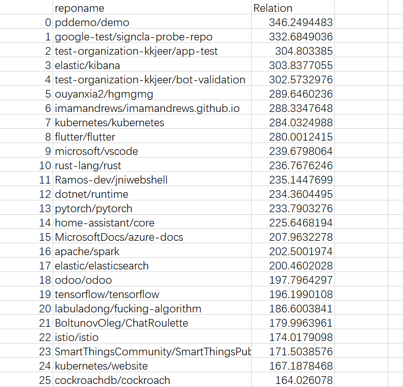
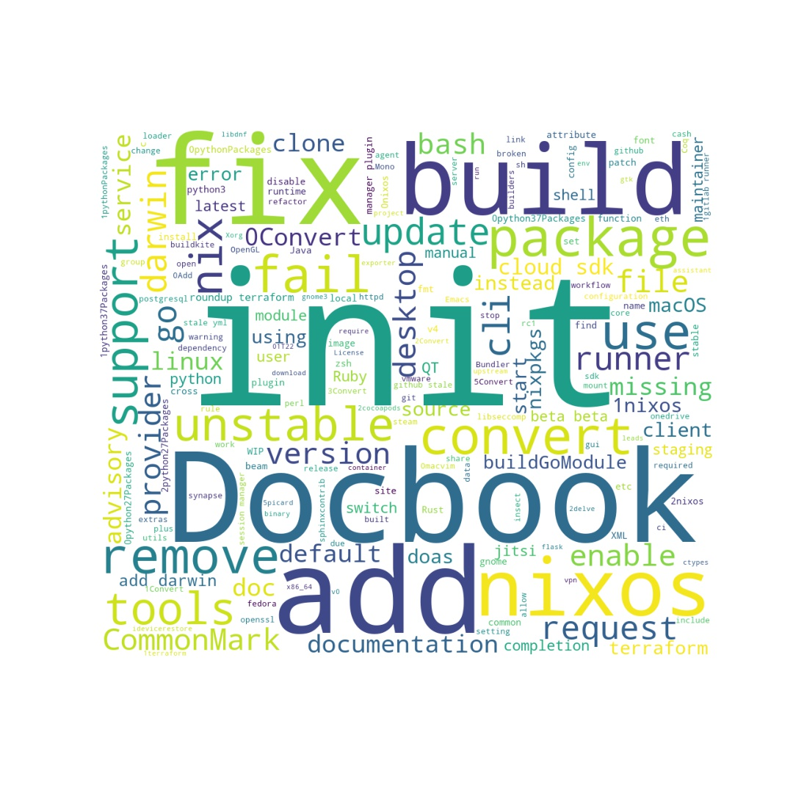

# GitHub开源项目NixOS/Nixpkgs深入数据分析

Nixpkgs是一个超过60,000个软件包的集合，可以与Nix软件包管理器一起安装, 它还实现了一个纯功能的Linux发行版NixOS。接下来对该项目进行深入的数据分析和流程调研。

## 一、数据分析

### **1.** **基础的统计数据分析、可视化**

1. **Nixpkgs项目2015-2020年开发者和日志数量的变化图**

   随着不断发展，参与开发的人数越来越多。日志数量也基上在逐年上升，除了在2019年略微下降，如图1所示。

   

       
        
       

         图 1 不同年份开发者与日志的数量
     	

   

2. **Nixpkgs项目2015-2020年各种行为的变化趋势**

   图2展示了随着项目的不断完善，issue、pull、merge、fork等各种行为随着年数不断增加。在2018年issue-comment这种交互行为达到顶峰。

   

       
        
       

         图 2 2015-2020 issue、pull、merge、fork等行为的数量
     	

   

   

   图3、图4、图5分别展示了2015-2020年Nixpkgs项目每个月pull-review-comment、issue-comment、merge-pull三种交互行为的变化曲线图，可以看到基本上每月都会稳定上升，2018年可能是这个项目繁荣时期，issue-comment、merge-pull行为得到大幅度提升。

   

       
        
       

         图 3 2015-2020年pr交互数量
     	

   

   

       
        
       

         图 4  2015-2020年issue交互数量
     	

   

   

       
        
       

         图 5  2015-2020年merge操作数量
     	

   

   图6展示了2020年Nixpkgs各种交互行为所占比重，可以看到issue-comment是占比最大约为二分之一，接下来就是关于pull的行为占比其次，fork和star行为最少。

   

       
        
       

         图 6  nixpkgs项目2020年活动数量分布
     	

   

### 2. **开发者数据统计、可视化**

1. **nixpkgs 2020开发者活跃度**

   图7展示在Nixpkgs项目中最活跃的20位贡献者不同贡献行为的次数，图8可视化显示出前20名活跃开发者的活跃度排序，其中用户名为SuperSandro2000的用户贡献度是最大的，且远超于排在第二位的开发者cole-h，应该是最主要的开发者或者主要管理者，该用户的活跃度达到6255左右。

   

       
        
       

         图 7  活跃度排名前20位开发者的不同贡献行为次数统计
     	

   

   

       
        
       

         图 8  前20位活跃用户的活跃度
     	

   

2. **nixpkgs 2020工作时间分布**

   图9展示了开发者的工作时间分布情况，可以看到部分开发者都是集中在上午十点到下午十点左右，一个星期中最繁忙的就是星期一、星期二和星期三，并且这三个工作日中在凌晨项目也很活跃。

   

       
        
       

         图 9  开发者工作时间分布
     	

   

3. **nixpkgs 2020开发者之间关系**

   图10 展示的是开发者之间的交互关系，由于数量比较庞大，交互类型比较多，所以我们只关注与issue问题的发布者和comment这些issue问题的用户之间的关联。在中间部分显示大部分用户之间交互比较频繁，外圈显示的是低频率交互行为。

   

       
        
       

         图 10  开发者之间的交互关系
     	

   

### **3. 关联数据分析**

1. 我们按照不同项目间协作关联度公式$Pr_{ab}=\sum\frac{A_aA_b}{A_a+A_b}$，按照从大到小进行降序排序得到关联度高的其他项目。图11为与nixpkgs项目关联度较高的项目关联度，图12为可视化表示。图12中红色节点代表Nixpkgs项目，蓝色代表关联项目，节点越大，代表关联度越高。

   

       
        
       

         图 11  nixpkgs与其他项目的关联度
     	

   

   

       
        
       

         图 12  关联项目可视化结果
     	

   

### 4. 其他数据分析

我们还根据issue title和issue body进行了词云分析，从issue title结果中可以看到出现频率较高的词有init、fix、Docbook、add、build、fix等，也就是项目中add、fix类型的工作会比较多。

    
     
    

      图 13  isuue title词云分析
  	

在issue body中，即问题描述中，出现频率较高的词有https、github、nixos、review、rebuild、cachix、contributing等。

    
     
    

      图 14  issue body词云分析
  	

