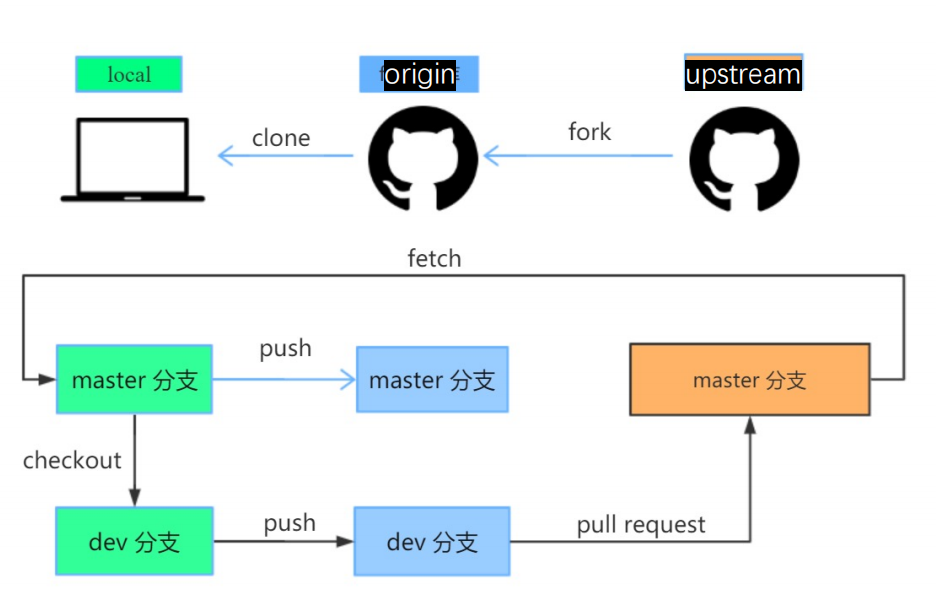

---

---

# nixpigs项目流程调研

## 项目的日常协作流程

NixOS/nixpkgs开发者协作符合上课中讲述的协作模式2，如图1所示.

**具体日常协作流程总结：**

确保拥有一个github账号，在这个主题中没有已经开的issue时，通过选择主题类型填充模板提交一个新的issue.

-  在github上fork Nixpkgs仓库
-  创建分支。由于需要从二进制缓存中接收包，所以可以从本地nixos-version的提交中创建分支，可以避免额外的本地编译。避免直接在master分支上做修改。
-  提交逻辑单元
-  如果删除了包或者对原有文件做出了重要更改，在下一个稳定版本的发布中作出描述。
-  在commit提交之前检查删除不必要的空格
-  如果在nixpkgs中进行了更新、增加操作，则需要测试更改
-  将更改push到fork的nixpkgs中
-  创建PR，等待review结果

## 开发者参与流程

在Nixpkgs中添加package的流程：

- 克隆Nixpkgs源
- 在Nixpkgs项目中合适的位置添加自己的包。例如，通常库文件包在目录pkgs/development/libraries/pkgname，而网页浏览器包的目录在pkgs/applications/networking/browsers/pkgname。在创建目录的时候参见提示信息。
- 在包目录中，创建一个Nix表达式——这是一段描述如何构建包的代码。在这种情况下，它应该是一个以包依赖项作为参数调用的函数，并返回Nix存储中包的构建。该表达式通常应该被称为default.nix。并且该项目给定参考样例。
- 向上一步在pkgs/top/all-packages中定义的函数添加一个调用，使用描述性的名称来定义变量，例如libfoo。该文件中的属性按类别(如“Development / Libraries”)排序，或多或少对应于Nixpkgs的目录结构，然后按属性名排序。
- 测试包是否真实构建成功，添加标志 -k 区分临时性构建文件夹以防构建失败影响其他文件。如果构建成功，会创建一个存储在Nix中的符号链接./result。
- 选择性提交新创建的包，并像nixpkgs提交PR，或者使用Discourse中的the Patches categor发送一个匿名的补丁。

## 项目CI/CD流程

Nixpkgs项目使用持续集成系统Hydra进行构建和测试。使用Hydra成功构建的工作发布到缓存中，当成功构建且达到测试标准之后，将其通过Nix-channel进行分发，供用户下载更新使用。

其中缓存构建使用Cachix进行，Nix的一个优势是CI可以使用二进制缓存为每个分支上的每个项目构建和缓存开发人员环境。使用Cachix可以避免浪费二次构建中的派生，并且每个开发人员与所有开发人员共享已构建的派生，在每次工作完成之后，只需要将构建的派生push到二进制缓存中即可，在作业之前，如果缓存中已经存在派生，则进行替换。