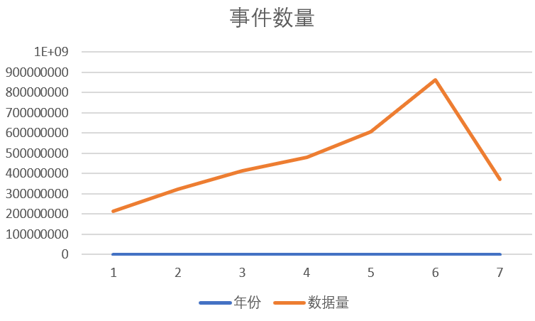
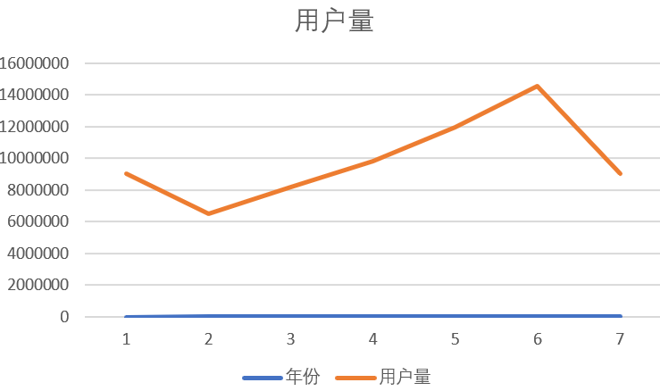
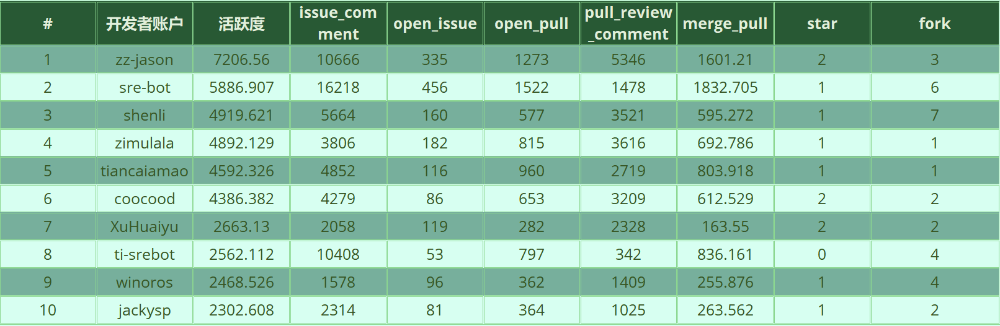
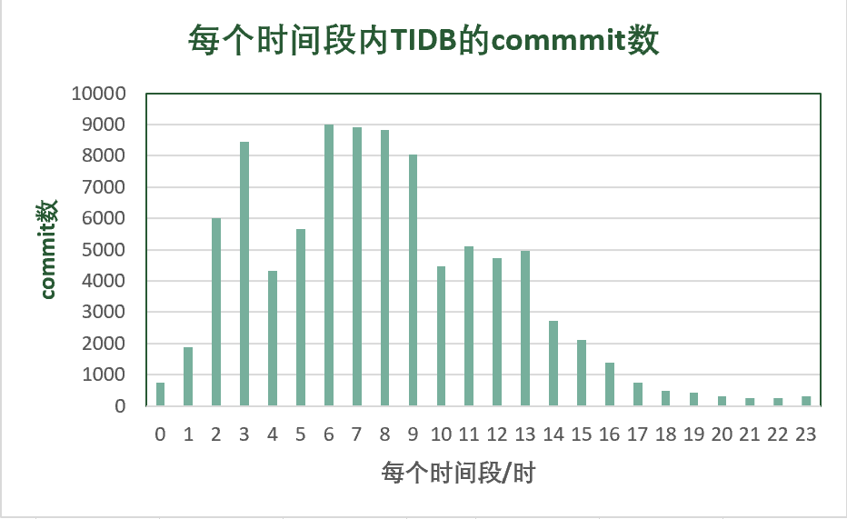
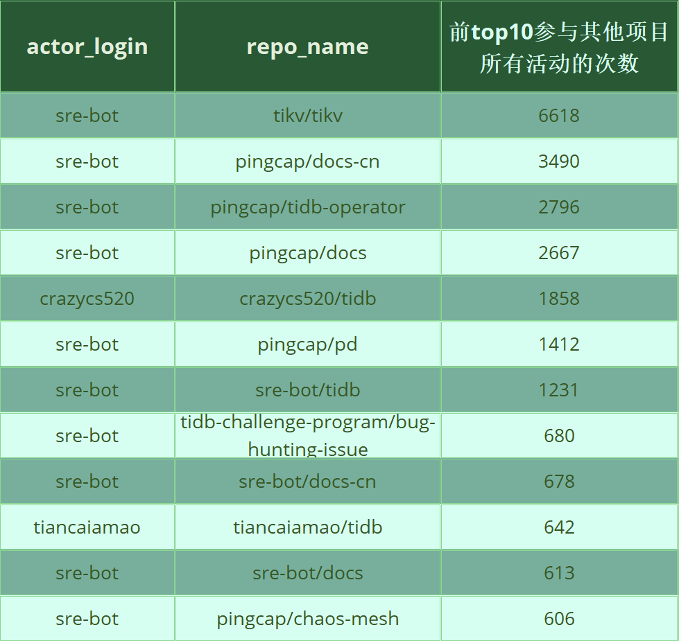
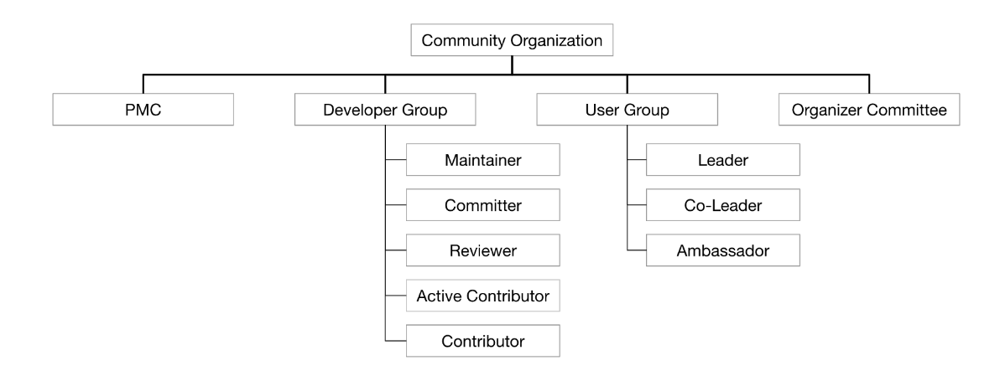
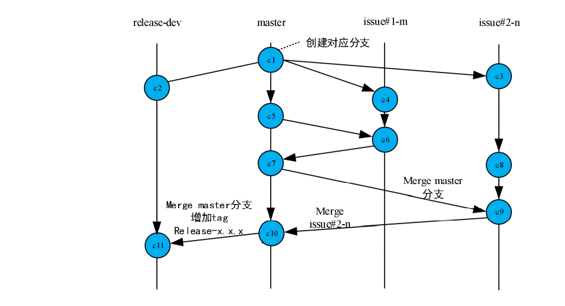
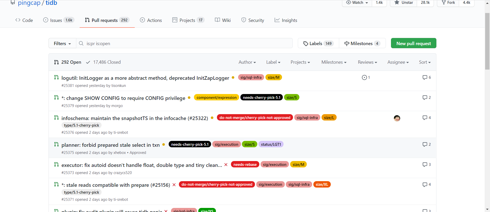

# 数据类
## 1、基础的统计数据分析、可视化
这里使用了year2015-year2021表的数据来进行分析，
每个表包含137列。

数据说明:
- year表归档了github各个事件的产生的日志记录
    - 事件描述参考：https://docs.github.com/cn/developers/webhooks-and-events/events/github-event-types
    - 字段描述参考：https://github.com/X-lab2017/open-digger/blob/master/docs/assets/data_description.csv

### 1.1 Github事件统计

根据2015-2021年的github事件数据，得出下面的每年github事件量图，可以看到，github的事件数量以一个稳定的速度在逐年增加。其中2021年刚过半，因此数据量比较小，但不难看出，今年的github事件数量也是一定能够超越2020年的。

### 1.2 Github使用用户量统计
从github事件统计中，不难看出每年的事件数量是飞速增长的，那么现在来看一下，每年使用github的人是否有明显变化。
从下图中可以看出来，在15年的时候，有大量用户在github上进行包括fork、commit、watch、push等操作，但在16年的时候数据又变少了，之后的每一年也以一个稳定的速度在增长，其中去年更是达到了1454万用户在使用github。

### 1.3 社区受欢迎程度
下面根据2020年全年 GitHub 日志进行统计。
一个社区的活跃度，可以根据该社区的事件数量、参与人数、fork次数、watch次数等进行判断。

因为根据一个项目的事件数进行判断非常不准确，一个机器人项目总共push了5961770次。因此这里用watch事件次数来进行统计。
下图是根据项目的watch事件数量得到的活跃度最高的十五个项目。

|  排名  |  项目   | 数量  |
|  ----  |  ----  | ----  |
| 1 | labuladong/fucking-algorithm |	81980 |
| 2 | jwasham/coding-interview-university | 	63216 |
| 3 | kamranahmedse/developer-roadmap | 	54291 |
| 4 | public-apis/public-apis | 	40661 |
| 5 | donnemartin/system-design-primer	 | 40404 |
| 6 | EbookFoundation/free-programming-books | 	40061 |
| 7 | TheAlgorithms/Python	 | 36529 |
| 8 | danistefanovic/build-your-own-x | 	36519 |
| 9 | CyC2018/CS-Notes	 | 35388 |
| 10 | microsoft/PowerToys | 	35338 |
| 11 | trekhleb/javascript-algorithms | 	35020 |
| 12 | flutter/flutter | 	33132 |
| 13 | Snailclimb/JavaGuide	 | 32800 |
| 14 | denoland/deno | 	32786 |
| 15 | sindresorhus/awesome	 | 30580 |

统计得到的结果还是比较让人诧异的，上面几个项目好多都不是大家都知道的有名的开源项目。其中一个原因是，这里统计的是2020年，watch数量增长最快的15个项目。

并且大家更喜欢watch一些教程类型的项目。
- fucking-algorithm：这个项目是《la'buladong的算法小抄》 是讲算法
- jwasham/coding-interview-university： A complete computer science study plan to become a software engineer.
- public-apis/public-apis： 白嫖API
-  microsoft/PowerToys： 微软的项目

### 1.4 开发语言统计

下面对开源项目中使用的语言进行统计。

但在数据中，有54173232个项目的常用语言是空的。
|  排名  |  语言   | 数量  |
|  ----  |  ----  | ----  |
| 1  | JavaScript | 2356153 |
| 2  | HTML | 681045 |
| 3 | Java | 652861 |
| 4 | TypeScript | 618318 |
| 5 | Python | 533666 |
| 6 | Ruby | 415687 |
| 7 | CSS | 313140 |
| 8 | PHP | 294207 |
| 9 | Vue | 246942 |
| 10 | C# | 128885 |

可以看出来github上的项目，主要还是用js和html的比较多，有可能是因为前端代码比较长，且前端项目较多。
后端最受欢迎的语言依然是Java~

## 2、pingCap/tidb分析

本次使用2020 年全年 GitHub 日志进行统计，主要对pingcap/tidb这个开源项目进行分析。本节主要分析了开发者的统计信息以及和该项目协作度高的其他项目。

这里使用了year2020表, daily_activity表的数据来进行分析，

数据说明:

- year表归档了github各个事件的产生的日志记录
  - 事件描述参考：https://docs.github.com/cn/developers/webhooks-and-events/events/github-event-types
  - 字段描述参考：https://github.com/X-lab2017/open-digger/blob/master/docs/assets/data_description.csv

- daily_activity表存储了2015-2020某个开发者参与某个项目产生的日活跃度daily_score，以及其他事件计数issue_comment、open_issue、open_pull、pull_review_comment、merge_pull、star、fork

### 2.1 TIDB Top 10 开发者账号

我们统计了pingcap/tidb这个项目中活跃度前10的开发者账户，以及他们的活跃度和其他的活动，表格按活跃度降序排序。

从数据统计来看，zz-jason和sre-bot的活跃度远远高于其他的开发者账户。经过后面的分析和调研，sre-bot应该是一个机器人账号，而zz-jason是一个真实存在的开发者。

### 2.2 TIDB开发者每个时间段内的对pingcap/tidb项目的commit数

我们统计了TIDB中所有的开发者在每个时间段内对pingcap/tidb项目的commit数的分布情况。横坐标为时间，对应的是北京东八区的时间；纵坐标为commit的数量。

统计发现在19点到23点之间的commit数很低，我们分析了一下存在这种现象的原因。可能是对于在中国生活的人而言，这段时间大家有自己的生活，需要社交和带娃。此外，我们还发现6点到9点的commit数尤其高，可能是因为存在机器人账号，在这段时间的commit比较频繁。

### 2.3 TIDB活跃度前三的账户在不同时间段的commit数

我们统计了TIDB中活跃度前三的账户在不同时间段对pingcap/tidb项目的commit数的分布情况。横坐标为时间，对应的是北京东八区的时间；纵坐标为commit的数量。

统计分析sre-bot不眠不休地每个时间段都在为pingcap/tidb做贡献，它大概率是个机器人。此外，zz-jason是最活跃的开发者账户，他一般在凌晨0点到6点这段时间commit很频繁。据我们调研，他生活在中国北京，是一个架构工程师，兴趣围绕分布式计算，sql优化和执行，在PingCAP公司的一员。但他为什么一直在这段时间内进行commit，我们不得而知。

### 2.4 与TIDB协作关联度高的前10个项目

我们调研了与TIDB协作关联度高的前10个项目，通过统计了pingcap/tidb这个项目中前top10个活跃者账户参加其他项目所有活动的次数来分析。

我们发现sre-bot是pingCAP公司的机器人，它还负责了公司的其他项目，这些项目都和tidb密切相关，比如tikv是tidb底下的存储引擎，tidb-operator，pd, docs-cn，docs都是和tidb息息相关的。此外，对于开发者账户crazycs520和tiancaiamao都在自己仓库中维护了一份tidb，在他们仓库本地开发tidb。

# 流程类
## 1、项目的日常协作流程调研
下图是TiDB开源社区组织：

本项目由下列小组组成并负责运作： 
项目管理委员会(PMC)  
组织委员会  
开发小组  
维护人员  
特殊兴趣小组，SIGs(技术领导)  
工作小组WGs  
TiDB用户组  

### 1.1 PMC（Project Management Committee）
PMC作为监督TiDB社区的核心管理团队。PMC除了维护人员的职责之外还有其他的职责。这些责任确保了项目的顺利进行。
PMC的成员没有重大权力社区的其他成员,尽管它是选票的PMC新维护者或提交者,并使所有重大决策对未来关于TiDB,如项目级别的治理策略,次级架构管理、安全流程等等。它还在社区无法达成共识时作出决定。此外，PMC还可以访问项目的私人邮件列表及其存档。
PMC的成员资格是由现有PMC成员邀请的。提名将经过讨论，然后由现有PMC成员投票。PMC成员投票须经当前PMC成员的一致同意。
在委员会的第一次组建中，我们的维护者提名了一批对这个项目有很大影响的人，包括一些PingCAP的成员，他们创立了TiDB。新的PMC成员是根据上面描述的规则选择的。

### 1.2 组织者委员会（Organizer Committee）
组织者委员会由负责社区活动或活动运作的组织者组成。他们确保PMC战略和决策的执行。具体来说，这些成员是跨区域的用户组或社区活动组织者的领导者。

### 1.3 开发小组（Developer Group）
作为社区开发的基石，TiDB开发人员组由以下角色组成:维护者、提交者、审阅者、活动贡献者和贡献者。每个角色在社区中承担相应的责任。它们共同对TiDB的蓬勃发展起着重要作用。
开发小组以两种功能形式运作TiDB项目:特殊利益小组(SIG)和工作组(WG)。下图说明了SIG和WG的定义、组的内部角色以及角色提升路径。

### 1.4 维护者（Maintainers）
PMC是监督项目的核心管理小组，而维护者是开发小组中的技术权威，他们担任每个项目的计划人员和设计人员。维护者为特定SIG拥有的子项目设定技术方向和优先级，并确保其持续健康和发展。他们为项目做出或批准设计决策——直接或通过委派这些责任。维护人员由PMC以绝对多数票任命。
### 1.5 SIGs
TiDB项目主要被组织成特殊利益小组(SIGs)。每个团体的成员是由多个企业或组织的共同目标推进TiDB项目对一个特定的主题,例如执行团体或文档团体。一个团体的目标是使一个分布式决策结构和代码所有权,以及为完成工作提供集中的论坛,做决定，接纳新的贡献者。项目的每个可识别的子部分(例如，GitHub org、库、子目录、API、测试、问题、PR)都被相应的SIG拥有。
每个SIG必须有一个章程，其中规定了它的范围(主题、代码存储库和目录)、职责、权限领域、如何选择/授予权限/领导的成员和角色、如何做出决策，以及如何解决冲突。关于如何管理特许的详细信息，请参阅SIG特许流程。sig应该可以相对自由地自定义或更改它们的操作方式，在这个治理和sig治理强加的一些宽泛的指导方针和约束中。
SIG是由Tech Leads组织和操作的，这是SIG的内部角色，监督SIG的健康和持续发展。在SIG最初建立时，维护者将分配2-3个Tech Leads。

### 1.6 Working Groups
工作组(wg)是临时的小组，其组成是为了解决跨团体边界的问题。工作组不拥有任何代码或其他长期工件。工作组可以通过涉及的sigg进行汇报和行动。（这个可以扩展一点）
工作组(WG)是由社区开发人员组成的，他们聚集在一起来完成一个特定的目标。为了实现这个目标，一些wg可能跨越多个SIG，而一些wg可能只专注于一个特定SIG中的特定内容。
每个WG都有自己的生命周期。一旦目标完成，小组将被解散。WG运营和管理的唯一目标是确保在正确的时间完成团队设定的目标。一般来说，工作组定期召开会议，总结当前项目进展，并确定下一步计划。
WG的成立和解散受到PMC的监督。

### 1.7 贡献（Contributions）
任何人都可以为项目做出贡献，不管他们的技能如何，因为有很多方式可以做出贡献。不同的贡献方式在一个单独的文档中有更详细的描述。

### 1.8 决策和投票（Decision making and voting）
提案和想法可以通过github问题或PR提交以达成协议。项目未来的决定取决于项目的性质，由PMC或维护者做出。作为技术权威，维护者为SIG项目设定技术方向和优先级，而PMC则做出其他高层决策，如子项目、子结构的建立和运营政策、推广新的维护者、安全流程等。
主要的变更，比如特性提议和组织或过程的变更，应该通过请求评论(RFC)过程引起PMC或维护者的注意。为了改变的发生，RFC必须在相应的组中获得绝对多数票(2/3)。

### 1.9 冲突解决（Conflict resolution）
一般来说，我们更希望技术问题和其他无法达成共识的争议在相关人员之间得到友好解决。如果争议不能独立解决(取决于其性质)，则PMC或维护人员可以根据原则和行为准则通过投票来解决该问题。可以使用相同的PR或在相关存储库中打开一个单独的PR进行投票。

### 1.10 添加新项目（Adding new projects）
新项目可以通过现有SIG中的GitHub问题讨论添加到PingCAP组织中(通常由SIG的Tech Leads进行)，只要他们遵守该治理中定义的指导方针。一旦进行了充分的讨论，维护者将决定是否应该添加新项目。请求者需要创建一个相应的RFC来进行更改。

## 2、开发者参与流程调研
### 2.1 TiDB开发者团队。
作为社区开发的基石，TiDB开发人员组由以下角色组成:维护者、提交者、审阅者、活动贡献者和贡献者。每个角色在社区中承担相应的责任。它们共同对TiDB的蓬勃发展起着重要作用。
交流。
可以通过聊天、社交媒体等沟通渠道。对于更具体的主题，可以加入TiDB Community slack工作空间并与他人讨论。
在TiDB社区内的交流遵守贡献者契约行为准则。你可以通过以下任何一种方式联系社区成员。
Slack、Blog、TiDB Weekly以及其他如Stack Overflow、Twitter、Facebook、Reddit以及Google Groups。
#### 2.1.1 贡献者（Contributor）
在PingCAP组织中，任何一个项目合并了一个PR的人都是贡献者。新贡献者应该受到现有成员的欢迎，帮助PR工作流程，指导相关文档和沟通渠道。贡献者自动成为贡献的团体的成员。
成为贡献者：为PingCAP组织中的任何项目合并至少1个PR。
我们也鼓励你以以下方式参与项目：积极回答GitHub社区用户提出的技术问题；帮助测试项目；帮助审查其他人提交的pull request；帮助改进技术文档；提交有价值的问题；报告或修复已知和未知的bug；编写关于源代码分析和项目用例的文章。

#### 2.1.2 审阅者（Reviewer）
评审人员负责评审社区提交的代码，以确保质量和正确性；由特定SIG中的活动贡献者生成。
成为审阅者：熟悉代码库；演示了一个公认的社区参与团体发展水平,通过贡献,满足一个或多个最小标准如下定义：合并20个或更多PR(团体中可能不同)；修正了1个或更多中等难度的问题；由SIG的2个提交者赞助。
权限和责任：确保提交给SIG的代码的正确性；迅速回应PRs；定期参加团体会议；用LGTM批准代码评审；获得在相应SIG的会员页面上列出的个人资料。

#### 2.1.3 提交者（Committer）
提交者来自审阅者，并因他们对特定SIG的杰出贡献而被维护者和SIG技术领导者所认可。
成为提交者：提交者必须完成下列一项或多项：在团体内部的公关审查中表现出良好的责任感审查捐款必须符合特定团体章程中规定的数额或难度标准；通过以下重要贡献，展示了对特定于SIG的TiDB组件的深刻理解：1. 完成2个以上中等难度的任务’2. 固定1或更多的任务的困难的难度；由SIG的技术领导提名，获得维护者的绝对多数票(2/3)。
权限和责任：在SIG下控制项目的整体代码质量；指导贡献者和评审者不断地对SIG做出贡献
定期参加委员会会议，对项目开发有知识优先权；参与设计讨论；获得在相应SIG的会员页面上列出的个人资料。

#### 2.1.4 维护者（Maintainer）
维护者是TiDB项目的规划人员和设计人员，他们有权将分支合并到主程序中。维护者来自于提交者。他们必须对TiDB项目的持续发展和整体健康表现出良好的判断力和责任感。
成为维护者：对TiDB的技术目标和方向有深刻和全面的理解；必须是至少2个SIGs的提交者
积极参与组织技术研讨会，提出或审查重大技术设计方案;能否在代码实现过程中处理复杂问题;被PMC提名并获得了绝对多数票。
权限和责任：开发和批准TIDB项目的技术设计和决策；为SIG项目设定技术方向和优先级；参与项目的产品发布和路线图开发；通过指导评审者和提交者不断地为项目做出贡献；确保TiDB项目的整体质量。

### 2.2 TiDB Contribution Workflow
要对TiDB代码库做出贡献，需要遵循本节中定义的工作流。
1. 从开发者想要创建工作的地方开始创建一个主题分支
2. 如果更改修复了bug或添加了新功能，则提交逻辑单元并添加测试用例。
3. 运行测试并确保所有测试都已通过。
4. 开发者需要确保提交消息采用正确的格式。
5. 将更改推到存储库分支中的主题分支。
6. 提交pull request

#### 获取Code review
如果你的pull request (PR)被打开，它将被分配给相关的Special Interest Group (SIG)内的审阅者。通常情况下，每个PR都需要至少2个合格的评审员的lgtm(看起来不错)。这些评审人员将进行彻底的代码评审，查看正确性、bug、改进机会、文档和注释以及风格。
为了处理评审评论，应该将变更提交到您的分支上的PR的相同分支。

## 3、项目CI/CD的流程调研
- 开源项目：TiDB
- 项目github地址： https://github.com/pingcap/tidb
### 3.1 分支策略
采用了主干开发，分支发布的策略。master分支上是项目的全量代码，开发人员在特性分支上进行开发，开发完成后将功能合并到master分支中。

TiDB的项目版本发布，大致上是以major + minor进行发布。如2.0、3.0是一个major版本，该版本发布时，创建一个新的分支进行发布。后续如果有新的功能想加到里面，就将特性分支merge进去。minor版本发布的时候，就不切新的分支，而是在该版本进行源码打包。

下图是一个该项目的分支管理策略示意图：

### 3.2 持续集成
开发人员在本地进行开发并且单元测试通过之后，将代码push到远程分支上。以及当开发者，提交pull request时，会触发自动进行测试。
下图是该项目的pull request页面，可以清晰的看到每个pr请求和其测试的状态，测试通过后面会有个小绿勾。

该项目使用了Github + Jenkins来进行持续集成工作。在用户进行push到远程仓库以及提交pr操作时，触发webhook，这个时候jenkins将会根据提交的源码进行环境配置、编译和测试等工作。

这部分的配置不可见。

下面这张图是该项目某一个pr对应的jenkins构建和测试，可以看到它测试失败以后，就不允许进行merge了。

可以查看jenkins pipeline的详细信息,如下图所示：

### 3.3 持续部署
TiDB属于一个产品，不存在典型的线上业务，因此不存在需要对源码进行打包、环境配置、打包镜像、将业务进行上线。这样的典型CD场景。
下面将提供一个类似场景，并且大致说明该项目的部署方式流程。

类似场景

1. 内部集群每天做回归测试，每天12点pull master代码进行测试。
2. 前面提到的开发人员提交之后，会跑测试。

TiDB搭建了一套Github + Jenkins + kubernetes的CICD框架。
提交之后，jenkins会进行镜像打包等操作，然后kubernetes作为一个容器管理调度工具，管理多个容器进行测试的工作，以及测试完成对镜像的销毁和调度新的镜像等工作。

