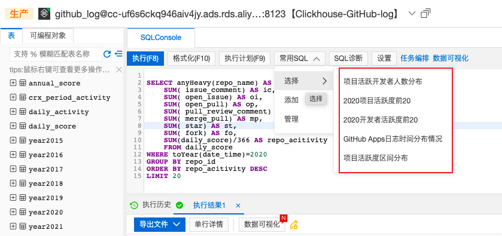

## 任务

某开源项目的2020年深入数据分析

* 23 组同学分别选择某一开源项目，分组情况：[https://shimo.im/docs/9gcg9rVkYKDrDjd6](https://shimo.im/docs/9gcg9rVkYKDrDjd6?fileGuid=TvKwRCK3xqhwhJXk)
* 在 2021/06/30 之前所有组完成所选开源项目的数据分析并形成报告，以一个 PR 的方式提交到主仓库
* 上述 PR 中必须包含组内所有同学的 commit 记录
## 分析内容

### 数据类

1. 基础的统计数据分析、可视化
2. 开发者数据统计、可视化
3. 关联数据的分析，如协作关联度高的其他项目
4. 其他任意想做的数据分析
### 流程类

1. 项目的日常协作流程调研
2. 开发者参与流程调研
3. 项目CI/CD的流程调研
## 课程提供支持

1. 全域数据的Clickhouse数据库只读访问能力
2. 预置常用数据统计的SQL
3. 分析过程中的指导答疑
## 评分标准

满分为100分的情况下，

1. 缺少【数据类】或者【流程类】分析内容的前1，2，3点中的任意一点，扣除10分；
2. 提出比较出彩的数据分析角度，加10分；
3. 组长加分，最终提交PR到课程仓库者 +5 分。
## 协作流程

* 每位同学 fork 本仓库后组内分工分析项目的数据
* 每位同学完成自己的部分后 push 到自己的仓库中
* 每组选出一位最终提交 PR 的同学为组长，组长在其他同学完成自己的部分后，通过 Git 直接拉取合并同组同学的提交记录 ； 或者组内其他同学将组长的仓库设为上游仓库，将自己完成的部分提交PR到上游仓库中。
* 由上述同学提交 PR 到主仓库，该 PR 中应包含多个来自本组不同同学的 commit 记录
## 数据库使用账号

* 阿里云 RAM 登录用户名：OSSDevGov2021@1224904496484627.onaliyun.com
* 阿里云 RAM 登录密码：OSSDevGov2021
* GitHub-Log 数据库名：Clickhouse-GitHub-log
* GitHub-Log 数据库登录用户名：ossdevgov2021
* GitHub-Log 数据库登录密码：OSSDevGov2021
* Clickhouse 数据库登录地址：[https://dms.aliyun.com/](https://dms.aliyun.com/?fileGuid=TvKwRCK3xqhwhJXk)

各位同学请使用**RAM**登录阿里云

## 数据表描述

* year表归档了github各个事件的产生的日志记录
    * 事件描述参考：[https://docs.github.com/cn/developers/webhooks-and-events/events/github-event-types](https://docs.github.com/cn/developers/webhooks-and-events/events/github-event-types?fileGuid=TvKwRCK3xqhwhJXk)
    * 字段描述参考：[https://github.com/X-lab2017/open-digger/blob/master/docs/assets/data_description.csv](https://github.com/X-lab2017/open-digger/blob/master/docs/assets/data_description.csv?fileGuid=TvKwRCK3xqhwhJXk)
* annual_score表存储2015-2020了某个开发者参与某个项目产生的年活跃度score
* daily_activity表存储了2015-2020某个开发者参与某个项目产生的日活跃度daily_score，以及其他事件计数issue_comment、open_issue、open_pull、pull_review_comment、merge_pull、star、fork
* crx_period_activity无需关注
## 常用SQL语句

我们在提供的数据库中为同学们提供了一些常用的SQL查询语句，同学们可以根据自己报告内容自行选择使用。

## 参考示例

1、[GitHub 2019数字年报](https://github.com/X-lab2017/github-analysis-report-2019/blob/master/REPORT.md?fileGuid=TvKwRCK3xqhwhJXk)

2、[GitHub 2020 数字洞察报告](https://mp.weixin.qq.com/s/DYySsVe5Z2NH0hvGi4xlKg?fileGuid=TvKwRCK3xqhwhJXk)

