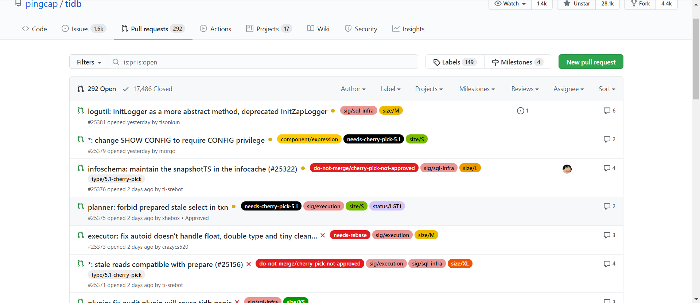

# 数据类
## 1、基础的统计数据分析、可视化
这里使用了year2015-year2021表的数据来进行分析，
每个表包含137列。

数据说明:
- year表归档了github各个事件的产生的日志记录
    - 事件描述参考：https://docs.github.com/cn/developers/webhooks-and-events/events/github-event-types
    - 字段描述参考：https://github.com/X-lab2017/open-digger/blob/master/docs/assets/data_description.csv

### 1.1 Github事件统计

根据2015-2021年的github事件数据，得出下面的每年github事件量图，可以看到，github的事件数量以一个稳定的速度在逐年增加。其中2021年刚过半，因此数据量比较小，但不难看出，今年的github事件数量也是一定能够超越2020年的。

### 1.2 Github使用用户量统计
从github事件统计中，不难看出每年的事件数量是飞速增长的，那么现在来看一下，每年使用github的人是否有明显变化。
从下图中可以看出来，在15年的时候，有大量用户在github上进行包括fork、commit、watch、push等操作，但在16年的时候数据又变少了，之后的每一年也以一个稳定的速度在增长，其中去年更是达到了1454万用户在使用github。

### 1.3 社区受欢迎程度
下面根据2020年全年 GitHub 日志进行统计。
一个社区的活跃度，可以根据该社区的事件数量、参与人数、fork次数、watch次数等进行判断。

因为根据一个项目的事件数进行判断非常不准确，一个机器人项目总共push了5961770次。因此这里用watch事件次数来进行统计。
下图是根据项目的watch事件数量得到的活跃度最高的十五个项目。

|  排名  |  项目   | 数量  |
|  ----  |  ----  | ----  |
| 1 | labuladong/fucking-algorithm |	81980 |
| 2 | jwasham/coding-interview-university | 	63216 |
| 3 | kamranahmedse/developer-roadmap | 	54291 |
| 4 | public-apis/public-apis | 	40661 |
| 5 | donnemartin/system-design-primer	 | 40404 |
| 6 | EbookFoundation/free-programming-books | 	40061 |
| 7 | TheAlgorithms/Python	 | 36529 |
| 8 | danistefanovic/build-your-own-x | 	36519 |
| 9 | CyC2018/CS-Notes	 | 35388 |
| 10 | microsoft/PowerToys | 	35338 |
| 11 | trekhleb/javascript-algorithms | 	35020 |
| 12 | flutter/flutter | 	33132 |
| 13 | Snailclimb/JavaGuide	 | 32800 |
| 14 | denoland/deno | 	32786 |
| 15 | sindresorhus/awesome	 | 30580 |

统计得到的结果还是比较让人诧异的，上面几个项目好多都不是大家都知道的有名的开源项目。其中一个原因是，这里统计的是2020年，watch数量增长最快的15个项目。

并且大家更喜欢watch一些教程类型的项目。
- fucking-algorithm：这个项目是《la'buladong的算法小抄》 是讲算法
- jwasham/coding-interview-university： A complete computer science study plan to become a software engineer.
- public-apis/public-apis： 白嫖API
-  microsoft/PowerToys： 微软的项目

### 1.4 开发语言统计

下面对开源项目中使用的语言进行统计。

但在数据中，有54173232个项目的常用语言是空的。
|  排名  |  语言   | 数量  |
|  ----  |  ----  | ----  |
| 1  | JavaScript | 2356153 |
| 2  | HTML | 681045 |
| 3 | Java | 652861 |
| 4 | TypeScript | 618318 |
| 5 | Python | 533666 |
| 6 | Ruby | 415687 |
| 7 | CSS | 313140 |
| 8 | PHP | 294207 |
| 9 | Vue | 246942 |
| 10 | C# | 128885 |

可以看出来github上的项目，主要还是用js和html的比较多，有可能是因为前端代码比较长，且前端项目较多。
后端最受欢迎的语言依然是Java~

## 2、pingCap/tidb分析

本次使用2020 年全年 GitHub 日志进行统计，主要对pingcap/tidb这个开源项目进行分析。本节主要分析了开发者的统计信息以及和该项目协作度高的其他项目。

这里使用了year2020表, daily_activity表的数据来进行分析，

数据说明:

- year表归档了github各个事件的产生的日志记录
  - 事件描述参考：https://docs.github.com/cn/developers/webhooks-and-events/events/github-event-types
  - 字段描述参考：https://github.com/X-lab2017/open-digger/blob/master/docs/assets/data_description.csv

- daily_activity表存储了2015-2020某个开发者参与某个项目产生的日活跃度daily_score，以及其他事件计数issue_comment、open_issue、open_pull、pull_review_comment、merge_pull、star、fork

### 2.1 TIDB Top 10 开发者账号

我们统计了pingcap/tidb这个项目中活跃度前10的开发者账户，以及他们的活跃度和其他的活动，表格按活跃度降序排序。

从数据统计来看，zz-jason和sre-bot的活跃度远远高于其他的开发者账户。经过后面的分析和调研，sre-bot应该是一个机器人账号，而zz-jason是一个真实存在的开发者。

### 2.2 TIDB开发者每个时间段内的对pingcap/tidb项目的commit数

我们统计了TIDB中所有的开发者在每个时间段内对pingcap/tidb项目的commit数的分布情况。横坐标为时间，对应的是北京东八区的时间；纵坐标为commit的数量。

统计发现在19点到23点之间的commit数很低，我们分析了一下存在这种现象的原因。可能是对于在中国生活的人而言，这段时间大家有自己的生活，需要社交和带娃。此外，我们还发现6点到9点的commit数尤其高，可能是因为存在机器人账号，在这段时间的commit比较频繁。

### 2.3 TIDB活跃度前三的账户在不同时间段的commit数

我们统计了TIDB中活跃度前三的账户在不同时间段对pingcap/tidb项目的commit数的分布情况。横坐标为时间，对应的是北京东八区的时间；纵坐标为commit的数量。

统计分析sre-bot不眠不休地每个时间段都在为pingcap/tidb做贡献，它大概率是个机器人。此外，zz-jason是最活跃的开发者账户，他一般在凌晨0点到6点这段时间commit很频繁。据我们调研，他生活在中国北京，是一个架构工程师，兴趣围绕分布式计算，sql优化和执行，在PingCAP公司的一员。但他为什么一直在这段时间内进行commit，我们不得而知。

### 2.4 与TIDB协作关联度高的前10个项目

我们调研了与TIDB协作关联度高的前10个项目，通过统计了pingcap/tidb这个项目中前top10个活跃者账户参加其他项目所有活动的次数来分析。

我们发现sre-bot是pingCAP公司的机器人，它还负责了公司的其他项目，这些项目都和tidb密切相关，比如tikv是tidb底下的存储引擎，tidb-operator，pd, docs-cn，docs都是和tidb息息相关的。此外，对于开发者账户crazycs520和tiancaiamao都在自己仓库中维护了一份tidb，在他们仓库本地开发tidb。

# 流程类
## 3、项目CI/CD的流程调研
- 开源项目：TiDB
- 项目github地址： https://github.com/pingcap/tidb
### 3.1 分支策略
采用了主干开发，分支发布的策略。master分支上是项目的全量代码，开发人员在特性分支上进行开发，开发完成后将功能合并到master分支中。

TiDB的项目版本发布，大致上是以major + minor进行发布。如2.0、3.0是一个major版本，该版本发布时，创建一个新的分支进行发布。后续如果有新的功能想加到里面，就将特性分支merge进去。minor版本发布的时候，就不切新的分支，而是在该版本进行源码打包。

下图是一个该项目的分支管理策略示意图：

### 3.2 持续集成
开发人员在本地进行开发并且单元测试通过之后，将代码push到远程分支上。以及当开发者，提交pull request时，会触发自动进行测试。
下图是该项目的pull request页面，可以清晰的看到每个pr请求和其测试的状态，测试通过后面会有个小绿勾。

该项目使用了Github + Jenkins来进行持续集成工作。在用户进行push到远程仓库以及提交pr操作时，触发webhook，这个时候jenkins将会根据提交的源码进行环境配置、编译和测试等工作。

这部分的配置不可见。

下面这张图是该项目某一个pr对应的jenkins构建和测试，可以看到它测试失败以后，就不允许进行merge了。

可以查看jenkins pipeline的详细信息,如下图所示：

### 3.3 持续部署
TiDB属于一个产品，不存在典型的线上业务，因此不存在需要对源码进行打包、环境配置、打包镜像、将业务进行上线。这样的典型CD场景。
下面将提供一个类似场景，并且大致说明该项目的部署方式流程。

类似场景

1. 内部集群每天做回归测试，每天12点pull master代码进行测试。
2. 前面提到的开发人员提交之后，会跑测试。

TiDB搭建了一套Github + Jenkins + kubernetes的CICD框架。
提交之后，jenkins会进行镜像打包等操作，然后kubernetes作为一个容器管理调度工具，管理多个容器进行测试的工作，以及测试完成对镜像的销毁和调度新的镜像等工作。

