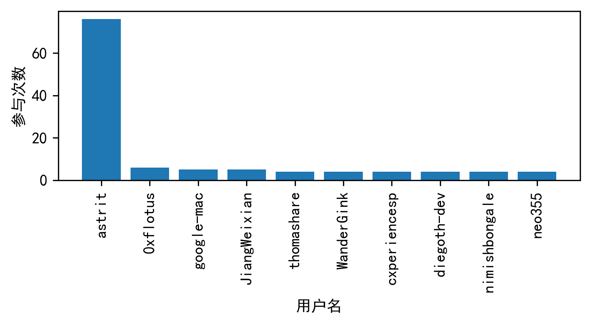

## 数据类

我们选取了开源项目 `astrit/css.gg`，这是一个开源的图标库，在 Clickhouse 数据库中获取了 2020 年该项目的所有数据，并进行了分析研究。

### 基础数据分析

数据集包含本项目 2020 年的 6996 次操作记录，65 个 issue 被创建，26 个 issue 被关闭

### 开发者数据分析

在 2020 年本开源项目的开发过程中，共有 6439 位开发者参与其中，平均每位用户参与 1.087 次，其中参与次数最多的一位用户 `astrit` 参与了 76 次

在 2020 年，开发者该项目的频率呈现波动，在 2020 年 3 月 2 日开发者们参与的次数达到峰值

### 关联数据分析

2020 年大量开发者选择 `watch` 本项目，开发者们的 watch、Fork、issue 次数与人数关系如下图所示：

图中圆形大小与人数正相关，从图中可以看出，实际参与贡献的开发者占比较少。

## 流程分析

### 项目的日常协作流程调研
这是一个非常典型的精致小项目，整个项目只有极少的核心人员负责维护，没有正规的管理流程，没有CI/CD的概念，没有规范严谨的文档，项目的开发与贡献者自发的热情高度相关。项目的开发高潮只持续了不到一年，其中第二位开发者只参与了不到半年，就不再贡献代码。

作为一个小型开源项目，整个项目只有五名开发者参与其中。项目的发起人与另一名开发者贡献了主要代码，剩下的三名贡献者则只贡献了微小的工作，可以说整个项目的代码开发都是由两个人完成的。这也导致了项目的主要开发流程完全由两个人决定，事实上从下面开发者的贡献图可以看出来，这个项目并没有对协作流程进行严格管理，还是以贡献者提PR再由管理人员Review的模式运作。

Pull requests列表里有8条开放PR，但是已经很长时间没有人负责review合并PR，所以这个项目也出现了许多开源项目常见的问题：项目的管理者没有及时与贡献者进行互动，降低了其他人的参与热情。

### 开发者参与调研

与一般的项目不同，这是一个开源的图标库，想要开发一个图标库除了程序员，美术设计也非常重要，所以在项目的GitHub首页的主要贡献者里，除了两个核心开发者，还有一个图标设计人员Lona。可以看到一个项目的背后，可能除了Contributors列表里的人，还有其他非技术人员也发挥了重要作用。

- Astrit - Author
- JiangWeixian - Styled Components
- Lona - Figma/SVG Design

### 总结
这个项目在GitHub上获得了超过7600颗星，349个Frok，吸引了不少人的注意，这也说明它确实有一定的价值，但是由于缺乏贡献者参与，这个项目并没有能很好的持续发展下去。这个项目遇到的问题也是大量GitHub开源项目遇到的普遍性问题。

不过作为一个个人发起的项目，主要的收入来源于捐款，很难维持开发的动力，能够取得这样的结果已经是相当的优秀了。所以对于几乎没有盈利的个人开发项目来说，开源身就是不可持续的事情，绝大多数项目也只能短暂的维持热度然后被人遗忘，我们认为这目前没有什么好的解决方法。