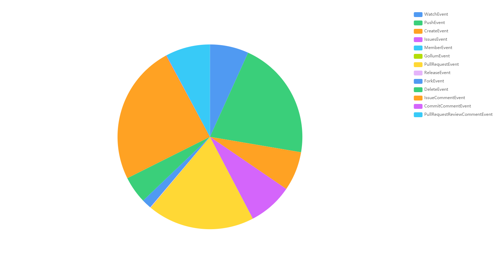
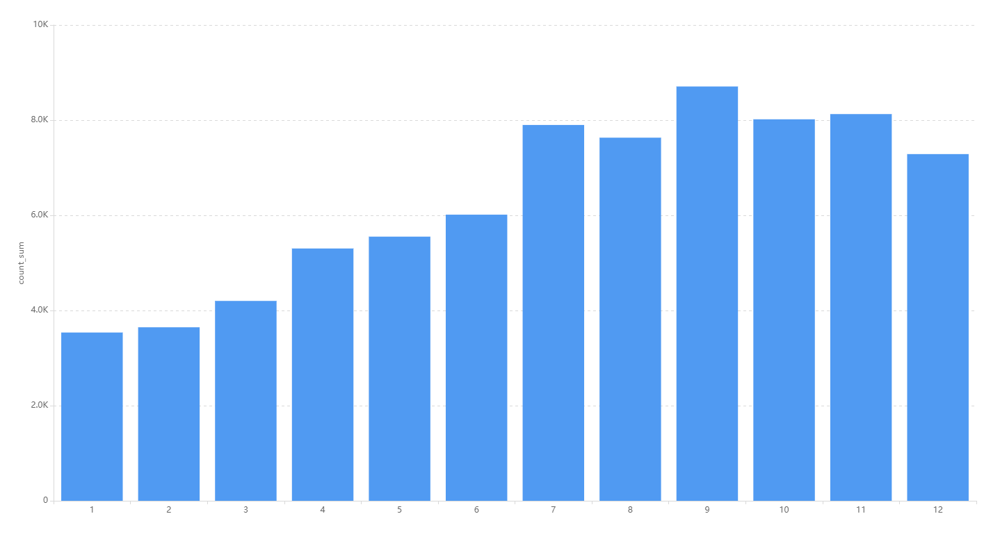
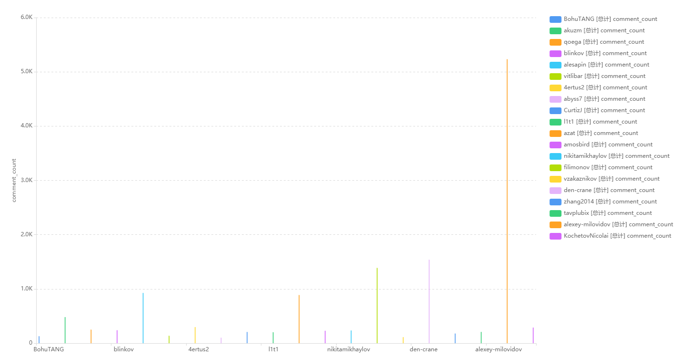
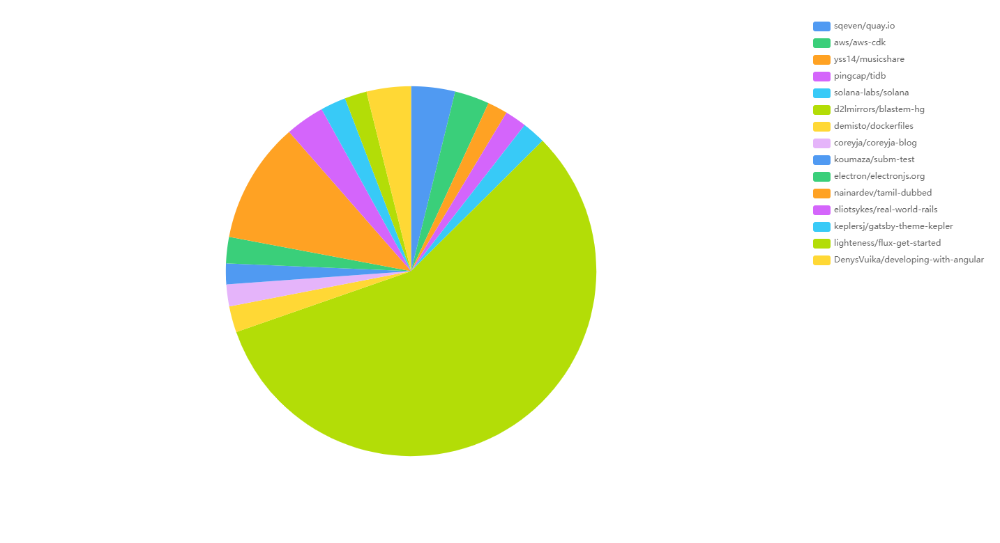
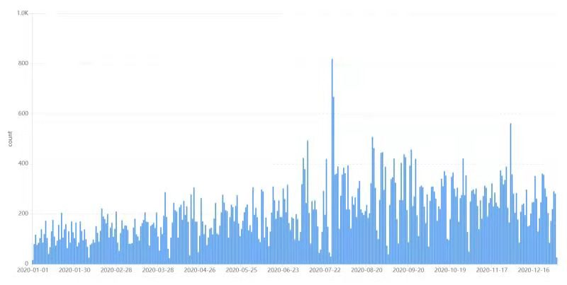

# 开源项目ClickHouse分析
**摘要：** ClickHouse是一个用于联机分析(OLAP)的列式数据库管理系统(DBMS)
## 一、数据类分析
### 1.1 基础的统计数据分析
&emsp;&emsp;
ClickHouse在2020年共有7091名用户活跃用户，共产生75926次事件操作，其中共有13种事件类型，包括IssueCommentEvent,PushEvent,PullRequestEvent,PullRequestReviewCommentEvent,IssueEvent,CreateEvent,WatchEvent,DeleteEvent,ForkEvent,ReleaseEvent,CommitCommentEvent,MemberEvent,GollumEvent，其中IssueCommentEvent,PushEvent两个事件最多，可以看出ClickHouse社区非常繁荣，问题讨论与项目开源质量都非常高。

&emsp;&emsp;
同时根据月份划分事件数量，可以看到ClickHouse社区活跃度随着月份不断提高。尤其是7，8，9月份的社区活跃度，全年最高。

### 1.2 开发者数据统计、可视化
&emsp;&emsp;
从之前的分析可以看出，ClickHouse作为一个成熟的开源项目，其问题评论是相当多的，在此我们统计比较活跃的问题评论用户，提交问题评论大多数情况下是为了解决问题，可以从侧面反应活跃用户对于社区项目的理解。

### 1.3 关联数据分析
&emsp;&emsp;
我们通过统计在ClickHouse上触发事件的用户，在其他项目上的贡献，来找出与ClickHouse相关联的项目，以下是统计出的前十五个比较相关的项目：

### 1.4 用户活跃图
&emsp;&emsp;
我们通过用户统计，筛选出了所有用户在2020年本项目中的用户活跃图，可以看到在2020年7月末期，有大量的用户活跃度，并且在之后的活跃度也明显比之前的高，说明有更多的用户在参与这个项目，更加活跃。



##  二、日常协作流程调研

`ClickHouse`是一个用于分析处理的开源列式数据库，它的开发协作完全在GitHub上完成。

### GitHub issue

`ClickHouse`主要使用`issue`作为社区的讨论区。根据`issue`的类型可以使用不同格式的`issue`模板。

* question
  * 提问前需要先看文档，确保没有重复的问题。对于比较简短的问题可以在telegram上或是stackoverflow上提问。
* feature request
  * 需要明确写出用例以及解决方案。
* bug  report
  * bug 的行为，在什么版本出现，预期行为是什么，如何复现 bug以及相关的上下文。

在`issue`提出之后，社区响应时间很快。一般在一天之内就可以得到相应的答复。以及会贴上相应的`label`，比如bug是属于哪一部分。同时会`assign`给社区的成员去解决问题。

除了上述的 issue 类型，社区的发展方向等问题也会在`issue`中讨论，比如现在在`pinned issue`位置的就是有关2021 roadmap的讨论，以及最近21.7版本必须解决的issue的讨论等。

ClickHouse社区的运作是完全透明的。内部成员的交流也都在issue中公开讨论。

### 邮件列表

邮件列表中的讨论不是特别频繁，但偶尔也会有人发邮件提问，一般也可以得到快速的响应。

## 开发者参与流程调研

#### 1. fork

首先在自己的github上fork一份ClickHouse代码。

#### 2. clone到本地

```
git clone --recursive https://github.com/your_name/ClickHouse
```

#### 3. 创建新的分支

```
git checkout -B fix_xx(branch名字)
```

#### 4. 功能开发

在完成开发任务之后，开发者可以提交一个Pull Request到官方master分支。

#### 5. `can be testd`标签

作为外部开发者需要等待社区的member打[can be tested]标签，才可以跑CI/CD。内部开发者应该是可以直接跑CI/CD的。CI/CD流程在下一节中详细说明。
CI/CD协助开发者发现一些代码Style、编译以及测试等错误，这样开发者就可以在自己的分支不停的迭代、修正。

如果只是修改typo，或者是文档类型的PR，这个标签Upstream通常不会添加。

#### 6. Merge到Master

在reviewer approved之后就可以merge进master分支了。之后在社区中你的ID后面就会有`contributor`的标签了。截止现在社区有contributor 713人。

社区对新的 contributor 还是很友好的，会及时review 你的代码，甚至会在必要的时候帮你改代码。

## CI/CD的流程调研

当提交 PR 时，ClickHouse 持续集成 (CI) 系统会为代码运行一些自动检查。这发生在member（来自 ClickHouse 团队的某个人）筛选了代码并将`can be testd`标签添加到 PR 之后。检查结果列在 GitHub  PR 页面上。如果检查失败，可能需要修复它。

如果检查失败看起来与您的更改无关，则可能是一些暂时性故障或其他问题。将空提交推送到拉取请求以重新启动 CI 检查：

``` bash
git reset
git commit --allow-empty
git push
```

下面简单介绍一下CI/CD的检查的主要内容。

### Docs check

尝试构建 ClickHouse 文档网站。如果更改了文档中的某些内容，它可能会失败。最可能的原因是文档中的某些交叉链接是错误的。转到检查报告并查找错误和警告消息。

### Description Check

检查您的拉取请求的描述是否符合模板 PULL_REQUEST_TEMPLATE.md。

### Style Check

使用 utils/check-style/check-style 二进制文件执行一些简单的基于正则表达式的代码风格检查（注意它可以在本地运行）。如果失败，请按照代码样式指南修复样式错误。

### Build Check

以各种配置构建 ClickHouse，以用于进一步的步骤。您必须修复失败的构建。构建日志通常有足够的信息来修复错误。 

### Fast Test

通常这是为 PR 运行的第一次检查。它构建了 ClickHouse 并运行了大部分无状态功能测试。如果失败，则在修复之前不会开始进一步检查。查看报告以了解哪些测试失败。

### Stress Test

从多个客户端同时运行无状态功能测试以检测与并发相关的错误。

### Performance Tests

测量查询性能的变化。这是最长的检查，需不到 6 小时运行。