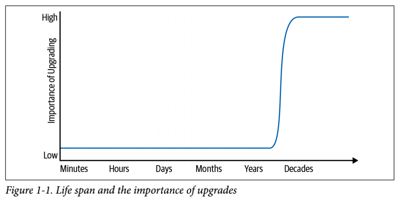
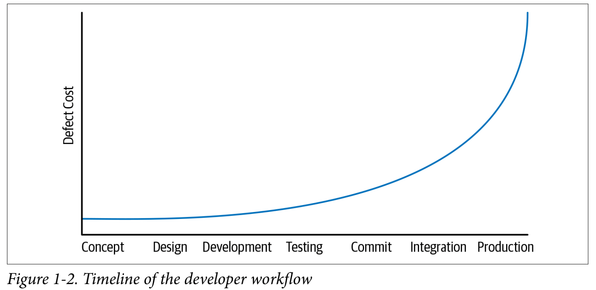

# 第一章

## 什么是软件工程？

> 没有什么东西是建立在石头上的；所有的东西都是建立在沙子上的，但我们必须把沙子当作石头来建造。
>
> —Jorge Luis Borges

我们认为编程和软件工程之间有三个关键性的区别：时间、规模和作用的权衡。在一个软件工程项目中，工程师需要更关注时间消耗和最终需求的改变。在软件工程组织中，我们需要更关注规模和效率，既要关注我们生产的软件，也要关注生产软件的组织。最后，作为软件工程师，通常基于对时间和增长的不精确估计，我们被要求做出更多复杂的决策，伴随着更高的风险。

在Google内部，我们有时会说：“软件工程就是随着时间的推移而整合的编程”。编程当然是软件工程的一个重要部分：毕竟，编程是你首先生成新软件的方式。如果你接受这种区分，也就清楚了，我们可能需要划分编程任务（开发）和软件工程任务（开发、修改、维护）。时间的加入给编程增加了一个重要的新维度。立方体不是正方形，距离不是速度。软件工程不是编程。

观察时间对程序影响的一种方法是思考这样一个问题：“你的代码的预期寿命是多少？”。这个问题的合理答案大约有10万倍的差异。想想需要持续几分钟的代码和想象能活几十年的代码一样合理。一般来说，处于该频谱短端的代码是不受时间影响的。你不可能为了一个实用性只有一个小时的程序而需要适应新的底层库、操作系统（OS）、硬件或语言版本。这些短命的系统实际上 “只是 ”一个编程问题，就像一个立方体在一个维度上被压缩得足够远就是一个正方形一样。当我们把这个时间扩大到允许更长的寿命时，变化变得更加重要。在十几年的时间里，大多数程序的依赖性，无论是隐性的还是显性的，都可能会发生变化。这种认识是我们区分软件工程师和编程的根本。

这种区别是我们所说的软件可持续性的核心。如果在软件的预期生命周期内，你有能力对任何有价值的变化做出反应，无论是技术上的还是商业上的，你的项目就是可持续的。重要的是，我们只关注能力——你可能会因为缺乏价值或其他优先事项而选择不执行特定的升级。当你无法对基础技术或产品方向的变化做出反应时，你就等于把高风险的赌注押在了希望这种变化永远不会成为关键。对于短期项目，这可能是一个安全的赌注。但在几十年的时间里，这可能并不安全。

另一种看待软件工程的方法是考虑规模。有多少人参与？他们在长期的开发和维护中扮演了什么角色？一个编程任务往往是个人创造的行为，但一个软件工程任务是一个团队的努力。早期对软件工程进行定义的尝试为这一观点产生了一个很好的定义：“多人开发多版本程序”。这说明软件工程与编程的区别是时间和人员的区别。团队协作带来了新的问题，但也提供了比任何一个程序员都更有可能产生有价值的系统。

团队组织、项目组成以及软件项目的政策和实践都主导着软件工程复杂性的这一方面。这些问题是规模化所固有的：随着组织的发展和项目的扩大，它在生产软件方面是否变得更有效率？我们的开发工作流程是否随着我们的成长而变得更有效率，或者我们的版本控制政策和测试策略是否让我们付出了相应的代价？围绕着沟通和人的规模问题从软件工程的早期就开始讨论了，一直可以追溯到人月神话。这样的规模问题往往是政策问题，也是软件可持续性问题的根本：我们需要重复做的事情要付出多少代价？

我们也可以说，软件工程在需要做出的决定的复杂性和其利害关系方面与编程不同。在软件工程中，我们经常被迫评估几条前进道路之间的权衡，有时风险很高，而且往往有不完善的价值衡量标准。软件工程师或软件工程领导者的工作，是为了实现组织、产品和开发工作流程的可持续性和管理扩展成本。考虑到这些投入，评估你的权衡并做出合理的决定。我们有时可能会推迟维护变化，甚至拥抱那些不能很好扩展的政策，因为我们知道我们需要重新审视这些决定。这些选择应该是明确的，并清楚地说明推迟的成本。

在软件工程中，很少有放之四海而皆准的解决方案，这本书也是如此。考虑到 ”这个软件的寿命有多长 ”的合理答案是100,000倍，”你的组织中有多少工程师 ”的范围可能是10,000倍，以及谁知道 ”你的项目有多少计算资源”，谷歌的经验可能与你的不一致。在本书中，我们旨在介绍我们在构建和维护预计将持续数十年的软件过程中所发现的有效方法，这些软件拥有数以万计的工程师和遍布全球的计算资源。我们发现在这种规模下所需要的大多数做法也会对较小的工作有很好的效果：把这看作是关于一个工程生态系统的报告，我们认为当你扩大规模时，它可能是好的。在一些地方，超大规模会带来自己的成本，而我们更乐意不支付额外的管理费。我们把这些叫出来作为一个警告。希望如果你的组织发展到足以担心这些成本，你可以找到一个更好的答案。

在我们讨论关于团队工作、文化、政策和工具的具体细节之前，让我们首先阐述一下时间、规模和权衡这些主要主题。

### 时间与变化

当一个新手在学习编程时，所产生的代码的寿命通常是以小时或天来衡量的。编程作业和练习往往是一次性写完的，几乎没有重构，当然也没有长期维护。这些程序在最初制作后往往不会再被重建或执行。这在教学环境中并不令人惊讶。也许在中学或中学后的教育中，我们可能会发现一个团队项目课程或实践论文。如果是这样的话，这样的项目很可能是学生代码活得超过一个月左右的唯一时间。这些开发者可能需要重构一些代码，也许是为了应对不断变化的需求，但他们不太可能被要求处理环境的更大变化。

在常见的行业环境中，我们也发现了短命代码的开发者。移动应用程序的寿命通常相当短，而且无论好坏，完全重写是比较常见的。早期创业公司的工程师可能会正确地选择关注眼前的目标，而不是长期投资：公司可能活得不够长，无法从回报缓慢的基础设施投资中获得收益。一个连续的初创公司的开发人员可能有10年的开发经验，但很少或根本没有维护任何预期存在超过一两年的软件的经验，这是非常合理的。

在光谱的另一端，一些成功的项目实际上具有无限制的寿命：我们不能合理地预测谷歌搜索、Linux内核或Apache HTTP服务器项目的终点。对于大多数谷歌项目，我们必须假设它们将无限期地生存下去——我们无法预测何时不需要升级我们的依赖关系、语言版本等等。随着寿命的增长，这些长寿的项目最终会有与编程作业或初创公司开发不同的感觉。

请看图1-1，它展示了两个处于 ”预期寿命 ”两端的软件项目。对于一个从事预期寿命为几个小时的任务的程序员来说，什么样的维护是合理的？也就是说，如果你在做一个将被执行一次的Python脚本时，你的操作系统出现了新的版本，你应该放弃你正在做的事情而进行升级吗？当然不是：升级并不关键。但是在光谱的另一端，谷歌搜索停留在我们的操作系统的90年代的版本上将是一个明显的问题。



预期寿命谱上的低点和高点表明，在某个地方有一个过渡。在一个一次性项目和一个持续几十年的项目之间的某个地方，发生了一个过渡：一个项目必须开始对不断变化的外部因素作出反应。7 对于任何从一开始就没有计划升级的项目来说，这种过渡很可能是非常痛苦的，原因有三，每一个原因都会加重其他原因。

- 你正在执行一项尚未为这个项目完成的任务；更多隐藏的假设已经被烘托出来了。
- 试图进行升级的工程师不太可能有这种任务的经验。
- 升级的规模往往比平时大，一次做几年的升级，而不是更多的递增式升级。

因此，在实际经历了一次这样的升级（或中途放弃）之后，高估了后续升级的成本并决定 ”再也不升级 ”是非常合理的。得出这个结论的公司最终会承诺把东西扔掉，重写他们的代码，或者决定不再升级。与其采取自然的方法来避免一项痛苦的任务，有时更负责任的答案是投资使它不那么痛苦。这完全取决于你的升级成本，它所提供的价值，以及有关项目的预期寿命。

不仅要通过第一次大的升级，而且要达到能够可靠地保持现状的程度，这是你的项目长期可持续性的本质。可持续性需要规划和管理所需变化的影响。对于谷歌的许多项目，我们相信我们已经实现了这种可持续性，主要是通过试验和错误。

那么，具体来说，短期编程与制作预期寿命更长的代码有什么不同？随着时间的推移，我们需要更加清楚地认识到 ”碰巧能用 ”和 ”可维护 ”之间的区别。对于识别这些问题，没有完美的解决方案。这是不幸的，因为保持软件的长期可维护性是一场持久战。

### 海勒姆法则

如果你正在维护一个被其他工程师使用的项目，那么关于 ”它可以工作 ”与 ”它可以维护 ”的最重要的教训就是我们所说的海勒姆法则。

> 有了足够数量的API用户，你在合同中承诺什么并不重要：你的系统的所有可观察行为都会被某人依赖。

根据我们的经验，这个公理是任何关于随时间变化的软件的讨论中的一个主导因素。它在概念上类似于熵：讨论随时间变化和维护时必须注意到海勒姆定律8，正如讨论效率或热力学时必须注意到熵一样。熵不会减少并不意味着我们不应该努力提高效率。海勒姆定律在维护软件时也会适用，但这并不意味着我们不能对它进行规划或试图更好地理解它。我们可以减轻它，但我们知道它永远不可能被根除。

海勒姆法则代表了这样一个实际的知识：即使有最好的意图、最好的工程师和坚实的代码审查实践，我们也不能假定对已发布的合同或最佳实践的完美遵守。作为一个API的拥有者，你可以通过明确接口承诺来获得一些灵活性和自由，但是在实践中，一个特定的变化的复杂性和难度也取决于用户发现你的API的一些可观察的行为有多有用。如果用户不能依赖这样的东西，你的API就会很容易改变。如果有足够的时间和足够的用户，即使是最无害的改变也会破坏一些东西；9 你对该改变的价值的分析必须包括调查、识别和解决这些破坏的难度。

### 例子：哈希排序

考虑一下哈希迭代排序的例子。如果我们在一个基于哈希的集合中插入五个元素，我们会以什么顺序把它们取出来呢？

```python
>>> for i in {”apple”, ”banana”, ”carrot”, ”durian”, ”eggplant”}: print(i) 
...
durian
carrot
apple
eggplant
banana
```

大多数程序员都知道，哈希表是不明显的排序。很少有人知道他们所使用的特定哈希表是否打算永远提供这种特定的排序的具体情况。这可能看起来不值一提，但在过去的一二十年里，计算行业使用这种类型的经验已经发生了变化：

- 哈希泛滥攻击为非确定性的哈希迭代提供了更大的动力。
- 对改进的哈希算法或哈希容器的研究可能带来的效率提升需要改变哈希迭代顺序。
- 根据海勒姆定律，如果程序员有能力的话，他们会编写依赖于哈希表遍历顺序的程序。

因此，如果你问任何专家：”我可以为我的哈希容器假设一个特定的输出序列吗？”该专家大概会说：”不行。” 总的来说，这是正确的，但也许是简单化的。一个更细致的答案是：”如果你的代码是短期的，没有改变你的硬件、语言运行时间或数据结构的选择，这样的假设是好的。如果你不知道你的代码能活多久，或者你不能保证你所依赖的任何东西都不会改变，这样的假设是不正确的”。此外，即使你自己的实现不依赖于哈希容器的顺序，它也可能被其他代码使用，隐含地创造了这样一种依赖性。例如，如果你的库将值序列化到远程过程调用（RPC）响应中，RPC调用者可能会依赖于这些值的顺序。

这是一个非常基本的例子，说明了 ”它可以工作 ”和 ”它是正确的 ”之间的区别。对于一个短命的程序，依赖你的容器的迭代顺序不会引起任何技术问题。另一方面，对于一个软件工程项目来说，这种对定义好的顺序的依赖是一种风险——只要有足够的时间，就会有东西让你改变这个迭代顺序。这种价值可以体现在很多方面，无论是效率、安全，还是仅仅是对数据结构的未来保护，以适应未来的变化。当这种价值变得清晰时，你将需要权衡这种价值和破坏你的开发者或客户的痛苦之间的权衡。

一些语言专门在库的版本之间，甚至在同一程序的执行之间随机化哈希排序，以试图防止依赖性。但即使是这样，还是会有一些海勒姆法则的惊喜：有一些代码将哈希迭代排序作为一种低效的随机数生成器。现在去掉这种随机性会破坏这些用户。正如熵在每个热力学系统中的增加一样，海勒姆定律适用于每个可观察的行为。

仔细思考以 “现在工作 “和 “无限期工作 “的心态编写的代码之间的差异，我们可以提取一些明确的关系。把代码看作是一个具有（高度）可变寿命要求的人工制品，我们可以开始对编程风格进行分类：依赖于其依赖关系的脆弱和未公布的特征的代码可能会被描述为 “黑客 “或 “聪明“，而遵循最佳实践并对未来进行规划的代码则更可能被描述为 “干净 “和 “可维护“。两者都有各自的目的，但你选择哪一种，主要取决于相关代码的预期寿命。我们已经习惯说：“如果‘聪明‘是一种赞美，那就是编程，但如果‘聪明‘是一种指责，那就是软件工程“。

#### 为什么不以“没有变化”为目标？

所有这些关于时间和需要对变化做出反应的讨论都隐含着一个假设，即变化可能是必要的。是这样吗？

与本书中的其他内容一样，这看具体情况而定。我们会欣然承诺：“对于大多数项目，在足够长的时间内，它们下面的一切都可能需要改变”。如果你有一个用纯C语言编写的项目，没有外部依赖性（或者只有像POSIX这样承诺长期稳定的外部依赖性），你很可能能够避免任何形式的重构或困难的升级。C语言在提供稳定性方面做得很好——在许多方面，这是它的主要目的。

大多数项目在底层技术变化时遭受风险要多得多。大多数编程语言和运行时的变化比C语言要大得多。即使是用纯C语言实现的库，也可能为了支持新的功能而改变，这可能会影响到下游的用户。安全问题在各种技术中都有披露，从处理器到网络库到应用程序代码。你的项目所依赖的每一项技术都有一些（希望是小的）风险，包含关键的错误和安全漏洞，而这些问题可能在你开始依赖它之后才被发现。如果你没有能力为Heartbleed部署补丁，或减轻像Meltdown和Spectre这样的缓解投机性执行问题的话，你就是在假设（或承诺）什么都不会改变，这就是一场重大的赌博。

效率的提高使情况更加复杂。我们希 望为我们的数据中心配备高性价比的计算设备，尤其是提高CPU效率。然而，早期Google的算法和数据结构在现代设备上的效率实在是太低了：链表或二叉树仍然可以正常工作，但CPU周期与内存延迟之间不断扩大的差距影响了“高效”代码的样子。随着时间的推移，如果不对软件进行相应的设计修改，升级到新硬件的价值就会降低。向后兼容可以确保旧系统仍然可以运行，但这并不能保证旧的优化仍然有用。不愿意或不能够利用这样的机会，反而可能招致巨大的成本费用。这样的效率问题特别微妙：原来的设计可能是完全合理的，遵循合理的最佳实践。只有在经过向后兼容的变化演变之后，一个新的、更有效率的方案才变得重要。不改变并没有犯错，但时间的流逝还是让改变变得有价值。

刚才提到的，就是为什么那些没有投资于可持续性的长期项目会有很大的风险。我们必须有能力应对这类问题，利用这些机会，不管它们是直接影响我们，还是只表现为我们所建立的技术的过渡性封闭。改变并不是天生的好事。我们不应该为了改变而改变。但我们确实需要有能力去改变。如果我们考虑到这种最终的必要性，我们也应该考虑是否要投资让这种能力变得便宜。每个系统管理员都知道，在理论上知道可以从磁带上恢复是一回事，而在实践中确切地知道如何去做，以及在必要时需要花费多少钱又是另一回事。实践和专业知识是提高效率和可靠性的重要推动力。

#### 规模和效率

正如《Site Reliability Engineering》（SRE）一书中所指出的那样，Google的生产系统作为一个整体，是人类创造的最复杂的机器之一。构建这样一台机器并保持其平稳运行所涉及的复杂性，需要我们整个组织和全球的专家进行无数小时的思考、讨论和重新设计。所以，我们写了一本书，内容是保持该机器以这种规模运行的复杂性。

本书的大部分内容都集中在生产这样一台机器的组织的复杂规模，以及我们用来保持这台机器长期运行的过程。再考虑一下代码库可持续性的概念：“当你能够安全地改变所有你应该改变的东西，并且能够在你的代码库的生命周期内改变时，你的组织的代码库就是可持续的。”在关于能力的讨论中，还隐藏着一个成本问题：如果改变某件事情需要付出过高的成本，那么它很可能会被推迟。如果成本随着时间的推移超线性增长，那么这个操作显然是不可扩展的。最终，时间会占据主导地位，会出现一些你绝对必须改变的意外情况。当你的项目范围扩大一倍，你需要再次执行该任务时，是否会耗费两倍的人力？下一次你还会有所需的人力资源来解决这个问题吗？

人力成本并不是唯一需要扩展的有限资源。就像软件本身需要利用计算、内存、存储和带宽等传统资源进行良好的扩展一样，该软件的开发也需要扩展，包括人力时间的参与和为你的开发工作流提供动力的计算资源。如果你的测试集群的计算成本超线性增长，每个季度每个人消耗的计算资源更多，那么你就走在一条不可持续的道路上，需要尽快做出改变。

最后，软件组织最宝贵的资产——代码库本身也需要扩展。如果你的构建系统或版本控制系统随着时间的推移而超线性地扩展，也许是由于增长和不断增加的变更日志历史的结果，那么你可能会到了一个你根本无法继续下去的地步。很多问题，比如“做一个完整的构建需要多长时间？”、“拉一个新的版本库需要多长时间？”或者“升级到一个新的语言版本需要多少钱？”并没有被主动监控，变化的速度很慢。它们很容易变得像温水煮青蛙一样，问题很容易慢慢恶化，但永远不会表现为一个单一的危机时刻。只有全组织意识到并致力于规模化，你才有可能关注这些问题。

你的组织赖以生产和维护代码的所有东西，在总体成本和资源消耗方面应该是可扩展的。特别是，你的组织必须反复做的所有事情，在人力方面都应该是可扩展的。许多常见的策略在这个意义上似乎并不具有可扩展性。

#### 不能扩展的策略

只要稍加实践，就能更容易发现具有不良扩展属性的策略。通常，可以通过考虑对单个工程师施加的工作并想象组织将规模扩大10或100倍来确定这些问题。 当我们规模扩大10倍时，我们会不会增加10倍的工作，我们的样本工程师需要跟上？我们的工程师必须完成的工作量是否会随着组织规模的增长而增长？工作量是否会随着代码库规模的扩大而扩大？如果上述两种情况属实，我们是否有任何机制来自动化或优化这些工作？如果没有，我们就会出现扩展问题。

考虑一下传统的弃用方法。我们将在第15章中更多地讨论弃用问题，但常见的弃用方法可以作为扩展问题的一个很好的例子。一个新组件被开发出来了，然后决定大家都用新的，停止使用旧的。为了激励大家，项目负责人说：“我们将在8月15日删除旧组件，请确保你已经将原有的转换到新组件上。”

这种类型的方法在小型软件环境中可能有效，但随着依赖图的深度和广度的增加，很快就会失效。团队对组件的依赖程度越来越高，一个单一的构建中断就会以越来越大的比例影响到公司。以可扩展的方式解决这些问题意味着改变我们处理弃用问题的方式：与其将迁移工作推给客户，团队可以自己将其内部化，从而实现规模经济。

2012年，我们试图用缓解流失的规则来制止这种情况：基础设施团队必须自己动手将内部用户迁移到新版本，或者以向后兼容的方式在原地进行更新。这个被我们称为“流失规则”的政策能更好地扩展：依赖性项目不再为了跟上进度而逐渐花费更大的精力。我们还了解到，由一组专门的专家来执行变更，比要求每个用户付出更多的维护努力更有扩展性：专家们会花一些时间深入学习整个问题，然后将这些专业知识应用到每个子问题上。强迫用户应对流失意味着每个受影响的团队都会做得比专家更差，并在解决了他们眼前的问题后扔掉那些现在无用的知识。

传统的开发分支的使用是另一个有内在扩展问题的策略的例子。一个组织可能会发现，将大型功能合并到主干中已经破坏了产品的稳定性，并得出结论：“我们需要更严格地控制东西何时合并。我们应该减少合并的频率。”这很快导致每个团队或每个特性都有独立的开发分支。每当任何一个分支被决定为“完整”时，它就会被测试并合并到主干中，从而引发其他仍在其开发分支上工作的工程师的一些潜在的形式为重新同步和测试的大量工作。这样的分支管理对于小型组织，可以在5到10个这样的分支中发挥作用。但随着组织规模（以及分支数量）的增加，我们很快就会发现，为了完成同样的任务，我们付出的开销越来越大。当我们扩大规模时，我们需要一种不同的方法，我们将在第16章讨论这个问题。

#### 具有良好扩展性的策略

随着组织的发展，什么样的策略会带来更佳的成本？或者进一步，随着组织的发展，我们可以制定什么样的策略来提供超线性的价值？

我们最喜欢的内部策略之一是构建可以保护团队安全进行基础架构变更的能力，这也是基础架构团队的一大助力。“如果一个产品由于基础架构变更而出现中断或其他问题，但这个问题没有被我们的持续集成（CI）系统中的测试所覆盖到，那就不是基础架构变更的错。”更通俗地说，这句话可以被表述为“如果你喜欢它，你就应该对它进行CI测试”，即我们所称的“碧昂斯规则”（The Beyoncé Rule）13。从扩展性的角度来看，碧昂斯规则意味着：如果复杂的、一次性的定制测试不是由我们常见的CI系统触发的，则这个测试就不算数。如果没有这一点，基础设施团队的工程师可以想象，需要跟踪每一个团队的任何受影响代码，并询问他们如何运行测试。当有一百个工程师的时候，我们当然还可以做到这一点，但我们绝对不能再这样做了。

我们发现，随着组织规模的扩大，专业知识和共享交流论坛提供了巨大的价值。当工程师在共享论坛上讨论和回答问题时，知识往往会传播。新的专家也会成长起来。如果你有一百个工程师在写Java，一个愿意友好回答问题、有帮助的Java专家很快就会产生一百个写出更好Java代码的工程师。知识是病毒式的，专家是载体，这些为工程师扫除常见的绊脚石的价值是很大的。我们将在第3章中更详细地介绍这个问题。

#### 例子：编译器升级

考虑一下升级编译器这个艰巨的任务。理论上讲，考虑到语言向后兼容需要付出多少努力，编译器升级应该是很便宜的，但实际操作起来有多便宜呢？如果你从来没有做过这样的升级，你会如何评估你的代码库是否与这种变化兼容？

根据我们的经验，语言和编译器的升级是微妙而困难的任务，即使它们大体上被期望是向后兼容的。编译器升级几乎总是会导致行为的微小变化比如修复错误编译、调整优化或可能改变任何以前未定义的结果。你将如何针对所有这些潜在的结果评估整个代码库的正确性呢？

谷歌历史上最传奇的一次编译器升级发生在2006年。当时，我们已经运营了几年，有几千名工程师在职，而我们已经有大约五年没有更新编译器了，大部分工程师都没有更换编译器的经验。我们的大部分代码只经历过一个编译器版本。对于一个（大部分）由志愿者组成的团队来说，这是一项艰难而痛苦的任务。这个任务最终变成了寻找捷径和简化的问题，以便绕过我们不知道如何采用的上游编译器和语言变化。14 最终，2006年的编译器升级是非常痛苦的。许多大大小小的海拉姆定律（Hyrum's Law）问题已经潜入代码库，加深了我们对特定编译器版本的依赖性。打破这些隐性的依赖是痛苦的。有关的工程师们正在冒着风险：我们还没有碧昂斯法则，也没有一个普遍的CI系统，所以很难提前知道变化的影响，也很难确定他们不会因为回归而受到责备。

这个故事一点也不稀奇。许多公司的工程师都可以讲述一个关于痛苦的升级的类似故事。不寻常的是，我们在事后认识到这项任务是痛苦的，并开始关注技术和组织变革，以克服规模扩展问题，并将规模转化为我们的优势：自动化（使一个人可以做更多的事情），整合/一致性（使低级别的变化的问题范围有限），以及专业知识（使一些人可以做更多的事情）。

改变基础设施的频率越高，就越容易做到这一点。我们发现，大多数时候，当代码作为编译器升级等事情的一部分进行更新时，它就会变得不那么脆弱，并且在未来更容易升级。在一个生态系统中，大多数代码都经历了多次升级，它不再依赖于底层实现的细微差别，而是依赖于语言或操作系统保证的实际抽象。不管你到底要升级什么，即使控制了其他因素，预计一个代码库的第一次升级也会比以后的升级贵很多。

通过这个和其他经验，我们发现了很多影响代码库灵活性的因素。

*专业知识*

​		我们知道如何做到这一点；对于某些语言，我们现在已经在许多平台上做了数百次的编译器升级。

*稳定性*

​		由于我们更有规律地采用发布版本，因此发布版本之间的变化较小；对于一些语言，我们现在每隔一两个星期就会部署编译器升级。

*符合性*

​		没有经过升级的代码已经比较少了，这也是因为我们在定期升级。

*熟悉度*

​		由于我们经常这样做，我们可以在执行升级的过程中发现冗余，并尝试自动化。这与SRE关于辛苦工作的观点有很大的重合。

*政策*

​		我们有像碧昂丝规则这样的流程和政策。这些流程的净效果是，升级仍然是可行的，因为基础设施团队不需要担心每一个未知的使用，只需要担心我们CI系统中可见的使用。


根本的教训不是关于编译器升级的频率或难度，而是当我们意识到编译器升级任务是必要的时候，我们就想方设法确保用恒定数量的工程师来执行这些任务，即使代码库随着增长。16 如果我们反而认为这项任务太昂贵，今后应该避免，我们可能还在使用一个十年前的编译器版本。由于错过了优化机会，我们可能要为计算资源多付25%的费用。鉴于2006年时代的编译器肯定无助于缓解投机性执行漏洞，我们的中央基础设施可能会受到重大安全风险的影响。停滞不前是一种选择，但往往不是明智之举。

### 向前转移问题

我们看到的一个广泛的真理是，在开发者工作流程中更早地发现问题，通常会减少成本。考虑一下开发人员工作流程的时间线，从左到右，从概念和设计开始，经过实施、审查、测试、提交、检查漏洞，以及最终的生产部署。在这个时间轴上，将问题检测转移到时间线左边的问题，会使问题的处理成本降低。如图1-2所示，将问题转移到时间轴“左边”处，比起等待更长的时间，修复问题的成本更低。

这个术语似乎起源于这样的论点：安全问题不能被推迟到开发过程的最后阶段，并要求 “在安全问题上向左转移”。这种情况下的论点相对简单：如果一个安全问题在你的产品投入生产后才被发现，你就有一个非常昂贵的问题。如果它在部署到生产之前被发现，可能仍然需要大量的工作来识别和补救问题。补救问题，但它更便宜。如果你能在最初的开发者将缺陷提交到版本控制之前发现它，那就更便宜了：他们已经对该功能有了了解；根据新的安全限制进行修改比 提交并强迫别人去分流和修复它。



同样的基本模式在本书中出现了很多次。在提交前通过静态分析和代码审查发现的缺陷 在提交之前，通过静态分析和代码审查发现的错误要比 在提交前通过静态分析和代码审查发现的错误要比在生产中出现的错误便宜得多。在开发过程的早期提供强调质量、可靠性和安全性的工具和实践。在开发过程的早期提供强调质量、可靠性和安全性的工具和实践是我们许多基础设施团队的一个共同目标。我们的基础设施团队的共同目标。没有一个过程或工具需要完美，所以我们可以 我们可以采取深入防御的方法，希望能尽可能多地捕捉到图表左边的缺陷。尽可能多地抓住图表左边的缺陷。

### 权衡与成本

如果我们了解如何编程，了解我们所维护的软件的寿命，并了解在我们随着更多的工程师生产和维护新功能而扩大规模时如何维护它，那么剩下的就是做出好的决定。这似乎很明显：在软件工程中，就像在生活中一样，好的选择会带来好的结果。然而，这一观点的后果很容易被忽视。在谷歌内部，人们对 “因为我这么说 ”非常反感。对于任何话题，都要有一个决定者，当决定似乎是错误的时候，要有明确的升级路径，但目标是达成共识，而不是一致。看到一些 “我不同意 ”的情况是可以的，也是人们所期待的。“我不同意你的衡量标准/评价，但我知道你是如何得出这个结论的”。所有这一切的内在想法是，每件事都需要有一个理由；“只是因为”、“因为我这么说 ”或 “因为其他人都这么做 ”是潜伏着错误决定的地方。只要这样做是有效的，在决定两个工程选项的一般成本时，我们应该能够解释我们的工作。

我们所说的成本是什么意思？我们在这里不仅是在谈论美元。“成本 ”大致上是指努力，可以涉及任何或所有这些因素：

- 财务成本（如，金钱）
- 资源成本（如，CPU时间）
- 人事成本（如，工程努力）
- 交易成本（如，采取行动的成本是多少？）
- 机会成本（如，不采取行动的代价是什么？）
- 社会成本（如，这一选择将对整个社会产生什么影响？）

从历史上看，特别容易忽视社会成本的问题。然而，谷歌和其他大型科技公司现在可以可信地部署拥有数十亿用户的产品。数十亿的用户。在许多情况下，这些产品是一个明显的净收益，但当我们以这样的规模运作时，即使是在可用性、可及性、公平性方面的微小差异。或滥用的可能性都会被放大，往往会损害那些已经被边缘化的群体。被边缘化的群体。软件渗透到社会和文化的许多方面；因此，我们应该意识到这一点。因此，我们在做出产品和技术决定时，意识到我们所促成的好事和坏事是明智的。产品和技术决策时，我们应该意识到我们所促成的好事和坏事。我们将在第四章中更多地讨论这个问题。

除了上述的成本（或我们对它们的估计），还有一些偏见：现状偏见、损失厌恶，以及其他。当我们评估成本时，我们需要牢记之前列出的所有成本：一个组织的健康不仅仅是银行里是否有钱，还包括其成员是否感到有价值和有生产力。在像软件工程这样高度创造性和有利可图的领域，财务成本通常不是限制因素——人员成本通常是。保持工程师的快乐、专注和参与所带来的效率提升可以很容易地支配其他因素，仅仅是因为专注和生产力是如此多变，10-20%的差异很容易想象。

### 例子：标记

在许多组织中，白板笔被视为贵重物品。它们被严格控制，总是供不应求。无独有偶，在任何特定的白板上，有一半的标记是干的，无法使用。你有多少次参加会议时因为没有可用的记号笔而中断的会议？你有多少次因为马克笔用完了而影响了你的思路？有多少次，所有的标记都不翼而飞，大概是因为其他球队的标记用完了，而不得不用你的标记潜逃？所有这些都是为了一个成本不到一美元的产品。

谷歌往往在大多数工作区域都有未上锁的壁橱，里面装满了办公用品，包括白板笔。只要稍加注意，就可以很容易地拿到各种颜色的几十支记号笔。在某种程度上，我们做了一个明确的权衡：优化无障碍的头脑风暴远比防止有人带着一堆记号笔乱跑更重要。

我们的目标是对我们所做的每一件事，从办公用品和员工福利，到开发人员的日常经验，再到如何提供和运行全球规模的服务，都有同样程度的睁大眼睛和明确权衡所涉及的成本/利益权衡。我们经常说，“谷歌是一种数据驱动的文化”。事实上，这是一种简化：即使没有数据，也可能有证据、先例和论据。做出好的工程决策就是要权衡所有可用的输入，并对权衡做出明智的决定。有时，这些决定是基于本能或公认的最佳做法，但只是在我们用尽了试图衡量或估计真正的基本成本的方法之后。

最后，工程小组的决定应该归结为很少的事情：

- 我们这样做是因为我们必须这样做（法律要求、客户要求）
- 我们这样做是因为这是我们当时能看到的基于当前证据的最佳选择（由一些适当的决定者决定）

决定不应该是 “我们这样做是因为我这么说”。

### 决策投入

当我们在权衡数据时，我们发现两种常见的情况。

- 所有涉及的数量都是可以测量的，或者至少可以估计。这通常意味着我们正在评估CPU和网络之间的权衡，或者美元和内存之间的权衡，或者考虑是否要花费两周的工程师时间来为我们的数据中心节省N个CPU
- 有些数量是微妙的，或者我们不知道如何测量它们。有时这表现为 “我们不知道这需要多少工程师的时间。”有时它甚至更模糊：你如何衡量一个设计不佳的API的工程成本？或者一个产品选择的社会影响？

在第一种类型的决策上，没有什么理由会出现缺陷。任何软件工程组织都可以而且应该跟踪当前的计算资源、工程师工时和其他你经常接触的数量的成本。即使你不想向你的组织公布确切的美元数额，你仍然可以制作一个转换表：这么多CPU的成本与这么多内存或这么多网络带宽的成本相同。

有了商定的转换表在手，每个工程师都可以做自己的分析。“如果我花两周时间把这个链接列表改成一个更高性能的结构，我将会多用五吉字节的生产内存，但会节省两千个CPU。我应该这样做吗？” 这个问题不仅取决于内存和CPU的相对成本，而且还取决于人员成本（一个软件工程师两周的支持）和机会成本（这个工程师在两周内还能生产什么？）。

对于第二种类型的决定，没有简单的答案。我们依靠经验、领导力和先例来谈判这些问题。我们正在投资研究，以帮助我们量化难以量化的东西（见第七章）。然而，我们所拥有的最好的广泛建议是，意识到并非所有的事情都是可衡量或可预测的，并试图以同样的优先权和更大的谨慎对待此类决定。它们往往同样重要，但更难管理。

### 例子：分布式构建

考虑你的建设。根据完全不科学的Twitter民意调查，大约有60%到70%的开发者在本地构建，即使是今天的大型复杂构建。这就直接导致了这个 “编译 ”漫画所说明的非笑话——在你的组织中，有多少生产时间是在等待编译的？在你的组织中，有多少生产性时间是在等待构建时损失的？与为一个小团体运行类似distcc的东西的成本相比。或者，为一个大型团体运行一个小型的建造农场需要多少钱？这些成本需要多少个星期/月才能成为净赢？

早在2000年代中期，谷歌纯粹依靠本地构建系统：你检查出的代码，并在本地进行编译。在某些情况下，我们有大量的本地机器（你可以在你的桌面上构建地图！）。但随着代码库的增长，编译时间变得越来越长。不足为奇的是，因为损失了时间，我们在人员方面的开销越来越大，以及为更大和更强大的本地机器增加的资源成本，等等。这些资源成本特别麻烦：我们当然希望人们有尽可能快的构建，但大多数时候，高性能的桌面开发机器会闲置。这并不像适当的方式来投资这些资源。

最终，谷歌开发了自己的分布式构建系统。当然，这个系统的开发是有成本的：它需要工程师花时间来开发，需要更多的
工程师的时间来改变每个人的习惯和工作流程，学习新的系统。当然，它也花费了额外的计算资源。但是，总体上的节约显然是值得的：构建速度变快了，工程师的时间被收回了，而硬件投资可以集中在管理的共享基础设施上（实际上是我们的生产机群的一个子集），而不是一直在生产中使用。而不是越来越强大的台式机。第18章详细介绍了我们的分布式构建方法和相关的权衡。

因此，我们建立了一个新系统，将其部署到生产中，并加快了每个人的构建速度。这就是故事的圆满结局吗？不完全是：提供分布式构建系统对工程师的生产力有巨大的改善，但随着时间的推移，分布式构建本身变得臃肿。在以前的情况下，单个工程师的限制（因为他们的既得利益是保持他们的本地构建尽可能快）在分布式构建系统中是不受限制的。构建图中臃肿或不必要的依赖关系变得非常普遍。当每个人都直接感受到非最佳构建的痛苦，并被激励去保持警惕时，激励机制就会更好地统一起来。通过取消这些激励措施，并将臃肿的依赖关系隐藏在并行的分布式构建中，我们创造了一种情况，在这种情况下，消费可以猖獗，而且几乎没有人被激励去关注构建的臃肿。这让人联想到杰文斯悖论：一种资源的消费可能会增加，作为对其使用效率提高的回应。

总的来说，增加一个分布式建造系统所节省的成本远远超过了与建造和维护相关的负面成本。但是，正如我们看到的消费增加，我们没有预见到所有这些成本。当我们向前迈进的时候，我们发现自己处于这样一种境地：我们需要重新认识系统的目标和限制以及我们的使用，确定最佳实践（小的依赖性，机器管理的依赖性），并资助新生态系统的工具和维护。并为新的生态系统的工具和维护提供资金。即使是相对简单的 “我们花美元购买计算资源以收回工程师时间 ”的权衡，也会产生不可预见的下游影响。

### 例子：在时间和规模之间做出决定

在很多时候，我们的时间和规模的主要主题是重叠的，并结合在一起工作。像 “碧昂斯规则 ”这样的政策可以很好地扩展，并帮助我们随着时间的推移维护事物。操作系统界面的变化可能需要许多小的重构来适应，但大多数的变化会有很好的扩展性，因为它们的形式是相似的：操作系统的变化对每个调用者和每个项目都没有不同的表现。

时间和规模偶尔会发生冲突，而且没有任何地方像基本问题那样明显：我们应该添加一个依赖性，还是分叉/重新实现它，以更好地满足我们的本地需求？

这个问题可能出现在软件堆栈的许多层面上，因为通常情况下，为你狭窄的问题空间定制的解决方案可能比需要处理所有可能性的通用解决方案更出色。通过分叉或重新实现实用程序代码，并为你狭窄的领域进行定制，你可以更容易地添加新功能，或更有把握地进行优化，无论我们谈论的是微服务、内存缓存、压缩例程，还是我们软件生态系统中的其他东西。也许更重要的是，你从这样的分叉中获得的控制权将你与你的基础依赖的变化隔离开来：这些变化不是由另一个团队或第三方供应商决定的。你可以控制如何以及何时对时间的流逝和变化的必要性做出反应。

另一方面，如果每个开发者都把他们的软件项目中使用的所有东西分叉，而不是重复使用现有的东西，那么可扩展性就会和可持续性一起受到影响。对底层库的安全问题做出反应，不再是更新一个依赖关系及其用户的问题：现在是识别该依赖关系的每一个脆弱的分叉和这些分叉的用户的问题。

与大多数软件工程决定一样，这种情况没有一个放之四海而皆准的答案。如果你的项目寿命很短，分叉的风险就比较小。如果有问题的分叉在范围上是有限的，那也是有帮助的，同时也要避免分叉那些可能跨越时间或项目时间界限的接口（数据结构、序列化格式、网络协议）。一致性有很大的价值，但通用性也有其自身的成本，你往往可以通过做自己的事情来赢得胜利——如果你仔细做的话。

### 重新审视决定，犯下错误

致力于数据驱动文化的一个默默无闻的好处是承认错误的能力和必要性的结合。一个决定将在某个时候做出，基于现有的数据——希望是基于良好的数据和仅有的几个假设，但隐含的是基于当前可用的数据。随着新数据的出现，环境的变化，或假设的破灭，可能会发现一个决定是错误的，或在当时是有意义的，但现在已经没有意义了。这对一个长期存在的组织来说尤其关键：时间不仅会引发技术依赖和软件系统的变化，而且会引发用于驱动决策的数据的变化。

我们坚信数据为决策提供依据，但我们认识到，数据会随着时间的推移而变化，新的数据可能会出现。这意味着，从本质上讲，在有关系统的生命周期内，需要不时地重新审视决策。对于长期项目来说，在做出初步决定后，有能力改变方向往往是至关重要的。而且，重要的是，这意味着决定者需要有承认错误的权利。与一些人的直觉相反，承认错误的领导者更受尊重，而不是更少。

要以证据为导向，但也要意识到，无法衡量的东西可能仍然有价值。如果你是一个领导者，这就是你被要求做的事情：行使判断力，断言事情是重要的。我们将在第五章和第六章中更多地谈论领导力。

### 软件工程与编程

当我们提出软件工程和编程之间的区别时，你可能会问是否有一个内在的价值判断在起作用。难道编程比软件工程差吗？一个由数百人组成的团队预计将持续十年的项目是否比一个由两个人建立的仅能使用一个月的项目更有价值？

当然不是。我们的观点不是说软件工程更优越，只是说这代表了两个不同的问题领域，有着不同的约束、价值和最佳实践。相反，指出这种差异的价值来自于认识到有些工具在一个领域很好，但在另一个领域却不是。对于一个只持续几天的项目，你可能不需要依赖集成测试（见第14章）和持续部署（CD）实践（见第24章）。同样，我们对软件工程项目中的语义版本（SemVer）和依赖性管理的所有长期关注（见第21章）并不真正适用于短期编程项目：使用任何可用的东西来解决手头的任务。

我们认为，区分 “编程 ”和 “软件工程 ”这两个相关但不同的术语很重要。这种差异在很大程度上源于对代码的长期管理，时间对规模的影响，以及面对这些想法的决策。编程是产生代码的直接行为。软件工程是一套必要的政策、实践和工具，以使代码在需要使用的时间内发挥作用，并允许在一个团队中协作。

### 总结

本书讨论了所有这些主题：组织和单个程序员的政策，如何评估和完善你的最佳实践，以及可维护软件的工具和技术。谷歌一直在努力拥有一个可持续的代码库和文化。我们不一定认为我们的方法是唯一真正的方法，但它确实提供了一个例子，证明它可以做到。我们希望它能为思考一般问题提供一个有用的框架：如何维护你的代码，使其持续工作？

TL;DRs（太长，别读）

- “软件工程 ”与 “编程 ”在维度上有所不同：编程是关于生产代码。软件工程将其扩展到包括维护该代码的有用寿命
- 短命的代码和长命的代码的寿命至少相差10万倍。假设同样的最佳实践普遍适用于该光谱的两端是很愚蠢的
- 当在代码的预期寿命内，我们有能力对依赖关系、技术或产品需求的变化做出反应时，软件就是可持续的。我们可以选择不改变事情，但我们需要有能力
- 海勒姆定律：如果一个API有足够数量的用户，你在合同中承诺什么并不重要：你的系统的所有可观察到的行为都会被
- 你的组织必须重复做的每一项任务，在人力投入方面都应该是可扩展的（线性或更好）。政策是使流程可扩展的一个绝妙工具。
- 流程效率低下和其他软件开发任务往往会缓慢地扩大规模。 要小心水煮青蛙的问题。
- 当与规模经济相结合时，专业知识的回报率特别高。
- “因为我这么说 ”是一个可怕的做事理由。
- 数据驱动是一个良好的开端，但在现实中，大多数决策都是基于数据、假设、先例和论证的混合。当客观数据占这些投入的大部分时，这是最好的，但它很少是所有的。
- 随着时间的推移，数据驱动意味着需要在数据发生变化时（或假设被推翻时）改变方向。错误或修改计划是不可避免的。

