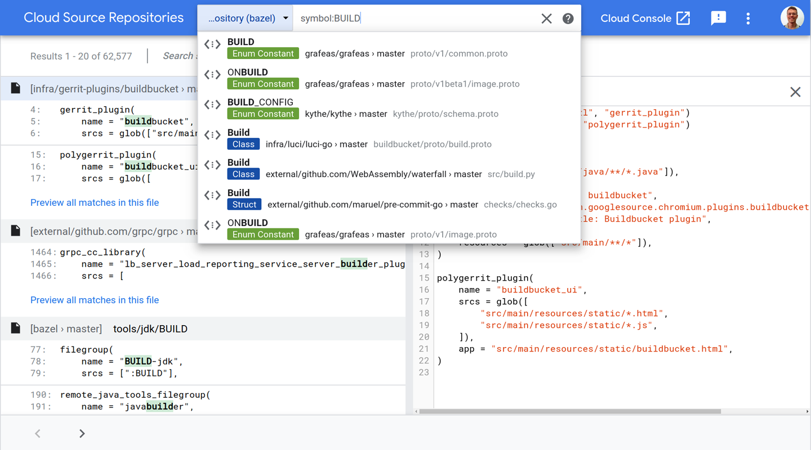
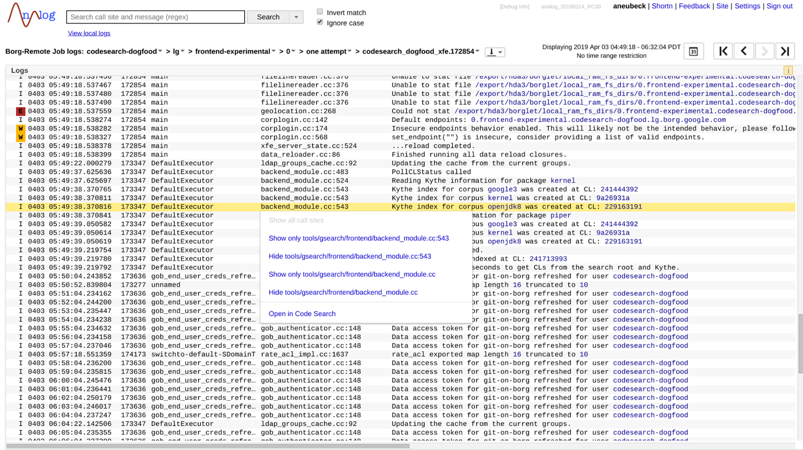

# CHAPTER 17

## Code Search

*Written by Alexander Neubeck and Ben St. John*

*Edited by Lisa Carey*

Code Search is a tool for browsing and searching code at Google that consists of a
frontend UI and various backend elements. Like many of the development tools at
Google, it arose directly out of a need to scale to the size of the codebase. Code Search
began as a combination of a grep-type tool1
for internal code with the ranking and UI
of external Code Search.2
 Its place as a key tool for Google developers was cemented
by the integration of Kythe/Grok,3
 which added cross-references and the ability to
jump to symbol definitions. 

That integration changed its focus from searching to browsing code, and later devel‐
opment of Code Search was partly guided by a principle of “answering the next ques‐
tion about code in a single click.” Now such questions as “Where is this symbol
defined?”, “Where is it used?”, “How do I include it?”, “When was it added to the
codebase?”, and even ones like “Fleet-wide, how many CPU cycles does it consume?”
are all answerable with one or two clicks.

In contrast to integrated development environments (IDEs) or code editors, Code
Search is optimized for the use case of reading, understanding, and exploring code at
scale. To do so, it relies heavily on cloud-based backends for searching content and
resolving cross-references.

------

1 GSearch originally ran on Jeff Dean’s personal computer, which once caused company-wide distress when he
went on vacation and it was shut down!

2 Shut down in 2013; see https://en.wikipedia.org/wiki/Google_Code_Search. 

3 Now known as Kythe, a service that provides cross-references (among other things): the uses of a particular
code symbol—for example, a function—using the full build information to disambiguate it from other ones
with the same name.

----

351

In this chapter, we’ll look at Code Search in more detail, including how Googlers use
it as part of their developer workflows, why we chose to develop a separate web tool
for code searching, and examine how it addresses the challenges of searching and
browsing code at Google repository scale.

### The Code Search UI
The search box is a central element of the Code Search UI (see Figure 17-1), and like
web search, it has “suggestions” that developers can use for quick navigation to files,
symbols, or directories. For more complex use cases, a results page with code snippets
is returned. The search itself can be thought of as an instant “find in files” (like the
Unix grep command) with relevance ranking and some code-specific enhancements
like proper syntax highlighting, scope awareness, and awareness of comments and
string literals. Search is also available from the command line and can be incorpora‐
ted into other tools via a Remote Procedure Call (RPC) API. This comes in handy
when post-processing is required or if the result set is too large for manual
inspection.

Figure 17-1. The Code Search UI

When viewing a single file, most tokens are clickable to let the user quickly navigate
to related information. For example, a function call will link to its function definition,
an imported filename to the actual source file, or a bug ID in a comment to the corre‐
sponding bug report. This is powered by compiler-based indexing tools like Kythe.
Clicking the symbol name opens a panel with all the places the symbol is used. Simi‐

---
352 | Chapter 17: Code Search

larly, hovering over local variables in a function will highlight all occurrences of that
variable in the implementation.
Code Search also shows the history of a file, via its integration with Piper (see Chap‐
ter 16). This means seeing older versions of the file, which changes have affected it,
who wrote them, jumping to them in Critique (see Chapter 19), diffing versions of
files, and the classic “blame” view if desired. Even deleted files can be seen from a
directory view.
### How Do Googlers Use Code Search?
Although similar functionality is available in other tools, Googlers still make heavy
use of the Code Search UI for searching and file viewing and ultimately for under‐
standing code.4 The tasks engineers try to complete with Code Search can be thought
of answering questions about code, and recurring intents become visible.5

#### Where?
About 16% of Code Searches try to answer the question of where a specific piece of
information exists in the codebase; for example, a function definition or configura‐
tion, all usages of an API, or just where a specific file is in the repository. These ques‐
tions are very targeted and can be very precisely answered with either search queries
or by following semantic links, like “jump to symbol definition.” Such questions often
arise during larger tasks like refactorings/cleanups or when collaborating with other
engineers on a project. Therefore, it is essential that these small knowledge gaps are
addressed efficiently.
Code Search provides two ways of helping: ranking the results, and a rich query lan‐
guage. Ranking addresses the common cases, and searches can be made very specific
(e.g., restricting code paths, excluding languages, only considering functions) to deal
with rarer cases.
The UI makes it easy to share a Code Search result with colleagues. So, for code
reviews, you can simply include the link—for example, “Have you considered using
this specialized hash map: cool_hash.h?” This is also very useful for documentation,
in bug reports, and in postmortems and is the canonical way of referring to code

----
4 There is an interesting virtuous cycle that a ubiquitous code browser encourages: writing code that is easy to
browse. This can mean things like not nesting hierarchies too deep, which requires many clicks to move from
call sites to actual implementation, and using named types rather than generic things like strings or integers,
because it’s then easy to find all usages.

5 Sadowski, Caitlin, Kathryn T. Stolee, and Sebastian Elbaum. “How Developers Search for Code: A Case
Study” In Proceedings of the 2015 10th Joint Meeting on Foundations of Software Engineering (ESEC/FSE 2015).
https://doi.org/10.1145/2786805.2786855.

---
How Do Googlers Use Code Search? | 353

within Google. Even older versions of the code can be referenced, so links can stay
valid as the codebase evolves.
#### What?
Roughly one quarter of Code Searches are classic file browsing, to answer the ques‐
tion of what a specific part of the codebase is doing. These kinds of tasks are usually
more exploratory, rather than locating a specific result. This is using Code Search to
read the source, to better understand code before making a change, or to be able to
understand someone else’s change.
To ease these kinds of tasks, Code Search introduced browsing via call hierarchies
and quick navigation between related files (e.g., between header, implementation, test,
and build files). This is about understanding code by easily answering each of the
many questions a developer has when looking at it.
#### How?
The most frequent use case—about one third of Code Searches—are about seeing
examples of how others have done something. Typically, a developer has already
found a specific API (e.g., how to read a file from remote storage) and wants to see
how the API should be applied to a particular problem (e.g., how to set up the remote
connection robustly and handle certain types of errors). Code Search is also used to
find the proper library for specific problems in the first place (e.g., how to compute a
fingerprint for integer values efficiently) and then pick the most appropriate imple‐
mentation. For these kinds of tasks, a combination of searches and cross-reference
browsing are typical.
#### Why?
Related to what code is doing, there are more targeted queries around why code is
behaving differently than expected. About 16% of Code Searches try to answer the
question of why a certain piece of code was added, or why it behaves in a certain way.
Such questions often arise during debugging; for example, why does an error occur
under these particular circumstances?
An important capability here is being able to search and explore the exact state of the
codebase at a particular point in time. When debugging a production issue, this can
mean working with a state of the codebase that is weeks or months old, while debug‐
ging test failures for new code usually means working with changes that are only
minutes old. Both are possible with Code Search.

----
354 | Chapter 17: Code Search

#### Who and When?
About 8% of Code Searches try to answer questions around who or when someone
introduced a certain piece of code, interacting with the version control system. For
example, it’s possible to see when a particular line was introduced (like Git’s “blame”)
and jump to the relevant code review. This history panel can also be very useful in
finding the best person to ask about the code, or to review a change to it.6
### Why a Separate Web Tool?
Outside Google, most of the aforementioned investigations are done within a local
IDE. So, why yet another tool?
#### Scale
The first answer is that the Google codebase is so large that a local copy of the full
codebase—a prerequisite for most IDEs—simply doesn’t fit on a single machine. Even
before this fundamental barrier is hit, there is a cost to building local search and
cross-reference indices for each developer, a cost often paid at IDE startup, slowing
developer velocity. Or, without an index, one-off searches (e.g., with grep) can
become painfully slow. A centralized search index means doing this work once,
upfront, and means investments in the process benefit everyone. For example, the
Code Search index is incrementally updated with every submitted change, enabling
index construction with linear cost.7

In normal web search, fast-changing current events are mixed with more slowly
changing items, such as stable Wikipedia pages. The same technique can be extended
to searching code, making indexing incremental, which reduces its cost and allows
changes to the codebase to be visible to everyone instantly. When a code change is
submitted, only the actual files touched need to be reindexed, which allows parallel
and independent updates to the global index.

Unfortunately, the cross-reference index cannot be instantly updated in the same way.
Incrementality isn’t possible for it, as any code change can potentially influence the
entire codebase, and in practice often does affect thousands of files. Many (nearly all

---
6 That said, given the rate of commits for machine-generated changes, naive “blame” tracking has less value
than it does in more change-averse ecosystems.

7 For comparison, the model of “every developer has their own IDE on their own workspace do the indexing
calculation” scales roughly quadratically: developers produce a roughly constant amount of code per unit
time, so the codebase scales linearly (even with a fixed number of developers). A linear number of IDEs do
linearly more work each time—this is not a recipe for good scaling.

---
Why a Separate Web Tool? | 355

of Google’s) full binaries need to be built8
 (or at least analyzed) to determine the full
semantic structure. It uses a ton of compute resources to produce the index daily (the
current frequency). The discrepancy between the instant search index and the daily
cross-reference index is a source of rare but recurring issues for users.

### Zero Setup Global Code View
Being able to instantly and effectively browse the entire codebase means that it’s very
easy to find relevant libraries to reuse and good examples to copy. For IDEs that con‐
struct indices at startup, there is a pressure to have a small project or visible scope to
reduce this time and avoid flooding tools like autocomplete with noise. With the
Code Search web UI, there is no setup required (e.g., project descriptions, build envi‐
ronment), so it’s also very easy and fast to learn about code, wherever it occurs, which
improves developer efficiency. There’s also no danger of missing code dependencies;
for example, when updating an API, reducing merge and library versioning issues.
#### Specialization
Perhaps surprisingly, one advantage of Code Search is that it is not an IDE. This
means that the user experience (UX) can be optimized for browsing and understand‐
ing code, rather than editing it, which is usually the bulk of an IDE (e.g., keyboard
shortcuts, menus, mouse clicks, and even screen space). For example, because there
isn’t an editor’s text cursor, every mouse click on a symbol can be made meaningful
(e.g., show all usages or jump to definition), rather than as a way to move the cursor.
This advantage is so large that it’s extremely common for developers to have multiple
Code Search tabs open at the same time as their editor.

#### Integration with Other Developer Tools
Because it is the primary way to view source code, Code Search is the logical platform
for exposing information about source code. It frees up tool creators from needing to
create a UI for their results and ensures the entire developer audience will know of
their work without needing to advertise it. Many analyses run regularly over the
entire Google codebase, and their results are usually surfaced in Code Search. For

----
8 Kythe instruments the build workflow to extract semantic nodes and edges from source code. This extraction
process collects partial cross-reference graphs for each individual build rule. In a subsequent phase, these par‐
tial graphs are merged into one global graph and its representation is optimized for the most common queries
(go-to-definition, find all usages, fetch all decorations for a file). Each phase—extraction and post processing
—is roughly as expensive as a full build; for example, in case of Chromium, the construction of the Kythe
index is done in about six hours in a distributed setup and therefore too costly to be constructed by every
developer on their own workstation. This computational cost is the why the Kythe index is computed only
once per day

----

356 | Chapter 17: Code Search

example, for many languages, we can detect “dead” (uncalled) code and mark it as
such when the file is browsed.

In the other direction, the Code Search link to a source file is considered its canonical
“location.” This is useful for many developer tools (see Figure 17-2). For example, log
file lines typically contain the filename and line number of the logging statement. The
production log viewer uses a Code Search link to connect the log statement back to
the producing code. Depending on the available information, this can be a direct link
to a file at a specific revision, or a basic filename search with the corresponding line
number. If there is only one matching file, it is opened at the corresponding line
number. Otherwise, snippets of the desired line in each of the matching files are
rendered.

Figure 17-2. Code Search integration in a log viewer

Similarly, stack frames are linked back to source code whether they are shown within
a crash reporting tool or in log output, as shown in Figure 17-3. Depending on the
programming language, the link will utilize a filename or symbol search. Because the
snapshot of the repository at which the crashing binary was built is known, the search
can actually be restricted to exactly this version. That way, links remain valid for a
long time period, even if the corresponding code is later refactored or deleted.

----
Why a Separate Web Tool? | 357
