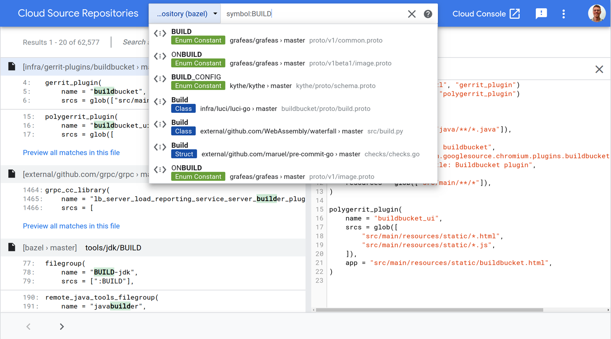
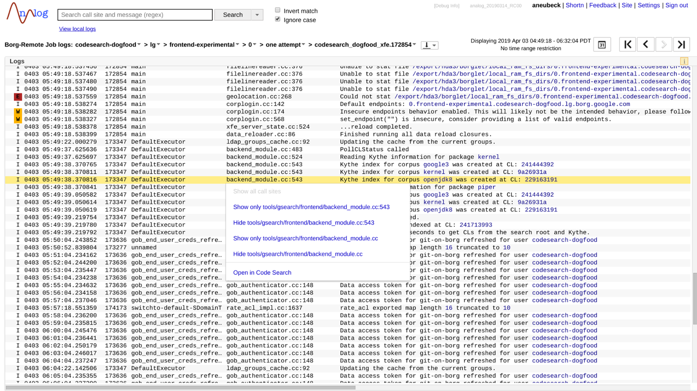
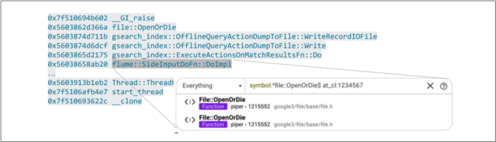
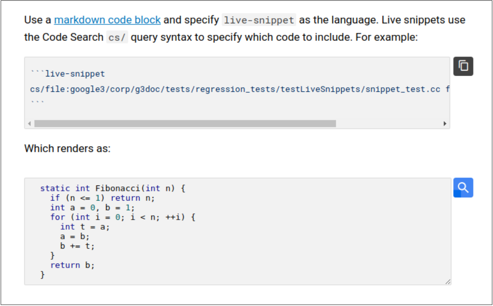

# 第十七章

## 代码搜索

*作者：亚历山大·纽贝克（Alexander Neubeck）和本·圣约翰（Ben St.John）*

*编辑：Lisa Carey*

代码搜索是一个在谷歌上浏览和搜索代码的工具，它由一个前端UI和各种后端元素组成。与谷歌上的许多开发工具一样，它直接产生于需要扩展到代码库的大小的需要。代码搜索最初是将内部代码的grep类型工具与外部代码搜索的排名和UI的组合。它作为谷歌开发者的关键工具的地位得到了集成Kythe/Grok的巩固，增加了交叉引用和跳转到符号定义的能力。

这种集成将它的焦点从搜索变成了浏览代码，后来的代码搜索的设计选择的部分原则是“一键回答代码”。现在像“这个符号定义了哪里？”在哪里？”、“它在哪里？”、“我如何包括它？”、“它是什么时候添加到代码库的”？甚至是像“车队消耗的CPU周期？”这样的问题都要由一两次点击负责。

与集成开发环境(IDE)或代码编辑器相比，代码搜索是针对大规模阅读、理解和探索代码的用例进行了优化的。为此，它在很大程度上依赖于基于云的后端来搜索内容和解决交叉引用。

在本章中，我们将更详细地介绍代码搜索，包括谷歌用户如何将其作为开发人员工作流的一部分，为什么我们选择开发单独的web工具，并检查它如何解决谷歌存储库规模搜索和浏览代码的挑战。

### 代码搜索用户界面
搜索框是代码搜索用户界面的中心元素（参见图17-1），与Web搜索一样，开发人员可以用来快速导航到文件、符号或目录。对于更复杂的用例，将返回一个带有代码片段的结果页。搜索本身可以被认为是一个即时的“在文件中查找”(如Unixgrep命令)，具有相关性排名和一些特定于代码的增强，如适当的语法突出显示、范围意识以及对注释和字符串文本的认识。也可以从命令行获得搜索，并且可以通过远程过程调用(RPC)API合并到其他工具中。当需要后处理或结果集太大而无法手动检查时，这就会派上用场。

图17-1.代码搜索界面

查看单个文件时，大多数令牌都可单击，让用户快速导航到相关信息。例如，函数调用将链接到其函数定义、导入的文件名链接到实际的源文件名，或对相关支持错误报告的注释中的bugID。这是由基于编译器的索引工具提供的。单击符号名称将打开一个包含使用该符号的所有位置的面板。

相似地，悬停在函数中的局部变量上将突出显示该变量在实现中的所有出现情况。代码搜索还通过文件与Piper的集成显示文件的历史（参见第16章）。这意味着看到文件的旧版本，这些变化影响了它，谁写了它们，在评论中跳到它们（见第19章），不同版本的文件，如果需要的话，经典的“指责”视图。甚至是被删除的文件也可以从目录视图中看到。
### Google员工如何使用代码搜索？
虽然在其他工具中也可以使用类似的功能，但谷歌用户仍然大量使用代码搜索用户界面来搜索和文件查看，并最终使用站立代码。工程师试图完成代码搜索的任务可以被认为是回答有关代码的问题，并且重复的意图变得可见。

#### Where？
大约16%的代码搜索试图回答代码库中哪里存在特定信息的问题；例如，函数定义或配置，API的所有用法，或者只是特定文件在存储库中的位置。这些问题非常有针对性，可以通过搜索查询或遵循语义链接来非常精确地回答，比如“跳到符号定义”。这类问题经常出现在更大的任务中，如重新分解/清理，或者在在项目中与其他工程师合作时。因此，必须有效地解决这些较小的知识差距。

代码搜索提供了两种帮助方法：对结果进行排序和丰富的查询lan猜测。排名解决了常见的情况，搜索可以非常具体（例如，限制代码路径，不包括语言，只考虑函数）来处理更罕见的情况。

该用户界面便于与同事共享代码搜索结果。因此，对于代码审查，您可以简单地包括链接—例如，“您是否考虑过使用此专门的哈列映射：cool_hash.h？”，这对于文档、错误报告和时候检查中也非常有用，并且引用代码是谷歌用户在谷歌内。甚至可以引用较旧版本的代码，因此链接可以随着代码库的发展而保持有效。

#### What？
大约四分之一的代码搜索是经典的文件浏览，以回答代码库的特定部分在做什么的问题。这些任务通常更具有探索性，而不是定位一个特定的结果。这是指使用代码搜索来读取源代码，以便在进行更改之前更好地理解代码，或者能够理解其他人的更改。

为了简化这类任务，代码搜索引入了通过调用层次结构的浏览和在相关文件之间（例如，在标头、实现、测试和构建文件之间）的快速导航。这是关于通过轻松地回答开发人员在查看代码时遇到的每一个问题来理解代码。

#### How？
最常见的用例，大约三分之一的代码搜索，是关于看到其他人如何做什么的例子。通常，开发人员已经找到了一个特定的API（例如，如何从远程存储中读取文件），并希望了解如何将该API应用于特定的问题（例如，如何稳健地设置远程连接并处理某些类型的错误）。代码搜索还首先用于为特定问题找到合适的库（例如，如何有效地计算整数值的指纹），然后选择最合适的整数表示。对于这类任务，搜索和交叉引用浏览的结合非常典型。

#### Why？
与代码在做什么有关，关于为什么代码的行为与预期的不同，有更有针对性的查询。大约16%的代码搜索会试图回答为什么会添加某段代码，或者为什么它会以某种方式行为的问题。这类问题经常在调试过程中出现；例如，为什么在这种特殊情况下会发生错误？

这里的一个重要功能是能够在一个特定的时间点搜索和探索代码库的确切状态。在调试生产问题时，这可能意味着使用数周或数月的代码库状态，而为新代码调试测试失败通常意味着处理仅几分钟的更改。两者都可以通过代码搜索来实现。

#### Who and When？
大约8%的代码搜索会试图回答关于谁或何时引入某段代码，与版本控制系统交互的问题。例如，可以看到何时引入了特定的行（如Git的“责任”），并跳转到相关的代码审查。这个历史记录面板也可以对寻找询问代码或查看代码更改的最佳人选非常有用。

### 为什么要使用单独的Web工具？
在Google之外，上述大多数调查都是在本地IDE内进行的。那么，为什么还要使用另一个工具呢？

#### 规模
第一个答案是，谷歌代码库如此之大，因此完整代码库的本地副本（大多数IDE的先决条件）根本不适合在单台机器上。甚至在这一基本障碍被击中之前，为每个开发人员构建本地搜索和交叉参考索引就会有成本，这一成本通常在IDE启动时支付，减慢了开发人员的速度。或者，没有索引，一次性搜索（例如，grep）会变得非常慢。集中的搜索索引意味着预先做一次这项工作，并意味着在这个过程中的投资使每个人都受益。例如，代码搜索索引会随着每次提交的更改而增量更新，从而实现具有线性成本的索引构建。

在正常的网络搜索中，快速变化的时事与更缓慢变化的项目混合在一起，比如稳定的维基百科页面。同样的技术也可以扩展到搜索代码上，建立增量索引，从而降低其成本，并允许每个人都能立即看到对代码库的更改。当提交代码更改时，只需要重新对所触摸的实际文件进行索引，这允许对全局索引进行并行和独立的更新。

不幸的是，交叉引用索引不能立即以同样的方式进行更新。增量是不可能的，因为任何代码更改都可能会影响整个代码库，而且在实际操作中通常会影响数千个文件。

### 零设置全局代码视图
能够立即、有效地浏览整个代码库意味着很容易找到要重用的相关库，并且可以复制良好的示例。对于在启动时包含结构索引的ide，有一个小项目或可见范围，以减少这次时间，避免淹没像自动完成噪音这样的工具。使用代码搜索web用户界面，不需要安装（例如，项目描述、构建环境），因此可以轻松快速了解代码，提高开发人员的效率。也没有丢失代码依赖关系的危险，例如，当更新API时，减少了合并和库的版本控制问题。

#### 特殊化
也许令人惊讶的是，代码搜索的一个优点是它不是一个IDE。这意味着用户体验(UX)可以被优化来浏览和理解代码，而不是编辑它，这通常是IDE的大部分（例如，键盘快捷键、菜单、鼠标点击，甚至屏幕空间）。例如，由于没有编辑器的文本游标，每次鼠标点击一个符号都会显得有意义（例如，显示所有用法或跳转到定义），而不是作为移动游标的一种方式。这种优势非常大，因此开发人员通常会与编辑器同时打开多个代码搜索选项卡。

#### 与其他开发人员工具的集成

由于它是查看源代码的主要方式，因此代码搜索是公开有关源代码信息的逻辑平台。它释放了工具创建者不需要为他们的结果创建一个用户界面，并确保整个开发人员的观众将知道他们的工作，而不需要做广告。许多分析经常在整个谷歌代码库上运行，它们的结果通常出现在代码搜索中。例如，对于许多语言，我们可以检测“dead”（未调用）代码并在浏览文件时标记。

另一方面，指向源文件的代码搜索链接被认为是其标准的“位置”。这对许多开发人员工具都很有用（见图17-2）。例如，日志文件行通常包含日志记录语句的文件名和行号。生产日志查看器使用代码搜索链接将日志语句连接回生产代码。根据可用的信息，这可以是直接链接到特定版本中的文件，也可以是具有相应行号的基本文件名搜索。如果只有一个匹配的文件，则会以相应的行号打开它。否则，将呈现每个匹配文件中所需行的片段。

图17-2.日志查看器中的代码搜索集成

类似地，堆栈帧也会重新链接到源代码，无论它们是显示在崩溃报告工具中还是显示在日志输出中，如图17-3所示。根据编程语言，链接将使用文件名或符号搜索。由于构建崩溃二进制文件的存储库的快照是已知的，因此搜索实际上可以完全限制在这个版本内。这样，链接在很长一段时间内仍然有效，即使相应的代码后来被重构或删除。

图17-3 栈框架中的代码搜索集成
编译错误和测试通常还会返回到代码位置（例如，测试X在文件中的行位置）。鉴于大多数开发都发生在特定的对云可见的工作空间中，因此可以将这些链接链接起来，即使未提交的代码也可以通过代码搜索访问和搜索。

最后，codelab和其他文档引用了API，示例和实现的链接。此类链接可以是引用特定类或函数的搜索查询，当文件结构更改时，这些查询仍然有效。对于代码片段，可以将最新的实现轻松地嵌入到文档页面中，如图17-4所示，而无需使用其他文档标记来污染源文件。

图17-4 文档中的代码搜索集成
### API公开
代码搜索将其搜索，交叉引用和语法高亮API公开给工具，因此工具开发人员可以将这些功能引入其工具中，而无需重新实现它们。此外，已经编写了插件来为vim，emacs和IntelliJ等编辑器和IDE提供搜索和交叉引用。这些插件恢复了由于无法在本地对代码库进行索引而造成的部分功能损失，并降低了开发人员的工作效率。

## 规模对设计的影响
在上一节中，我们研究了代码搜索UI的各个方面，以及为什么值得使用一个单独的工具来浏览代码的原因。在以下各节中，我们将稍微看一下实现的背后。首先，我们讨论了主要的挑战-扩展-然后讨论了使大规模组合成为搜索和浏览代码的良好产品的一些复杂方法。之后，我们详细介绍了如何应对其中的一些挑战，以及在构建代码搜索时进行了哪些权衡。

搜索代码的最大扩展挑战是语料库大小。对于只有几兆字节的小型存储库，可以使用grep搜索进行强力搜索。当需要搜索数百兆字节时，简单的本地索引可以将搜索速度提高一个数量级或更多。当需要搜索千兆字节或TB级的源代码时，具有多台计算机的云托管解决方案可以使搜索时间保持合理。中央解决方案的实用性随使用它的开发人员数量和代码空间的大小而增加。

### 搜索查询延迟

尽管我们认为快速响应的UI对用户更好，但低延迟并不是免费的。为了证明这项工作的合理性，可以将其与所有用户节省的工程时间进行权衡。在Google内部，我们每天在“代码搜索”中处理来自开发人员的搜索查询超过一百万次。对于一百万个查询，每个搜索请求仅增加一秒钟，相当于每天约有35位空闲的专职工程师。相反，搜索后端可以由大约十分之一的工程师来构建和维护。这意味着每天大约有100,000个查询（相当于少于5,000个开发人员），只有一秒钟的延迟参数才可以达到收支平衡点。

实际上，生产效率损失并不是随延迟线性增长的。如果延迟低于200毫秒，UI被认为是响应性的。但是仅仅一秒钟后，开发人员的注意力往往开始漂移。如果再过10秒，开发人员很可能完全切换上下文，通常认为上下文具有较高的生产效率代价。保持开发人员处于生产“流”状态的最佳方法是将所有频繁操作的端到端延迟设置为低于200毫秒，并投资相应的后端。

为了浏览代码库，执行了大量的代码搜索查询。理想情况下，只需单击一下“下一个”文件（例如，对于包含的文件或符号定义），但是对于常规导航，而不是使用传统的文件树，只需搜索所需文件或符号，理想情况下无需完全指定它，并且为部分文本提供了建议。随着代码库（和文件树）的增长，这一点变得越来越正确。

正常导航到另一个文件夹或项目中的特定文件需要几次用户交互。通过搜索，只需几次点击就足以到达相关文件。为了使搜索有效，可以将有关搜索上下文的其他信息（例如，当前查看的文件）提供给搜索后端。上下文可以将搜索限制在特定项目的文件中，或者通过优先选择与其他文件或目录接近的文件来影响排名。在代码搜索UI中，用户可以预定义多个上下文，并根据需要在它们之间快速切换。在编辑器中，打开或编辑的文件被隐式用作上下文，以优先考虑在它们附近的搜索结果。

可以考虑将搜索查询语言的功能（例如，使用正则表达式指定文件）作为另一条件；我们将在本章稍后的“权衡”部分中对此进行讨论。

### 索引延迟

大多数时候，开发人员不会注意到索引何时过时。他们只关心一小部分代码，即使如此，他们通常也不知道是否有更新的代码。但是，对于他们编写或审查相应更改的情况，不同步可能会引起很多混乱。更改是小的修正，重构还是全新的代码通常无关紧要-开发人员只是期望一致的视图，例如他们在IDE中对小型项目的体验。

编写代码时，应立即索引已修改的代码。添加新文件，函数或类后，无法找到它们令人沮丧，并且破坏了用于完善交叉引用的开发人员的常规工作流程。另一个示例是基于搜索和替换的重构。当删除的代码立即从搜索结果中消失时，这不仅更加方便，而且随后的重构必须考虑新的状态，这一点也很重要。使用集中式VCS时，如果先前的更改不再是本地修改的文件集的一部分，则开发人员可能需要立即为提交的代码建立索引。

相反，有时能够及时返回到以前的代码快照很有用；换句话说，就是发布。在事件发生期间，索引和运行代码之间的差异可能尤其成问题，因为它可能隐藏真正的原因或引起无关紧要的注意力。对于交叉引用而言，这是一个问题，因为目前以Google规模构建索引的技术仅需花费数小时，而复杂性意味着仅保留了索引的一个“版本”。尽管可以进行一些修补以使新代码与旧索引对齐，但这仍然是一个要解决的问题。

## Google的实现
Google针对代码搜索的特定实现方式是针对其代码库的独特特征量身定制的，上一节概述了我们为创建健壮且响应迅速的索引而进行的设计约束。以下部分概述了代码搜索小组如何实施并将其工具发布给Google开发人员。

### 搜索索引
由于其庞大的规模，Google的代码库对于“代码搜索”来说是一个特殊的挑战。在早期，采用了基于三字母组的方法。拉斯·考克斯（RussCox）随后开源了简化版本。当前，代码搜索索引大约1.5TB的内容，每秒处理大约200个查询，其中服务器端搜索延迟的中位数小于50毫秒，索引编制延迟的中位数（介于代码提交和索引可见性之间的时间）小于10秒。

让我们粗略估计使用基于grep的暴力解决方案来实现此性能所需的资源。RE2库用于正则表达式匹配过程，用于RAM中的数据约100MB/秒。给定一个50毫秒的时间窗口，将需要300,000个内核来处理1.5TB的数据。因为在大多数情况下，简单的子字符串搜索就足够了，所以可以用一种特殊的子字符串搜索来替换正则表达式，该子字符串搜索在某些条件下可以以大约1GB/秒的速度进行处理，从而将内核数减少了10倍。到目前为止，我们仅研究了在50毫秒内处理单个查询的资源需求。如果我们每秒收到200个请求，则其中的10个将同时在50毫秒的窗口中处于活动状态，从而使我们回到300,000个内核，仅用于子字符串搜索。

尽管此估计忽略了一旦找到一定数量的结果，搜索就可以停止，或者可以比内容搜索更有效地评估文件限制，但是它不会占用通信开销，排名或将粉丝分散到成千上万机器都考虑在内。但这很好地显示了所涉及的规模，以及Google的代码搜索团队为何不断投资以改善索引编制。多年来，我们的索引从最初的基于三字母组的解决方案，通过基于自定义后缀数组的解决方案，变为当前的稀疏n-gram解决方案。这一最新解决方案的效率比暴力解决方案高500倍以上，同时还能够以惊人的速度回答正则表达式搜索。

我们从基于后缀数组的解决方案转向基于令牌的n-gram解决方案的一个原因是，利用了Google的主要索引和搜索栈。使用基于后缀数组的解决方案，构建和分配自定义索引本身就是一个挑战。通过利用“标准”技术，我们将从核心搜索团队在反向索引构建，编码和服务方面的所有进步中受益。即时索引是标准搜索栈中存在的另一个功能，而在大规模解决它时，它本身就是一个很大的挑战。

依靠标准技术是实现简单性和性能之间的权衡。即使Google的代码搜索实施是基于标准反向索引的，但实际的检索，匹配和评分还是高度定制和优化的。否则，某些更高级的代码搜索功能将无法实现。为了对文件修订历史进行索引，我们提出了一种自定义压缩方案，其中对整个历史进行索引仅使资源消耗增加了2.5倍。

在早期，“代码搜索”提供了内存中的所有数据。随着索引大小的增加，我们将倒排索引移至闪存。尽管闪存至少比内存便宜一个数量级，但其访问延迟至少要高两个数量级。因此，当从闪存中提供服务时，在内存中运行良好的索引可能不适合。例如，原始的Trigram索引不仅需要从Flash中获取大量的反向索引，而且还需要获取相当大的反向索引。使用n-gram方案时，可以减少反索引的数量及其大小，但要以较大的索引为代价。

为了支持本地工作空间（从全局存储库中获取较小的增量），我们有多台机器进行简单的暴力搜索。工作区数据在第一个请求上加载，然后通过侦听文件更改保持同步。当内存不足时，我们将从计算机中删除最近的工作空间。使用我们的历史索引搜索未更改的文档。因此，搜索隐式限于工作空间同步到的存储库状态。
### 排名
对于非常小的代码库，排名并不能带来太多好处，因为总的来说结果并不多。但是代码库越大，发现的结果就越多，排名也越重要。在Google的代码库中，任何简短的子字符串都会出现数千次（即使不是数百万次）。如果不进行排名，用户要么必须检查所有这些结果以找到正确的结果，要么必须进一步细化查询，直到结果集减少为少数文件为止。两种选择都浪费了开发人员的时间。

排名通常从评分功能开始，该功能将每个文件的一组功能（“信号”）映射到某个数字：分数越高，结果越好。然后，搜索的目标是尽可能高效地找到前N个结果。通常，可以区分两种信号：仅依赖于文档的信号（“独立于查询”）和依赖于搜索查询及其与文档的匹配方式的信号（“依赖于查询”）。文件名的长度或文件的编程语言将是与查询无关的信号的示例，而匹配是函数定义还是字符串文字则是与查询相关的信号。

#### 查询独立信号
一些最重要的与查询无关的信号是文件视图的数量和对文件的引用数量。文件视图很重要，因为它们指示开发人员认为哪些文件很重要，因此更有可能要查找。例如，基本库中的实用程序功能具有很高的视图计数。该库是否已经稳定并且不再更改，或者该库是否正在积极开发都无关紧要。该信号最大的缺点是它产生的反馈环路。通过对经常查看的文档评分更高，开发人员查看它们的机会会增加，而其他文档进入前N名的机会也会减少。此问题被称为“开发与探索”，存在各种解决方案（例如，高级A/B搜索实验或训练数据的整理）。在实践中，高分的项目似乎并没有什么害处：当它们不相关时，它们将被简单地忽略；如果需要通用的示例，则将其取而代之。但是，这对于新文件来说是个问题，因为新文件还没有足够的信息来发出良好的信号。
通过将Web链接替换为大多数语言中存在的各种“包含/导入”语句，我们还使用了与原始页面排名算法相似的文件引用数量。我们可以将概念扩展到构建依赖关系（库/模块级别的引用），再扩展到函数和类。这种全球相关性通常被称为文档的“优先级”。

在使用参考进行排名时，必须意识到两个挑战。首先，您必须能够可靠地提取参考信息。早期，Google的代码搜索使用简单的正则表达式提取包含/导入语句，然后应用启发式将其转换为完整的文件路径。随着代码库的复杂性不断增长，这种启发式方法变得容易出错，并且难以维护。在内部，我们用Kythe图中的正确信息替换了此部分。

大规模重构，例如开源核心库，提出了第二个挑战。此类更改不会在单个代码更新中自动发生；相反，它们需要分多个阶段推出。通常，会引入间接寻址，例如，隐藏使用情况中的文件移动。这些类型的间接操作会降低已移动文件的页面排名，并使开发人员更难发现新位置。此外，文件视图通常在文件移动时丢失，从而使情况更糟。由于此类代码库的全局重组相对较少（大多数接口很少移动），因此最简单的解决方案是在此类过渡期间手动增强文件。（或者等到迁移完成并等待自然过程将文件升级到新位置。）

#### 查询相关信号
可以独立地计算与查询无关的信号，因此尽管成本可能很高，但计算成本并不是主要问题。例如，对于“页面”排名，信号取决于整个语料库，并且需要类似MapReduce的批处理来计算。必须为每个查询计算的与查询相关的信号，计算起来应该便宜。这意味着它们仅限于可从索引快速访问的查询和信息。

与网络搜索不同，我们不仅匹配令牌。但是，如果存在干净的令牌匹配项（即，搜索项与带有某种形式的中断的内容（例如，空格）相匹配），则会进一步提高匹配度并考虑区分大小写。举例来说，这意味着搜索“point”相对于“point *p”的得分要高于“被任命为理事会的得分”。

为了方便起见，除实际文件内容外，默认搜索还匹配文件名和合格符号。用户可以指定特定的匹配类型，但不必指定。评分提高了符号和文件名的匹配度，超过了常规内容的匹配度，以反映开发人员的推断意图。与网络搜索一样，开发人员可以在搜索中添加更多专业术语词，以使查询更具体。带有文件名提示的“限定”查询是很常见的（例如，“ base”或“ myproject ”）。评分方法利用这一点来提高特定查询结果的效率，如很多查询都发生在可能结果的完整路径中，从而使这些查询的结果优秀于仅在内容中包含随机位置的单词的那些结果。

#### 检索
在文档能被评分前，得先找到可能与查询匹配的候选对象。此阶段称为检索。检索所有文件是不现实的，但又只有检索到的文件才可以打分，所以检索和评分必须协同工作，才能找到最相关的文档。一个典型的例子是搜索一个类（class）名。根据类的流行程度，它可能在成千上万个地方被使用，但只能有一个地方去定义。如果没有明确搜索范围为类的定义，那么检索固定数量文件的话，可能在找到单独的那个类定义文件之前就停止了。显然，随着代码库的增长，该问题变得更具挑战性。
检索阶段的主要挑战是，在大量无趣的文件中找到很少几个高度相关的文件。一种效果很好的解决方案称为“补充检索”。想法是将原始查询重写为更专业的查询。在我们的示例中，这意味着补充查询会将搜索限制为仅定义和文件名，并将新检索到的文档添加到检索阶段的输出中。在朴素的补充检索实现中，需要对更多文档进行评分，但是获得的额外部分评分信息可以用于仅对检索阶段中最有可能的文档进行全面评估。

#### 结果多样性 
搜索的另一个方面是结果的多样性，多样性意味着需要在多个类别中找到最佳结果。一个简单的例子是为一个函数名提供Java和Python匹配，而不是用一个或另一个填充结果的第一页。
当用户的意图不清楚时，这一点尤其重要。多样性带来的其中一个挑战是有很多不同的类目——比如函数，类，文件名，本地结果，用途，测试，示例等，结果可以分成组，但没有一个用户界面中有足够多的空间来显示所有结果，甚至分组的展示结果也不理想。Google的代码搜索的做法与网络搜索不同，建议结果的下拉列表（如网络搜索的自动补全）经过了调整，可以在用户当前的工作空间进行匹配。

## 权衡取舍 
在Google这般大小的代码库中实现代码搜索并保持其响应能力，这涉及到各种取舍。这些将在下面说明。

### 完整性：位于头部的存储库 
我们已经看到，较大的代码库会对搜索产生负面影响。例如，索引速度更慢，价格更高，查询速度更慢，结果噪音更大。可以通过牺牲完整性来降低这些成本吗？换句话说，是否将某些内容排除在索引之外？答案是肯定的，但要谨慎。非文本文件（二进制文件，图像，视频，声音等）通常并不可以被人读取，并且会根据文件名分开存放。由于它们很大，因此忽视这些文件可以节省大量资源。更为极端的情况涉及生成的JavaScript文件。由于混淆和结构丢失，它们对于人类来说几乎是不可读的，因此将它们从索引中排除通常是一个很好的取舍方式，从而以完整性为代价减少了索引资源的消耗和噪声的产生。根据经验，几兆字节的文件很少包含开发人员需要的信息，因此排除极端情况大概率是正确的选择。
但是，从索引中删除文件有一个很大的缺点。为了使开发人员能够依赖于代码搜索，他们需要能够信任它。不幸的是，如果丢失的文件最初没有建立索引，一般就不可能对搜索不完整的结果做反馈。这种为了节省的资源而对开发人员造成的混乱和生产损失是要付出高昂的代价的。即使开发人员完全了解其局限性，如果他们仍然需要执行搜索，他们也会以临时且容易出错的方式执行搜索。考虑到这些罕见但潜在的高昂成本，我们选择在索引方面多犯错误，并选择很高的限制，主要是为了防止滥用和保证系统稳定性，而不是节省资源。
另一方面，生成的文件不在代码库中，但通常对索引很有用。目前它们都不是，因为索引它们需要集成工具和配置，这将是一个产生复杂与混乱的巨大来源。

### 完整性：所有结果与最相关的结果 
正常搜索会为了速度牺牲完整性，本质上是一场博弈，赌排名靠前的结果将包含所有期望的结果。实际上，对于代码搜索而言，排名搜索是一种更常见的情况，其中用户正在数百万个匹配项中寻找诸如函数定义之类的特定内容。但是，有时开发人员希望得到所有结果。例如，找到所有出现的特定符号以进行重构。
为了分析，工具或重构（例如全局搜索和替换）通常需要所有结果如全局搜索或替换。是否需要交付所有结果是代码搜索与Web搜索的根本区别，在Web搜索中，可以采用许多快捷方式，例如仅考虑排名较高的项目。
能够为非常大的结果集提供所有的结果有很高的成本，但是我们认为这对于工具来说是必须的，对于开发者来说也是需要信任结果的。然而，因为对于大多数查询来说，只有少数结果是相关的（要么只有几个匹配的，要么只有几个是有趣的），我们不想为了潜在的完整性而牺牲平均速度。
为了通过一种体系结构同时实现这两个目标，我们将代码库分割成碎片，文件按其优先级排序。然后，我们通常只需要考虑每个分块中与高优先级文件匹配的文件。这类似于网络搜索的工作方式。然而，如果有要求，代码搜索可以从每个分块中获取所有的结果，以保证找到所有的结果。这让我们可以解决这两种使用情况，而不会因为不常用的返回大型完整结果集的能力而使典型的搜索变得缓慢。结果也可以按字典序，而不是按排名提供，这对某些工具来说是很有用的。
因此，这里的取舍是更复杂的实现和API与更大的能力，而不是更明显的延迟与完整性。 

### 完整性：当前快照与分支与所有历史与工作区
与语料库大小相关的问题是，哪些代码版本应该被索引：具体来说，除了当前的代码快照（"head"）之外，是否还有其他内容应该被索引。如果多个文件版本被编入索引，系统的复杂性、资源消耗和整体成本就会急剧增加。我们知道，除了当前版本的代码外，没有任何IDE会对其他内容进行索引。可以看到像Git或Mercurial这样的分布式版本控制系统时，它们的很多效率来自于对其历史数据的压缩。但在构建反向索引时，这些代表的紧凑性就会丧失。另一个问题是很难有效地对图结构进行索引，而这正是分布式版本控制系统的基础。

一个很大的好处是，过时的代码现在可以简单地从代码库中删除。以前，代码经常被移到标记为过时的目录中，以便以后仍然可以找到它。完整的历史索引也为有效地搜索人们的工作空间（未提交的修改）奠定了基础，这些工作空间被同步到代码库的特定快照。对于未来，历史索引为排名时使用有趣的信号提供了可能性，例如作者身份、代码活动等等。
工作区与全局资源库有很大不同。
- 每个开发者都可以有自己的工作空间。
- 在一个工作空间内，通常有少量的改变的文件。
- 被处理的文件是经常变化的。
- 一个工作空间只存在于一个相对较短的时间段内。
为了提供价值，工作空间索引必须准确反映工作空间的当前状态。 

### 表现力：令牌与子字符串与正则表达式 
效果的好坏在很大程度上受到支持的搜索功能集的影响。代码搜索支持正则表达式（regex）搜索，这增加了查询语言的力量，允许指定或排除整组术语，而且它们可以用于任何文本，这对于不存在更深层次语义工具的文档和语言特别有帮助。
开发人员也习惯于在其他工具（例如grep）和背景下使用正则表达式，因此它们提供了强大的搜索功能，而不会增加开发人员的认知负担。这种能力是有代价的，因为创建一个索引来有效地查询它们是有难度的。有什么更简单的选择呢？
基于标记的索引（即单词）可以很好地扩展，因为它只存储了实际源代码的一小部分，并得到了标准搜索引擎的支持。缺点是，在处理源代码时，许多用例都很棘手，甚至不可能用基于标记的索引来有效实现，因为源代码对许多字符的意义通常在标记化时被忽略。例如，搜索 "function() "与 "function(x)"、"(x ^ y) "或"=== myClass "在大多数基于标记的搜索中是困难的或不可能的。
标记化的另一个问题是，代码标识符的标记化定义不清。标识符可以用很多方式写，比如CamelCase、snake_case，甚至是没有任何单词分隔符的mashedtogether。在只记得部分单词的情况下找到一个标识符，这对基于标记的索引来说是一个挑战。
标记化通常也不关心字母的大小写（"r "与 "R"），而且经常会模糊单词；例如，将 "搜索 "和 "搜索 "简化为同一干代币搜索。在搜索代码时，这种精度的缺乏是一个重要的问题。最后，标记化使得它不可能在空白处或其他单词分隔符（逗号、括号）上进行搜索，这在代码中可能是非常重要的。
搜索能力的下一步是全子串搜索，其中任何字符序列都可以被搜索到。一个相当有效的方法是通过一个triangle-based索引来提供这种搜索。在其最简单的形式下，所产生的索引大小仍然比原始源代码的大小小得多。然而，与其他子串索引相比，小尺寸的代价是相对较低的检索精度。这意味着查询速度较慢，因为不匹配的内容需要从结果集中过滤掉。这就是必须在索引大小、搜索延迟和资源消耗之间找到一个很好的折衷方案，它在很大程度上取决于代码库的大小、资源的可用性和每秒的搜索量。
如果有一个子串索引，很容易将其扩展到允许正则表达式搜索。基本的想法是将正则表达式自动机转换成一组子串搜索。这种转换对于一个triangle-based索引来说是很直接的，并且可以推广到其他子串索引上。因为不存在完美的正则表达式索引，所以总是有可能构建出能导致暴力搜索的查询。然而，鉴于只有一小部分的用户查询是复杂的正则表达式，在实践中，通过子串索引的近似方法效果非常好。

### 结论 
代码搜索从grep的有机替代品发展成为提高开发者生产力的核心工具，也顺带影响了谷歌的网络搜索技术。但这对你来说意味着什么呢？如果你是在一个小项目上，很容易适合你的集成开发环境，可能没有什么意义。如果你负责一个较大代码库的工程师的生产力，可能会有一些启示。
最重要的一点也许是显而易见的：理解代码是开发和维护代码的关键，这意味着在理解代码方面的投资将产生可能难以衡量的红利，但却是真实的。我们在代码搜索中增加的每一个功能都被开发人员用来帮助他们的日常工作（当然，有些功能比其他功能更重要）。其中最重要的两个功能，Kythe集成（即增加语义上的代码理解）和寻找工作实例，也是与理解代码最明显的联系（相对于，例如，找到它，或看到它是如何改变的）。就工具的影响而言，没有人会使用他们不知道存在的工具，因此，让开发人员了解可用的工具也很重要--在谷歌，这是 "Noogler "培训的一部分，一个对新雇用的软硬件工程师的入职培训。
对你来说，这可能意味着为IDEs建立一个标准的索引配置文件，分享关于egrep的知识，运行ctags，或者建立一些自定义的索引工具，比如Code Search。无论你做什么，它几乎肯定会被使用，而且是以不同于你预期的方式被使用，你的开发者将从中受益。

### 觉得太长的话看这里
- 帮助你的开发人员理解代码可以大大促进工程的专业性。在谷歌，关键的工具是代码搜索。
- 代码搜索作为其他工具的基础，以及作为所有文档和开发者工具链接的中央标准场所，具有额外价值。
- 谷歌代码库的巨大规模使得定制的工具--与grep或IDE的索引相比--成为必要。
- 作为一个交互式工具，代码搜索必须是快速的，允许一个 "问答 "工作流程。在搜索、浏览和索引等各个方面，它都要有低延迟。
- 它只有在被信任的情况下才会被广泛使用，而且只有在它索引所有的代码，给出所有的结果，并首先给出所需的结果时才会被信任。然而，早期的、不那么强大的版本，只要了解它们的局限性，都是有用的，也是可以使用的。
