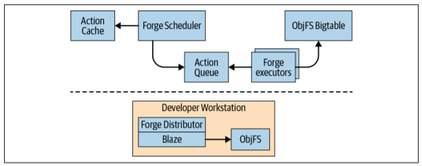

### 第十八章 构建系统和构建哲学


如果您问Google工程师，他们在Google工作时最喜欢什么（除了免费的食物和很酷的产品），您可能会听到一些令人惊讶的消息：工程师喜欢构建系统。为了确保我们的工程师能够快速可靠地编写代码，谷歌在其一生中花费了大量的工程努力，从头开始创建自己的构建系统。这项工作非常成功，构建系统的主要组成部分Blaze已经被离开公司的前谷歌员工重构了好几次。2015年，Google最终开源了名为Bazel的Blaze实现。

#### 构建系统的目的
从根本上说，所有构建系统都有一个直接的目的: 它们将工程师编写的源代码转换为可由机器读取的可执行二进制文件。一个好的构建系统通常会针对两个重要属性进行优化:

快：开发人员应该能够键入单个命令来运行构建并取回生成的二进制文件，通常只需几秒钟。
准确：每次开发人员在任何计算机上运行构建时，他们都应获得相同的结果（假设源文件和其他输入相同）。

许多较早的构建系统都试图通过采取可能导致构建不一致的捷径来在速度和正确性之间做出权衡。Bazel 的主要目标是避免在速度和正确性之间做出选择，提供一个构建系统结构，以确保始终能够有效和一致地构建代码。

构建系统不仅仅适合人类。 它们还允许机器自动创建构建，无论是用于测试还是用于生产发布。实际上，Google的大多数构建都是自动触发的，而不是由工程师直接触发的。几乎我们所有的开发工具都以某种方式与构建系统相结合，为我们的代码库工作人员提供了巨大的价值。下面是一个利用我们的自动构建系统的工作流程的小例子:

- 代码是自动生成、测试和推送到生产环境中的，不需要任何人工干预。不同的团队以不同的速度执行此操作：一些团队每周推进，另一些团队每天推进，而其他团队则尽可能快地创建和验证新版本。(请参阅第24章)
- 将开发人员的代码更改更改发送给审阅者进行代码审核时(请参阅第19章)，系统会对其进行自动测试，以便作者和审阅者都可以立即看到由更改引起的任何构建或测试问题。
- 在将更改合并到主干之前，会立即再次测试更改，这使得提交突发更改变得更加困难。
- 低级库的作者能够在整个代码库中测试其更改，从而确保其更改在数百万个测试和二进制文件中是安全的。
- 工程师能够创建大规模的更改(LSCs) ，每次触及数以万计的源文件(例如，重命名一个公共符号) ，同时仍然能够安全地提交和测试这些更改。(请参阅第22章)

这一切之所以成为可能，仅仅是因为谷歌在其构建系统上的投资。尽管Google的规模可能是独一无二的，但任何规模的组织都可以通过适当使用现代构建系统来实现类似的收益。

### 没有构建系统会发生什么？

构建系统使您的开发可以扩展。正如我们将在下一节中说明的那样，在没有适当的构建环境的情况下，我们会遇到扩展问题。

### 但是我所需要的只是一个编译器！

对构建系统的需求可能不会立即显现出来。毕竟，当我们第一次学习编码时，我们大多数人可能没有使用过构建系统——我们可能首先从命令行直接调用gcc或javac之类的工具，或者在集成开发环境（IDE）中调用了类似的工具 。只要我们所有的源代码都在同一个目录中，这样的命令就可以正常工作：
```
javac *.java
```
这指示Java编译器获取当前目录中的每个Java源文件，并将其转换为二进制类文件。 在最简单的情况下，这就是我们所需要的。

然而，一旦我们的代码扩展，事情就变得更加复杂。javac非常聪明，可以在当前目录的子目录中查找要导入的代码。但是它没有办法找到存储在文件系统其他部分的代码(可能是我们的几个项目共享的库)。显然，它也只知道如何构建Java代码。大型系统通常包含用不同编程语言编写的不同部分，这些部分之间存在依赖关系，这意味着没有一个单一语言的编译器可以构建整个系统。

一旦我们不得不处理来自多种语言或多个编译单元的代码时，构建代码就不再是一个一步到位的过程了。现在我们需要考虑我们的代码依赖于什么，并按照正确的顺序构建这些部分，可能对每个部分使用不同的工具集。如果更改任何依赖项，则需要重复此过程以避免依赖过时的二进制文件。对于即使是中等规模的代码库，这个过程也会很快变得冗长乏味并且容易出错。

编译器也不知道如何处理外部依赖关系，比如 Java 中的第三方 JAR 文件。在没有构建系统的情况下，我们能做的最好的事情就是从互联网上下载依赖项，把它放在硬盘上的一个lib文件夹中，然后配置编译器从该目录读取库。随着时间的推移，我们很容易忘记我们在那里放置了什么库，它们从哪里来，以及它们是否仍在使用。当库维护人员发布新版本时，希望他们能保持最新。

### 使用Shell脚本来解决？

假设您的喜爱项目开始时非常简单，您可以使用一个编译器来构建它，但是您开始遇到前面描述的一些问题。也许您仍然不认为需要一个真正的构建系统，可以使用一些简单的 shell 脚本来自动化那些繁琐的部分，这些脚本可以按照正确的顺序进行构建。这会帮上一阵子，但是很快您就会遇到更多问题：

- 这就变得乏味了。随着系统变得越来越复杂，开始在构建脚本上花费的时间几乎与在实际代码上花费的时间一样多。随着越来越多的代码被层层叠加，调试shell脚本是非常痛苦的。
- 为了确保您不会意外地依赖陈旧的库，您可以在每次运行构建脚本时按顺序构建每个依赖项。这太慢了。您考虑添加一些逻辑来检测需要重建的部分，但这听起来非常复杂，并且脚本容易出错。或者你考虑指定每次哪些部分需要重建，然后你又回到原点。
- 好消息：是时候发布了！最好找出所有需要传递给 jar 命令以完成最终构建的参数。记住如何上传它，并将其推送到中央存储库。构建和推送文档更新，并向用户发送通知。嗯，也许这需要另一个脚本...
- 糟糕！您的硬盘驱动器崩溃了，现在您需要重新创建整个系统。您足够聪明，可以将所有源文件保存在版本控制中，但是您下载的那些库呢？你能再次找到它们并确保它们与你第一次下载它们时的版本相同吗？您的脚本可能依赖于在特定位置安装的特定工具——您能够恢复相同的环境以便脚本能够再次工作吗？很久以前为了让编译器正常工作而设置的环境变量又忘记了怎么办呢？
- 尽管存在这些问题，但是你的项目已经足够成功，你可以开始雇佣更多的工程师。现在您意识到，以前的问题不会造成灾难——每当新开发人员加入您的团队时，您都需要经历同样痛苦的引导过程。尽管您已尽力而为，但每个人的系统仍然存在细微的差异。通常，在一个人的机器上工作的东西在另一个人的机器上不工作，并且每次都要花费几个小时的调试工具路径或库版本来找出差异所在。
- 您决定需要自动化构建系统。理论上，这很简单，只需获得一台新计算机，并使用 cron 将其设置为每天晚上运行构建脚本。你仍然需要经历痛苦的设置过程，但是现在你没有人类大脑能够检测和解决小问题的好处。现在，每天早上，当您进入时，您都会看到昨晚的构建失败了，因为昨天开发人员进行了可在其系统上使用但未在自动构建系统上运行的更改。每次都是简单的修复，但这种情况经常发生，以至于你每天都要花很多时间去发现和应用这些简单的修复。
- 随着项目的增长，构建会变得越来越慢。有一天，在等待构建完成的同时，您悲哀地注视着正在休假的同事的闲置桌面，并希望有办法利用所有浪费的计算能力。

你遇到了一个经典的规模问题。对于一个开发人员来说，最多花一两周时间编写几百行代码(这可能是刚从大学毕业的初级开发人员迄今为止的全部经验) ，一个编译器就足够了。脚本可能会使您更进一步。但是，一旦您需要跨多个开发人员和他们的机器进行协调，即使是一个完美的构建脚本也是不够的，因为要考虑到这些机器之间的细微差别会变得非常困难。至此，这种简单的方法崩溃了，该是时候投资一个真正的构建系统了。

#### 现代构建系统

幸运的是，现有通用构建系统已经解决了许多我们开始遇到的所有问题。从根本上说，它们与我们之前提到的基于脚本的 DIY 方法没有什么不同: 它们运行相同的编译器，而且您需要理解这些底层工具，以便能够知道构建系统到底在做什么。但是这些现有的系统已经经过了多年的开发，使得它们比您可能尝试自己编写的脚本更加健壮和灵活。

#### 关键在于依赖

在回顾前面提到的问题时，有一个主题反复出现:管理您自己的代码非常简单，但是管理其依赖关系要困难得多（第21章专门介绍此问题）。有各种各样的依赖关系: 有时依赖于一个任务(例如，“在我将一个发布标记为完成之前推动文档”)，有时依赖于一个工件(例如，“我需要计算机视觉库的最新版本来构建我的代码”)。有时，您对代码库的另一部分有内部依赖，有时您对另一个团队(无论是在您的组织中还是第三方)拥有的代码或数据有外部依赖。但是，在任何情况下，“我需要那个，然后我才能拥有这个”的想法在构建系统的设计中反复出现，并且管理依赖性可能是构建系统最基本的工作。

#### 基于任务的构建系统

我们在上一节中开始开发的 shell 脚本是基于任务的基本构建系统的一个示例。在基于任务的构建系统中，基本的工作单元是任务。每个任务都是某种类型的脚本，可以执行任何类型的逻辑，任务将其他任务指定为必须在其之前运行的依赖项。目前使用的大多数主要构建系统，如 Ant、 Maven、 Gradle、 Grunt 和 Rake，都是基于任务的。

大多数现代构建系统都要求工程师创建描述如何执行构建的构建文件，而不是 shell 脚本。以 Ant 手册中的这个例子为例:
```xml 
<project name="MyProject" default="dist" basedir=".">
    <description>
        simple example build file
    </description>
<!-- set global properties for this build -->
<property name="src" location="src"/>
<property name="build" location="build"/>
<property name="dist" location="dist"/>

<target name="init">
    <!-- Create the time stamp -->
    <tstamp/>
    <!-- Create the build directory structure used by compile -->
<mkdir dir="${build}"/>
</target>

<target name="compile" depends="init" description="compile the source">
    <!-- Compile the Java code from ${src} into ${build} -->
    <javac srcdir="${src}" destdir="${build}"/>
</target>

<target name="dist" depends="compile" description="generate the distribution">
    <!-- Create the distribution directory -->
    <mkdir dir="${dist}/lib"/>

    <!-- Put everything in ${build} into the MyProject-${DSTAMP}.jar file -->
    <jar jarfile="${dist}/lib/MyProject-${DSTAMP}.jar" basedir="${build}"/>
</target>

<target name="clean" description="clean up">
    <!-- Delete the ${build} and ${dist} directory trees -->
    <delete dir="${build}"/>
    <delete dir="${dist}"/>
    </target>
</project>
```

构建文件是用 XML 编写的，它定义了一些关于构建的简单元数据以及一个任务列表(XML中的<target>标记)。每个任务执行由 Ant 定义的可能命令列表，其中包括创建和删除目录、运行 javac 和创建 JAR 文件。用户提供的插件可以对这组命令进行扩展，以涵盖任何类型的逻辑。每个任务还可以通过依赖属性定义它所依赖的任务。这些依赖关系形成了一个非循环图(参见图18-1)。

<center>图18-1 显示依赖关系的非循环图</center>

用户通过向 Ant 的命令行工具提供任务来执行构建。例如，当用户输入 Ant dist 时，Ant 会执行以下步骤:

1. 在工作目录中加载一个名为 build.xml 的文件，并解析它来创建/n图18-1所示的图形结构。
2. 查找命令行上提供的名为dist的任务，并发现该任务与名为compile的任务有关。
3. 查找名为compile的任务，并发现它对名为init的任务具有依赖性。
4. 查找名为init的任务，并发现它没有依赖项。
5. 执行init任务中定义的命令。
6. 假设所有任务的依赖项都已运行，则执行在编译任务中定义的命令。
7. 假设所有任务的依赖项都已运行，则执行dist任务中定义的命令。

最后，Ant在运行dist任务时执行的代码等效于以下shell脚本：
```shell
./createTimestamp.sh
mkdir build/
javac src/* -d build/
mkdir -p dist/lib/
jar cf dist/lib/MyProject-$(date --iso-8601).jar build/*
```

当语法被剥离时，构建文件和构建脚本实际上并没有太大的不同。但是通过这样做我们已经获得了很多好处。 我们可以在其他目录中创建新的构建文件并将它们链接在一起。我们可以很容易地以任意和复杂的方式添加依赖于现有任务的新任务。我们只需要将单个任务的名称传递给 ant 命令行工具，它将负责确定需要运行的所有内容。

Ant 是一个非常古老的软件，最初发布于2000年——不是今天许多人认为的“现代”构建系统！在过去的几年中，其他工具（例如Maven和Gradle）在Ant上进行了改进，并通过添加诸如自动管理外部依赖项和更简洁的语法（无需任何XML）之类的功能实质上替代了它。但是这些新系统的本质是一样的: 它们允许工程师以一种有原则的、模块化的方式编写构建脚本作为任务，并为执行这些任务和管理它们之间的依赖关系提供工具。

#### 基于任务的构建系统的缺点

因为这些工具本质上允许工程师将任何脚本定义为一项任务，它们非常强大，允许您用它们做几乎任何您能想象到的事情。但是这种能力也有缺点，随着构建脚本变得越来越复杂，基于任务的构建系统可能变得难以使用。这种系统的问题在于，它们实际上给工程师提供了太多的权力，而给系统提供的权力却不够。因为系统不知道脚本在做什么，所以性能会受到影响，因为它必须非常保守地安排和执行构建步骤。而且系统没有办法确认每个脚本正在做它应该做的事情，所以脚本往往会变得越来越复杂，最终成为另一件需要调试的事情。

#### 难以并行化构建步骤

现代开发工作站通常非常强大，具有多个核心，理论上应该能够并行执行多个构建步骤。但是基于任务的系统通常无法并行执行任务，即使看起来他们应该能够这样做。假设任务A依赖于任务B和C。因为任务B和任务C之间没有依赖关系，同时运行它们是否安全，以便系统能够更快地到达任务A？也许吧，如果他们不碰任何相同的资源。但也许不是——也许两者都使用同一个文件来跟踪他们的状态，同时运行这些状态会导致冲突。一般情况下，系统是不可能知道的，因此要么必须承担这些冲突的风险(导致罕见但非常难以调试的构建问题) ，要么必须将整个构建限制在单个进程中的单个线程上运行。这对于功能强大的开发机器来说是一种巨大的浪费，而且它完全排除了在多台机器之间分发构建的可能性。

#### 执行增量构建的困难

一个好的构建系统将允许工程师执行可靠的增量构建，这样一个小的更改不需要从头开始重建整个代码库。如果构建系统运行缓慢，并且由于上述原因无法将构建步骤并行化，那么这一点尤为重要。但不幸的是，基于任务的构建系统在这方面也很困难。因为任务可以做任何事情，所以通常没有办法检查它们是否已经完成。许多任务只是获取一组源文件并运行编译器来创建一组二进制文件;因此，如果底层源文件没有更改，它们就不需要重新运行。但是，如果没有额外的信息，系统就不能肯定地这么说——也许任务会下载一个可能已经更改的文件，或者它所写的时间戳在每次运行时可能不同。为了保证正确性，系统通常必须在每次构建期间重新运行每个任务。

有些构建系统尝试通过让工程师指定需要重新运行任务的条件来启用增量构建。有时这是可行的，但通常这是一个比看起来更棘手的问题。例如，在像C++这样允许文件被其他文件直接包含的语言中，如果不解析输入源，就不可能确定需要监视的整个文件集。工程师通常会最终选择捷径，而这些捷径会导致罕见而令人沮丧的问题，即使任务结果不应该重复使用，任务结果也会被重复使用。当这种情况频繁发生时，工程师就会养成习惯，在每次构建之前运行干净的代码，以获得一个新的状态，这完全违背了增量的目的，一开始就是建造。弄清楚一个任务何时需要重新运行是很困难的，比起人类，机器更适合处理这种工作。

#### 难以维护和调试脚本

最后，基于任务的构建系统强加的构建脚本通常很难处理。尽管构建脚本经常受到较少的审查，但它们就像正在构建的系统一样是代码，也是 bug 容易隐藏的地方。下面是一些在使用基于任务的构建系统时常见的bug的例子:
- 任务A依赖任务B生成特定的文件作为输出。任务B的所有者没有意识到其他任务依赖于它，因此他们将任务B改为在不同的位置生成输出。在有人尝试运行任务A并发现任务A失败之前，无法检测到此问题。
- 任务A依赖于任务B，而任务B依赖于任务C，任务C正在生成特定文件作为任务A所需的输出。任务B的所有者决定不再需要依赖任务C，即使任务B根本不关心任务C，这也会导致任务A失败！
- 新任务的开发人员意外地对运行任务的机器做出假设，例如工具的位置或特定环境变量的值。这个任务在他们的机器上可以运行，但是每当其他开发人员尝试时就会失败。
- 任务包含不确定性组件，例如从Internet下载文件或向构建添加时间戳。现在，人们每次运行构建都将获得不同的结果，这意味着工程师将永远无法重现并修复彼此的故障或自动构建系统中发生的故障。
- 具有多个依赖项的任务可以创建竞争条件。如果任务A同时依赖于任务B和任务C，并且任务B和C都修改了同一文件，则任务A将获得不同的结果，具体取决于任务B和C中的哪一个先完成。

在这里提出的基于任务的框架中，没有通用的方法来解决这些性能、正确性或维护能力问题。只要工程师可以编写在构建过程中运行的任意代码，系统就不会拥有足够的信息来始终能够快速正确地运行构建。为了解决这个问题，我们需要从工程师手中拿走一些权力，把它放回到系统的手中，并且重新定义系统的角色，不是作为运行任务，而是作为产品。这是Google对Blaze和Bazel采取的方法，下一部分将对此进行介绍。

#### 基于工件的构建系统
为了设计一个更好的构建系统，我们需要回退一步。早期系统的问题在于，他们给了单个工程师太多的权限，让他们自己定义自己的任务。也许与其让工程师定义任务，我们可以让系统定义少量的任务，工程师可以以有限的方式进行配置。我们可以从这一章的名称中推断出最重要的任务的名称: 构建系统的主要任务应该是构建代码。工程师仍然需要告诉系统要构建什么，但是如何构建将会留给系统处理。
这正是 Blaze 及其后继的其他基于工件的构建系统(包括 Bazel、 Pants 和 Buck)所采用的方法。与基于任务的构建系统一样，我们仍然有构建文件，但是这些构建文件的内容非常不同。在 Blaze 中，命令集不是图灵完整脚本语言中描述如何生成输出的命令集，而是一个声明性的列表，描述要构建的一组工件、它们的依赖关系，以及影响它们构建方式的有限选项集。当工程师们在命令下工作，它们指定要构建的一组目标(“ what”) ，而 Blaze 负责配置、运行和调度编译步骤(“ how”)。因为构建系统现在可以完全控制什么时候运行什么工具，所以它可以更有效的保证，让它在保证正确的同时效率更高。
#### 功能视角
易于基于工件的构建系统和函数式编程之间进行类比。传统的命令式编程语言(如 Java、 c 和 Python)指定要执行的语句列表，可以类比于基于任务的构建系统，构建系统需要程序员定义一系列要执行的步骤。相比之下，函数式编程语言(例如 Haskell 和 ML)的结构更像一系列数学方程。在函数式语言中，程序员描述了要执行的计算，但没有详细说明何时以及如何执行
计算被执行到编译器。这与在基于工件的构建系统中声明列表并让系统指出如何执行构建的想法相对应。
许多问题不能用函数式编程简单地表达出来，但可以从中获益的是:语言通常能够将这些程序并行化，并有效保证程序的正确性，这在命令式语言中是不可能做到的。使用函数式编程表达的最简单的问题是，使用一系列规则或函数将一段数据转换成另一段数据的问题。这就是构建体系: 整个体系实际上就是一个接受源文件的数学函数(以及像编译器这样的工具)作为输入，并生成二进制文件作为输出。因此，将构建体系建立在功能性原则的基础上并不少见。
用 Bazel 巩固程序。Bazel 是 Google 内部构建工具 Blaze 的开源版本，是基于工件构建系统的一个很好的例子。下面是 Bazel 中的构建文件(通常命名为 BUILD)的示例：
```java
java_binary(
name = "MyBinary",
srcs = ["MyBinary.java"],
deps = [
":mylib",
],
)
java_library(
name = "mylib",
srcs = ["MyLibrary.java", "MyHelper.java"],
visibility = ["//java/com/example/myproduct:__subpackages__"],
deps = [
"//java/com/example/common",
"//java/com/example/myproduct/otherlib",
"@com_google_common_guava_guava//jar",
],
)
```
在 Bazel 框架中，BUILD 文件定义目标---- 这里有两种类型的目标文件: java 二进制文件和 java 库。每个目标文件对应于一个可以由 System: 二进制目标生成可以直接执行的二进制文件，而库目标生成可供二进制文件或其他库使用的库。每个目标都有一个名称(它定义了命令行和其他目标如何引用它)、 srcs (它定义了必须为目标创建工件而编译的源文件)和 deps (它定义了必须在此目标文件之前构建和连接的的其他目标文件)。依赖可以在同一个包中(例如，MyBinary 对“ : mylib”的依赖) ，在同一个源层次结构中的不同包中(例如，mylib 对“//java/com/example/common”的依赖) ，或者在源层次结构之外的第三方工件上(例如，mylib 对“@com _ google _ common _ guava _ guava/jar”的依赖)。每个源层次结构称为一个工作区，并通过在根目录中存储的一个特殊的 WORKSPACE 文件来标识。
与 Ant 一样，用户使用 Bazel 的命令行工具执行构建。要构建 MyBinary 目标，用户需要运行 bazel build: MyBinary。在一个未使用的存储库中第一次输入这个命令，Bazel 会做以下操作:
1. 解析工作区中的每个 BUILD 文件，以创建工件之间的依赖关系图。
2. 使用依赖关系图确定 MyBinary 的传递依赖关系; 也就是说，MyBinary 依赖的每个目标以及这些目标依赖的每个目标都是递归的。
3. 按顺序构建(或下载外部依赖项)每个依赖项。从构建每个没有其他依赖关系的目标文件开始追踪踪每个目标文件仍然需要构建哪些依赖项。一旦目标文件的所有依赖关系都建立起来，Bazel 就开始建立这个目标文件。这个过程将一直持续到 MyBinary 的每一个可传递依赖项都已经建成。
4. 构建 MyBinary 以生成最终的可执行二进制文件，该文件链接了在步骤3中构建的所有依赖项。
从根本上讲，这里与使用基于任务的构建系统时的操作没有太大的不同。实际上，最终的结果是相同的二进制文件，生成它的过程包括分析一系列步骤，找出它们之间的依赖关系，然后按顺序运行这些步骤。但是，两者之间存在着关键性的差异。第一个出现在第三步: 因为 Bazel 知道每个目标只会产生一个 Java 库，它知道它所要做的就是运行 Java 编译器，而不是运行任意用户定义的脚本，所以此时并行运行这些步骤是安全的。这可以在多核机器上一次一个地提高构建目标的性能，并且只有在基于工件的方法，让构建系统负责自己的执行策略的情况下才有可能，这样它才能更好地保证并行性。不过，这种优势不仅限于并行性。接下来的操作也是使用上述方法。
当开发者第二次输入 Bazel build: MyBinary 没有做任何修改时，我们就可以清楚地看到: Bazel 将在不到一秒钟的时间内退出，并反馈一条消息，目标文件是最新的。这是有可能存在的，因为我们之前讨论过的函数编程范例，bazel 知道每个目标只是运行 Java 编译器的结果，并且它知道 Java 的输出编译器只依赖于它的输入，所以只要输入没有改变，输出就可以被重用。如果 MyBinary.java 改变了,就要重新构建 MyBinary，但是要重用 mylib。如果//java/com/example/common 更改了源文件，Bazel 将重新构建该库、 mylib 和 MyBinary，并重用/java/com/example/myproduct/otherlib。因为 Bazel 知道它每一步运行的工具的属性，所以它每次只能重新构建最小的工件集，同时保证它不会生成旧的构建。
用工件而不是任务来重新构建构建过程是微妙但强大的。通过减少向程序员公开的灵活性，构建系统可以更多地了解构建过程中的每一个步骤。它可以利用这些知识，通过并行化构建过程和重用，使构建更加高效的产出。但这仅仅是第一步，这些并行性和重用的构建模块将构成分布式和高度可伸缩的构建系统的基础，后面将讨论这个问题。
#### 其他实用的 Bazel 技巧
基于工件的构建系统从根本上解决了基于任务的构建系统中固有的并行性和重用问题。但是仍然存在我们还没有解决的问题。Bazel 有解决这些问题的有效方法，我们在此继续之前讨论。工具是存在依赖关系的。
#### 工具依赖
我们之前遇到的一个问题是构建依赖于安装在我们机器上的工具，由于不同的工具版本或位置，跨系统复制构建可能会很困难。当你的项目需要使用不同工具的语言时，问题就变得更加困难了，这些工具需要基于不同的平台构建或编译(比如 Windows 和 Linux) ，而且每个平台都需要稍微不同的工具集来完成相同的工作。
Bazel 通过将工具视为对每个目标的依赖，解决了这个问题的第一部分。工作区中的每个 Java 库都隐式地依赖于一个 Java 编译器,这个编译器可以在工作区全局配置。每当 Blaze 构建 java 库时，它都会进行检查以确保指定的编译器在已知的位置可用，如果没有，则下载该编译器。就像任何其他依赖项一样，如果 Java 编译器发生更改，那么所有依赖于它的工件都需要重新构建。在 Bazel 中定义的每种目标类型都使用相同的策略声明它需要运行的工具，以确保 Bazel 能够引导它们，不管它运行的系统上存在什么。
Bazel 通过使用工具链解决了问题的第二部分，即平台独立性。而不是有目标直接依赖于他们的工具，他们实际上取决于工具链的类型。工具链包含一组工具和其他属性，这些属性定义如何在特定平台上构建目标类型。工作空间可以根据主机和目标平台定义要用于工具链类型的特定工具链。更多详细信息，请参阅 Bazel 手册。
#### 扩展构建系统
Bazel 为几个流行的编程提供了封装好的语言，但是工程师们总是想做更多的事情ーー基于任务的系统的部分好处是它们能够灵活地支持任何类型的构建过程,在基于工件的构建系统中，最好不要抛弃这一点。幸运的是，Bazel 允许通过添加自定义规则来扩展其支持的目标类型。
为了在 Bazel 中定义规则，开发者声明规则需要的输入(以 BUILD 文件中传递的属性的形式)和规则生成的固定输出集。开发者还定义了将由该规则产生的操作。每个操作声明其输入和输出，运行特定的可执行文件或将特定的字符串写入文件，并且可以通过其输入和输出连接到其他操作。这意味着操作是构建系统中最底层的可组合单元。一个action操作可以做任意操作，只要使用它宣布的输入。Bazel 将负责调度操作，并在适当的时候缓存结果。
这个系统并不是万无一失的，因为没有办法阻止一个开发者操作，比如在他们action中引入一个不确定的过程。但是这种情况在实践中并不经常发生，而且将滥用的可能性一路推到行动级别，大大减少了出错的机会。支持许多通用语言和工具的规则在网上广泛可用，大多数项目将永远不需要定义自己的规则。即使对于那些需要定义的规则，规则定义也只需要在存储库中的中心位置进行定义，工程师将能够使用这些规则，而不必担心系统的修复问题。
#### 隔离环境 
action操作可能会遇到与其他系统中相同的问题---- 是不是仍然可能同时写入两个系统的actiom。同样的文件，最后却互相冲突。事实上，Bazel 通过使用沙盒使这些冲突不可能发生。在受支持的系统上，每个操作都通过文件系统沙盒与其他操作分开。实际上，每个操作只能看到文件系统的受限视图，其中包括它已声明的输入和它已生成的输出。这是由 Linux 上的 LXC 之类的系统强制执行的，同样背后的技术，意味着操作之间不可能发生冲突，因为它们无法读取未声明的任何文件和任何文件。他们写的但是没有声明的变量会在行动结束后被扔掉。Bazel 还使用沙盒来限制通过网络进行通信的操作。
#### 使外部依赖具有确定性
构建系统还有一个尚未解决的问题是: 它通常需要从外部源代码下载依赖项(无论是工具还是库) ，而不是直接构建它们。这可以通过从 Maven 下载 JAR 文件的@com _ google _ common _ guava _ guava/JAR。它的 依赖性我们可以从示例中看出。
但依赖取决于当前工作区之外的文件是有风险的。这些文件可能随时更改，这可能要求构建系统不断检查它们是否正确的，有无经过刷新。如果远程文件的更改没有对工作区源代码进行相应的更改，也可能导致不可重复的构建ーー构建可能会在下一次失败，并且找不到没有明显的原因，因为构建没有注意到依赖关系的变化。最后，当外部依赖项被第三方拥有时，可能会带来巨大的安全风险: 如果攻击者能够渗透到第三方服务器，他们可以用自己设计的东西替换该依赖项文件，这可能使他们完全控制构建环境及其输出。
根本问题是我们希望构建系统能够在不需要进行源代码管理的情况下获悉文件内容。更新一个依赖项应该是一个有意识的选择，但是这个选择应该在一个中心位置做管理，而不是由个别工程师管理或由系统自动管理。这是因为即使使用“ Live at Head”模型，我们仍然希望构建是确定性的，这意味着如果您检查上周的一个提交，您应该看到您的依赖项以前的样子，而不是现在的样子。
Brazel和其他一些构建系统通过要求一个全工作空间的列表文件来解决这个问题，比如哈希，一种简洁的表示方式，可以唯一地表示文件，而不需要在源代码管理时检查整个文件。每当从工作区引用新的外部依赖项时，该依赖项以手动或自动的方式散列德被添加到列表中。当 Bazel 运行构建时，它根据列表中定义的预期散列检查缓存依赖项的实际散列，并在散列不同时重新下载文件。
如果我们下载的工件的散列值与列表中声明的不同，那么除非更新列表中的散列值，否则构建将失败。这个过程可以自动完成，但在构建接受新的依赖项之前，必须接受更改并将更改写入源代码管理中。这意味着我们需要有一个关于依赖项更新时间的记录，如果工作空间源中没有相应的更改，外部依赖项就不能更改。这还代表在检查源代码的旧版本时，构建保证使用相同的依赖。如果那些依赖项不再可用，构建将失败。
当然，如果远程服务器不可用或者无法启动，可能会出现新问题。我们需要提供损坏的数据ーー如果没有该依赖项的另一个副本可用，则可能导致所有构建开始失败。为了避免这个问题，我们建议修补这个问题，对于任何重要的项目，您都可以将它的所有依赖关系映射到您信任和控制的服务器或服务上。否则，你将永远受制于一个你的构建系统的可用性的第三方，即使使用哈希保证它的安全性。
#### 分布式构建
谷歌的代码库非常庞大ーー拥有超过20亿行代码，依赖链可能会变得非常深。即使是 Google 的简单二进制文件也经常依赖于成千上万的目标代码。在这种规模下，在一台机器上在合理的时间内完成一个构建是完全不可能的: 任何构建系统都无法突破机器硬件上的问题，这是基本物理定律。唯一的方法是使用一个支持分布式构建的构建系统，即系统正在完成的工作单元分布在一个任意的、可扩展的机器数量上。假设我们已经把系统的工作分解成足够小的部分单位，这将允许我们完成任何大小的构建，但是要以牺牲速度为代价。通过定义基于工件的构建系统，我们致力于实现可伸缩性。
#### 远程缓存
最简单的分布式构建类型是只利用远程缓存的构建类型，原理如图18-2所示。
<center>图18-2. 分布式构建的远程缓存</center>

每个执行构建的系统，包括开发人员工作站和持续集成系统，都共享对公共远程缓存服务的引用。
这项服务是类似 Redis 的本地快速短期存储系统，也可能是类似 Google Cloud Storage 的云服务。每当用户需要构建工件时,无论是直接构建还是作为一个依赖项，系统首先检查远程缓存，看看那个工件是否已经存在。如果存在，则可以下载工件而不是建造它。如果没有，系统将构建工件，并将结果上传回缓存。这意味着不经常更改的底层依赖关系可以一次性构建，并在用户之间共享，而不是由每个用户重新构建。在谷歌，许多工件都是从一个缓存服务开始，而不是从零获得，这可以大量降低运行构建系统的成本。
为了使远程缓存系统能够工作，构建系统必须保证构建是完全可复现的。也就是说，对于任何构建目标，都必须能够在确定该目标的一组输入情况下，其他机器的可以产生完全相同的输出。这是确保下载工件的结果与自己构建工件的结果相同的唯一方法。幸运的是，Bazel 提供了这种保证，支持远程缓存。请注意，这要求缓存中的每个工件同时对其目标和输入的散列进行键控---- 这样，不同的工程师可以对缓存进行不同的修改。远程缓存将存储所有产生的工件，并在没有冲突的情况下适当地为它们提供服务。
当然，我们可以从远程缓存中获益，因为下载一个工件要比比建造它更快。但情况并非总是如此，特别是当缓存服务器远离执行构建的计算机时。谷歌的网络和构建系统会根据具体情况调整，以便能够快速共享构建结果。在组织中配置远程缓存时，要注意考虑网络延迟，并通过实验来确保缓存实际上提高了性能。
#### 远程执行
远程缓存不是真正的分布式构建。如果高速缓存丢失，或者进行了需要重新构建所有内容的低级更改，您仍然需要在计算机上本地执行整个构建。我们真正的目标是支持远程执行，在远程执行中，构建的实际工作可以分布在任意数量的工作人员中。

<center>图18-3. 远程执行系统</center>

在每个用户的机器上运行的构建工具(其中的用户要么是工程师，要么是自动构建系统)将请求发送到中央构建主机。构建
Master 将请求分解为组件操作，并通过可伸缩的工作池调度这些操作的执行。每个工作者使用用户指定的输入执行要求它执行的操作，并输出结果构件。这些构件在执行需要它们的操作的其他机器之间共享，直到最终输出能够生成并发送给用户。
实现这样一个系统最棘手的部分是管理工作者、主机和用户的本地机器之间的通信。工作者可能依赖于其他工作者生成的中间工件，最终的输出需要发送回用户的本地机器。为此，我们可以在前面描述的分布式缓存之上构建，方法是让每个工作线程将其结果写入缓存，并从缓存中读取其依赖项。主服务器会阻止开发者继续操作，直到他们所依赖的所有事情都完成，在这种情况下，他们将能够从缓存中读取他们的输入。最终的产品也被缓存，缓存可以被本地机器下载。值得注意的是，我们还需要一个单独的方法来导出用户源代码树中的本地更改，以便工作人员可以在此之前应用这些更改来构建。为了实现这一点，前面描述的基于工件的构建系统的所有部分都需要集中在一起。
构建环境必须首先完成描述，以便我们可以在没有人为干预的情况下，让构建系统自由操作。构建流程本身必须是完全自包含的，因为每个步骤可能在不同的机器。输出必须完全确定，以便每个工作线程可以其他工作线程接收结果，这样的结果是可信任的。这样的保证对于任务型系统来说是极其困难的，这使得在任务型系统之上几乎不可能建立一个可靠的远程执行系统。
#### 谷歌的分布式构建
自2008年以来，Google一直在使用分布式构建系统-
同时使用远程缓存和远程执行的系统,如图18-4。

<center>图18-4. Google 的分布式构建系统</center>

Google的远程缓存称为ObjFS。它由一个在Bigtables中存储构建输出的后端组成，这些Bigtables分布在我们所有的生产机器中，还包括一个在每个开发人员的机器上运行的名为objfsd的前端FUSE守护程序。FUSE 守护进程允许工程师浏览构建输出，就像它们是存储在工作站上的普通文件一样，但是在按需下载文件内容的情况下，只有用户直接请求的少数文件才可以这样做。按需提供文件内容极大地减少了网络和磁盘的使用，与我们将所有构建输出存储在开发人员的本地磁盘上相比，系统能够以两倍的速度构建。

谷歌的远程执行系统叫做 Forge。在 Blaze 中，一个名为分销商的 Forge 客户机将对每个操作的请求发送给在我们的数据中心中运行的作业，这个数据中心称为调度器。调度程序维护操作结果的缓存，如果系统的任何其他用户已经创建了操作，则调度程序可以立即返回响应。如果不是，则将操作放入队列。 大量的执行作业不断从此队列中读取操作，执行操作，并将结果直接存储在ObjFS Bigtables中。执行者可以将这些结果用于将来的操作，也可以用于由最终用户通过ObjFS下载。Google的构建规模确实是巨大的：Google运行数百万个构建，执行数百万个测试用例，每天从数十亿行源代码中生成PB级的构建输出。这样的系统不仅使我们的工程师能够快速构建复杂的代码库，还使我们能够实施大量依赖于我们的构建的自动化工具和系统。我们花了很多年的时间来开发这个系统，但是现在开源工具很容易获得，任何组织都可以实现类似的系统。尽管部署这样一个构建系统需要时间和精力，但是对于工程师来说，最终的结果可能是不可思议的，而且通常是非常值得的。

#### 时间、规模、权衡
构建系统就是要让代码在规模和时间上更容易使用。就像软件工程中的所有事情一样，在选择使用哪种构建系统时需要权衡利弊。使用 shell 脚本或直接调用的 DIY 方法这些工具只适用于不需要处理长时间代码更改的最小项目，或者适用于像 Go 这样具有内置构建系统的语言。选择基于任务的构建系统，而不是依赖于 DIY 脚本，可以大大提高项目的可伸缩性，允许您自动化复杂的构建和更容易在机器上复制这些构建。权衡的结果是，您需要真正开始考虑构建的结构，并处理编写构建文件的开销(尽管自动化工具通常可以帮助解决这个问题)。对于大多数项目来说，这种权衡是值得的，但是对于特别琐碎的项目(例如，包含在单个源文件中的项目) ，开销可能不会给您带来太多好处。

随着项目的进一步扩展，基于任务的构建系统开始遇到一些基本问题，这些问题可以通过使用基于工件的构建系统来补救。这样的构建系统开启了一个全新的规模，因为巨大的构建现在可以分布在许多机器上，成千上万的工程师可以更加确定他们的构建是一致的和可重复的。与本书中的许多其他主题一样，这里的权衡是缺乏灵活性：基于工件的系统不允许您用真实的编程语言编写通用任务，而是要求您在系统的约束范围内工作。对于从一开始就设计用于基于工件的系统的项目来说，这通常不是问题，但是从现有的基于任务的系统迁移可能会很困难，如果构建在速度或正确性方面还没有显示出问题，那么迁移就不值得。

对项目构建系统的更改可能代价高昂，而且随着项目变得更大，成本也会增加。这就是为什么谷歌相信几乎每一个新项目从一开始就从合并像 Bazel 这样的基于工件的构建系统中获益。在谷歌内部，从微型实验项目到谷歌搜索，基本上所有的代码都是使用 Blaze 构建的。
#### 处理模块和依赖关系
使用像 Bazel 这样基于工件的构建系统的项目被分解为一组模块，模块通过 BUILD 文件表达彼此之间的依赖关系。这些模块和依赖项的正确组织对构建系统的性能和维护工作量都有巨大的影响。
#### 使用细粒度模块和1:1:1规则
构建基于工件的构建时出现的第一个问题是确定单个模块应包含多少功能。 在Bazel中，“模块”由指定可构建单元（如Java库或go二进制文件）的目标表示。在一个极端情况下，通过将一个 BUILD 文件放在根目录下，并递归地将该项目的所有源文件全局地放在一起，整个项目可以包含在单个模块中。在另一个极端，几乎每个源文件都可以生成将每个文件列入它自己的模块，有效地要求每个文件在 BUILD 文件中列出它所依赖的每个其他文件。

大多数项目都处于这些极端之间，选择时需要在性能和可维护性之间进行权衡。对整个项目使用单个模块可能意味着除了添加外部依赖项之外，您永远不需要触及 BUILD 文件，但这意味着构建系统将总是需要一次性构建整个项目。这意味着它不能并行化或分发构建的部分，也不能缓存已经构建的部分。每个文件一个模块的情况正好相反: 构建系统在缓存和调度构建步骤方面具有最大的灵活性，但是工程师需要花费更多的精力维护依赖关系的列表，无论何时他们改变哪个文件引用哪个。

尽管具体的粒度因语言(甚至是语言)而异，但是 Google 倾向于使用比基于任务的构建系统更小的模块。谷歌典型的产品二进制文件可能依赖于数以万计的目标，甚至一个中等规模的团队也可以在其代码库中拥有数百个目标。对于像 Java 这样具有强大打包内置概念的语言，每个目录通常包含一个包、 target 和 BUILD 文件(Pants 是另一个基于 Blaze 的构建系统，称之为1:1:1规则)。打包约定较弱的语言通常会为每个 BUILD 文件定义多个目标。

较小的构建目标的好处实际上已开始显示出规模，因为它们可导致更快的分布式构建和较少的重建目标需求。 测试进入画面后，优点变得更加引人注目，因为更细粒度的目标意味着构建系统可以更聪明地运行仅受任何给定更改影响的有限子集的测试。由于Google相信使用较小目标的系统性好处，因此我们在投资方面的优势已得到缓解，通过投资于自动管理BUILD文件的工具来避免给开发人员造成负担。 这些工具中的许多现在都是开源的。
#### 最小化模块可见性
Bazel 和其他构建系统允许每个目标指定一个可见性: 一个指定哪些其他目标可能依赖于它的属性。目标可以是公共的，在这种情况下，工作空间中的任何其他目标都可以引用这些目标； 私有的，在这种情况下，只能从同一BUILD文件中引用它们； 或仅对其他目标的明确定义列表可见。可见性本质上与依赖性相反: 如果目标 a 希望依赖于目标 b，那么目标 b 必须使自己对目标 a 可见。

就像大多数编程语言一样，通常最好尽可能地减少可见性。一般来说，Google 的团队只有在这些目标代表了任何 Google 团队都可以使用的广泛使用的图书馆的情况下，才会公开这些目标。这些团队要求其他人在使用他们的代码之前与他们协调将维护一个客户目标的白名单作为他们的目标的可见性。每个团队的内部实施目标都将仅限于该团队拥有的目录，并且大多数BUILD文件将只有一个非私有的目标。
#### 管理依赖关系
模块需要能够相互引用。将代码库分解为细粒度模块的缺点是，您需要管理这些模块之间的依赖关系(尽管工具可以帮助实现这一点)。表达这些依赖性
通常最终以BUILD文件中的大部分内容结尾。
##### 内部依赖
在分解为细粒度模块的大型项目中，大多数依赖项可能是内部的; 也就是说，在同一个源代码库中定义和构建的另一个目标上。内部依赖不同于外部依赖，因为它们是从源代码构建的，而不是在运行构建时作为预构建的工件下载的。这也意味着对于内部依赖关系没有“版本”的概念ー目标及其所有内部依赖关系总是在存储库中相同的提交/修订中构建。关于内部依赖关系，一个需要谨慎处理的问题是如何处理可传递依赖关系(图18-5)。假设目标A取决于目标B，目标B取决于公共库目标C。目标A是否应该能够使用目标C中定义的类？

<center>图18-5可传递依赖关系</center>

就底层工具而言，这没有问题； B和C都将在建立目标B时链接到目标A，因此C中定义的任何符号对于A都是已知的。Blaze允许这样做很多年，但是随着Google的发展，我们开始发现问题。假设 b 被重构成不再需要依赖于 c。如果 b 对 c 的依赖被移除，那么 a 和其他任何通过 b 的依赖使用 c 的目标都会中断。实际上，目标的依赖关系已经成为其公共契约的一部分，永远不能安全地改变。这意味着依赖性随着时间的推移而累积，Google 的构建开始变慢。Google 最终通过在 Blaze 中引入“严格传递依赖模式”解决了这个问题。在这种模式下，Blaze 检测目标是否尝试引用一个符号而不直接依赖它，如果是这样的话，失败的话，会有一个错误和一个 shell 命令，这个命令可以用来自动插入依赖项。在 Google 的整个代码库中推广这个改变，并重构我们数百万的构建目标中的每一个，以明确列出它们的依赖项，这是一个多年的努力，但这是非常值得的。我们的构建现在快得多，因为目标具有更少的不必要的依赖性，工程师被授权去除他们不需要的依赖性，而不用担心打破依赖于他们的目标。

像往常一样，强制执行严格的传递性依赖关系需要权衡。它使构建文件更加冗长，因为现在常用的库需要在许多地方显式列出，而不是顺便提取，工程师需要花更多的精力添加 BUILD 文件的依赖项。我们已经开发了一些工具，通过自动检测许多丢失的依赖关系，并将它们添加到 BUILD 文件中，而不需要任何开发人员的干预，从而减少了这些工作。但是即使没有这样的工具，我们也发现这种权衡是非常值得的，因为代码库规模: 显式地向 BUILD 文件添加依赖项是一次性的开销，但是只要构建目标存在，处理隐式传递依赖项就会导致持续的问题。Bazel 在默认情况下强制对 Java 代码执行严格的传递依赖。
##### 外部依赖
如果依赖不是内部的，那么它必须是外部的。外部依赖是那些构建和存储在构建系统之外的工件上的依赖。该依赖性直接从工件存储库导入(通常通过 internet 访问) ，并且不是从源头开始建造。外部和内部依赖关系之间最大的区别之一是外部依赖关系有版本，这些版本独立于项目的源代码存在。
##### 自动与手动依赖管理
构建系统可以允许版本/n手动或自动地管理外部依赖项。当手动管理时，构建文件显式地列出它想从工件存储库下载的版本，通常使用语义版本字符串，如“1.1.4”。自动管理后，源文件会指定一系列可接受的版本，并且构建系统将始终下载最新版本。 例如，Gradle允许将依赖项版本声明为“ 1. +”，以指定只要主要版本为1，就可以接受任何次要或补丁版本的依赖项。

自动管理的依赖关系对于小型项目来说很方便，但是对于大型项目或正在进行的项目来说，它们通常是灾难性的，不止一个工程师的工作。自动管理依赖项的问题是您无法控制版本的更新时间。 无法保证外部各方不会进行重大更新（即使他们声称使用语义版本控制），因此，一天可以工作的构建可能会在第二天被破坏，而没有简单的方法来检测更改或回滚它并进入工作状态。即使构建没有中断，也可能会有细微的行为或性能变化是很难找到的。

相比之下，由于手动管理的依赖项需要更改源代码控制，因此可以轻松地发现它们并回滚它们，并且可以检出较旧版本的存储库以使用较早的依赖项进行构建。 Bazel要求手动指定所有依赖项的版本。 在中等规模的情况下，手动版本管理的开销对于它提供的稳定性来说是值得的。

#### 单版本版规则
库的不同版本通常由不同的工件表示，因此从理论上讲，没有理由不能在构建系统中使用相同的名称声明相同的外部依赖项的不同版本，这样，每个目标都可以选择哪个版本的库。 Google发现这会在实践中引起很多问题，因此我们对内部代码库中的所有第三方依赖项强制执行严格的“单版本规则”。

允许多个版本的最大问题是多重依赖问题。 假设目标A取决于目标B和外部库的v1。 如果稍后将目标B重构以添加对同一外部库的v2的依赖关系，则目标A将中断，因为它现在隐式依赖于同一库的两个不同版本。实际上，从目标向具有多个版本的任何第三方库添加新依赖项从来都不安全，因为该目标的任何用户可能已经依赖于不同的版本。遵循单版本规则使得这种冲突不可能发生ーー如果目标对第三方库添加了依赖项，那么任何现有的依赖项都已经在同一个版本上，因此它们可以愉快地共存。

在第21章中，我们将在大型monorepo的背景下对此进行进一步研究。
#### 传递性外部依存关系
处理外部依赖关系的传递依赖关系可能特别困难。许多工件存储库(如 Maven Central)允许工件指定对存储库中其他工件的特定版本的依赖性。默认情况下，诸如 Maven 或 Gradle 这样的构建工具通常会递归地下载每个可传递的依赖项，这意味着在项目中添加一个单独的依赖项可能会导致总共下载数十个工件。

这非常方便: 在新库上添加依赖项时，必须跟踪每个库的可传递依赖项并手动添加它们，这将是一个巨大的痛苦。但是也有一个巨大的缺点: 因为不同的库可能依赖于同一个第三方库的不同版本，所以这种策略是必要的/n违反了一版规则，导致了多重依赖性问题。如果您的目标依赖于使用相同依赖关系的不同版本的两个外部库，则无法确定您将获得哪个版本。这也意味着更新外部依赖关系可能会导致整个代码库出现看似不相关的故障，如果新版本开始引入其中一些版本的冲突版本依赖。

出于这个原因，Bazel 不会自动下载可传递的依赖项。而且，不幸的是，并没有什么灵丹妙药ーー bazel 的替代方案是要求一个全局文件列出存储库的每一个外部依赖项，以及存储库中用于该依赖项的显式版本。幸运的是，Bazel 提供的工具能够自动生成这样一个文件，其中包含一组 Maven 构件的传递依赖关系。此工具可以运行一次以生成项目的初始 WORKSPACE 文件，然后可以手动更新该文件以调整每个依赖项的版本。

再次强调，这里的选择是方便性和可扩展性之间的选择/n可能不喜欢必须管理传递性依赖本身，并可能能够逃脱使用自动传递性依赖。随着组织和代码库的增长，这种策略变得越来越没有吸引力，冲突和意外的结果变得越来越频繁。在更大的范围内，手动管理依赖项的成本远低于处理自动依赖项管理所引起的问题的成本。
#### 使用外部依赖项缓存构建结果
外部依赖通常由发布稳定版本库的第三方提供，可能不需要提供源代码。有些组织可能还会选择将自己的一些代码作为工件提供，从而允许其他代码作为第三方而不是内部依赖对其进行依赖。理论上，如果构建工件的速度很慢，但是下载速度很快，那么这可以加快构建速度。

但是，这也带来了很多开销和复杂性：需要负责构建每个工件并将其上载到工件存储库，并且客户需要确保它们保持最新。调试也变得更加困难，因为将从存储库中的不同点构建系统的不同部分，并且不再有一致的源代码树视图。

要解决构建工件需要很长时间的问题，一个更好的方法是使用支持远程缓存的构建系统，如前所述。这样的构建系统会将每个构建的产品保存到工程师之间共享的位置，所以如果一个开发人员依赖于某个最近由其他人构建的产品，构建系统会自动下载而不是构建它。这提供了直接依赖工件的所有性能优势，同时仍然确保构建的一致性，就像它们始终是从同一个源代码构建的一样。这是 Google 内部使用的策略，Bazel 可以配置为使用远程缓存。

#### 外部依赖的安全性和可靠性
依靠第三方来源的产品具有固有的风险。 如果第三方源（例如工件存储库）发生故障，则存在可用性风险，因为如果无法下载外部依赖项，则整个构建可能会停顿下来。 还存在安全风险：如果攻击者破坏了第三方系统，则攻击者可以使用自己的设计替换引用的工件，从而允许他们将任意代码注入到您的构建中。

通过将您依赖的任何工件镜像到您控制的服务器上，并阻止构建系统访问第三方工件仓库（如Maven Central），可以缓解这两个问题。权衡是这些镜像需要花费精力和资源来维护，因此是否使用它们的选择通常取决于项目的规模。还可以通过要求在源代码存储库中指定每个第三方工件的哈希值来完全防止安全性问题，如果工件被篡改，则导致构建失败。

完全避开此问题的另一种方法是供应项目的依赖项。 当项目提供其依赖项时，它会将其与源代码一起作为源代码或二进制文件与项目源代码一起检查到源代码控制中。这实际上意味着项目的所有外部依赖都转换为内部依赖。Google 在内部使用这种方法，在 Google 的源代码树的根目录中检查 Google 引用的每一个第三方库。然而，这仅仅是因为谷歌的源代码控制吗系统是为了处理巨大的 monorepo 而定制的，所以其他组织可能不会选择超市销售。
#### 总结
建设系统是工程组织的重要组成部分。每个开发人员每天可能与其交互数十次或数百次，在许多情况下，这可能是决定其生产率的限速步骤。这意味着值得投入时间和精力去把事情做好。

正如本章所讨论的那样，Google吸取的教训之一是，限制工程师的能力和灵活性可以提高他们的生产率。我们能够开发出满足我们需求的构建系统，而不是让工程师自由地决定如何 可以执行构建，但是要通过开发高度结构化的框架来限制个人选择，并且将最有趣的决策留在自动化工具的手中。而且，尽管您可能会想到，工程师们还是不会讨厌这个：Google员工喜欢这个系统主要独立运行，让他们专注于编写应用程序的有趣部分，而不是为构建逻辑而苦恼。 能够信任构建非常强大-增量构建就可以了，几乎不需要清除构建缓存或运行“清理”步骤。

我们利用这种洞察力创建了一种全新类型的基于工件的构建系统，与传统的基于任务的构建系统形成了鲜明的对比。这种以工件为中心而不是以任务为中心的构建方式，使得我们的构建可以扩展到像谷歌那么大的组织。在极端情况下，它允许分布式构建系统，能够利用整个计算集群的资源来提高工程师的生产力。尽管您的组织可能不够大，无法从这种投资中获益，但我们相信基于工件的构建系统可以随着它们的扩展而扩展: 即使对于小型项目，像 Bazel 这样的构建系统也可以在速度和正确性方面带来显著的好处。

本章的其余部分探讨了如何在基于工件的世界中管理依赖项。 我们得出的结论是，细粒度模块的扩展性优于粗粒度模块。我们还讨论了管理依赖版本的困难，描述了“单版本规则”，并观察到所有依赖都应手动和显式地进行版本控制。 这样的做法避免了诸如多重依赖问题之类的常见陷阱，并允许代码库在具有统一构建系统的单个存储库中实现Google数十亿行代码的规模。
#### 这篇内容篇幅比较长，如果不想深入探讨或时间有限，可以看总结
- 一个功能齐全的构建系统对于保持开发人员的生产力是必要的组织规模
- 权力和灵活性是有代价的。适当地限制构建系统会让开发人员更容易开发
- 围绕工件组织的构建系统往往比围绕任务组织的构建系统具有更好的可伸缩性和可靠性
- 在定义工件和依赖性时，最好以细粒度模块为目标。细粒度模块能够更好地利用并行性和增量构建
- 外部依赖项应该在源代码管理下显式地进行版本控制。依赖“最新”版本是灾难性的和不可重复的构建的处方


