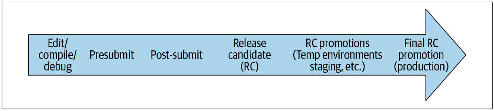
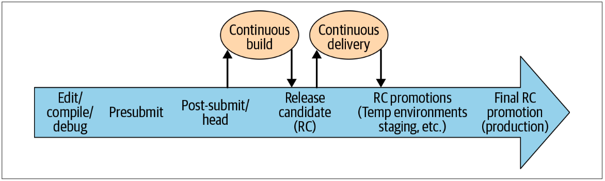

# CHAPTER 23 Continuous Integration

Written by Rachel Tannenbaum Edited by Lisa Carey

*Continuous Integration*, or CI, is generally defined as “a software development practice where members of a team integrate their work frequently [...] Each integration is verified by an automated build (including test) to detect integration errors as quickly as possible.”[^1] Simply put, the fundamental goal of CI is to automatically catch problematic changes as early as possible.

In practice, what does “integrating work frequently” mean for the modern, distributed application? Today’s systems have many moving pieces beyond just the latest versioned code in the repository. In fact, with the recent trend toward microservices, the changes that break an application are less likely to live inside the project’s immediate codebase and more likely to be in loosely coupled microservices on the other side of a network call. Whereas a traditional continuous build tests changes in your binary, an extension of this might test changes to upstream microservices. The dependency is just shifted from your function call stack to an HTTP request or Remote Procedure Calls (RPC).

Even further from code dependencies, an application might periodically ingest data or update machine learning models. It might execute on evolving operating systems, runtimes, cloud hosting services, and devices. It might be a feature that sits on top of a growing platform or be the platform that must accommodate a growing feature base. All of these things should be considered dependencies, and we should aim to “continuously integrate” their changes, too. Further complicating things, these changing components are often owned by developers outside our team, organization, or company and deployed on their own schedules.

So, perhaps a better definition for CI in today’s world, particularly when developing at scale, is the following:

> *Continuous Integration (2)*: the continuous assembling and testing of our entire complex and rapidly evolving ecosystem.

It is natural to conceptualize CI in terms of testing because the two are tightly coupled, and we’ll do so throughout this chapter. In previous chapters, we’ve discussed a comprehensive range of testing, from unit to integration, to larger-scoped systems.

From a testing perspective, CI is a paradigm to inform the following:

• *Which* tests to run *when* in the development/release workflow, as code (and other) changes are continuously integrated into it

• *How* to compose the system under test (SUT) at each point, balancing concerns like fidelity and setup cost

For example, which tests do we run on presubmit, which do we save for post-submit, and which do we save even later until our staging deploy? Accordingly, how do we represent our SUT at each of these points? As you might imagine, requirements for a presubmit SUT can differ significantly from those of a staging environment under test. For example, it can be dangerous for an application built from code pending review on presubmit to talk to real production backends (think security and quota vulnerabilities), whereas this is often acceptable for a staging environment.

And *why* should we try to optimize this often-delicate balance of testing “the right things” at “the right times” with CI? Plenty of prior work has already established the benefits of CI to the engineering organization and the overall business alike.[^2] These outcomes are driven by a powerful guarantee: verifiable—and timely—proof that the application is good to progress to the next stage. We don’t need to just hope that all contributors are very careful, responsible, and thorough; we can instead guarantee the working state of our application at various points from build throughout release, thereby improving confidence and quality in our products and productivity of our teams.

In the rest of this chapter, we’ll introduce some key CI concepts, best practices and challenges, before looking at how we manage CI at Google with an introduction to our continuous build tool, TAP, and an in-depth study of one application’s CI transformation.

[^1]: *https://www.martinfowler.com/articles/continuousIntegration.html*

[^2]:  Forsgren, Nicole, et al. (2018). Accelerate: The Science of Lean Software and DevOps: Building and Scaling High Performing Technology Organizations. IT Revolution.

## CI Concepts

First, let’s begin by looking at some core concepts of CI.

## Fast Feedback Loops

As discussed in Chapter 11, the cost of a bug grows almost exponentially the later it is caught. Figure 23-1 shows all the places a problematic code change might be caught in its lifetime.

*Figure 23-1. Life of a code change*

In general, as issues progress to the “right” in our diagram, they become costlier for the following reasons:

- They must be triaged by an engineer who is likely unfamiliar with the problematic code change.
- They require more work for the code change author to recollect and investigate the change.
- They negatively affect others, whether engineers in their work or ultimately the end user.

To minimize the cost of bugs, CI encourages us to use *fast feedback loops.*[^3] Each time we integrate a code (or other) change into a testing scenario and observe the results, we get a new *feedback loop*. Feedback can take many forms; following are some com‐ mon ones (in order of fastest to slowest):

- The edit-compile-debug loop of local development
- Automated test results to a code change author on presubmit
- An integration error between changes to two projects, detected after both are submitted and tested together (i.e., on post-submit)
- An incompatibility between our project and an upstream microservice dependency, detected by a QA tester in our staging environment, when the upstream service deploys its latest changes
- Bug reports by internal users who are opted in to a feature before external users
- Bug or outage reports by external users or the press

*Canarying*—or deploying to a small percentage of production first—can help minimize issues that do make it to production, with a subset-of-production initial feedback loop preceding all-of-production. However, canarying can cause problems, too, particularly around compatibility between deployments when multiple versions are deployed at once. This is sometimes known as *version skew*, a state of a distributed system in which it contains multiple incompatible versions of code, data, and/or configuration. Like many issues we look at in this book, version skew is another example of a challenging problem that can arise when trying to develop and manage software over time.

*Experiments* and *feature* *flags* are extremely powerful feedback loops. They reduce deployment risk by isolating changes within modular components that can be dynamically toggled in production. Relying heavily on feature-flag-guarding is a common paradigm for Continuous Delivery, which we explore further in Chapter 24.

[^3]:  This is also sometimes called “shifting left on testing.”

### Access and actionable feedback

It’s also important that feedback from CI be widely accessible. In addition to our open culture around code visibility, we feel similarly about our test reporting. We have a unified test reporting system in which anyone can easily look up a build or test run, including all logs (excluding user Personally Identifiable Information [PII]), whether for an individual engineer’s local run or on an automated development or staging build.

Along with logs, our test reporting system provides a detailed history of when build or test targets began to fail, including audits of where the build was cut at each run, where it was run, and by whom. We also have a system for flake classification, which uses statistics to classify flakes at a Google-wide level, so engineers don’t need to figure this out for themselves to determine whether their change broke another project’s test (if the test is flaky: probably not).

Visibility into test history empowers engineers to share and collaborate on feedback, an essential requirement for disparate teams to diagnose and learn from integration failures between their systems. Similarly, bugs (e.g., tickets or issues) at Google are open with full comment history for all to see and learn from (with the exception, again, of customer PII).

Finally, any feedback from CI tests should not just be accessible but actionable—easy to use to find and fix problems. We’ll look at an example of improving user-unfriendly feedback in our case study later in this chapter. By improving test output readability, you automate the understanding of feedback.

## Automation

It’s well known that automating development-related tasks saves engineering resources in the long run. Intuitively, because we automate processes by defining them as code, peer review when changes are checked in will reduce the probability of error. Of course, automated processes, like any other software, will have bugs; but when implemented effectively, they are still faster, easier, and more reliable than if they were attempted manually by engineers.

CI, specifically, automates the *build* and *release* processes, with a Continuous Build and Continuous Delivery. Continuous testing is applied throughout, which we’ll look at in the next section.

### Continuous Build

The *Continuous Build* (CB) integrates the latest code changes at head[^4] and runs an automated build and test. Because the CB runs tests as well as building code, “breaking the build” or “failing the build” includes breaking tests as well as breaking compilation.

After a change is submitted, the CB should run all relevant tests. If a change passes all tests, the CB marks it passing or “green,” as it is often displayed in user interfaces (UIs). This process effectively introduces two different versions of head in the repository: *true head*, or the latest change that was committed, and *green head,* or the latest change the CB has verified. Engineers are able to sync to either version in their local development. It’s common to sync against green head to work with a stable environment, verified by the CB, while coding a change but have a process that requires changes to be synced to true head before submission.

[^4]:  *Head* is the latest versioned code in our monorepo. In other workflows, this is also referred to as *master*, *mainline*, or *trunk*. Correspondingly, integrating at head is also known as *trunk-based development*.

### Continuous Delivery

The first step in Continuous Delivery (CD; discussed more fully in Chapter 24) is *release automation*, which continuously assembles the latest code and configuration from head into release candidates. At Google, most teams cut these at green, as opposed to true, head.

> *Release candidate* (RC): A cohesive, deployable unit created by an automated process,[^5] assembled of code, configuration, and other dependencies that have passed the continuous build.

Note that we include configuration in release candidates—this is extremely important, even though it can slightly vary between environments as the candidate is promoted. We’re not necessarily advocating you compile configuration into your binaries —actually, we would recommend dynamic configuration, such as experiments or feature flags, for many scenarios.[^6]

Rather, we are saying that any static configuration you *do* have should be promoted as part of the release candidate so that it can undergo testing along with its corresponding code. Remember, a large percentage of production bugs are caused by “silly” configuration problems, so it’s just as important to test your configuration as it is your code (and to test it along *with* the same code that will use it). Version skew is often caught in this release-candidate-promotion process. This assumes, of course, that your static configuration is in version control—at Google, static configuration is in version control along with the code, and hence goes through the same code review process.

We then define CD as follows:

> *Continuous Delivery* (CD): a continuous assembling of release candidates, followed by the promotion and testing of those candidates throughout a series of environments— sometimes reaching production and sometimes not.

The promotion and deployment process often depends on the team. We’ll show how our case study navigated this process.

For teams at Google that want continuous feedback from new changes in production (e.g., Continuous Deployment), it’s usually infeasible to continuously push entire binaries, which are often quite large, on green. For that reason, doing a *selective* Continuous Deployment, through experiments or feature flags, is a common strategy.[^7]

As an RC progresses through environments, its artifacts (e.g., binaries, containers) ideally should not be recompiled or rebuilt. Using containers such as Docker helps enforce consistency of an RC between environments, from local development onward. Similarly, using orchestration tools like Kubernetes (or in our case, usually Borg), helps enforce consistency between deployments. By enforcing consistency of our release and deployment between environments, we achieve higher-fidelity earlier testing and fewer surprises in production.

[^5]:   At Google, release automation is managed by a separate system from TAP. We won’t focus on *how* release automation assembles RCs, but if you’re interested, we do refer you to *Site Reliability Engineering* (O’Reilly) in which our release automation technology (a system called Rapid) is discussed in detail.

[^6]:   CD with experiments and feature flags is discussed further in Chapter 24.

[^7]:   We call these “mid-air collisions” because the probability of it occurring is extremely low; however, when this does happen, the results can be quite surprising.

## Continuous Testing

Let’s look at how CB and CD fit in as we apply Continuous Testing (CT) to a code change throughout its lifetime, as shown Figure 23-2.

*Figure 23-2. Life of a code change with CB and CD*

The rightward arrow shows the progression of a single code change from local development to production. Again, one of our key objectives in CI is determining *what* to test *when* in this progression. Later in this chapter, we’ll introduce the different tes ing phases and provide some considerations for what to test in presubmit versus post-submit, and in the RC and beyond. We’ll show that, as we shift to the right, the code change is subjected to progressively larger-scoped automated tests.

### Why presubmit isn’t enough

With the objective to catch problematic changes as soon as possible and the ability to run automated tests on presubmit, you might be wondering: why not just run all tests on presubmit?

The main reason is that it’s too expensive. Engineer productivity is extremely valuable, and waiting a long time to run every test during code submission can be severely disruptive. Further, by removing the constraint for presubmits to be exhaustive, a lot of efficiency gains can be made if tests pass far more frequently than they fail. For example, the tests that are run can be restricted to certain scopes, or selected based on a model that predicts their likelihood of detecting a failure.

Similarly, it’s expensive for engineers to be blocked on presubmit by failures arising from instability or flakiness that has nothing to do with their code change.

Another reason is that during the time we run presubmit tests to confirm that a change is safe, the underlying repository might have changed in a manner that is incompatible with the changes being tested. That is, it is possible for two changes that touch completely different files to cause a test to fail. We call this a midair collision, and though generally rare, it happens most days at our scale. CI systems for smaller repositories or projects can avoid this problem by serializing submits so that there is no difference between what is about to enter and what just did.

### Presubmit versus post-submit

So, which tests *should* be run on presubmit? Our general rule of thumb is: only fast, reliable ones. You can accept some loss of coverage on presubmit, but that means you need to catch any issues that slip by on post-submit, and accept some number of rollbacks. On post-submit, you can accept longer times and some instability, as long as you have proper mechanisms to deal with it.

We’ll show how TAP and our case study handle failure management in “CI at Google” on page 493.

We don’t want to waste valuable engineer productivity by waiting too long for slow tests or for too many tests—we typically limit presubmit tests to just those for the project where the change is happening. We also run tests concurrently, so there is a resource decision to consider as well. Finally, we don’t want to run unreliable tests on presubmit, because the cost of having many engineers affected by them, debugging the same problem that is not related to their code change, is too high.

Most teams at Google run their small tests (like unit tests) on presubmit[^8]—these are the obvious ones to run as they tend to be the fastest and most reliable. Whether and how to run larger-scoped tests on presubmit is the more interesting question, and this varies by team. For teams that do want to run them, hermetic testing is a proven approach to reducing their inherent instability. Another option is to allow large- scoped tests to be unreliable on presubmit but disable them aggressively when they start failing.

[^8]:  Each team at Google configures a subset of its project’s tests to run on presubmit (versus post-submit). In reality, our continuous build actually optimizes some presubmit tests to be saved for post-submit, behind the scenes. We’ll further discuss this later on in this chapter.

### Release candidate testing

After a code change has passed the CB (this might take multiple cycles if there were failures), it will soon encounter CD and be included in a pending release candidate.

As CD builds RCs, it will run larger tests against the entire candidate. We test a release candidate by promoting it through a series of test environments and testing it at each deployment. This can include a combination of sandboxed, temporary environments and shared test environments, like dev or staging. It’s common to include some manual QA testing of the RC in shared environments, too.

There are several reasons why it’s important to run a comprehensive, automated test suite against an RC, even if it is the same suite that CB just ran against the code on post-submit (assuming the CD cuts at green):

*As a sanity check*

​	We double check that nothing strange happened when the code was cut and recompiled in the RC.

*For auditability*

​	If an engineer wants to check an RC’s test results, they are readily available and associated with the RC, so they don’t need to dig through CB logs to find them.

*To allow for cherry picks*

​	If you apply a cherry-pick fix to an RC, your source code has now diverged from the latest cut tested by the CB.

*For emergency pushes*

​	In that case, CD can cut from true head and run the minimal set of tests necessary to feel confident about an emergency push, without waiting for the full CB to pass.

### Production testing

Our continuous, automated testing process goes all the way to the final deployed environment: production. We should run the same suite of tests against production(sometimes called probers) that we did against the release candidate earlier on to verify:
1) the working state of production, according to our tests, and 2) the relevance of our tests, according to production.

Continuous testing at each step of the application’s progression, each with its own trade-offs, serves as a reminder of the value in a “defense in depth” approach to catching bugs—it isn’t just one bit of technology or policy that we rely upon for quality and stability, it’s many testing approaches combined.

#### CI Is Alerting

*Titus Winters*

As with responsibly running production systems, sustainably maintaining software systems also requires continual automated monitoring. Just as we use a monitoring and alerting system to understand how production systems respond to change, CI
reveals how our software is responding to changes in its environment. Whereas production monitoring relies on passive alerts and active probers of running systems, CI uses unit and integration tests to detect changes to the software before it is deployed.
Drawing comparisons between these two domains lets us apply knowledge from one to the other.

Both CI and alerting serve the same overall purpose in the developer workflow—to identify problems as quickly as reasonably possible. CI emphasizes the early side of the developer workflow, and catches problems by surfacing test failures. Alerting focuses on the late end of the same workflow and catches problems by monitoring metrics and reporting when they exceed some threshold. Both are forms of “identify problems automatically, as soon as possible.”

A well-managed alerting system helps to ensure that your Service-Level Objectives(SLOs) are being met. A good CI system helps to ensure that your build is in good shape—the code compiles, tests pass, and you could deploy a new release if you needed to. Best-practice policies in both spaces focus a lot on ideas of fidelity and actionable alerting: tests should fail only when the important underlying invariant is violated, rather than because the test is brittle or flaky. A flaky test that fails every few CI runs is just as much of a problem as a spurious alert going off every few minutes and generating a page for the on-call. If it isn’t actionable, it shouldn’t be alerting. If it isn’t actually violating the invariants of the SUT, it shouldn’t be a test failure.

CI and alerting share an underlying conceptual framework. For instance, there’s a similar relationship between localized signals (unit tests, monitoring of isolated statistics/cause-based alerting) and cross-dependency signals (integration and release tests, black-box probing). The highest fidelity indicators of whether an aggregate system is working are the end-to-end signals, but we pay for that fidelity in flakiness, increasing resource costs, and difficulty in debugging root causes.

Similarly, we see an underlying connection in the failure modes for both domains. Brittle cause-based alerts fire based on crossing an arbitrary threshold (say, retries in the past hour), without there necessarily being a fundamental connection between
that threshold and system health as seen by an end user. Brittle tests fail when an arbitrary test requirement or invariant is violated, without there necessarily being a fundamental connection between that invariant and the correctness of the software being tested. In most cases these are easy to write, and potentially helpful in debugging a larger issue. In both cases they are rough proxies for overall health/correctness, failing to capture the holistic behavior. If you don’t have an easy end-to-end probe, but you do make it easy to collect some aggregate statistics, teams will write threshold alerts based on arbitrary statistics. If you don’t have a high-level way to say, “Fail the test if the decoded image isn’t roughly the same as this decoded image,” teams will instead build tests that assert that the byte streams are identical.

Cause-based alerts and brittle tests can still have value; they just aren’t the ideal way to identify potential problems in an alerting scenario. In the event of an actual failure, having more debug detail available can be useful. When SREs are debugging an outage,
it can be useful to have information of the form, “An hour ago users, started experiencing more failed requests. Around the same, time the number of retries started ticking up. Let’s start investigating there.” Similarly, brittle tests can still provide extra debugging information: “The image rendering pipeline started spitting out garbage. One of the unit tests suggests that we’re getting different bytes back from the JPEG compressor. Let’s start investigating there.”

Although monitoring and alerting are considered a part of the SRE/production management domain, where the insight of “Error Budgets” is well understood,[^9] CI comes from a perspective that still tends to be focused on absolutes. Framing CI as the “left shift” of alerting starts to suggest ways to reason about those policies and propose better best practices:

- Having a 100% green rate on CI, just like having 100% uptime for a production service, is awfully expensive. If that is actually your goal, one of the biggest problems is going to be a race condition between testing and submission.
- Treating every alert as an equal cause for alarm is not generally the correct approach. If an alert fires in production but the service isn’t actually impacted, silencing the alert is the correct choice. The same is true for test failures: until our CI systems learn how to say, “This test is known to be failing for irrelevant reasons,” we should probably be more liberal in accepting changes that disable a failed test. Not all test failures are indicative of upcoming production issues.
- Policies that say, “Nobody can commit if our latest CI results aren’t green” are probably misguided. If CI reports an issue, such failures should definitely be investigated before letting people commit or compound the issue. But if the root cause is well understood and clearly would not affect production, blocking commits is unreasonable.

This “CI is alerting” insight is new, and we’re still figuring out how to fully draw parallels. Given the higher stakes involved, it’s unsurprising that SRE has put a lot of thought into best practices surrounding monitoring and alerting, whereas CI has been viewed as more of a luxury feature.[^10] For the next few years, the task in software engineering will be to see where existing SRE practice can be reconceptualized in a CI context to help reformulate the testing and CI landscape—and perhaps where best
practices in testing can help clarify goals and policies on monitoring and alerting.

[^9]:Aiming for 100% uptime is the wrong target. Pick something like 99.9% or 99.999% as a business or product trade-off, define and monitor your actual uptime, and use that “budget” as an input to how aggressively you’re willing to push risky releases.
[^10]:We believe CI is actually critical to the software engineering ecosystem: a must-have, not a luxury. But that is not universally understood yet.

## CI Challenges

We’ve discussed some of the established best practices in CI and have introduced some of the challenges involved, such as the potential disruption to engineer productivity of unstable, slow, conflicting, or simply too many tests at presubmit. Some common additional challenges when implementing CI include the following:

- *Presubmit optimization*, including which tests to run at presubmit time given the potential issues we’ve already described, and how to run them.
- *Culprit finding* and *failure isolation*: Which code or other change caused the problem, and which system did it happen in? “Integrating upstream microservices” is one approach to failure isolation in a distributed architecture, when you
  want to figure out whether a problem originated in your own servers or a backend. In this approach, you stage combinations of your stable servers along with upstream microservices’ new servers. (Thus, you are integrating the microservices’
  latest changes into your testing.) This approach can be particularly challenging due to version skew: not only are these environments often incompatible, but you’re also likely to encounter false positives—problems that occur in a particular
  staged combination that wouldn’t actually be spotted in production.

- *Resource constraints*: Tests need resources to run, and large tests can be very expensive. In addition, the cost for the infrastructure for inserting automated testing throughout the process can be considerable.

There’s also the challenge of *failure management*—what to do when tests fail. Although smaller problems can usually be fixed quickly, many of our teams find that it’s extremely difficult to have a consistently green test suite when large end-to-end
tests are involved. They inherently become broken or flaky and are difficult to debug; there needs to be a mechanism to temporarily disable and keep track of them so that the release can go on. A common technique at Google is to use bug “hotlists” filed by an on-call or release engineer and triaged to the appropriate team. Even better is when these bugs can be automatically generated and filed—some of our larger products, like Google Web Server (GWS) and Google Assistant, do this. These hotlists
should be curated to make sure any release-blocking bugs are fixed immediately. Nonrelease blockers should be fixed, too; they are less urgent, but should also be prioritized so the test suite remains useful and is not simply a growing pile of disabled,
old tests. Often, the problems caught by end-to-end test failures are actually with tests rather than code.

Flaky tests pose another problem to this process. They erode confidence similar to a broken test, but finding a change to roll back is often more difficult because the failure won’t happen all the time. Some teams rely on a tool to remove such flaky tests from presubmit temporarily while the flakiness is investigated and fixed. This keeps confidence high while allowing for more time to fix the problem.

*Test instability* is another significant challenge that we’ve already looked at in the context of presubmits. One tactic for dealing with this is to allow multiple attempts of the test to run. This is a common test configuration setting that teams use. Also, within
test code, retries can be introduced at various points of specificity. 

Another approach that helps with test instability (and other CI challenges) is hermetic testing, which we’ll look at in the next section.

## Hermetic Testing

Because talking to a live backend is unreliable, we often use hermetic backends for larger-scoped tests. This is particularly useful when we want to run these tests on presubmit, when stability is of utmost importance. In Chapter 11, we introduced the concept of hermetic tests:

> *Hermetic tests*: tests run against a test environment (i.e., application servers and resources) that is entirely self-contained (i.e., no external dependencies like production backends).

Hermetic tests have two important properties: greater determinism (i.e., stability) and isolation. Hermetic servers are still prone to some sources of nondeterminism, like system time, random number generation, and race conditions. But, what goes into
the test doesn’t change based on outside dependencies, so when you run a test twice with the same application and test code, you should get the same results. If a hermetic test fails, you know that it’s due to a change in your application code or tests (with a minor caveat: they can also fail due to a restructuring of your hermetic test environment, but this should not change very often). For this reason, when CI systems rerun tests hours or days later to provide additional signals, hermeticity makes test failures easier to narrow down.

The other important property, isolation, means that problems in production should not affect these tests. We generally run these tests all on the same machine as well, so we don’t have to worry about network connectivity issues. The reverse also holds:
problems caused by running hermetic tests should not affect production.

Hermetic test success should not depend on the user running the test. This allows people to reproduce tests run by the CI system and allows people (e.g., library developers) to run tests owned by other teams.

One type of hermetic backend is a fake. As discussed in Chapter 13, these can be cheaper than running a real backend, but they take work to maintain and have limited fidelity.

The cleanest option to achieve a presubmit-worthy integration test is with a fully hermetic setup—that is, starting up the entire stack sandboxed[^11]—and Google provides out-of-the-box sandbox configurations for popular components, like databases, to
make it easier. This is more feasible for smaller applications with fewer components, but there are exceptions at Google, even one (by DisplayAds) that starts about four hundred servers from scratch on every presubmit as well as continuously on postsubmit. Since the time that system was created, though, record/replay has emerged as a more popular paradigm for larger systems and tends to be cheaper than starting up a large sandboxed stack.

Record/replay (see Chapter 14) systems record live backend responses, cache them, and replay them in a hermetic test environment. Record/replay is a powerful tool for reducing test instability, but one downside is that it leads to brittle tests: it’s difficult to strike a balance between the following:

*False positives*

​	The test passes when it probably shouldn’t have because we are hitting the cache too much and missing problems that would surface when capturing a new response.

*False negatives*

​	The test fails when it probably shouldn’t have because we are hitting the cache too little. This requires responses to be updated, which can take a long time and lead to test failures that must be fixed, many of which might not be actual problems.
This process is often submit-blocking, which is not ideal.

Ideally, a record/replay system should detect only problematic changes and cachemiss only when a request has changed in a meaningful way. In the event that that change causes a problem, the code change author would rerun the test with an updated
response, see that the test is still failing, and thereby be alerted to the problem. In practice, knowing when a request has changed in a meaningful way can be incredibly difficult in a large and ever-changing system.

### The Hermetic Google Assistant

Google Assistant provides a framework for engineers to run end-to-end tests, including a test fixture with functionality for setting up queries, specifying whether to simulate on a phone or a smart home device, and validating responses throughout an exchange with Google Assistant.

One of its greatest success stories was making its test suite fully hermetic on presubmit. When the team previously used to run nonhermetic tests on presubmit, the tests would routinely fail. In some days, the team would see more than 50 code changes
bypass and ignore the test results. In moving presubmit to hermetic, the team cut the runtime by a factor of 14, with virtually no flakiness. It still sees failures, but those failures tend to be fairly easy to find and roll back.

Now that nonhermetic tests have been pushed to post-submit, it results in failures accumulating there instead. Debugging failing end-to-end tests is still difficult, and some teams don’t have time to even try, so they just disable them. That’s better than having it stop all development for everyone, but it can result in production failures.

One of the team’s current challenges is to continue to fine-tuning its caching mechanisms so that presubmit can catch more types of issues that have been discovered only post-submit in the past, without introducing too much brittleness.

Another is how to do presubmit testing for the decentralized Assistant given that components are shifting into their own microservices. Because the Assistant has a large and complex stack, the cost of running a hermetic stack on presubmit, in terms
of engineering work, coordination, and resources, would be very high.

Finally, the team is taking advantage of this decentralization in a clever new postsubmit failure-isolation strategy. For each of the *N* microservices within the Assistant, the team will run a post-submit environment containing the microservice built at head, along with production (or close to it) versions of the other *N – 1* services, to isolate problems to the newly built server. This setup would normally be *O(N^2)* cost to facilitate, but the team leverages a cool feature called *hotswapping* to cut this cost to *O(N)*. Essentially, hotswapping allows a request to instruct a server to “swap” in the address of a backend to call instead of the usual one. So only *N* servers need to be run, one for each of the microservices cut at head—and they can reuse the same set of prod backends swapped in to each of these N “environments.”

As we’ve seen in this section, hermetic testing can both reduce instability in largerscoped tests and help isolate failures—addressing two of the significant CI challenges we identified in the previous section. However, hermetic backends can also be more expensive because they use more resources and are slower to set up. Many teams use combinations of hermetic and live backends in their test environments.

[^11]:In practice, it’s often difficult to make a completely sandboxed test environment, but the desired stability can be achieved by minimizing outside dependencies.

## CI at Google

Now let’s look in more detail at how CI is implemented at Google. First, we’ll look at our global continuous build, TAP, used by the vast majority of teams at Google, and how it enables some of the practices and addresses some of the challenges that we looked at in the previous section. We’ll also look at one application, Google Takeout, and how a CI transformation helped it scale both as a platform and as a service.

### TAP: Google’s Global Continuous Build

*Adam Bender*

We run a massive continuous build, called the Test Automation Platform (TAP), of our entire codebase. It is responsible for running the majority of our automated tests. As a direct consequence of our use of a monorepo, TAP is the gateway for almost all changes at Google. Every day it is responsible for handling more than 50,000 unique changes and running more than four billion individual test cases. 

TAP is the beating heart of Google’s development infrastructure. Conceptually, the process is very simple. When an engineer attempts to submit code, TAP runs the associated tests and reports success or failure. If the tests pass, the change is allowed into the codebase.

#### Presubmit optimization

To catch issues quickly and consistently, it is important to ensure that tests are run against every change. Without a CB, running tests is usually left to individual engineer discretion, and that often leads to a few motivated engineers trying to run all tests and keep up with the failures.

As discussed earlier, waiting a long time to run every test on presubmit can be severely disruptive, in some cases taking hours. To minimize the time spent waiting, Google’s CB approach allows potentially breaking changes to land in the repository (remember that they become immediately visible to the rest of the company!). All we ask is for each team to create a fast subset of tests, often a project’s unit tests, that can be run before a change is submitted (usually before it is sent for code review)—the presubmit. Empirically, a change that passes the presubmit has a very high likelihood (95%+) of passing the rest of the tests, and we optimistically allow it to be integrated so that other engineers can then begin to use it.

After a change has been submitted, we use TAP to asynchronously run all potentially affected tests, including larger and slower tests.

When a change causes a test to fail in TAP, it is imperative that the change be fixed quickly to prevent blocking other engineers. We have established a cultural norm that strongly discourages committing any new work on top of known failing tests, though flaky tests make this difficult. Thus, when a change is committed that breaks a team’s build in TAP, that change may prevent the team from making forward progress or building a new release. As a result, dealing with breakages quickly is imperative.

To deal with such breakages, each team has a “Build Cop.” The Build Cop’s responsibility is keeping all the tests passing in their particular project, regardless of who breaks them. When a Build Cop is notified of a failing test in their project, they drop whatever they are doing and fix the build. This is usually by identifying the offending change and determining whether it needs to be rolled back (the preferred solution) or can be fixed going forward (a riskier proposition).

In practice, the trade-off of allowing changes to be committed before verifying all tests has really paid off; the average wait time to submit a change is around 11 minutes, often run in the background. Coupled with the discipline of the Build Cop, we are able to efficiently detect and address breakages detected by longer running tests with a minimal amount of disruption.

#### Culprit finding

One of the problems we face with large test suites at Google is finding the specific change that broke a test. Conceptually, this should be really easy: grab a change, run the tests, if any tests fail, mark the change as bad. Unfortunately, due to a prevalence of flakes and the occasional issues with the testing infrastructure itself, having confidence that a failure is real isn’t easy. To make matters more complicated, TAP must evaluate so many changes a day (more than one a second) that it can no longer run every test on every change. Instead, it falls back to batching related changes together, which reduces the total number of unique tests to be run. Although this approach can make it faster to run tests, it can obscure which change in the batch caused a test to break.

To speed up failure identification, we use two different approaches. First, TAP automatically splits a failing batch up into individual changes and reruns the tests against each change in isolation. This process can sometimes take a while to converge on a failure, so in addition, we have created culprit finding tools that an individual developer can use to binary search through a batch of changes and identify which one is the likely culprit.

#### Failure management

After a breaking change has been isolated, it is important to fix it as quickly as possible. The presence of failing tests can quickly begin to erode confidence in the test suite. As mentioned previously, fixing a broken build is the responsibility of the Build Cop. The most effective tool the Build Cop has is the *rollback*.

Rolling a change back is often the fastest and safest route to fix a build because it quickly restores the system to a known good state.[^12] In fact, TAP has recently been upgraded to automatically roll back changes when it has high confidence that they are
the culprit.

Fast rollbacks work hand in hand with a test suite to ensure continued productivity. Tests give us confidence to change, rollbacks give us confidence to undo. Without tests, rollbacks can’t be done safely. Without rollbacks, broken tests can’t be fixed quickly, thereby reducing confidence in the system.

[^12]:Any change to Google’s codebase can be rolled back with two clicks!

