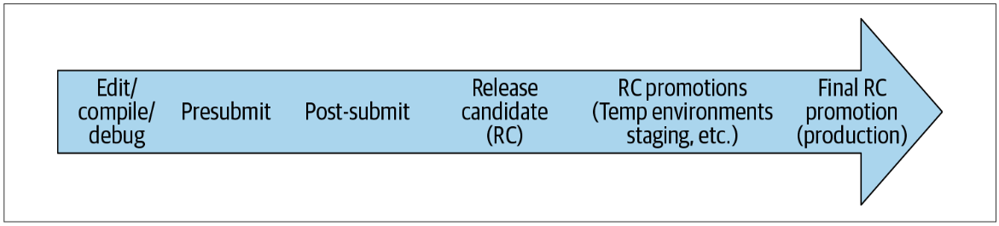
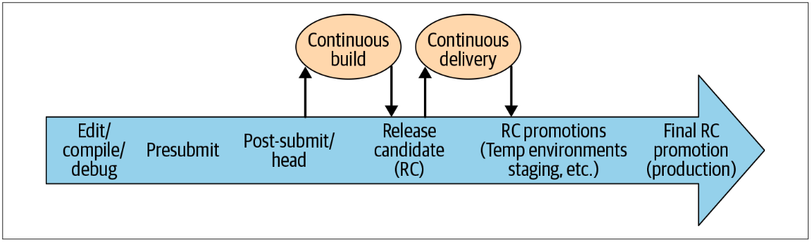

# 第23章 持续集成

由Rachel Tannenbaum撰写，Lisa Carey编辑

*连续集成*（CI）通常被定义为”团队成员需要频繁集成他们工作的软件开发工作[...]每次集成都通过自动构建（包括测试）进行验证，以检测集成错误。“[^1]简而言之，CI的基本目标是尽早自动发现有问题的代码更新。

“持续集成”对于现代的分布式应用有什么意义？当今的系统除了仓库中的最新版本代码外，还有许多其他不错的部分。实际上，随着微服务的最新趋势，破坏程序的代码更新不太可能存在于项目的当前仓库中，而更有可能出现在网络调用另一端的松耦合微服务中。传统的连续构建会测试二进制文件中的更新，在这上的扩展可能会测试上游微服务的更改。依赖关系只是从函数调用堆栈转移到HTTP请求或远程过程调用（RPC）。

即使远离代码依赖关系，程序也可能会定期提取数据或更新机器学习模型。它可能在不断发展的操作系统，内存管理，云托管服务和设备上执行。它可能是一个位于不断发展的平台之上的功能，也可能是必须适应不断增长的功能的基础平台。所有这些东西都应被视为依赖项，我们也应致力于“持续集成”它们的更新。更复杂的是，这些不断变化的模块通常由我们团队，组织或公司之外的开发人员拥有，并按自己的进度进行部署。

因此，对于当今的CI，尤其是在大规模开发时，可能有一个更好的定义：

> *持续集成（2）*：对我们整个复杂而迅速发展的系统环境的不断合并和测试。

从测试的角度对CI进行概念化是很自然的，因为两者紧密相关，我们将在本章中继续进行。在前面的章节中，我们讨论了从单元到集成，再到更大范围的系统的全面测试。

从测试方面来说，CI是一个介绍以下部分的范例：

• 在开发/发布开发过程中，随着代码（和其他部分）的更新的不断集成，要运行哪些测试

• 如何在每个测试点上组成被测系统（SUT），平衡准确性和启动成本等

例如，我们在提交前运行哪些测试，在提交后保存哪些测试，甚至在以后进行暂存部署之前保存哪些测试？因此，我们如何在这些测试点上划分我们的SUT？就像你想象的那样，预提交SUT的要求可能与测试中的过渡环境的要求有很大不同。例如，在代码审核前提交前的程序与真实的生产后端进行交互（可能存在安全性和配额漏洞问题）可能很危险，但对于过渡环境而言，这通常是可以接受的。

为何我们还要尝试通过CI在“合适的时间”测试“合适的事物”达成这一通常微妙的平衡呢？大量的先前工作已经建立了CI对开发团队和整个业务的好处。[^2]这些结果是由有力的证据所驱动的：即时的可验证的程序可以很好地发展到下一个阶段。我们不需要只是希望所有贡献者都非常谨慎，负责和透彻；相反，我们可以保证从构建到发行的各个阶段，我们的应用程序都处于工作状态，从而提高了我们对产品的信心和质量以及团队的生产力。

在本章的其余部分中，我们将介绍一些关键的CI概念，最佳实践和挑战，然后介绍我们在Google上如何管理CI，并且将通过一个程序在CI转换上的深入研究来介绍我们的CI工具TAP。

[^1]: *https://www.martinfowler.com/articles/continuousIntegration.html*

[^2]: Forsgren, Nicole, et al. (2018). Accelerate: The Science of Lean Software and DevOps: Building and Scaling High Performing Technology Organizations. IT Revolution.

## CI概念

首先，让我们开始研究CI的一些核心概念。

## 快速反馈循环

正如第11章所讨论的，一个错误越晚被发现它所花费的成本会成倍的增加。图23-1展示了所有有问题的代码在时间线中可能被发现的时间节点。

* 图23-1. 代码更新的时间线

通常来说，随着问题发展到图表的右边，它们被发现的所消耗的成本更多，主要因为以下原因：

- 它们肯定是由不熟悉代码更改的工程师对它们进行分类。
- 它们需要代码更新的坐着消耗更多的工作了来收集和调查代码更新。
- 它们会对他人产生负面影响，无论是工作中的工程师还是最终用户。

为了最大程度地减少错误的成本，CI鼓励我们使用*快速反馈循环。*[^3]每当我们将代码（或其他部分）更新集成到测试环境中并观察结果时，我们都会得到一个新的*反馈循环*。反馈可以采取多种形式，以下是一些常见的（从最快到最慢的顺序排列）：

- 本地开发的编写-编译-调试循环
- 代码更新作者在提交前的自动化测试结果
- 在两个项目的更新一起提交并测试后检测到的两个项目的更新之间的集成错误（在提交后）
- 当上游服务部署其最新更改时，我们的项目与上游微服务依赖项之间的不兼容性（由过渡环境中的QA测试人员检测到）
- 内测用户发现的错误报告，他们比起外部用户更先尝试新功能
- 由外部用户或媒体发现的错误或中断报告

*金丝雀*—或者先部署一小部分代码到生产环境—可以通过在全部代码部署到生产环境之前进行生产子集的初始反馈循环，来最大程度地减少生产环境中遇到的问题。但是，金丝雀也会引起问题，尤其是在一次部署多个版本时，部署之间的兼容性问题。这有时被称为*版本倾斜*, 这是分布式系统的一种状态，其中它包含代码，数据和配置的多个不兼容版本。就像我们在本书中讨论的许多问题一样，版本倾斜是一个挑战性的例子，当尝试随着时间的推移开发和管理软件时，可能会出现挑战性的问题。

*实验* 和 *特征标记* 是极其强大的反馈循环。它们通过隔离可在生产环境中动态切换的模块化组件中的更改来降低部署风险。高度依赖功能标记保护是持续交付的常见范例，我们将在第24章中进一步探讨。

[^3]: 有时也被称为 “向左转移测试”

### 访问和可行反馈

CI反馈能够广泛可访问也很重要。除了围绕代码可见性的开源文化之外，我们对测试报告的感受也类似。我们拥有一个统一的测试报告系统，在该系统中，任何人都可以轻松地查找构建或测试运行，包括所有日志（不包括用户个人身份信息），无论是针对单个工程师的本地运行还是在自动化开发或分阶段构建中。

除日志外，我们的测试报告系统还提供了有关构建或测试目标何时开始失败的详细历史记录，包括审核每次运行时切片的位置，运行的位置以及由谁进行的审核。我们还提供了切片分类系统，该系统使用统计信息在Google范围内对切片进行分类，因此工程师无需自己弄清楚这一点来确定他们的变更是否破坏了另一个项目的测试（如果测试是片状：可能不是）。

测试历史记录的可视性使工程师能够共享反馈并在反馈上进行协作，这是不同团队从系统之间的集成故障中诊断和学习的基本要求。同样，Google的错误（例如票证或问题）也会打开，其中包含完整的评论历史记录，供所有人查看和学习（客户除外）。

最后，来自CI测试的任何反馈不仅应该可以访问，而且应该可行-易于使用来查找和解决问题。在本章稍后的案例研究中，我们将看一个改善一个用户不友好反馈的示例。通过提高测试输出的可读性，您可以很容易理解反馈。

## 自动化

众所周知，从长远来看，自动化与开发相关的任务可以节省工程资源。直观地讲，由于我们通过将流程定义为代码来实现流程自动化，因此其他开发者对代码更新的检查将减少出错的可能性。当然，像其他软件一样，自动化过程也会出现错误。但是，如果有效实施，与工程师手动尝试相比，它们仍然更快，更轻松，更可靠。

CI特别是通过持续*构建*和持续*交付*来自动化构建和发布过程。整个过程都将进行连续测试，我们将在下一部分中进行介绍。和发布过程。整个过程都将进行连续测试，我们将在下一部分中进行介绍。

### 持续构建

*持续构建*（CB）可以立即集成最新的代码更改[^4]，并运行自动化的构建和测试。由于CB既要运行测试又要构建代码，因此“破坏构建”或“失败构建”包括破坏测试和破坏编译。

提交代码更新后，CB应该运行所有相关测试。如果更改通过所有测试，则CB会将其标记为通过或“绿色”，因为它通常显示在用户界面（UI）中。此过程有效地在存储库中引入了两种不同的head版本：true head（已提交的最新更改）和green head（或CB已验证的最新更改）。工程师可以在其本地开发中同步到任一版本。通常需要与green head同步，以在稳定的环境下工作，并由CB进行验证，同时对更改进行编码，但其流程要求更改在提交前必须同步到true head的头上。

[^4]: *Head* 是我们monorepo中最新的版本代码。在其他工作流程中，这也称为 *master*, *mainline*, 或 *trunk*。相应地，head合并也被称为 *基于trunk的开发*。

### 持续交付

持续交付（CD；第24章将更全面地讨论）的第一步是*发布自动化*，它将最新的代码和配置从head开始不断组合到候选发布中。在Google，大多数团队都以green head而不是true head来筛选它们。

> 候选发布（RC）：由一个自动过程创建的，可凝聚的，可部署的单元[^5]，由经过连续构建的代码，配置和其他依赖项组成。

请注意，我们在候选版本中包括了配置——这是非常重要的，尽管随着候选版本的推出它在环境之间可能会略有不同。我们不一定要提倡将配置编译到您的二进制文件中——实际上，我们建议在许多情况下使用动态配置，例如实验或特征标记。[^6]

相反，我们说的是，您应该将任何*设置*的静态配置提升为候选发布版本，以便它可以与相应的代码一起进行测试。请记住，大量的生产错误是由“愚蠢”的配置问题引起的，因此测试您的配置和代码一样重要（并与将使用它的相同代码*一起*进行测试）。版本倾斜通常发生在发行候选升级过程中。当然，这假定您的静态配置在版本控制中——在Google中，静态配置与代码一起在版本控制中，因此要经过相同的代码检查过程。

然后，我们将CD定义如下：

> 持续交付 (CD): 持续合并发布候选版本，然后在一系列环境中对这些候选版本进行升级和测试——有时达到生产状态要求，有时无法达到要求。

升级和部署过程通常取决于团队。我们将展示我们的案例研究如何引导这一过程。

对于希望从生产环境中的新变化（例如“持续部署”）获得持续反馈的Google团队，通常不建议将较大的整个二进制文件连续推送到green head。因此，通过实验或特征标记进行“选择性”连续部署是一种常见的策略。[^7]

随着RC在环境中的发展，理想情况下，不应该重新编译或重建其组件（例如，二进制文件，容器）。从本地开发开始，使用诸如Docker之类的容器有助于增强环境之间RC的一致性。同样，使用Kubernetes之类的编排工具（在我们的情况下，通常是Borg）有助于实现部署之间的一致性。通过加强环境之间发布和部署的一致性，我们可以实现更高保真度的早期测试，并减少生产中的意外情况。

[^5]:  在Google中，发布自动化由与TAP不同的系统管理。 我们不会专注于*发布自动化如何组装候选发布*，但是，如果您有兴趣，我们会向您推荐*站点可靠性工程*（O'Reilly），我们在其中讨论了发布自动化技术（称为Rapid的系统）的详细过程。

[^6]:  带有实验和特征标记的CD将在第24章中进一步讨论。

[^7]:  我们将其称为“空中碰撞”是因为发生这种碰撞的可能性极低。但是，当确实发生这种情况时，结果可能会非常令人惊讶。

## 持续测试

让我们看一下在将连续测试（CT）应用于整个生命周期中的代码更新时，连续构建（CB）和连续发布（CD）如何配合，如图23-2所示。

* 图23-2. *使用CB和CD的代码周期*

右箭头显示了从本地开发到生产环境的单个代码更新的进度。同样，我们在CI中的主要目标之一是确定在此过程中“什么时候进行测试” *“什么时候进行测试”。在本章的后面，我们将介绍不同的测试阶段，并提供一些有关在提交前与提交后以及在RC及以后版本中要测试什么的注意事项。我们将证明，当我们向右移动时，对代码的更改将经受逐渐扩大的范围的自动化测试。

### 为什么预提交是不充分的？

出于尽快发现有问题的更新的目的，以及能够在提交前运行自动测试的能力，你可能想知道：为什么不只在提交前运行所有测试？

主要原因是它太贵了。工程师的工作效率是非常宝贵的，在代码提交期间等待很长时间才能运行每个测试可能会造成严重破坏。此外，通过消除预提交的穷举性约束，如果测试通过的频率比失败的通过频率高得多，则可以大大提高效率。例如，可以将运行的测试限制在某些范围内，或者可以根据模型预测到一个失败的可能性来选择。

同样，对于工程师来说，代码更新时由于不稳定或脆弱等导致失败使工程师无法预提交，这是非常昂贵的。

另一个原因是，在我们运行提交前的测试以确认更新是安全的期间，基础仓库的更新方式可能与所测试的更新不兼容。也就是说，可能有两个更新涉及了完全不同的文件，从而导致测试失败。我们称这为空中相撞，虽然通常很少见，但在我们的规模中大多数情况下都会发生。用于较小仓库或项目的CI系统可以通过对提交进行序列化来避免此问题，使得我们正要测试的更新和完成测试的更新没有区别。

### 提交前和提交后的区别

因此，*应该*在提交前运行哪些测试？我们的一般经验法则是：只运行快速，可靠的规则。您可以在提交前接受某些范围的损失，但这意味着您需要在提交后发现遗漏的所有问题，并接受一定数量的回滚。提交后，只要您有适当的处理机制，你需要接受更长的时间和不稳定性来解决这些问题。

我们将在493页的“ Google的CI”中展示TAP和我们的案例研究如何处理故障管理。

我们不想因为等待太慢的速度或太多的测试而浪费宝贵的工程师生产力，我们通常将提交前的测试限制为正在发生项目更新的测试。我们还同时运行测试，因此还需要考虑资源分配。最后，我们不想在提交前进行不可靠的测试，因此让许多工程师受其影响，因为让他们调试与他们的代码更新无关的相同问题的成本过高。

Google的大多数团队都会在提交前进行小型测试（例如单元测试）[^8]——这些都是显而易见的，因为它们往往是最快，最可靠的。在预提交时是否以及如何运行更大范围的测试是一个更有趣的问题，并且因团队而异。对于想要运行它们的团队，密封测试是一种减少其固有不稳定性的行之有效的方法。另一个选择是允许大范围的测试在预提交时不可靠，但是在测试开始失败时主动禁用它们。

[^8]: Google的每个团队都将其项目测试的子集配置为在提交前（而不是提交后）运行。实际上，我们的连续构建实际上优化了一些提交前的测试，这些测试可以在后台保存，以备提交后使用。我们将在本章稍后进一步讨论。

### 发布候选测试

在代码更新通过CB之后（如果发生故障，这可能需要花费多个周期），它将很快进入CD，并被包含在等待发布的候选版本中。

当CD建立RC时，它将对整个候选程序进行较大的测试。我们通过在一系列测试环境中对其进行升级并在每个部署中对其进行测试来测试候选版本。这可以包括沙盒，临时环境和共享测试环境（例如开发人员或过渡环境）的组合。在共享环境中包含一些RC的人工QA测试也是很常见的。

针对RC运行一个全面自动化的测试集是很重要的，即使它和CB在提交后对代码运行的测试集相同(假设CD是通过的)。这么做有以下几点理由:

*作一次全面检查*

​	我们再次检查代码在RC中被剪切和重新编译时没有发生任何奇怪的事情。

*用于审核*

​	如果一个工程师想要检查一个RC的测试结果，它们是现成的，并且与RC本身相关联，所以他们不需要挖掘CB的日志来找到它们。

*允许cherry-pick（择优挑选）*

​	如果你对RC应用一个cherry-pick，你的源代码现在已经与CB测试的最新版本不同了。

*紧急推送*

​	在这种情况下，CD不必等待完整的CB通过，就可以从真正的head中删除并运行所需的最小测试集，以此对紧急推送感到自信。

### 生产测试

我们持续自动化的测试过程一直延伸到最终部署的环境:生产环境。我们应该对生产版本(有时称为探测程序)运行与之前对RC所做的相同的测试集，以验证：1)由测试结果得出的生产环境的工作状态 2)由生产环境表现出的我们测试的相关性。。

在应用程序的每一步进程执行持续测试,每种方法都有自己的利弊,提醒人们利用“纵深防御”方法的优势来捕获错误——我们保证质量和稳定性依靠的不只是这一个技术或政策,这是许多测试方法的总和。

#### CI是一种警报

*Titus Winters*

与负责任地运行生产系统一样，可持续地维护软件系统也需要持续的自动化监控。正如我们使用监视和警报系统来理解生产系统如何响应变化一样，CI揭示了我们的软件如何响应其环境中的变化。生产监控依赖于运行系统的被动警报和主动探测器，而CI使用单元和集成测试检测软件在部署之前的更改。

比较CI和警报这两个领域可以让我们把知识从一个领域运用到另一个领域。

CI和警报在开发人员工作流程中的总目标是一样的——尽可能快地发现问题。CI强调开发人员早期的工作流程，并通过显示失败的测试来捕获问题。警报重点关注同一工作流的后期，并通过监控指标，在它们超过某个阈值时发起报告来捕获问题。两者都是“尽快自动发现问题”的形式。

一个管理有方的警报系统有助于令你的服务等级目标(service-level objective, SLOs)得到满足。一个好的CI系统有助于确保你的构建处于良好的状态——代码编译、然后测试通过，之后如果需要还可以部署一个新发布。这两个领域的最佳实践策略都着重于逼真度和可操作的警报:只有违反重要的基本不变量时，测试才会失败，而不是因为测试脆弱或不稳定。每隔几次CI运行就失败一次的不稳定测试，或者每隔几分钟就发出一次虚假警报并为on-call生成一个页面，都是有很大问题的。如果没法采取行动，就不应该发出警报。如果它实际上没有违反SUT的不变量，那么它就不该是失败的测试。

CI和警报共享一个基本的概念框架。例如，在局部信号(单元测试、监视独立统计信息/基于原因的警报)和交叉依赖信号(集成和发布测试、黑盒探测)之间存在类似的关系。衡量一个综合系统是否在工作的最高逼真度指标是端到端信号，但这种逼真度是不稳定的、而且增加了资源成本，并且不容易调试根本的原因。

类似地，我们在两个领域的故障模式中看到一个基本联系。基于原因的警报出现不稳定是因为数据超出了一个随意的阈值(例如，失败请求在过去一小时内的重试次数)，而该阈值与最终用户所看到的系统健康状况之间不一定存在根本联系。当一个任意的测试需求或不变条件被违反时，不稳定的测试就会失败，但这个不变条件和被测试软件的正确性之间不一定存在基本联系。在大多数情况下，这些代码很容易编写，并且可能有助于调试更大的问题。在这两种情况下，它们都是粗略的表现了整体的健康/正确性，无法捕获整体的具体行为。如果你没有一个简单的端到端探针，但你确实使收集一些汇总统计数据变得容易，那么团队将根据任意的统计数据编写阈值警报。如果你没有高等级的方法来解释这样的故障：”编码前的图像与解码后的图像不太相同”，那么测试失败，团队将构建一个断言测试：字节流是否相同的。

基于原因的警报和不稳定测试仍然是有用的，只不过它们并不是在警报场景中发现潜在问题的理想方式。在实际发生故障的情况下，提供更多的调试细节是很有用的。当SRE调试断电时，如果有“一小时前的用户，开始经历更多失败请求。大约在同一时间，重试次数开始增加。让我们开始调查吧。”这样的表单信息，就会很有用。类似地，不稳定的测试仍然可以提供额外的调试信息:“图像渲染管道开始吐出垃圾。其中一个单元测试表明，我们从JPEG压缩器得到了不同的字节。让我们从这里开始调查吧。”

尽管监视和警报被认为是SRE/生产管理领域的一部分，它们对于“错误预算”的观点也被充分的理解[^9] ，但CI仍然倾向于绝对的视角。将CI定义为警示的“左移”就是开始建议推行这些策略及其更好的最佳实践：

- 在CI上拥有100%的绿色率，就像生产服务拥有100%的正常运行时间一样，是非常昂贵的。如果这确实是你的目标，那么最大的问题之一就是测试和提交之间的竞争条件。
- 一般来说，不应该把每一次警报当作同等原因来处理。如果在生产中触发警报，但服务实际上没有受到影响，那么关闭警报才是正确的选择。对于测试失败也是如此：在我们的CI系统学会如何说明“这个测试因为不相关的原因失败了”之前，我们或许应该对禁用失败的测试更包容一点，因为并不是所有的测试失败都预示着即将到来的生产问题。
- “如果我们最新的CI运行结果不是绿色的，所有人都不能提交”，这种策略可能是一种误导。如果CI报告了一个问题，那么在让人们提交或加重这个问题之前，肯定应该对此类失败进行调查。但是，如果很好地理解了根本原因，而且很明显不会影响生产，那么阻塞提交是不合理的

这种“CI是一种警报”的观点仍是初步提出，我们还在研究如何完全将两者划成等号。考虑到所涉及的较高风险，SRE在围绕监视和警报的最佳实践方面投入了大量精力也就不足为奇了，而CI则被视为一种更奢侈的功能。[^10]在接下来的几年里,软件工程的任务将是见证现有CI环境的行为实践被赋予新的概念，来帮助调整测试和CI景观，测试中的最佳实践可以帮助明确监控和报警的目标和策略。

[^9]: 不应该以100%正常的运行时间作为目标。而是选择99.9%或99.999%作为业务或产品的取舍，定义并监控你的实际正常运行时间，并使用“预算”作为你愿意以多大的力度推送风险版本。
[^10]:  我们相信CI对于软件工程生态系统实际上是至关重要的:是必须的，而不是奢侈的。但这一点还没有得到普遍理解。

## CI的挑战

我们已经讨论了一些已实行的最佳CI实践，并引入了一些涉及的挑战，例如不稳定的、缓慢的、相互冲突的工程生产团队，或者只是在预提交时测试太多这样的潜在隐患。在实现CI时，一些常见的额外挑战包括:

- *预提交优化*，包括根据我们已经描述的潜在问题，确定哪些测试要在预提交时运行，以及如何运行它们。
- *找出罪魁祸首*和*故障隔离*：问题是被哪些代码或者其他改动导致的？它发生在哪个系统上？“集成上游微服务”是一种分布式架构中进行故障隔离的方法，当你想要确定问题是源于你本地的服务器还是后端时。在这种方法中，你可以组合稳定服务器和上游微服务的新服务器。（因此，你正在将微服务的最新更改集成到你的测试中。）由于版本倾斜，这种方法可能特别具有挑战性:不仅这些环境经常不兼容，而且你还可能遇到在特定的集成中出现的误报问题，而在生产中实际上不会发现这些问题。
- *资源约束*：测试需要资源来运行，大型测试可能非常昂贵。此外，在整个过程中插入自动化测试的基础设施的成本是相当大的。

另外还需要面临*失败管理*的挑战——当测试失败时该怎么做。尽管较小的问题通常可以很快得到解决，但我们的许多团队发现，当涉及到大型端到端测试时，很难有一个一致通过的测试集。它们本身就是残缺的或者不稳定的，难以调试；需要有一种机制来暂时禁用并跟踪它们，这样发布才能继续进行。谷歌的一项常见技术是使用由on-call或设计发布工程师提交的bug“热点列表”，并将其划分到合适的团队。这些错误如果可以自动生成和归档就更好了——我们的一些较大的产品都是这样做的，如谷歌Web服务器(GWS)和谷歌助理。为了确保任何阻止发布的bug都能被立即修复，这些热点列表应该被妥善管理。非发布版本的断点也应该被修复；它们不那么紧急，但也应该被优先考虑，这样测试集仍然有用，而不仅仅是一堆被禁用的、旧的测试。通常，端到端测试失败所捕获的问题实际上与测试有关，而不是代码。

不稳定的测试给这个过程带来了另一个问题。它们类似于残缺的测试，降低了团队的信心，而且更难找到一个代码变更来回滚，因为失败不会一直发生。一些团队依赖于某种工具，在这些不稳定的测试被调查和修复的时候，暂时从预提交中删除这些不稳定的测试。这样可以保持较高的信心，同时留出更多时间来解决问题。

*测试不稳定性*是另一个重要的挑战，这个在预提交的背景下就已经被我们所考虑。处理这一问题的一个策略是允许测试多次尝试运行。这是团队常常使用的一个测试配置。同样，在测试代码中，可以在不同的特定点引入重试。

另一种有助于解决测试不稳定性（和其他CI挑战）的方法是密封测试，我们将在下一节中讨论。

## 密封测试

因为与在线的后端通信并不可靠，所以我们经常使用密封的后端来进行更大范围的测试。当我们想在预提交版本上运行这些测试时，这特别有用，因为稳定性是最重要的。在第11章中，我们介绍了密封测试的概念:

> *密封测试*：针对完全自包含的测试环境（即应用程序服务器和资源）运行的测试（即没有类似生产后端那样的外部依赖）。

密封测试有两个重要的特性：更高的确定性（即稳定性）和隔离性。密封的服务器仍然容易受到一些不确定性的影响，比如系统时间、随机数生成和竞态条件。但是，参与测试的内容不会根据外部依赖项而改变，所以当你使用相同的应用程序和测试代码再次运行测试时，应该会得到相同的结果。如果密封测试失败，你知道这是由于应用程序代码或测试的更改所致（有一个小警告：它们也可能由于密封测试环境的重新构造而失败，不过环境不常发生变化）。因此，当CI系统在数小时或数天之后重新运行测试以提供额外的信号时，密封测试失败更容易缩小范围。

另外还有一个重要的特性，隔离性，意味着生产中的问题应该不会影响这些测试。我们通常也会在同一台机器上运行这些测试，所以我们不必担心网络连接问题。反过来也成立：运行密封测试引起的问题应该不会影响生产。

密封测试的成功应该不会依赖于运行测试的用户。这允许人们重新运行由CI系统运行的测试，并允许人们（例如，lib库开发人员）运行其他团队的测试。

有一种专门仿造的密封后端。正如第13章所讨论的，这些可能比运行一个真正的后端成本更低，但是它们需要维护并且逼真度有限。要实现预提交版本的集成测试，最纯净的选择是使用一个完全密封的设置，即启动整个沙盒化堆栈[^11]，然后谷歌为流行的组件(如数据库)提供开箱即用的沙箱配置，使设置起来更加容易。小型应用程序的组件越少，实行起来就越容易，但在谷歌有例外，即使是一个DisplayAds的应用，都会在每次预提交和连续提交时从头启动大约400个服务器。自从系统创建以来，记录/重放模式已经流行于更大的系统，而且比启动一个大型沙盒化堆栈更便宜。

记录/回放系统（见第14章）记录并缓存实时的后端响应，然后在密封测试环境中回放它们。记录/回放是减少测试不稳定性的强大工具，但它的一个缺点是导致测试不稳定，很难在以下两者之间取得平衡：

*漏报率*

​	测试在不应该通过的情况下通过了，因为我们访问了太多次缓存从而错过了在捕捉新响应时可能出现的问题。	

*误报率*

​	测试在不应该失败的情况下失败了，因为我们命中的缓存太少。这需要对响应进行更新，可能耗时较长并导致一些需要修复的测试失败，其中许多可能不是真正的问题。这个过程通常是阻塞提交的，这并不理想。

理想情况下，记录/重放系统应该只检测有问题的更改，并且只在请求以有意义的方式更改时避开缓存。如果该更改产生了新的问题，代码更改的作者将使用更新的响应重新运行测试，查看测试是否仍然失败，并因此得到该问题的警报。实际上，在一个不断变化的大型系统中，是很难知道一个请求何时以一种有意义的方式改变的。

[^11]: 实际上，通常很难创建一个完全的沙盒化测试环境，但是可以通过减少外部依赖来实现所需的稳定性。

### 密封的Google Assistant

Google Assistant为工程师提供了一个框架来运行端到端测试，包括一个Test Fixture（测试固件），该测试固件具有设置查询的功能，还能指定在电话上或者智能家居设备上进行模拟，以及验证与Google Assistant之间的响应。它最成功的是使它的测试集在预提交上完全密封。当团队以前在预提交上运行非密封测试时，测试通常会失败。甚至某些时候，团队将看到超过50个代码更改绕过并忽略了测试结果。而通过将预提交移至密封环境，团队将运行时间缩短了14倍，几乎没有任何不稳定性。它仍然可以看到失败，但这些失败往往相当容易找到并回滚。

现在非密封测试已经被推送到提交后，它反而导致失败在那里累积。调试失败的端到端测试仍然很困难，一些团队甚至没有时间去尝试，所以他们只能禁用它们。让它停止所有人的开发进度相比这还算好，但它可能会导致生产环境报错。

该团队目前面临的挑战之一是继续微调其缓存机制，以便预提交能够捕获更多类型的问题，这些问题在过去只在提交后才发现，而不会带来太多的脆弱性。

另一个问题是如何为去中心化的Assistant进行预提交测试，因为组件正在将它们转换为微服务。由于Assistant有一个庞大而复杂的堆栈，在预提交上运行一个密封堆栈，其工程工作、协调和资源方面的成本，都将是非常高的。

最后，该团队正在以一种聪明的后提交的失败隔离策略来利用这种去中心化环境。对于Assistant中的每个*N*微服务，团队将运行一个提交后的环境，其中包含在头部构建的微服务，以及其他*N-1*个服务的生产（或接近它的）版本，以将问题隔离到新构建的服务器上。
这种设置通常需要*O(N^2)*成本才能实现，但该团队使用一个名为*热交换*的功能将成本降至*O(N)*。原理是，热交换允许请求指示服务器去“交换”后端地址，而不是通常的地址。所以只需要运行*N*个服务器，每个微服务都需要一个，并且它们可以在这N个环境中重用交换同一组生产后端。

正如我们在本节中所看到的，密封测试可以减少更大范围测试中的不稳定性，并帮助隔离故障，解决在前一节中我们所阐述的两个重要CI挑战。然而，密封后端也可能更昂贵，因为它们使用更多的资源，并且设置更慢。许多团队在他们的测试环境中组合使用密封后端和在线后端。

## 在谷歌的CI

现在让我们更详细地看看CI是如何在谷歌实现的。首先，我们将看看我们的全局持续构建，即被谷歌的绝大多数团队所使用的TAP，以及它如何使一些实践成为可能，并解决我们在上一节中所看到的一些挑战。我们还将讨论谷歌Takeout这一应用，以及它在转变为CI的过程中，CI是如何帮助它扩展为平台和服务的。

### TAP: 谷歌的全局持续构建

*Adam Bender*

我们对整个代码库运行了一个大规模的持续构建，称为自动化测试平台（Test Automation Platform，TAP）。它负责运行我们大部分的自动化测试。作为我们使用monorepo的一个直接结果，TAP把关谷歌几乎所有的更改。每天，它负责处理超过50,000个独特的变更，并运行超过40亿个单独的测试用例。

TAP是谷歌发展基础设施的跳动心脏。从概念上讲，这个过程非常简单。当工程师试图提交代码时，TAP运行相关测试并报告成功或失败。如果测试通过，更改就被允许进入代码库。

#### 预提交的优化

为了快速且一致地捕获问题，确保对每个更改都运行测试是很重要的。如果没有CB，通常由工程师个人自行决策测试的运行，这常常导致一些有动力的工程师试图运行所有测试并跟踪失败。

如前所述，在预提交上花很长时间去运行每个测试可能会造成严重破坏，某些情况下需要数个小时。为了最小化等待的时间，谷歌的CB方法允许潜在的破坏性更改进入存储库（请记住，它们对公司的其他人员是立即可见的！）我们要求每个团队创建一个快速的可以在预提交变更提交（通常是在它被发送给代码审查之前）之前运行的测试子集，通常是一个项目的单元测试。从经验来看，通过预提交的更改有很高的可能性（95%以上）通过剩下的测试，我们乐观地允许它被集成，这样其他工程师就可以开始使用它。

提交更改后，我们使用TAP异步运行所有可能受影响的测试，包括较大和较慢的测试。

当更改导致TAP中的测试失败时，必须迅速修复更改，以防止阻塞其他工程师。我们已经建立了一种文化规范，强烈反对在已知失败的测试上提交任何新工作，尽管不稳定的测试使这变得困难。因此，当提交了一个破坏了团队在TAP中的构建的变更时，该变更可能会阻止团队向前推进或构建一个新的发布版本。因此，快速处理错误是势在必行的。

为了处理这种错误，每个团队都有一个构建警察（Build Cop）。构建警察的责任是不管谁破坏了他们的特定项目，都要保持它们中的所有测试通过。当Build Cop收到项目中测试失败的通知时，他们会放下正在做的工作，并修复构建。这通常是通过识别有问题的更改并确定它是需要回滚（首选的解决方案）还是可以继续修复（风险更高的建议）。

在实践中，在验证所有测试之前允许提交更改的折衷做法确实得到了回报；提交更改的平均等待时间约为11分钟，通常在后台运行。结合构建Cop的原则，我们能够以最小的破坏量有效地检测和处理由长时间运行的测试检测到的错误。

#### 寻找错误根源

在谷歌的大型测试集中，我们面临的一个问题是找到破坏测试的特定更改。从概念上讲，这应该非常容易：获取更改，运行测试，如果任何测试失败，将更改标记为BAD。不幸的是，由于碎片的普遍存在和测试基础设施本身偶尔出现的问题，是很难相信失败是真实存在的。让事情变得更复杂的是，TAP必须每天评估如此多的更改（每秒不止一个），以至于它不能对每个更改再次运行每个测试。相反，它会将相关的更改放在一起批量处理，这减少了唯一测试的总数。尽管这种方法可以更快地运行测试，但它可能会掩盖批处理中是哪些更改导致测试中断。

为了加速故障识别，我们使用了两种不同的方法。首先，TAP自动将失败的批处理分割成单独的更改，并针对每个更改独立地重新运行测试。这个过程有时需要一段时间才能集中在一个故障上，因此，作为补充，我们已经创建了错误根源查找工具，单个开发人员就可以使用这些工具对一批更改进行二分查找，并确定哪一个可能是罪魁祸首。

#### 故障管理

在一个中断的更改被隔离之后，尽快修复它是很重要的。失败测试的出现会很快侵蚀人们对测试集的信心。如前所述，修复失败的构建是构建警察的职责。构建警察拥有的最有效的工具是*回滚*。

回滚更改通常是修复构建的最快和最安全的途径，因为它可以快速地将系统恢复到已知的良好状态。[^12]事实上，TAP最近升级了，当它确信某些更改是罪魁祸首时，它会自动回滚这些更改。

快速回滚与测试集一起工作，以确保持续的生产力。测试给了我们改变的信心，回滚给了我们撤销的信心。没有测试，就不能安全地执行回滚。没有回滚，就不能快速修复失败的测试，从而降低了对系统的信心。

[^12]: 对谷歌的代码库的任何更改都可以使用双击回滚!

